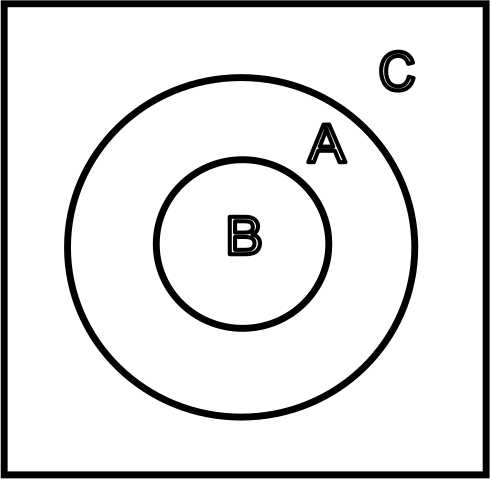

# 3. Homesteading and Property Rights

---

<!-- _footer: N. Stephan Kinsella, *Thoughts on the Latecomer and Homesteading Ideas; or, why the very idea of “ownership” implies that only libertarian principles are justifiable* -->

> [...] the first user and possessor of a good is either its owner or he is not. If he is not, then who is? The person who takes it from him by force? If forcefully taking possession from a prior owner entitles the new possessor to the thing, then there is no such thing as ownership, but only mere possession. But such a rule — that a later user may acquire something by taking it from the previous owner — does not avoid conflicts, it rather authorizes them.

---

# The Homesteading Principle
Ownership is assigned to the initial possessor/director of any external good

---

## The Prior-Later Distinction

---

## The Prior-Later Distinction
 * Ownership of a thing is distinct from the ability to direct its use
 * In asserting different ownership claims each person are asserting that they are the one who *justly* directs the use of the stick
 * If $B$ could own something by taking it from $A$, that implies $C$ could take it and become the owner
 * This would mean that ownership of a thing and the ability to direct its use are not distinct

---

<!-- _footer: N. Stephan Kinsella, *Thoughts on the Latecomer and Homesteading Ideas; or, why the very idea of “ownership” implies that only libertarian principles are justifiable* -->

> In other words, we can see not only that Lockean homesteading […] is inextricably bound up with the prior-later distinction […] _**but that the very idea of ownership implies that only libertarian-style ownership is justifiable**_.

---

# The Criteria for Property Borders

---

# The Criteria for Property Borders
Rational property borders are and must be:
 1. Objective
 2. Intersubjectively-ascertainable

---

## Objective Propety Borders

---

## Objective Propety Borders
 * Must adhere to existence as against the arbitrary content of ones consciousness
 * Subjective property borders might contradict, $\therefore$ non-universal

---

## Intersubjectively-Ascertainable Propety Borders

---

## Intersubjectively-Ascertainable Propety Borders
 * Must be able to be perceived by third parties
 * This is required to avoid conflicts

---

<!-- _footer: N. Stephan Kinsella, *Dialogical Arguments for Libertarian Rights* -->

> [...] no one could ever deny that norms for determining the ownership of scarce goods are useful for allowing conflict-free exploitation of such resources. But, as Hoppe points out, there are only two fundamental alternatives for acquiring unowned property: (1) by doing something with things with which no one else had ever done anything before, that is, the Lockean concept of mixing of labour, or homesteading; or (2) simply by verbal declaration or decree.

---

<!-- _footer: N. Stephan Kinsella, *Dialogical Arguments for Libertarian Rights* -->

> However, a rule that allows property to be owned by mere verbal declaration cannot serve to avoid conflicts, since any number of people could at any time assert conflicting claims of ownership of a particular scarce resource. Only the first alternative, that of Lockean homesteading, establishes an objective [...] link between a particular person and a particular scarce resource, and thus no one can deny the Lockean right to homestead unowned resources.

---

---

# The Homestead Stalemate

---

# The Homestead Stalemate
 * Neither is the late-comer
 * A stalemate is not (yet) a conflict
 * A stalemate can turn into a conflict if Crusoe forcefully excludes Friday
 * The aggressive party cedes ownership to the non-aggressive party

---

# Against the Georgist Anti-Homestead Ethic

---

# Against the Georgist Anti-Homestead Ethic
 * To engage in argumentation you must first homestead *something*
 * $\therefore$ it cannot be denied that it is just to engage in an act of homesteading

---

<!-- _footer: Hans-Hermann Hoppe, *A Theory of Socialism and Capitalism* -->

> What is wrong with this idea of dropping the prior-later distinction as morally irrelevant? First, if the late-comers, i.e., those who did not in fact do something with some scarce goods, had indeed as much of a right to them as the first-comers, i.e., those who did do something with the scarce goods, then literally no one would be allowed to do anything with anything, as one would have to have all of the late-comers’ consent prior to doing whatever one wanted to do.

---

<!-- _footer: Hans-Hermann Hoppe, *A Theory of Socialism and Capitalism* -->

> Indeed, as posterity would include one’s children’s children—people, that is, who come so late that one could never possibly ask them—advocating a legal system that does not make use of the prior-later distinction as part of its underlying property theory is simply absurd in that it implies advocating death but must presuppose life to advocate any thing.

---

<!-- _footer: Hans-Hermann Hoppe, *A Theory of Socialism and Capitalism* -->

> Neither we, our forefathers, nor our progeny could, do, or will survive and say or argue anything if one were to follow this rule. In order for any person—past, present, or future—to argue anything it must be possible to survive now. Nobody can wait and suspend acting until everyone of an indeterminate class of late-comers happens to appear and agree to what one wants to do.

---

<!-- _footer: Hans-Hermann Hoppe, *A Theory of Socialism and Capitalism* -->

> Rather, insofar as a person finds himself alone, he must be able to act, to use, produce, consume goods straightaway, prior to any agreement with people who are simply not around yet (and perhaps never will be). And insofar as a person finds himself in the company of others and there is conflict over how to use a given scarce resource, he must be able to resolve the problem at a definite point in time with a definite number of people instead of having to wait unspecified periods of time for unspecified numbers of people.

---

<!-- _footer: Hans-Hermann Hoppe, *A Theory of Socialism and Capitalism* -->

> Simply in order to survive, then, which is a prerequisite to arguing in favor of or against anything, property rights cannot be conceived of as being timeless and nonspecific regarding the number of people concerned. Rather, they must necessarily be thought of as originating through acting at definite points in time for definite acting individuals.

---

<!-- _footer: Hans-Hermann Hoppe, *A Theory of Socialism and Capitalism* -->

> Furthermore, the idea of abandoning the prior-later distinction, which socialism finds so attractive, would again simply be incompatible with the nonaggression principle as the practical foundation of argumentation. To argue and possibly agree with someone (if only on the fact that there is dis agreement) means to recognize each other’s prior right of exclusive control over his own body.

---

<!-- _footer: Hans-Hermann Hoppe, *A Theory of Socialism and Capitalism* -->

> Otherwise, it would be impossible for anyone to first say anything at a definite point in time and for someone else to then be able to reply, or vice versa, as neither the first nor the second speaker would be independent physical decision-making units anymore, at any time. Eliminating the prior-later distinction then, as socialism attempts to do, is tantamount to eliminating the possibility of arguing and reaching agreement.

---

<!-- _footer: Hans-Hermann Hoppe, *A Theory of Socialism and Capitalism* -->

> However, as one cannot argue that there is no possibility for discussion without the prior control of every person over his own body being recognized and accepted as fair, a late-comer ethic that does not wish to make this difference could never be agreed upon by anyone. Simply saying that it could implies a contradiction, as one’s being able to say so would presuppose one’s existence as an independent decision-making unit at a definite point in time.

---

# Self-Ownership

---

# Self-Ownership
 * Property rights are conflict avoiding norms
 * Property rights are derived from the nature of argumentation
 * For $A$ and $B$ to argue with each other, they have to first assume that the other guy owns himself

---

## The Failure of Particularism

---

## The Failure of Particularism
 * $A$ being allowed to punch $B$ but not the other way around is arbitrary and must be discarded
 * You have an objective, undeniable-and-thus-intersubjectively-ascertainable link to your own body
 * If arbitrarily coercing others to do what you want was a greater claim then it would be impossible to avoid conflicts in bodies

---

<!-- _footer: N. Stephan Kinsella, *How We Come to Own Ourselves* -->

> Moreover, any outsider who claims another’s body cannot deny this objective link and its special status, since the outsider also necessarily presupposes this in his own case. This is so because in seeking dominion over the other, in asserting ownership over the other’s body, he has to presuppose his own ownership of his body, which demonstrates he does place a certain significance on this link, at the same time that he disregards the significance of the other’s link to his own body.

---

## Slavery as Anti-Human
To be an ethic for man it must be universal and it must ensure the survival of mankind.

---

## Alternatives to Self-Ownership

Rothbard has pointed out10 that if you do not have a system of total self-ownership, two possibilities remain:

 1. universal and equal other-ownership, which he calls the “communist” ethic, or;
 2. partial ownership of one group by another.

---

## The Failure of the Alternatives
 * Universal co-ownership would imply the near immediate death of humanity
 * Universal co-ownership would be impossible to comply with
 * Partial ownership is particularistic, and thus false

---

# The Impossibility of Group Ownership

---

# The Impossibility of Group Ownership
 * A set of people $\{A,\cdots,Z\}$ commonly own a stick, there is a conflict over its use between $A$ and $B$
 * Either $A$ is the just victor or $B$ is
 * Both choices imply contradiction

---

# Potential Solutions

---

# Potential Solutions
 - The Democratic Solution

---

# Potential Solutions
 - The Democratic Solution - FAIL

---

<!-- _footer: Roderick T. Long, *In Defense of Public Space* -->

> On the libertarian view, we have a right to the fruit of our labor, and we also have a right to what people freely give us. Public property can arise in both these ways.

---

<!-- _footer: Roderick T. Long, *In Defense of Public Space* -->

> Consider a village near a lake. It is common for the villagers to walk down to the lake to go fishing. In the early days of the community it’s hard to get to the lake because of all the bushes and fallen branches in the way. But over time, the way is cleared and a path forms — not through any centrally coordinated effort, but simply as a result of all the individuals walking that way day after day.

---

<!-- _footer: Roderick T. Long, *In Defense of Public Space* -->

> The cleared path is the product of labor — not any individual’s labor, but all of them together. If one villager decided to take advantage of the now-created path by setting up a gate and charging tolls, he would be violating the collective property right that the villagers together have earned.

---

<!-- _footer: Roderick T. Long, *In Defense of Public Space* -->

> Public property can also be the product of gift. In 19th-century England, it was common for roads to be built privately and then donated to the public for free use. This was done not out of altruism but because the roadbuilders owned land and businesses alongside the site of the new road, and they knew that having a road there would increase the value of their land and attract more customers to their businesses. Thus, the unorganized public can legitimately come to own land, both through original acquisition (the mixing of labor) and through voluntary transfer.

---

# Potential Solutions
 - The Democratic Solution - FAIL
 - Communal Labour

---

# Potential Solutions
 - The Democratic Solution - FAIL
 - Communal Labour
 - Title-Transfer to the Community

---

<!-- _footer: LiquidZulu, *Why Artists Shouldn't Own Their Art* -->

---

<!-- _footer: N. Stephan Kinsella, *Against Intellectual Property* -->

> As noted before, some libertarian IP advocates, such as Rand, hold that creation is the source of property rights. This confuses the nature and reasons for property rights, which lie in the undeniable fact of scarcity. Given scarcity and the correspondent possibility of conflict in the use of resources, conflicts are avoided and peace and cooperation are achieved by allocating property rights to such resources. And the purpose of property rights dictates the nature of such rules.

---

<!-- _footer: N. Stephan Kinsella, *Against Intellectual Property* -->

> For if the rules allocating property rights are to serve as objective rules that all can agree upon so as to avoid conflict, they cannot be biased or arbitrary. For this reason, unowned resources come to be owned—homesteaded or appropriated—by the first possessor.

---

<!-- _footer: N. Stephan Kinsella, *Against Intellectual Property* -->

> The general rule, then, is that ownership of a given scarce resource can be identified by determining who first occupied it. There are various ways to possess or occupy resources, and different ways to demonstrate or prove such occupation, depending upon the nature of the resource and the use to which it is put.

---

<!-- _footer: N. Stephan Kinsella, *Against Intellectual Property* -->

> Thus, I can pluck an apple from the wild and thereby homestead it, or I can fence in a plot of land for a farm. It is sometimes said that one form of occupation is “forming” or “creating” the thing. For example, I can sculpt a statue from a block of marble, or forge a sword from raw metal, or even “create” a farm on a plot of land.

---

<!-- _footer: N. Stephan Kinsella, *Against Intellectual Property* -->

> We can see from these examples that creation is relevant to the question of ownership of a given “created” scarce resource, such as a statue, sword, or farm, only to the extent that the act of creation is an act of occupation, or is otherwise evidence of first occupation. However, “creation” itself does not justify ownership in things; it is neither necessary nor sufficient.

---

<!-- _footer: N. Stephan Kinsella, *Against Intellectual Property* -->

> One cannot create some possibly disputed scarce resource without first using the raw materials used to create the item. But these raw materials are scarce, and either I own them or I do not. If not, then I do not own the resulting product. If I own the inputs, then, by virtue of such ownership, I own the resulting thing into which I transform them.

---

<!-- _footer: N. Stephan Kinsella, *Against Intellectual Property* -->

> Consider the forging of a sword. If I own some raw metal (because I mined it from ground I owned), then I own the same metal after I have shaped it into a sword. I do not need to rely on the fact of creation to own the sword, but only on my ownership of the factors used to make the sword.

---

<!-- _footer: N. Stephan Kinsella, *Against Intellectual Property* -->

> And I do not need creation to come to own the factors, since I can homestead them by simply mining them from the ground and thereby becoming the first possessor. On the other hand, if I fashion a sword using your metal, I do not own the resulting sword. In fact, I may owe you damages for trespass or conversion.

---

# Potential Solutions
 - The Democratic Solution - FAIL
 - Communal Labour - FAIL
 - Title-Transfer to the Community

---

# Potential Solutions
 - The Democratic Solution - FAIL
 - Communal Labour - FAIL
 - Title-Transfer to the Community - FAIL

---

# Potential Solutions
 - The Democratic Solution - FAIL
 - Communal Labour - FAIL
 - Title-Transfer to the Community - FAIL
 - The polycentrist solution

---

# Potential Solutions
 - The Democratic Solution - FAIL
 - Communal Labour - FAIL
 - Title-Transfer to the Community - FAIL
 - The polycentrist solution - FAIL

---

# Potential Solutions
 - The Democratic Solution - FAIL
 - Communal Labour - FAIL
 - Title-Transfer to the Community - FAIL
 - The polycentrist solution - FAIL
 - Companies as a Counterexample

---

# Potential Solutions
 - The Democratic Solution - FAIL
 - Communal Labour - FAIL
 - Title-Transfer to the Community - FAIL
 - The polycentrist solution - FAIL
 - Companies as a Counterexample - FAIL

---

# The Blockean Proviso

---

---

<!-- _footer: N. Stephan Kinsella, *Thoughts on the Latecomer and Homesteading Ideas; or, why the very idea of “ownership” implies that only libertarian principles are justifiable* -->

> In a nutshell: de Jasay equates property with its owner’s “excluding” others from using it, for example by fencing in immovable property (e.g. land) or finding or creating (and keeping) movable property. Thus, the principle means “let ownership stand,” i.e., that claims to ownership of property appropriated from the state of nature or acquired ultimately through a chain of title tracing back to such an appropriation should be respected.

---

<!-- _footer: N. Stephan Kinsella, *Thoughts on the Latecomer and Homesteading Ideas; or, why the very idea of “ownership” implies that only libertarian principles are justifiable* -->

> De Jasay uses this idea to demolish the criticism that homesteading unowned resources unilaterally and unjustifiably imposes on others moral duties to refrain from interfering.

---

---

<!-- _footer: N. Stephan Kinsella, *Thoughts on the Latecomer and Homesteading Ideas; or, why the very idea of “ownership” implies that only libertarian principles are justifiable* -->

> Note that the de Jasayan idea of “let exclusion stand” or the Hoppean idea that the prior-later distinction is of crucial importance also sheds light on the nature of homesteading itself. Often the question is asked as to what types of acts constitute or are sufficient for homesteading (or “embordering” as Hoppe sometimes refers to it); what type of “labor” must be “mixed with” a thing; and to what property does the homesteading extend? What “counts” as “sufficient” homesteading? Etc.

---

<!-- _footer: N. Stephan Kinsella, *Thoughts on the Latecomer and Homesteading Ideas; or, why the very idea of “ownership” implies that only libertarian principles are justifiable* -->

> And we can see that in a way the answer to these questions is related to the issue of what is the thing in dispute. In other words, if B claims ownership of a thing possessed (or formerly possessed) by A, then the very framing of the dispute helps to identify what the thing is and what counts as possession of it.

---

<!-- _footer: N. Stephan Kinsella, *Thoughts on the Latecomer and Homesteading Ideas; or, why the very idea of “ownership” implies that only libertarian principles are justifiable* -->

> If B claims ownership of a given resource, he must want the right to control it according to its nature. Then the question becomes, did someone else previously control it (according to its nature); i.e., did someone else already homestead it, so that B is only a latecomer?

---

<!-- _footer: N. Stephan Kinsella, *Thoughts on the Latecomer and Homesteading Ideas; or, why the very idea of “ownership” implies that only libertarian principles are justifiable* -->

> This ties in with de Jasay’s “let exclusion stand” principle, which rests on the idea that if someone is actually able to control a resource such that others are excluded, then this exclusion should “stand.” Of course, the physical nature of a given scarce resource and the way in which humans use such resources will determine the nature of actions needed to “control” it and exclude others.

---

<!-- _footer: N. Stephan Kinsella, *Thoughts on the Latecomer and Homesteading Ideas; or, why the very idea of “ownership” implies that only libertarian principles are justifiable* -->

> De Jasay, as a matter of fact, considers two basic types of appropriation: “finding and keeping” and “enclosure.” The former applies primarily to movable objects that may be found, taken, and hidden or used exclusively. Since the thing has no other owner, prima facie no one is entitled to object to the first possessor claiming ownership.

---

<!-- _footer: N. Stephan Kinsella, *Thoughts on the Latecomer and Homesteading Ideas; or, why the very idea of “ownership” implies that only libertarian principles are justifiable* -->

> For immovable property (land), possession is taken by “enclosing” the land and incurring exclusion costs, e.g., erecting a fence (again, similar to Hoppe’s “embordering”—establishing an objective, intersubjectively ascertainable border). As in the case with movables, others’ loss of the opportunity to appropriate the property does not give rise to a claim sufficient to oust the first possessor (if it did, it would be an ownership claim).

---

---

# Direction vs Possession: What is Ownership?

---

# On the Impossibility of Intellectual Property Rights

---

# On the Impossibility of Intellectual Property Rights
 * To say that person $A$ has a property right in $X$ is to say that he should win any conflict over the use of $X$
 * Ideas are not scarce, so there can't be conflicts over ideas

---

## IP $\longrightarrow$ Ethical Stasis

---

# Related Reading
+ LiquidZulu, *Georgists Don’t Understand Rights*
+ Łukasz Dominiak, *The Blockian Proviso and the Rationality of Property Rights*
+ N. Stephan Kinsella, *Thoughts on the Latecomer and Homesteading Ideas; or, why the very idea of “ownership” implies that only libertarian principles are justifiable*
