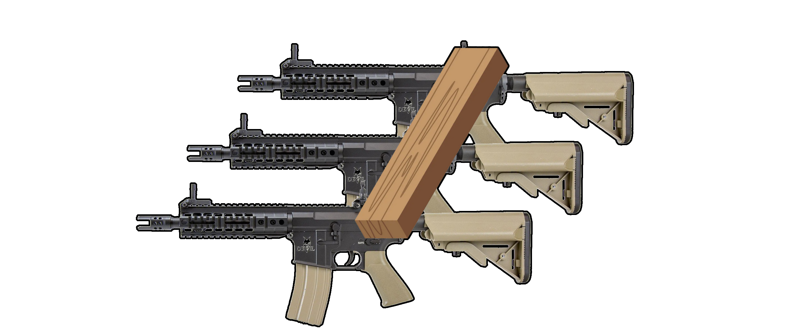
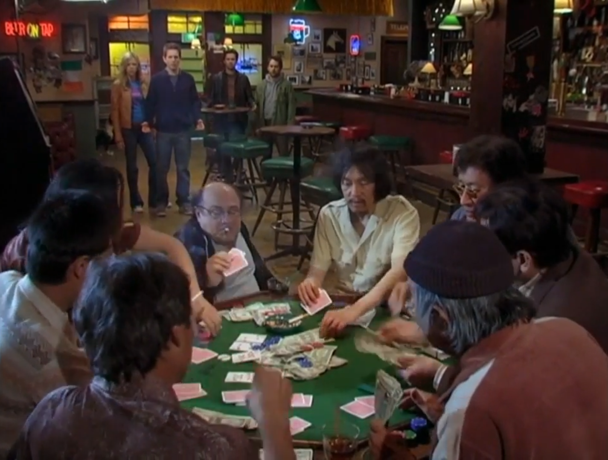

# 2. The Non-Aggression Principle

---

<!-- _footer: Hans-Hermann Hoppe, *The Ultimate Justification of the Private Property Ethic* -->

> Cognition and truth-seeking as such have a value [normative] foundation. And the normative foundation on which cognition and truth rest is the recognition of private property rights.

---

# The Non-Aggression Principle

---

# The Non-Aggression Principle

*The Non-Aggressor ought be the director of the means under conflict*

---

# The Non-Aggression Principle

In a contest over property $\alpha$, if $A$ is the aggressor and $B$ the non-aggressor, $B$ ought be the one to direct the use of $\alpha$ and $A$ ought not.

---

# The Argument from Argument

---

# The Argument from Argument
 * Praxeologic axioms are self-evident propositions
 * A proposition is self-evident if you must accept its validity in attempting to dispute its validity

---

## The NAP as an Axiom

---

## The NAP as an Axiom
 * Argumentation does not exist in a normative void
 * If this was not so then there would be no such thing as argumentation
 * Certain norms *define* a dialectic as such

---

## The A Priori of Argumentation
The validity of any truth claim must be raised and decided upon in the course of an argumentation, so the normative structure of argumentation in particular has the special status of being the practical pre-condition for ascertaining the truth or validity of any statement.

---

## Dialectic Contradiction

---

## Dialectic Contradiction
 * A contradiction between a proposition and the act of proposing it
 * "People ought never argue" would be a contradiction
 * So $\neg$"People ought never argue" which is "People ought sometimes argue" is true
 * The "sometimes" refers to dispute resolution

---

## Argumentation as Conflict-Free
 * Interlocutors have a dispute and they are solving it non-violently
 * $A$ and $B$ have a dispute over who has the property right to $\alpha$, $A$ asserts that they are the owner, and vice versa.
 * Arguing about $\alpha$ would be non-violent
 * Warring over $\alpha$ would not be truth-seeking

---

## Truth-Seeking as Non-Aggressive

---

## Truth-Seeking as Non-Aggressive
 * Coercing others to not argue with you does not intend to establish truth
 * Aggression is unreason, a man in unreason cannot make a truth claim
 * The purpose of argumentation is to seek truth, this cannot be denied

---

<!-- _footer: N. Stephan Kinsella, *Dialogical Arguments for Libertarian Rights* -->

> Looked at from another angle, participants in argumentation indisputably need to use and control the scarce resources in the world to survive; otherwise, they would perish. But because their scarcity makes conflict over the uses of resources possible, only norms that determine the proper ownership can avoid conflict over these scarce goods.

---

<!-- _footer: N. Stephan Kinsella, *Dialogical Arguments for Libertarian Rights* -->

> That such norms are valuable cannot be denied, because anyone who is alive in the world and participating in the practical activity of argumentation cannot deny the value of being able to control scarce resources and the value of avoiding conflicts over such scarce resources.

---

# The Contradiction of Rights-Scepticism

---

<!-- _footer: N. Stephan Kinsella, *Dialogical Arguments for Libertarian Rights* -->

> If any right at all exists, it is a right of $A$ to have or do $X$ without $B$'s preventing it; and, therefore, $A$ can legitimately use force against $B$ to *enforce* the right. $A$ is concerned with the enforceability of his right to $X$, and this enforceability is all that $A$ requires in order to be secure in his right to $X$.

---

<!-- _footer: N. Stephan Kinsella, *Dialogical Arguments for Libertarian Rights* -->

> For a rights-skeptic meaningfully to challenge $A$'s asserted right, the skeptic must challenge the *enforceability* of the right, instead of merely challenging the existence of the right. Nothing less will do. If the skeptic does not deny that $A$'s proposed enforcement of his purported right is legitimate, then the skeptic has not denied $A$'s right to $X$, because what it *means* to have a right is to be able to legitimately enforce it.

---

<!-- _footer: N. Stephan Kinsella, *Dialogical Arguments for Libertarian Rights* -->

> If the skeptic maintains, then, that $A$ has no right to $X$, indeed, no rights at all since there are no rights, the skeptic must also maintain that $A$'s enforcement of his purported right to $X$ is not justified.

---

## The Problem for the Rights Sceptic

---

## The Problem for the Rights Sceptic
 * *Merely* challenging $A$'s use of force is not enough
 * The rights-sceptic must attack the legitimacy of $A$ using force against $B$ to enforce the right
 * This means that $B$ or someone else can legitimately use force (has a right) to *stop* $A$'s use of force

---

<!-- _footer: N. Stephan Kinsella, *Dialogical Arguments for Libertarian Rights* -->

> More common-sensically, this demonstration points out the inconsistency on the part of a rights-skeptic who engages in discourse about the propriety of rights at all. If there are no rights, then there is no such thing as the justifiable or legitimate use of force, but neither is there such a thing as the unjust use of force. But if there is no unjust use of force, what is it, exactly, that a rights-skeptic is concerned about?

---

<!-- _footer: N. Stephan Kinsella, *Dialogical Arguments for Libertarian Rights* -->

> If individuals delude themselves into thinking that they have natural rights, and, acting on this assumption, go about enforcing these rights as if they are true, the skeptic has no grounds to complain. To the extent the skeptic complains about people enforcing these illusory rights, he begins to attribute rights to those having force used against them.

---

<!-- _footer: N. Stephan Kinsella, *Dialogical Arguments for Libertarian Rights* -->

> Any rights-skeptic can only shut up,6 because he contradicts himself the moment he objects to others' acting as if they have rights. [...] Indeed, another way to respond to a rights-skeptic would be to propose to physically harm him. If there are no rights, as he maintains, then he cannot object to being harmed. So, presumably, any rights-skeptic would change his position and admit there were rights (if only so as to be able to object to being harmed)—or there would soon be no more rights-skeptics left alive to give rights-advocates any trouble.

---

# Indirect and Joint Aggression

---

# Indirect and Joint Aggression
 * Both the mob boss and his goons are engaged in crime
 * Crime is an action, it is the use of efficacious means to cause the invasion of the borders of other peoples' property
 * You can use other people as a means towards some end.

---

## The Mail-Bomb Hypothetical
---

## The Mail-Bomb Hypothetical
 * If using other people as means broke the chain of causation then the courier must be at fault because he delivered the bomb
 * But even that doesn't work, because the victim set the bomb off, so its a suicide!
 * The victim and the courier are both properly understood as means to the bomb-makers end of exploding the victim

---

<!-- _footer: N. Stephan Kinsella and Patrick Tinsley, *Causation and Aggression* -->

> Even the [positive] law recognizes that an intervening force only breaks the chain causal connection when it is unforeseeable. As the Restatement of Torts provides, “The intervention of a force which is a normal consequence of a situation created by the actor’s ... conduct is not a superseding cause of harm which such conduct has been a substantial factor in bringing about”

---

<!-- _footer: N. Stephan Kinsella and Patrick Tinsley, *Causation and Aggression* -->

> [...] Clearly, when the terrorist in these cases uses a courier to deliver a letter bomb, it is not unforeseeable that the victim will receive it; and it is not unforeseeable that the victim will open it.

---

## The Outcome of the Activity Must Be Foreseeable for it to be Criminal

---

<!-- _footer: Adolf Reinarch (2000), "On The Concept of Causality in the Current Criminal Law," p. 14. Trans. Berit Brogaard. Jonathan Sandford, ed. (1998) and Ed Rackley (2000); unpublished draft translation; available at www.stephankinsella.com/texts. -->

> [...] there is no intention if the outcome is only hoped for.

---

---

---

<!-- _footer: N. Stephan Kinsella and Patrick Tinsley, *Causation and Aggression* -->

> Consider the following example. A malcontent, $A$, purchases a remote-controlled tank. With the remote control he can steer the tank and fire its cannon. He directs the tank to blow down the walls of a neighbor’s house, destroying the house and killing the neighbor. No one would deny that $A$ is the cause of the killing and is guilty of murder and trespass.

---

<!-- _footer: N. Stephan Kinsella and Patrick Tinsley, *Causation and Aggression* -->

> However, after the rampage, a hatch opens in the tank, and an evil midget jumps out. It turns out, you see, that the midget could see on a screen which buttons were pressed on the remote control, and he would operate the tank accordingly. We submit that $A$ is equally liable in both cases. From his point of view, the tank was a “black box” that he used to attain his end, regardless of whether there was a human will somewhere in the chain of causation. (Of course, the evil midget is also liable.)

---

## Aggressive Means as a Black Box

---

<!-- _footer: N. Stephan Kinsella and Patrick Tinsley, *Causation and Aggression* -->

> If it is illegal to hit someone [...] this means that it is illegal to *cause* another person to be hit; that is to say, it is illegal to use physical objects, including one's fist, in a way that will cause the unwanted physical contact with another person.

---

<!-- _footer: N. Stephan Kinsella and Patrick Tinsley, *Causation and Aggression* -->

> In analyzing action through the lens of the praxeological means-ends structure to determine if it amounts to aggression, we ask if the actor employed *means* to achieve the end of invading the borders of another’s property or body—in other words, we ask if he *caused* the border invasion.

---

<!-- _footer: N. Stephan Kinsella and Patrick Tinsley, *Causation and Aggression* -->

> The means employed can be inanimate or nonhuman means governed solely by causal laws (a gun), or it can include other humans who are employed as means to achieve the illicit end desired. The latter category includes both innocent humans that one employs to cause a border invasion and culpable humans that one conspires (cooperates) with to achieve the illicit end.

---

# Communication and Social Norms

---

---

---

---

---

# Related Reading
+ Hans-Hermann Hoppe (2005), “On The Ultimate Justification of the Ethics of Private Property,” in idem. *The Economics and Ethics of Private Property* second ed.
+ Kris Borer (2010), *Cause No Conflict*
+ N. Stephan Kinsella, *Dialogical Arguments for Libertarian Rights*
