# youtube.com/liquidzulu

---

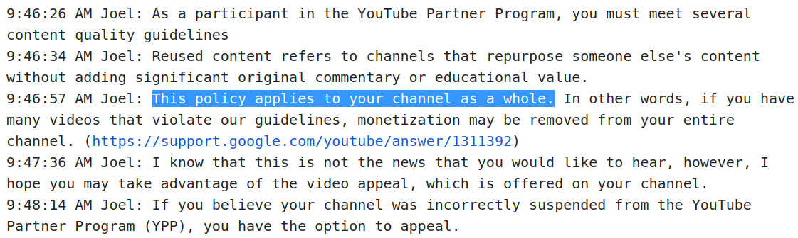

`Chat transcript for case: 0-0645000033319`

---

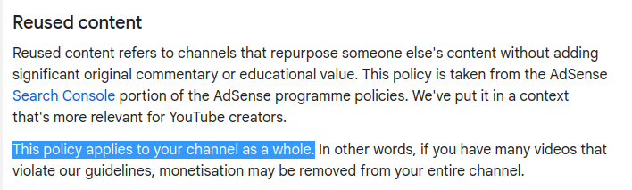

---

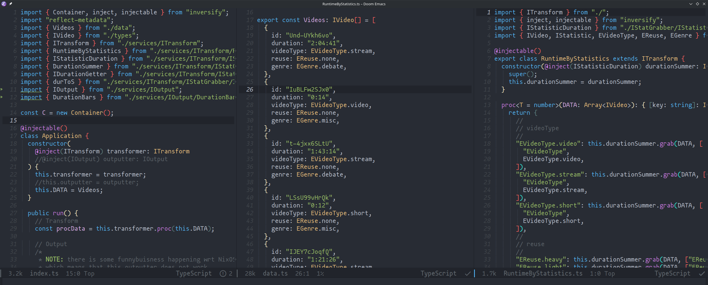
https://github.com/LiquidZulu/youtube-scripts/tree/main/scripts/demonetisation/analysis

---

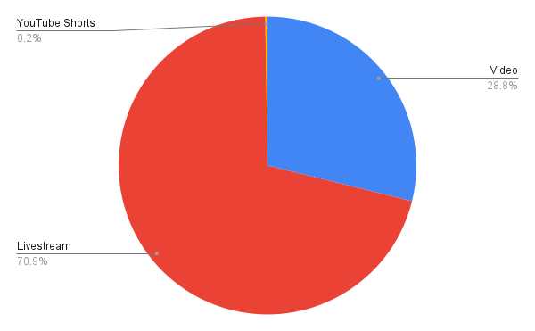

---

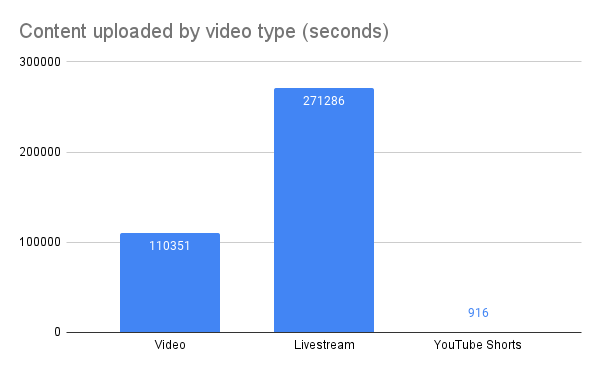

---

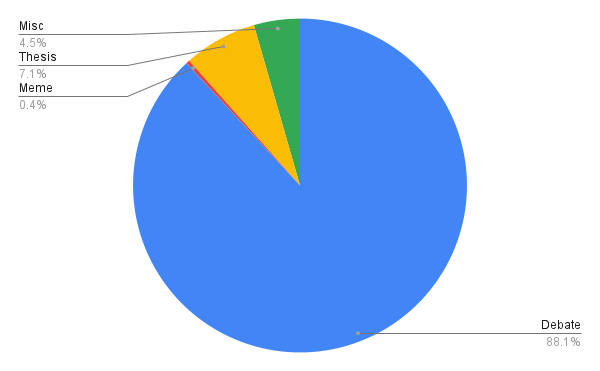

---

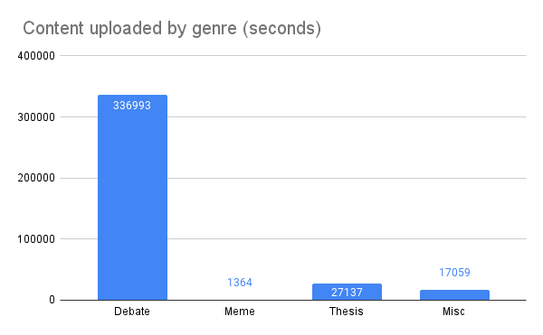

---

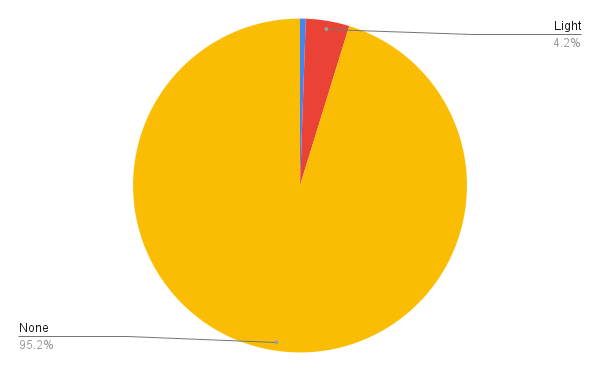

---

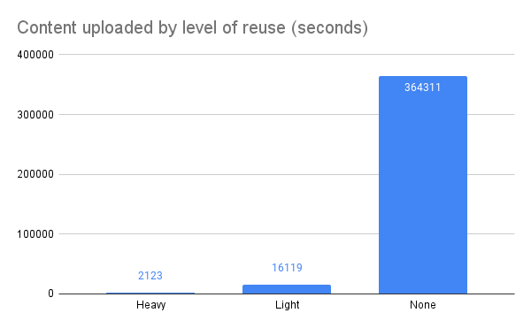

---

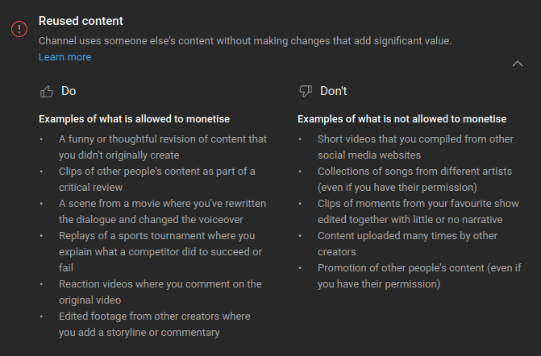

---

# 😄 Thank you!
Have a nice day

---

# Heavy
a lot of reused content

---

# Light
very little, but still *some* reused content

---

# None
not a single second of unoriginal content

---

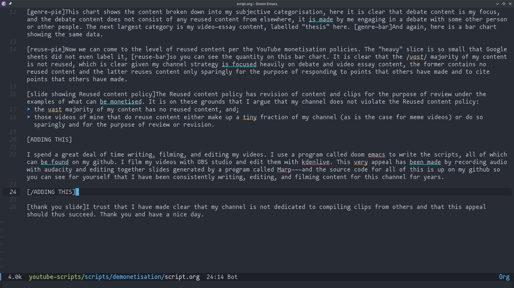

---

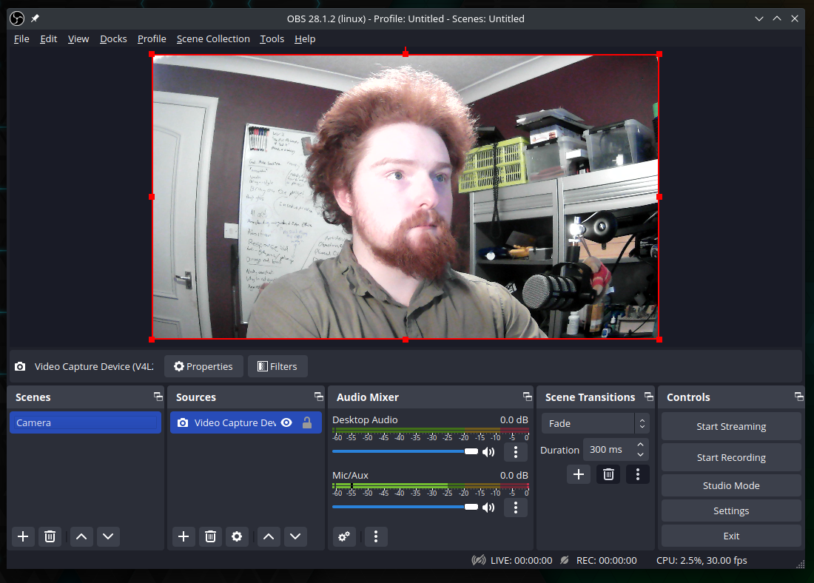

---

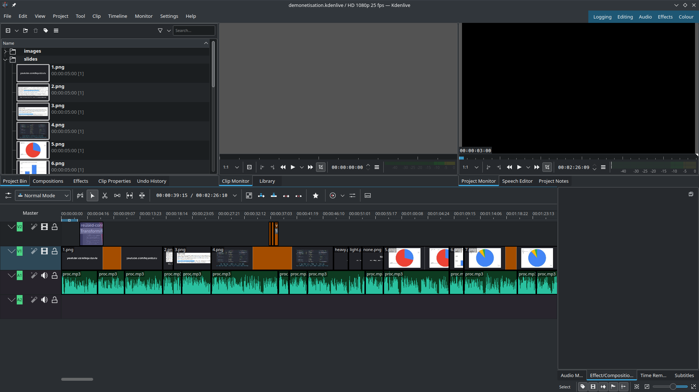

---

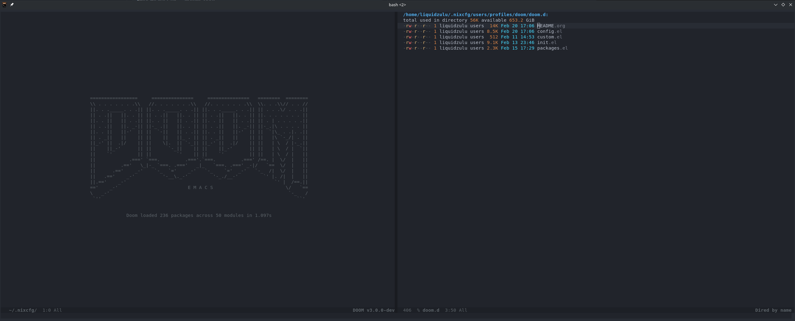

---

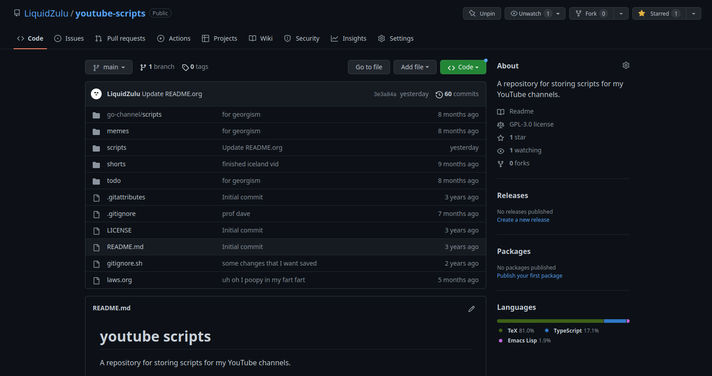
https://github.com/LiquidZulu/youtube-scripts

---

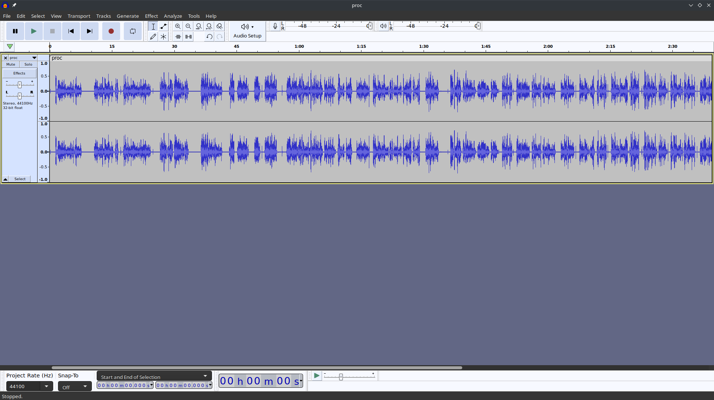

---

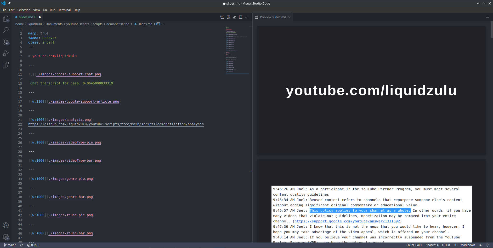
