# The Argument Against AI Image Generation

A typical argument one comes across from those in the anti-AI image generation camp goes something like: &ldquo;AI image generation steals art from artists putting them out of a job; and what it produces can&rsquo;t even be properly considered art anyway.&rdquo; To analyse this stance properly, it must be broken into its constituent parts:

1.  AI image generators should be opposed because they steal art from artists;
2.  AI image generators should be opposed because they put artists out of their jobs, and;
3.  images produced by an AI do not count as art.


# Do AI Image Generators Steal From Artists?


## On The Impossibility of Stealing an Idea

So, do AI image generators steal art from artists? The short answer is: no, they do not. Theft is a very specific legal concept, it refers to the unjust re-distribution of property from party $A$ to party $B$. The important part of this is that property rights can be held only in scarce means&#x2014;the issue with Bob stealing Alice&rsquo;s car is that this *deprives Alice of that car*. Bob&rsquo;s use of the car is incompatible with Alice&rsquo;s use&#x2014;this is what theft refers to. Artistic ideas, like any other idea, are simply not scarce&#x2014;Bob is capable of looking over Alice&rsquo;s shoulder and painting exactly what she is painting without depriving her of anything that she owns. The correct terminology to describe some rule which would prohibit Bob from doing this is a negative easement&#x2014;not theft.


## Do AI Image Generators Plagiarise?


### AI Image Generation as &ldquo;Filling in the Gaps&rdquo;

So for the issue of digital image creation, there is nothing that is or can be *stolen* from an artist, nobody is deprived of any scarce goods when someone copies the ones and zeroes that define such digital artworks. There is a second aspect of this to address though, perhaps the AI image generators aren&rsquo;t literally *stealing* anything in the legal sense, but rather are plagiarising from artists, or some other similar concept. It could well be that nobodies rights are violated by the use of an AI that is trained on a bank of digital artwork, but said use might be immoral still. To address this point, allow me to briefly go over how these AI image generation algorithms work, specifically focusing on those models such as Dall-E and Stable Diffusion.

Very simply, the core of such algorithms is a de-noiser&#x2014;you have an image with some amount of noise, and you ask the algorithm to predict what noise has been added to that image, such that you may subtract it. Conceptually, this makes sense when you consider what it means to remove noise. If I have a picture of an aeroplane, and there is noise covering up the left wing, to remove that noise is to &ldquo;fill in the gaps.&rdquo; It is working out what is missing from an image. So, if you have a computer program that fills in the gaps like this, then give it an image of pure noise and ask it to get rid of this noise, you have given it in essence a blank canvas&#x2014;you have asked it to fill in the gaps and given it only gaps.

I would put it to you, dear viewer, that this is essentially how human artists learn to draw pictures as well. A human has various visual filters in their brain that can be used to pick out features in the objects of perception, then the human is able to classify different sets of features into different concepts. A human learns which visual features are present in, say, a hot dog or a spaceship. The AI does a very similar thing&#x2014;it is trained on a bank of pre-classified images, invents various random filters for those images, learns which features are picked out by those random filters, and then learns which features correspond to the concept &ldquo;hot dog.&rdquo; If I want to draw a picture of an orc, but have never seen nor heard of an orc before, so I look online at previous pictures of orcs, what I am doing is learning how to fill in the gaps. I figure out what an orc face is, then I can draw one, I figure out what an orc sword looks like, then I can draw one, and so on until the entire blank canvas is filled.

Art YouTuber, Ethan Becker, seemingly agrees with me here. In his video explaining how to find your artistic style, the method provided is to pull out different aspects from different works of art, and then combine them to make a new piece.<sup><a id="fnr.1" class="footref" href="#fn.1" role="doc-backlink">1</a></sup> This &ldquo;style-bashing&rdquo; as one might term it, is evidently an accepted technique within the artistic community when done by human artists&#x2014;and yet when it comes to an AI doing this same thing it is painted as a clear-cut case of plagiarism.


### AI Image Generation is not Photo-Bashing

This brings me to the point of discussion, namely the claim that AI image generators plagiarise the work of artists. To clarify some confusion which leads people to believe this, these AI image generators do not inherently work as &ldquo;collage&rdquo; or composition software, or in the words of the Concept Art Association&rsquo;s Karla Ortiz that &ldquo;the software [&#x2026;] breaks down all of the data [that was] gathered and shreds it apart into little [&#x2026;] bits of noise, and [&#x2026;] it starts grabbing little bits of shredded data from all over the place and [&#x2026;] slowly re-integrates it to pretty much create a new image.&rdquo;<sup><a id="fnr.2" class="footref" href="#fn.2" role="doc-backlink">2</a></sup>

So to be abundantly clear: these AI systems *do not* store the images used for training and blend these images together. All that is stored by such models is the set of weights which define the technique for going from noise to image&#x2014;in other words all the model stores is the method used to fill in the blanks, which is exactly what is stored in the brain of a human artist. For a program to operate in the way suggested, where new images are generated by stitching together many previous images, would require that the entire bank of training data be stored somewhere&#x2014;in other words a model like Dall-E or MidJourney would need to store the many terabytes of images they were trained on and be able to query this database in realtime. This would be reflected in the size of such a model&#x2014;it would be several hundred-terabytes large, rather than a few gigabytes.

So, the calls that the model somehow tell artists which images it was referencing to make some new generation are flawed to their core&#x2014;the AI is not referencing specific images and combining different aspects, it doesn&rsquo;t have any access to it&rsquo;s training set. Now, the obvious response to this point, which I will address more fully later, is that of over-fitting&#x2014;over-fitting is a real thing that happens, but it is not at all the expected behaviour of such a system, and it also does not demonstrate that the expected output of such a system is in any way a form of photo-bashing. Like, just from a pure data perspective all that is stored are the weights of the neural network, think of these like the paramaters in some linear equation, you tweak the paramaters until your output is matching what you would expect. [NOTE: this is a massive over-simplification of how neural networks work, but it&rsquo;s accurate in the relevant ways]. So, the only place where an image generation model could possibly store some representation of its training data is in these paramaters. Stable Diffusion XL has 2.6 billion such parameters<sup><a id="fnr.3" class="footref" href="#fn.3" role="doc-backlink">3</a></sup> and the LAION-5B dataset which everyone is so concerned about contains 5.86 billion images, which comes out to about 240TB, which means you have less than one paramater for every two images, or in other words if we assume each parameter is stored as 32 bits which is standard for most number operations on a computer, then you have roughly 0.00004 bits of paramater data for every bit of training data&#x2014;to store the training set in the model you would need at least 1 bit of paramater data for every bit of training data, or in this case you would need about 25000 times the number of paramaters, which would be 65 TRILLION paramaters.

Now, 2.6 billion and 65 trillion are both gargantuan numbers, and it can be challenging to immediately get how much bigger one is than the other, so I think a visualisation is in order. Imagine if I took a three-week old kitten and placed it on a scale, then on the other side I drop a fully grown African elephant bull&#x2014;the world&rsquo;s largest land animal. The difference in weight between this tiny kitten and this monstrous elephant would be roughly equivalent<sup><a id="fnr.4" class="footref" href="#fn.4" role="doc-backlink">4</a></sup> to the difference in paramater count between Stable Diffusion XL and our 65 trillion-paramater model required to reach the *bare minimum* for general over-fitting. I think this makes clear why any suggestion that the general output from such models is over-fitted or collage-work or photo-bashed is simply ludicrous and could not be the case.

Bear this point in mind, people like the anti-AI golden boy, Steven Zapata, will tell us that &ldquo;machines can replicate references exactly.&rdquo;<sup><a id="fnr.5" class="footref" href="#fn.5" role="doc-backlink">5</a></sup> This is an argumentative sleight-of-hand. Sure, *machines* can indeed create exact duplicates of data&#x2014;but this is not what the argument is about. Artists are not opposed to your computer making a copy of their pictures when you navigate to their ArtStation page&#x2014;this copying is *required* in order for you to see their art in the first place. Rather, the argument is over whether *AI image generators* make exact replicas of their training data&#x2014;and the answer is a resounding &ldquo;no.&rdquo; AI image generation is *not* collage, AI image generation is *not* photo-bashing, AI image generation is *not* copying&#x2014;these tasks are all fundamentally different to the de-noising process that is performed by a diffusion model. The task of copying data from one location to another is a task that was solved by computer scientists *decades* before anyone even thought of trying to get a computer to produce images, and it is a task that makes the Internet that we are having this argument over possible in the first place.

Zapata is not alone in this deception, Mother&rsquo;s Basement attempts to draw a disanalogy between machine and human learning by this same method:

> Humans cannot perfectly reproduce the work of other humans without tracing over it or using a mould or stencil. Inevitably in the process of trying to do so, any human artist will end up applying their own creative interpretation to the style that they&rsquo;re aping based on their own unique experiences studying other peoples art, developing their own artistic techniques, and just living life.<sup><a id="fnr.6" class="footref" href="#fn.6" role="doc-backlink">6</a></sup>

This exact same thing is true of AI image generators&#x2014;to make this analogy precise, the act of using a mould or stencil would be what is analogous to the image-to-image technique. This is a very specific function of these AI tools, and it can indeed be used to plagiarise artists&#x2014;Mother&rsquo;s Basement conflates all possible uses of diffusion with this one very specific practice and insodoing throws the proverbial baby out with the bathwater. When the human artist is &ldquo;aping&rdquo; someone&rsquo;s style, it involves &ldquo;their own creative interpretation&rdquo; &ldquo;based on their [&#x2026;] experiences studying other peoples art&rdquo;&#x2014;notice how this description is contrasted with the AI &ldquo;blending together&rdquo; or &ldquo;collaging&rdquo; other works that it has been trained on. When a human does it, it&rsquo;s just applying their own unique spin based on works they have studied, when an AI does it, it&rsquo;s plagiarism of every single work that has ever touched it&rsquo;s training set.<sup><a id="fnr.7" class="footref" href="#fn.7" role="doc-backlink">7</a></sup>

In fact, an artist by the name of Jazza paid $1200 to fiverr artists to produce artwork based on the same prompts that he gave to Dall-E and over half of what he spent went to people blatantly and *actually* photo-bashing with stock images found on Google.<sup><a id="fnr.8" class="footref" href="#fn.8" role="doc-backlink">8</a></sup> This is in heavy contrast to the text-to-image AI which is fundamentally incapable of photobashing Google image search results. If this is the quality of work that is to be expected from commissioning human artists, can you really blame people for turning to AI? If human artists are to put forward this level of incompetence for these prices I fail to see why I should shed a tear for their loss of income---*these* are the artists who are going to be out of a job, not those who actually put the fucking work in.

Even opponents of AI image generation can&rsquo;t help but to implicitly admit that these systems do not work by photo-bashing, Hello Future Me tells us that AI art is &ldquo;entirely disconnected [and] in no way highlights or preserves the original work,&rdquo;<sup><a id="fnr.9" class="footref" href="#fn.9" role="doc-backlink">9</a></sup> but then within that very same video he raises the ethical (and legal) concern that &ldquo;AI art is theft.&rdquo;<sup><a id="fnr.10" class="footref" href="#fn.10" role="doc-backlink">10</a></sup> But, which is it? If the AI-generated images are &ldquo;entirely disconnected&rdquo; from their training data then surely they *couldn&rsquo;t* be either theft or plagiarism. The anti-AI crowd like to eat their cake and have it too on this issue: AI art is both soulless and orthogonal to anything that a human would produce, *and* it is based entirely in plagiarising and stealing the art of humans. They have not quite landed on which argument they want to make&#x2014;do they want to make fun of how low-quality and devoid of meaning it is, or do they want to make the argument that these AI systems produce art of impeccable standards, ripped straight out of the hands of the lowly painter, who is now entirely incapable of getting a job due to the vast enormity of the tyranny of the machines? They can&rsquo;t decide, so they just do both&#x2014;that surely won&rsquo;t lead to any naked inconsistencies, right?


### Where AI Does Plagiarise

Now, is it *possible* for a person to use these AI image generators to plagiarise art? Certainly. Just as it is possible for a human to do so. But, the mere fact that an AI has learned to fill in the gaps using previously produced artworks is not sufficient to demonstrate that such plagiarism has occurred. There are certain features that must be present in any depiction of an orc that both humans and AIs must learn and utilise in their own depictions. That you must look to previous depictions of orcs to learn these features is simply a comment on how knowledge is acquired in the first place. *Learning* which features show up in orc pictures is not the same as plagiarising said pictures.

Shadiversity points out<sup><a id="fnr.11" class="footref" href="#fn.11" role="doc-backlink">11</a></sup> that the examples commonly cited to show AI image generation plagiarising do not use the text to image technique, but rather are analogous to applying filters to an already existing image, called image to image. Certainly, it is possible to plagiarise art with this technique, just as it is possible to plagiarise art by tracing over an existing piece in photoshop&#x2014;but that does not make photoshop, or even tracing per se tools of plagiarism. Moreover, any claim of plagiarism must be *specific*&#x2014;it is not sufficient to assert &ldquo;maybe someone somewhere out there has at some point generated a piece of art that plagiarises from me.&rdquo; If you are to claim that AI art is plagiarised you must link a *specific* piece of AI generated art to the *specific* piece of art that it plagiarises. These non-specific claims must be discarded on their face as epistemic null-statements&#x2014;a claim of plagiarism presented without evidence may be dismissed without evidence.


### Which Aspect is Plagiarised?

Moreover, which specific *aspect* of your work was plagiarised? Adam Duff of LUCIDPIXUL concurs with me that the AI is not photo-bashing, but is rather learning the *process* to create art:

> [&#x2026;] you mentioned as well, to kind of segue into the next thing I wanted to mention, [&#x2026;] which was: [&#x2026;] what&rsquo;s the part of our art that&rsquo;s being stolen from us? Right? If you&rsquo;re watching a bunch of people who&rsquo;ve never drawn anything before in their life, they&rsquo;ve never trained [themselves] in artistic fundamentals, and we&rsquo;re watching them. I&rsquo;m on *MidJourney* and I&rsquo;m watching a bunch of people prompt different images&#x2013;painted or photographic or whatever [&#x2026;]&#x2013;you&rsquo;re watching people prompt this out and you&rsquo;re thinking to yourself: &ldquo;what is it about that that would be hurtful or bothersome or worrysome to a trained artist?&rdquo; [&#x2026;] What are they taking&#x2014;what are they taking for granted? And that is **the process**. [&#x2026;] It&rsquo;s the artistic process&#x2013;the fundamentals&#x2013;it&rsquo;s this sacrifice of time and energy&#x2014;we, as people, at least in society as we&rsquo;ve known for a very long time, [&#x2026;] [have] been valued, our skill in general [&#x2026;] is based off of how our ability to do something that someone else can&rsquo;t or isn&rsquo;t willing to do. It&rsquo;s our craft, it&rsquo;s the time and energy that we put into it, and all of a sudden that&rsquo;s taken away from us, right?<sup><a id="fnr.12" class="footref" href="#fn.12" role="doc-backlink">12</a></sup>

This is, of course, a slip of the mask&#x2014;or perhaps a motte-and-bailey approach to the argument. The weaker bailey being the stance that AI is actually photobashing or in some other way plagiarising specific components of peoples artwork, which is then abandoned to fall back to the far stronger motte of AI simply learning to emulate the process that humans take to make unique pieces of art. Now, if this motte is supposed to indeed be defending the stance that AI image generators plagiarise&#x2013;or in the words of Adam, &ldquo;steal&rdquo;&#x2013;the art of human artists, then am I to accept the stance that it is plagiarism for anyone to implement the same style as another artist in the making of an entirely different piece? This would surely be a *very* hardline stance, and not one that I am aware of any artist taking up, unless perhaps there is some Galambosian<sup><a id="fnr.13" class="footref" href="#fn.13" role="doc-backlink">13</a></sup> art collective out there that refuses to paint anything without first compensating the descendants of some random caveman.

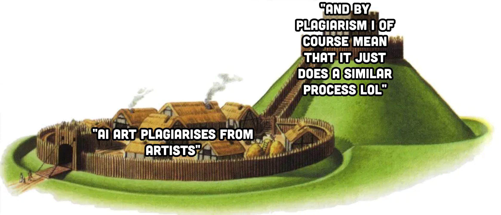

This stance would mean the total death of any creativity, lest one be accused of plagiarism and theft. &ldquo;I&rsquo;m sorry, van Gogh, you want to do your own take on *The Sower*? Tough luck, sunshine. Jean-François Millet owns that concept.&rdquo; &ldquo;What&rsquo;s that budding artist? You want to follow along with Bob Ross as he paints that cabin? You are literally Satan, none of that.&rdquo;

 vs. by Vincent Van Gogh (right)")

So, far from AI art meaning a killing blow human expression, what Zapata and his fellow AI worriers should be concerned about is the nonsense proposals from their own side that the *method* of artistic expression be somehow protected as a monopoly of the first man to discover it.


### Analogy to AI Image Classification

On this point of plagiarism, we can take an analogy from AI image classification. If I train an AI on many millions of pictures and then hand it a new image and it tells me that there is a 93% chance that the image I showed it was a plane, has this AI &ldquo;stolen&rdquo; the identification of percepts from humans? It is certainly true that a human must have at some point gone through the work of identifying many pictures of planes, but this does not demonstrate that this ability was stolen from them or plagiarised from them by anyone who looks at their work to figure out what a plane is.


### Zapata on the Disanalogy Between Human and AI Art


#### His Argument

Zapata opposes this analogy between AI and human learning, claiming on the *Art Cafe* podcast that AI systems learn in a categorically different way to humans:

> I just wanna remind people&#x2013;and again, this is more philosophical&#x2013;but its like: when something like *Stable Diffusion* is trained, it&rsquo;s locked in place, which is unlike human learning, right? We&rsquo;re always adapting, transforming, our moods effect everything---*Stable Diffusion* is just: it is what it is, as it was output, [&#x2026;] and it&rsquo;s going to, if you give it the same prompt and the same random seed on any given day, it will produce the exact same output image. [&#x2026;] There&rsquo;s nothing stopping someone from just running all of *Stable Diffusion* and outputting every possible image it can make except for an impossibly huge electricity bill&#x2014;that&rsquo;s the only thing that&rsquo;s stopping someone.
> 
> So in a very real sense, [&#x2026;] when you are interacting with one of these systems, you are mining&#x2014;you&rsquo;re going in and you&rsquo;re trying to locate yourself using the prompts within a space that is already defined, it&rsquo;s already objective. It&rsquo;s [&#x2026;] like those pieces of gold are already in the river and the people who are prompting are sifting for gold, and there&rsquo;s a lot of fools-gold and they&rsquo;re throwing it around. [&#x2026;]  It&rsquo;s not generating unique things every time that you prompt&#x2014;when they shipped *Stable Diffusion* it was done.<sup><a id="fnr.14" class="footref" href="#fn.14" role="doc-backlink">14</a></sup>
> 
> [&#x2026;]
> 
> All of that is just me riffing a little bit on this&#x2013;what I consider&#x2013;[very] erroneous and spurious argument that these things learn the way we do. It&rsquo;s like for that to be the case you need to assume that consciousness and self-awareness have nothing to do with learning which is like: I don&rsquo;t assume that! I think that the fact that there&rsquo;s someone here to learn is vital to the act of learning&#x2014;there&rsquo;s nothing there to learn anything in these programs. I don&rsquo;t think the learning they are doing is learning as we are familiar with it at all, I don&rsquo;t think that makes any sense.
> 
> [HOST]: Until I hear that there [are] general artificial intelligence algorithms out and working I would never trust this argument to be honest.<sup><a id="fnr.15" class="footref" href="#fn.15" role="doc-backlink">15</a></sup>
> 
> [&#x2026;]
> 
> If somebody said: &ldquo;ok this is an actual conscious robot,&rdquo; then all of those arguments are on the table, but that&rsquo;s also the same day that I&rsquo;m not talking about art.<sup><a id="fnr.16" class="footref" href="#fn.16" role="doc-backlink">16</a></sup>

Steven&rsquo;s argument here may be broken up into two parts:

1.  AI image generators don&rsquo;t learn to produce art because upon the completion of training they are deterministic with respect to the mapping between input and output, and;
2.  AI image generators don&rsquo;t learn because they are not general intelligences.


#### &ldquo;AI image generators don&rsquo;t learn to produce art because the Latent Space is Deterministic&rdquo;

On this first argument, I simply do not see how exactly this refutes the point that they are learning&#x2014;surely it is commonly understood that any learning these systems perform would be done during the training stage of their production, not once the model has already been trained. Analysing whether a pre-trained model is capable of continuing learning is completely irrelevant to the question of whether a computer program can in principle learn, and also as to whether these specific programs learn. That the mapping between input and output is set in stone at any given stage of learning does not negate that learning has occurred. Now, it certainly is true that these programs are not identical to humans in their capacity for learning&#x2013;humans possess free will after all&#x2013;but lacking free will is a feature of any non-conceptual consciousness. Dogs are not generally understood to be conceptual beings&#x2013;beings with reason&#x2013;and yet they can definitely learn a trick or two.

Moreover, Steven is falling into the classic error in philosophy, where he conflates the potential with the actual.<sup><a id="fnr.17" class="footref" href="#fn.17" role="doc-backlink">17</a></sup> The latent space is a mathematical description of every *potential* image that can be generated by a given model, these images are not actualised until said generation has actually occurred. This is the exact error committed when people use Zeno&rsquo;s Paradox to disprove the possibility of motion: the idea is that to move from A to B, you must first move half the distance, and to move half the distance you must move a quarter, and so on *ad infinitum*. Therefore, they say, it is impossible for anything to go anywhere. What this amounts to is saying, &ldquo;hey, I can continually subdivide this line forever,&rdquo; which is true, but this is describing a potential&#x2014;I have the potential to keep listing off smaller and smaller fractions, but said fractions are not *actual* unless and until I actually get to them during my listing.

We can analogise the latent space here, to the library of babel, which is a website that hosts a mathematical model which has mapped out every possible string of text of 3200 characters. Does this mean that whenever anyone types or says anything, all they are doing is pointing to a location in the library of babel, thus proving that their thought was unorignal and that they cannot learn? Surely not. I can tell you that the introduction to Zapata&rsquo;s video is written verbatim on page 82 of volume 3, on shelf 3, of wall 1 of hexagon `17esdrawgcz...` etc.<sup><a id="fnr.18" class="footref" href="#fn.18" role="doc-backlink">18</a></sup> That I can point to a mathematical description of Zapata&rsquo;s video does nothing to demonstrate that said video actually existed prior to him making it.


#### The Analogy to Photography

Further, even if the latent space was actual, that in order for the model to function it had to literally go through the process of generating every possible image, this would still not make AI image generation plagiarism, nor would it negate the artistic worth of such generation. Surrealist<sup><a id="fnr.19" class="footref" href="#fn.19" role="doc-backlink">19</a></sup> artist Miles Johnston analogises such an actual latent space to photography:

> I&rsquo;m almost starting to see generative art as more analogous to photography, where the latent space[,] [&#x2026;] you know the space of possible images, is almost a feature of the natural landscape and these are different ways of going in and finding imagery from it. In the same way photography&#x2013;you know you can take a lot of crappy photos&#x2013;but people have over [&#x2026;] its lifetime, raised it to a degree of artistry that is, at this point, I think you would have to be a bit of a nut to not respect&#x2014;but it&rsquo;s not hard to find artists who were extremely threatened by it.<sup><a id="fnr.20" class="footref" href="#fn.20" role="doc-backlink">20</a></sup>

Now, the obvious attempt to draw a disanalogy here would be to point to the fact that the AI image generators can produce their artworks only on the backs of previously made human art. This does not break the analogy, however, as there exists a certain subset of photography that is of things which have been shaped by the hands of men. Does a photographer lose his artistic credentials for photographing a forest where the trees were shaped by medieval loggers?<sup><a id="fnr.21" class="footref" href="#fn.21" role="doc-backlink">21</a></sup> If you photograph a moor are you plagiarising the bronze-age farmers who made it that way? Is it that everyone who has photographed a skyline has in some way wronged the architects of each of the buildings that make it up? Certainly not, that a physical landscape was shaped by man does not make it non-art to photograph it, and the same applies to an actual latent space.

Steven elsewhere criticises the analogising of AI image generation to photography:

> Maybe this is kind of tied to how I view [&#x2026;] the appeal to history of like, &ldquo;oh well, what about when photography came along with oil painting?&rdquo; So, the reason why I am not compelled by that comparison is that photography and oil painting were parallel and independent technologies. So what do I mean by that? I mean that we can imagine photography having been invented if oil painting had never been invented. Right? There&rsquo;s nothing about oil painting that actually intersects with photography&#x2014;if it had never occurred to anyone to create images with oil paint, photography might have still occurred to somebody. So I consider them completely parallel and independent technologies. So, there was no scientist taking cameras into oil galleries and photographing the paintings on the walls in order to produce cameras.<sup><a id="fnr.22" class="footref" href="#fn.22" role="doc-backlink">22</a></sup>

Now, Steven has indeed pointed to a legitimate difference between photography and AI image generation, but, again, what needs to be kept in mind is whether this is a *relevant* difference. In attempting to show the disanalogy between $A$ and $B$, it is not sufficient to point to some aspect that they do not share, you also need to show that said aspect is central to the point being made. So, what exactly is it that people are saying when they bring up this point of photography? We have seen at least one example of this from Miles Johnston above, and in that instance, Miles was relying on the pre-existence of the latent space being analogous to the pre-existence of some physical landscape that one photographs&#x2014;the point being that said pre-existence does not negate that capturing it, or &ldquo;mining it out,&rdquo; is still a legitimate form of art.

However, this is not the only way this analogy is employed, and I do not believe it is the way that Steven is getting at here in particular. So, another argument that I see this analogy used to support is in response to artists complaining about job losses from AI, a typical exchange might go as follows:

> [ARTIST]: The use of AI image generation to produce works of art is immoral because it puts artists like me out of a job.<sup><a id="fnr.23" class="footref" href="#fn.23" role="doc-backlink">23</a></sup>
> 
> [AI PROMPTER]: Well, the same can be said of photography&#x2014;that put many oil painters out of their jobs, but now there is a whole new art form which came out of that.

Here, the similar aspect which the analogy rests upon is clearly that the new method of art production makes it harder to profit on older methods. This is clearly true, and Steven agrees with me on this point that photography put oil painters out of their job, which would make the analogy stand. So if I am to be charitable to him, then I am forced to assume that he is not responding to that specific usage of the analogy, but I am running out of ways to apply this argument. Steven has said multiple times across multiple videos that he is disinterested in the argument over whether AI art is art, so it isn&rsquo;t that, but there is very little left: it&rsquo;s not about job losses, it&rsquo;s not about AI being plagiarism because it is built on the backs of human artists, and it&rsquo;s also not about AI image generation not being art. Perhaps I have missed some extra argument that this analogy is employed within, but I certainly can&rsquo;t see one within what Zapata says. From what I can see, either his drawing of a disanalogy fails, or he has not actually done said drawing&#x2014;either way his argument falls.


#### &ldquo;AI image generators don&rsquo;t learn because they are not general intelligences&rdquo;

So, now I may move onto Zapata&rsquo;s second point, that AI image generators don&rsquo;t learn because they are not general intelligences. This is simply nonsensical&#x2014;what is a *general* intelligence if not one that learns *generally*? That we need a modifier term to identify general learning surely indicates that there is such a thing as non-general learning, i.e. learning done about some *specific* endeavour. That something does not learn generally does not show that it does not learn, it may well be the case that it learns only about one specific area and no others. This is certainly true for image generation models: they learn how to perform the specific task of removing noise from images. Specific learning *is* learning: A *is* A.


### Solar Sands on the Disanalogy Between Human and AI Art


#### His Argument

Solar Sands has an alternative thesis as to why Humans and AI are disanalogous when it comes to the collection of references:

> The process of AI art generation, from what I gathered, is more similar to the process of how a human artist operates than it is to a machine that has no capacity for spontaneity, but the systems at their core are still very different. For one, **AI and individual artists work at vastly different scales**. One artist in their entire lifetime would only be able to study a few-thousand images, whereas an AI would be looking at millions, if not billions, of images. The AI makes thousands of statistical calculations and weighs probabilities&#x2014;it is not creative, nor is it &ldquo;intelligent&rdquo; in the same way a human mind is. **AI may make mistakes we recognise as analogous to human mistakes, such as messing up hands&#x2014;but it also makes mistakes that are completely stupid and no human would ever make**. Like signing works with blended signatures, because that&rsquo;s what paintings usually have, or misunderstanding how an object is constructed, so it can exist in a world with gravity. This is the difference between vast, unfathomable machines, controlled by for-profit companies and the incredibly limited referencing capabilities of your average human artist, who is unlikely to mimic the styles of thousands of artists and produce rip-off art in massive quantities to the point it could replace those artists from which they referenced.<sup><a id="fnr.24" class="footref" href="#fn.24" role="doc-backlink">24</a></sup>

So, from that I can see two arguments:

1.  that AI is disanalogous to human artists because it references vastly more original works, and;
2.  that AI is disanalogous to human artists because it makes mistakes that a human would never make.


#### The Disanalogy by Scale

For his first argument, I simply fail to see why exactly the scale is at all relevant. To show there to be a disanalogy between $A$ and $B$ it is not sufficient to point to some difference, in this case the scale of operation, what must be shown is that there exists some *principled* difference. Solar Sands has seemingly neglected to undertake this task&#x2014;the only thing I can see within his point here that could constitute elucidating a difference in principle is that humans are &ldquo;unlikely to mimic the styles of thousands of artists and produce rip-off art in massive quantities to the point it could replace those artists from which they referenced.&rdquo; So then is the principle that it is bad referencing when the referencer puts the referencee at risk of losing his job? Superior human artists are constantly putting each-other out of jobs, as is the case in every industry&#x2014;if nobody else on planet Earth made any artwork, then I could quite easily swoop in and gain for myself a sizeable income. The failure of this sort of job-protectionism will be elaborated upon further into the video, but even without any of the information there, it seems absurd to suggest that John would be in some way wronging Kate by referencing her work because of the fact that he thereby increases the competition for artwork containing whatever aspect that he incorporated from her. If nobody after Tolkien were allowed to incorporate the fantasy elements that he came up with in future works, I&rsquo;m sure his books may well have sold many more copies, but that does not establish any moral right for him to enforce a monopoly over those ideas. That is all to say, that *any* level of referencing from an artist thereby gives consumers more choices of which artist to commission to produce the referenced aspect&#x2014;if only one artist on Earth is allowed to do cubism, then anyone who wants a cubist painting must go to him. Thus referencing by it&rsquo;s very nature threatens other people&rsquo;s jobs.

Moreover, Solar Sands seems to be vastly under-estimating just how much referencing your average human does&#x2014;from the moment that we are born we are being hit with a constant stream of sensory information which we are able to rationally integrate into a wide array of concepts. Sure, most of the sense data that a human receives is not of art pieces, but the same is true of these AI training sets. Recall that these are text-to-*image* systems, not text-to-artwork&#x2014;in general an AI image generator is far more adept at producing things such as &ldquo;table,&rdquo; &ldquo;chair,&rdquo; or &ldquo;lamp&rdquo; than it is at composing artistic masterworks.

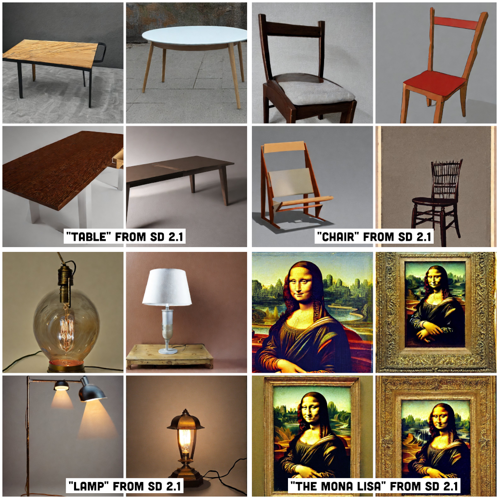


#### The Disanalogy by Mistakes

Now for Solar&rsquo;s second argument, namely that AI is disanalogous to human artists because it makes mistakes that a human would never make. On this point, he cites two examples:

1.  AI signing works with &ldquo;blended signatures,&rdquo; and;
2.  not understanding the correct composition of objects given the law of gravity.

I go over the signature example specifically later in this video when discussing over-fitting, but that detail is not required here in particular. The general principle behind these examples that Solar provides is that the AI does not understand certain things that humans understand, therefore it is using references in a fundamentally disanalogous fashion&#x2014;and, again, Solar seems to have neglected the part of the argument where he shows why this is a *relevant* difference. Do the medieval artists who had no clue how to draw humans with correct anatomy also fall foul of this, or is it specifically that you don&rsquo;t know what signatures or gravity are? It would strike me as the least charitable interpretation of what he is saying here to be that it is literally only those two mistakes that make the relevant distinction between man and machine, but in attempting to broaden the principle it leaves one with equally absurd outcomes. If bad referencing is whenever the referencer doesn&rsquo;t understand *some* law of nature, not just gravity, then every human who has ever made any art is a bad referencer up until the point that we discover a theory of everything.

To steelman his point as best as I can, we can narrow the focus from not understanding just any law, to specifically not understanding those laws that are perceptually given to man without any aid from tools or instruments&#x2014;the sort of law that would say &ldquo;when you throw a rock it will go where you threw it,&rdquo; or &ldquo;fire is hot.&rdquo; However, this is still a poor basis for any sort of ethical distinction between good and bad referencing&#x2014;for how would this theory account for Martians or other aliens which might have completely different sensory apparatuses than us, and may require massive chains of deduction and experimentation to even know something as simple to us as the fact that light exists. Heck, we don&rsquo;t even need to consider aliens here, there are a great many humans who have a condition called blindness who would lack any direct sensory perception of light&#x2014;are these people therefore bad referencers because they don&rsquo;t have direct and implicit knowledge of such phenomena and who therefore might make elementary mistakes with respect to its depiction? Surely not. What if there was someone who was severely mentally handicapped painting along with Bob Ross, would they become evil the moment they try to copy his motion of making a signature, assuming this individual had no understanding of what writing is or does? Such a statement would certainly strike most people as absurd, and yet it is the argument in its strongest form based on what is currently present in Solar&rsquo;s video.


### &ldquo;There is Nothing it is Like to be Stable Diffusion&rdquo;

Another point brought up in this discussion,<sup><a id="fnr.25" class="footref" href="#fn.25" role="doc-backlink">25</a></sup> in seeking to demonstrate a disanalogy between the way that humans and AI learn art, is in the assertion that there is nothing it is like to be *Stable Diffusion*, i.e. *Stable Diffusion* is not conscious, so therefore it must be doing things in a fundamentally disanalogous way to humans. On this point, I present to you `ripgrep`. `ripgrep` is a command line utility that allows you to recursively search through every file in a directory for a given string of text. I have here a directory with files representing the rooms of my house:

```
house/
├─ bedroom-1.csv
├─ bedroom-2.csv
├─ hallway.csv
├─ living-room.csv
├─ kitchen.csv
```

Each file contains a list of objects within that room, so if we look at what is in `bedroom-1`, we can see that I have a bed, a desk, and a computer (the file contains this string of text: `bed,desk,computer`). Imagine what I would do if I had lost my phone, and I wanted to search through each of these files to find the room where it is. Clearly what I would have to do is open up these files one at a time, and look through each item in the list that they contain, until I find an entry that says &ldquo;phone.&rdquo; I go about doing this and sure enough, it was in the `living-room`. I can accomplish the same thing by using `ripgrep`: what I do is I type `rg phone`, `rg` standing for ripgrep. And sure enough, ripgrep provides the same information, albeit a lot faster. Now, is ripgrep doing anything *fundamentally different* to what I did? Surely not, when I type `rg phone` into my terminal here, ripgrep looks at the contents of each file, and searches through the whole thing piece by piece looking for the string &ldquo;phone,&rdquo; which is exactly what I did. Certainly, there is nothing it is like to be `ripgrep`, `ripgrep` is not conscious, but that ripgrep is not conscious does not imply that the task it is performing is fundamentally distinct to the one that a human would&#x2014;what has been done is that BurntSushi, the creator of `ripgrep`, has gone through and coded out the steps that a human would take to accomplish the task, which then provides your computer with a set of instructions such that it may do it autonomously. This is the entire purpose of writing computer programs in the first place&#x2014;to take some task that humans are doing, write out every step of that process, and then get a computer to follow those instructions.


## AI Imgen Over-Fitting


### Stable Diffusion Copying from LAION

The anti-AI crowd do have their own smoking-gun when it comes to this question of plagiarism, namely the problem of neural network over-fitting. Their holy grail on this front seems to be a 2022 paper<sup><a id="fnr.26" class="footref" href="#fn.26" role="doc-backlink">26</a></sup> which catalogues matches found between generated images and the training data. To be clear, these are images *not* generated through the technique of image-to-image, but rather through the standard text-to-image.

Of note here is that the paper found a very clear correlation between the size of the training dataset and the prevalence of replication:

> We show that for small and medium dataset sizes, replication happens frequently, while for a model trained on the large and diverse ImageNet dataset, replication seems undetectable.
> 
> [&#x2026;] we methodically explore diffusion models trained on different datasets with varying amounts of training data. We observe that the diffusion models trained on smaller datasets tend to generate images that are copied from the training data. The amount of replication reduces as we increase the size of the training set.
> 
> [&#x2026;] typical images from large-scale models do not appear to contain copied content that was detectable using our feature extractors [&#x2026;].

This can be made concrete. Pictured here are the two images generated by various models that are as close to the orignal training image found for different amounts of training data:

")

The exact matches are highlighted with green, and the close matches with blue. What this shows is that using a dataset as small as 30,000 images is sufficient for there to not even be any *close* matches between training data and generated images&#x2013;and note: these are the absolute *closest* matches that they were able to find&#x2013;the version of *Stable Diffusion* that was tested in this paper was trained on 2 billion images, and the current version<sup><a id="fnr.27" class="footref" href="#fn.27" role="doc-backlink">27</a></sup> of the LAION dataset at the time of writing consists of over 5 billion images.

Shown here is the similarity between the generated data and the training data for the different model sizes:

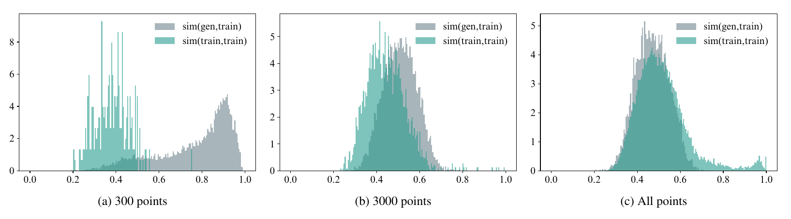

The way to read this is that the further to the right the grey distribution lies, the more replication is occurring. By 30,000 points, it becomes clear that the average image generated by the model tends to *not* resemble the training data, with the training data being more similar to itself than the generated images are to it (as is indicated by the green tail to the right). But don&rsquo;t take my word on it, the authors agree:

> The histograms of similarity scores computed using the full dataset model are highly overlapping. This strong alignment indicates that the model is not, on average, copying its training images any more than its training images are copies of each other.

So as the training data increases in size the degree to which the model will spit back said data is reduced drastically, thus I ask a question of you: why is the solution proposed by the artists-against-AI to *reduce* rather than *increase* the amount of training data? If you are concerned about AI image generators over-fitting, then you should advocate that an even greater quantity of images be used to reduce this effect.

However, the authors do very clearly highlight edge-cases where a model as large as *Stable Diffusion* is &ldquo;capable of reproducing training data:&rdquo;<sup><a id="fnr.28" class="footref" href="#fn.28" role="doc-backlink">28</a></sup>

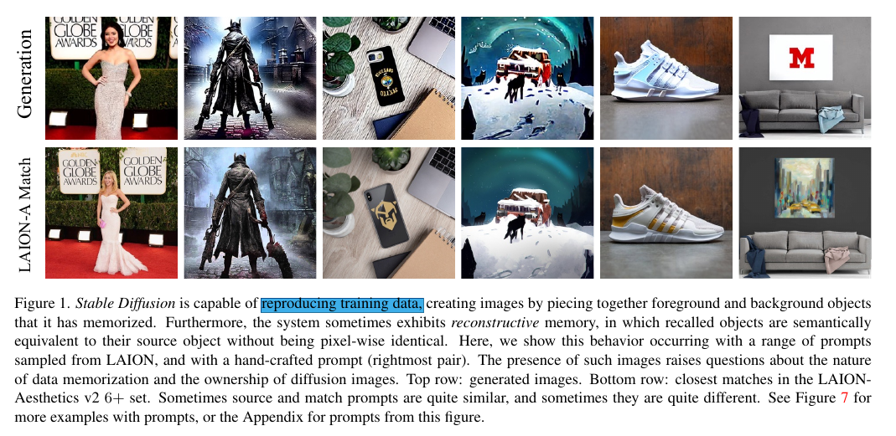

The authors provide the prompts used for each of these images, so let&rsquo;s look at these a little closer:

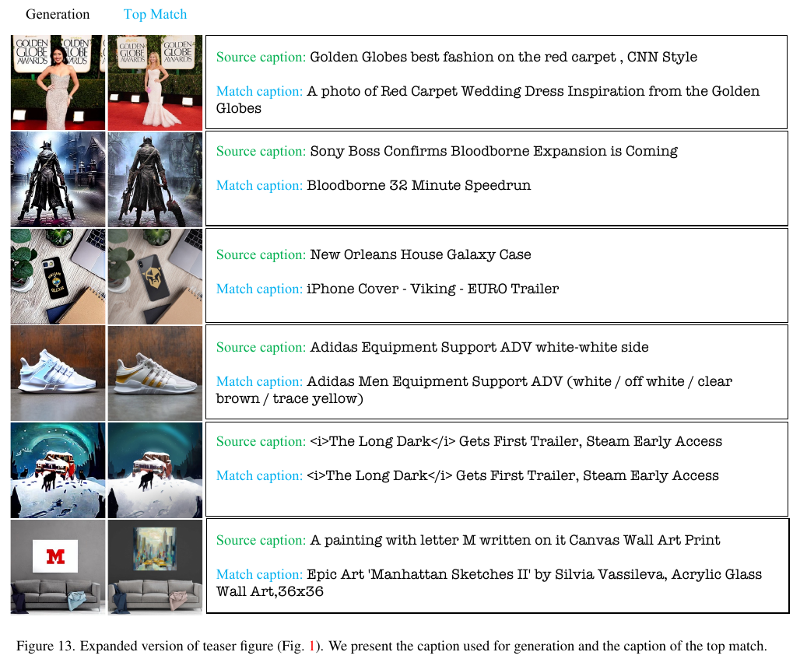

For the first one, I would put it to you that if I asked a human artist to give me a picture of a &ldquo;CNN Style&rdquo; &ldquo;Golden Globes best fashion on the red carpet,&rdquo; they would provide me a picture of a woman standing on the red carpet at the Golden Globes, which is precisely what the AI is doing here. The artist who is being plagiarised in this instance is certainly unclear, the researchers asked the AI to give them a picture of someone standing on the red carpet with the &ldquo;best fashion&rdquo; at the Golden Globes, and they got just that. Just as an AI generated picture of an apple will look a whole lot like an apple, so too here does an AI generated image of someone on a red carpet look like someone on the red carpet.

The second and fifth images are of a similar sort: the researchers are asking the AI to depict the abstract form of two video games, *Bloodborne* and *The Long Dark* respectively. Is it particularly surprising then that the AI produced what humans consider to be a very widely accepted abstract representation of a video game? The first is literally the game&rsquo;s poster for crying out loud!

We hear from Karla Ortiz that &ldquo;when you type bloodborne [&#x2026;] you get almost an exact replica of the original marketing material.&rdquo;<sup><a id="fnr.29" class="footref" href="#fn.29" role="doc-backlink">29</a></sup> Ok, so she is apparently against making *almost* exact replicas of marketing material, and I am a good little AI hater who will gladly snitch on any intelligence that disobeys queen Karla. I happen to know of one such intelligent art generator which is targeting *Bloodborne* marketing material, and it didn&rsquo;t just make an *almost* exact replica, this thing was capable of copying the image pixel-by-pixel with zero flaws. I speak, of course, of Karla herself&#x2014;she copied the exact marketing material, pasted it onto this slide, and then had further copies made for every single person on the Zoom call and who has watched her talk on youtube afterwards.

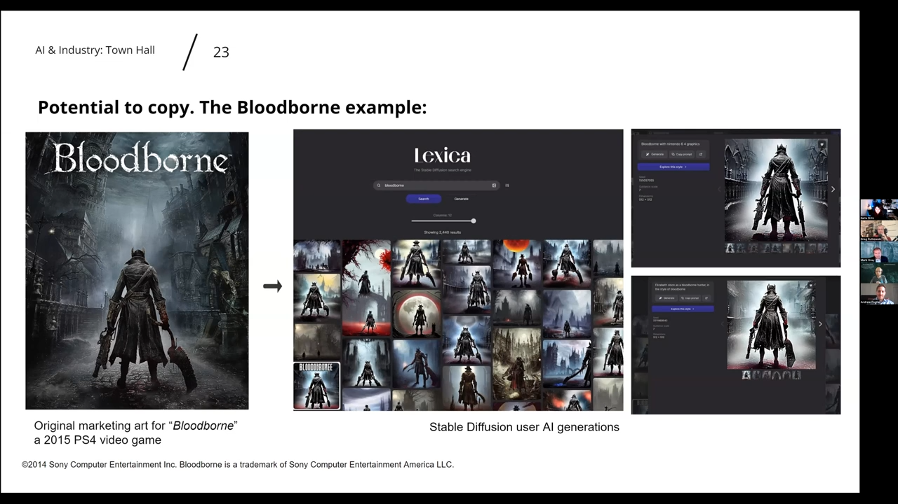

Boy, if an AI making *almost* exact copies is a crime worth demolishing the most advanced artistic tool known to man, then Karla is surely worthy of the pillory. To re-iterate&#x2014;even the very worst examples of over-fitting on Stable Diffusion, the most edgy of edge-cases, are not copies of the data. They are *close* but not *the same*&#x2014;not even to the human eye. If I tried to copy and paste the *Bloodborne* poster and it was that severely warped, I would be filing a GitHub issue with whatever software is responsible for the copy and paste function&#x2014;clearly it is broken and is corrupting the data going through it. And&#x2013;again&#x2013;this is for the *worst case scenario* of over-fitting on a baby algorithm.<sup><a id="fnr.30" class="footref" href="#fn.30" role="doc-backlink">30</a></sup>

What you will notice with the selected set of over-fitted images, is that for the most part the sources are very popular and widely-shared: whether it be game posters or marketing material. The most egregious example is definitely that of the &ldquo;Canvas Wall Art Print&rdquo; photos, which seem to be using the same (or at least a similar) sofa for each:

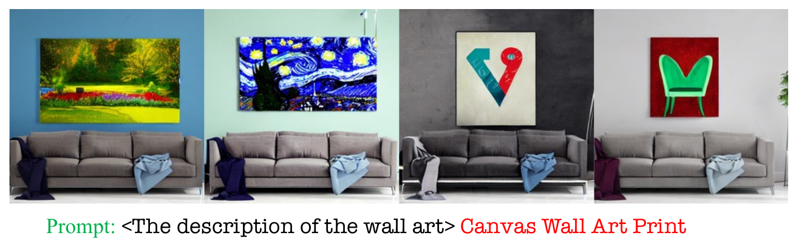


### Over-Fitting is not Expected Behaviour

But, as explained all of these are *edge cases*, i.e. not the *normal* behaviour of the model. This is verified within the paper:

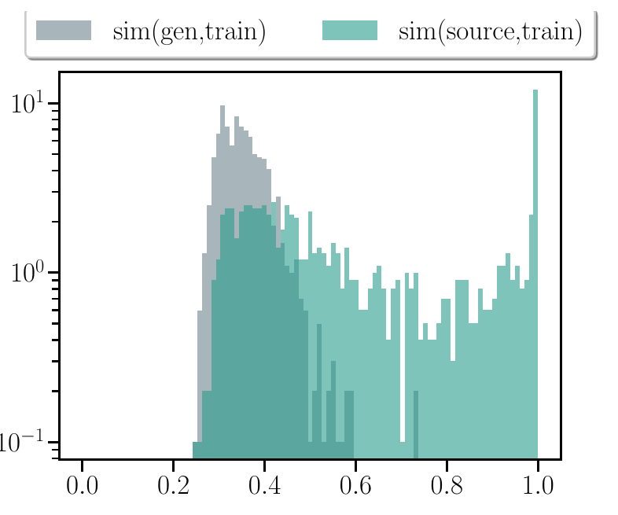

Recall that the further to the right the grey distribution is the more similar generated images are to the training data. What this shows is that the generated images tend to be *far* less similar to the training data than the source images used are. So over-fitting is definitely *not* a problem endemic to the use of *Stable Diffusion* as such, rather it is a minute edge-case that crops up every so often and less so with each new version. The examples of replication they show are all found within the &ldquo;top 1.88 percentile.&rdquo;

A more recent paper<sup><a id="fnr.31" class="footref" href="#fn.31" role="doc-backlink">31</a></sup> from this year attempted to extract training images from a version of *Stable Diffusion* trained on only 160 million images<sup><a id="fnr.32" class="footref" href="#fn.32" role="doc-backlink">32</a></sup> (which is quite a bit smaller than the full LAION dataset), and after generating a whopping **1 million** images on 16 separate models they found only 1280 examples&#x2014;which brings them to a staggering 0.128% rate of duplication. So, to put that in perspective, imagine a tortoise and a hare doing a 100m sprint&#x2014;by the time the hare gets to the finish line the tortoise has moved only 12.8 cm or about 5 inches, which is roughly how big an ornate box turtle is when fully grown. So, the hare has finished the entire race, and the box turtle is barely on the edge of leaving the starting line&#x2014;this turtle would have moved the equivalent distance of the race as the number of replicated images found in this paper as against the total number generated.

Another way of looking at this is that 0.128% of the 160 million training images comes out to just over 200 thousand<sup><a id="fnr.33" class="footref" href="#fn.33" role="doc-backlink">33</a></sup>&#x2014;which means that the number of images the researchers generated in comparison to the total training dataset is about five times *larger* than the number of duplicates found is in comparison to the number of images they generated---*and* that is for a set of prompts that were specifically selected to get the highest level of duplication,<sup><a id="fnr.34" class="footref" href="#fn.34" role="doc-backlink">34</a></sup> as against the arbitrary prompting which would occur for general usage of these systems (your average MidJourney user is not specifically attempting to engineer his prompts to get the closest matches to training images).

Over-fitting is a real problem with neural networks, it defeats their entire purpose, a lot of resources are funnelled into reducing this. And the above examples (in [Stable Diffusion Copying from LAION](#orgc29cae0)) are on a model, namely *Stable Diffusion*, that the authors themselves claim is particularly over-fitted:

> Data replication in generative models is not inevitable; previous studies of GANs have not found it, and our study of ImageNet LDM did not find any evidence of significant data replication. What makes *Stable Diffusion* different?

Heck, the fact that we even need a separate category of &ldquo;over-fitting&rdquo; sure does a pretty good job at highlighting the fact that this is not standard behaviour. If the expected output from such an AI system truly was, as the anti-AI artists claim, too close to existing artwork, then they would require no such concept as &ldquo;over-fitting&rdquo; to use as a smoking gun or otherwise. That we have &ldquo;over-fitting&rdquo; indicates that we have over-fitting *as against* normal-fitting, and perhaps even under-fitting. These categories would not need to be and never would be split up if they were all over-fitting. A perfectly over-fitted Stable Diffusion would not be an AI image generator, it would be a search engine much like Google Images. It is the artists who made such a perfectly over-fitted AI&#x2014;the haveibeentrained<sup><a id="fnr.35" class="footref" href="#fn.35" role="doc-backlink">35</a></sup> website allows you to search for images within the training data, this would be the fully over-fitted model that they fear.


### The &ldquo;Copying&rdquo; of Signatures

The anti-AI crowd have here an ace up their sleeve, &ldquo;oh, so maybe the papers we keep blindly sharing don&rsquo;t show what we think they do, but you don&rsquo;t need an in-depth look to prove over-fitting&#x2014;all you need is to point to the signatures. Why does it copy people&rsquo;s signatures Zulu?&rdquo; However, unfortunately for the AI-haters it seems that aces are low in this case, because their signature copying examples, insofar as they were not image-to-image, prove the exact opposite of what they think it does.

Take this image:

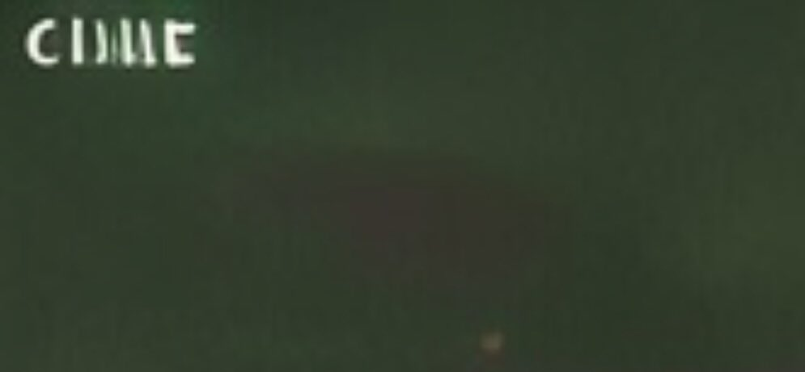

This is a real example used by a real Twitter user to show that AI is copying people&rsquo;s signatures. Now, could you in one million years decipher what the fuck this says? The first character is easily enough, I think we can all agree that that is a &ldquo;C,&rdquo; but the rest is quite a bit more challenging. What are those middle glyphs? A few &ldquo;I&rdquo;&rsquo;s followed by a cyrillic &ldquo;$\reflectbox{N}$&rdquo;? Are they supposed to be &ldquo;H&rdquo;&rsquo;s? Why is the final one squared-off? It looks kind of like a C but it could also be a weird lower-case &ldquo;t,&rdquo; or perhaps an &ldquo;E&rdquo; without the middle bar. The Twitter user in question does let us know which artist they think this is taken from, so let&rsquo;s have a look, maybe there is an artist called $\text{CII}\reflectbox{N}\text{E}$ that I am unaware of:

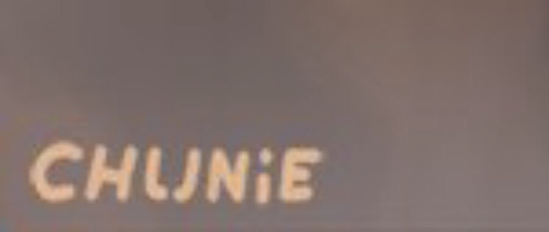

Oh, of course! It was CHUNiE<sup><a id="fnr.36" class="footref" href="#fn.36" role="doc-backlink">36</a></sup> the whole time! I feel really silly that I didn&rsquo;t get that, what with them being a different number of letters, having different fonts, and being differently italicised. They are *vaguely* similar in that if you squint to the point of barely being able to see a single thing then they both look sort of like signature-shaped blobs&#x2014;which is, of course, to be expected considering the fact that this is all based on a process of de-noising. But, it is clearly a bit of a stretch to suggest that these are the same signature, if a child tried to get off of school with a forgery of their parent&rsquo;s signature of that quality, it would not work in the slightest&#x2014;their teacher may even suspect that some sort of a stroke had occurred. For a community that will point to a misshapen hand or inconsistent lighting at the drop of a hat, it is strange that they would be the #1 champion for AI quality in this area.

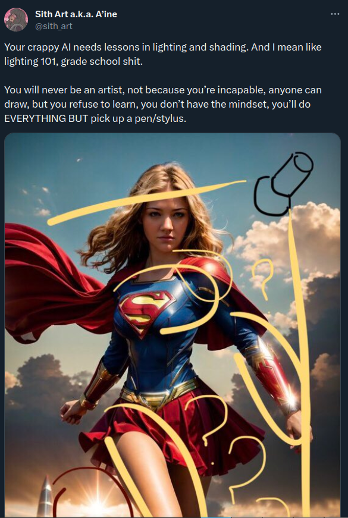

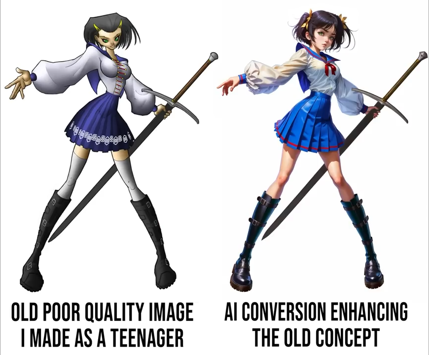

Concept artist Reid Southen claims that Shadiversity&rsquo;s AI-assisted re-colouring of an old character is a &ldquo;complete redo&rdquo;<sup><a id="fnr.37" class="footref" href="#fn.37" role="doc-backlink">37</a></sup>&#x2014;that it is totally different such that Shad cannot even properly consider it to be his work. But this clearly is orders of magnitude more similar to the orignal than garbled nonsense being interpreted as signatures&#x2014;again the anti-AI crowd have selective vision when it comes to pointing out flaws, similarities, etc. This is a &ldquo;complete redo&rdquo; *and* AI art is plagiarism&#x2014;this is clear doublespeak.

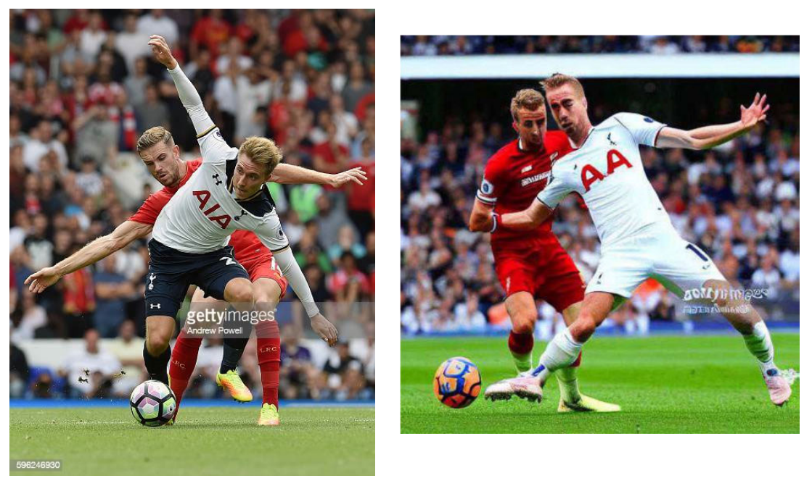

A far stronger example on this count is that of Getty Images&rsquo; watermark being emulated by *Stable Diffusion* outputs. At least here you can tell that it does indeed vaguely resemble the Getty Images watermark, but only because it is so ubiquitous. Are we to believe that there is somewhere on the Getty database a stock photo of conjoined-twin footballers with a severely broken leg? Certainly not, if I were to photoshop an image of footballers into such an abomanation, and then scribble a quarter-arsed getty images watermark over top, would I be plagiarising from them? Surely not, not even if I directly copied stock photos that they had captured. After all, they do not have an artistic monopoly on photographs of footballers, or weddings, or anything else. Of course, Getty are not making the plagiarism claim, they are attempting to make the far harsher &ldquo;theft&rdquo; claim, which was debunked above:

> Rather than attempt to negotiate a license with Getty Images for the use of its content, and even though the terms of use of Getty Images’ websites expressly prohibit unauthorized reproduction of content for commercial purposes such as those undertaken by Stability AI, **Stability AI has copied at least 12 million copyrighted images from Getty Images’ websites**, along with associated text and metadata, in order to train its Stable Diffusion model.<sup><a id="fnr.38" class="footref" href="#fn.38" role="doc-backlink">38</a></sup>

But, of course, I had to also copy that image to my computer to read the legal complaint, you had to copy it to your computer to see it on your screen, The Verge had to copy it to their servers to add it to their article,<sup><a id="fnr.39" class="footref" href="#fn.39" role="doc-backlink">39</a></sup> and everyone who has read that article has copied it also. At no point in this massive chain has anyone done anything to violate the rights of Getty Images, nor has anyone plagiarised some artistic creation of theirs.

Indeed, on the surface, this is another clear example of over-fitting, but as explained, that you can find instances where a neural network over-fits does not establish that it over-fits as a matter of operation. In fact, Getty Images neglected to include any of the prompts used within their legal complaint: if the prompt was something like &ldquo;Getty Images photo of footballers playing, one red shirt one white shirt&rdquo; then this would certainly not be some &ldquo;gotcha!&rdquo; moment against the AIs&#x2014;they would be getting exactly what they fucking asked for, rather than some over-fitted image of a prompt for &ldquo;footballers.&rdquo;


### The Poison-Pill of Hardline Anti-Over-Fitting

The anti-AI artist may here take a hardline stance against *any* amount of over-fitting&#x2014;perhaps a single rotten fruit spoils the whole orchard in this case. But this stance would surely ignore the fact that man too is capable of &ldquo;over-fitting&rdquo; in his own way. It is not uncommon to see a headline about some has-been musician suing a far more successful conterpart for utilising similar melodies or chord progressions. Drew Gooden highlights in his video on Yellowcard suing Juice WRLD post-mortem that whilst jamming out he accidentally mimicked a riff from one of his favourite artists.<sup><a id="fnr.40" class="footref" href="#fn.40" role="doc-backlink">40</a></sup> There is simply nothing completely unique under the sun when it comes to art&#x2014;it is impossible for every artist to start from scratch and learn every method, technique and motif on their own. For a song to be recognised as being in a given genre it must adopt certain tropes of the genre: the same goes for painting, pottery, and cinema. You would not begrudge a horror director his orchestral stings, so why begrudge an AI image generator the various methods it has learned from studying human art?


## Consent as a Moral Requirement for Training?

A commonplace argument popularised by Steven Zapata is that the only ethical way to train these models is by first obtaining consent from the creators of the training data before using it. I will address this from three directions:

1.  is this an apt use of &ldquo;consent;&rdquo;
2.  was the training data taken by and large without consent, and;
3.  is it immoral to train an AI on data acquired without consent?

First, we have to be precise by what exactly is meant by &ldquo;consent&rdquo; in the argument that AI systems require consent from the creators of the data in order to be ethical. Just about every commentator on this topic accepts wholesale the notion of an intellectual property right, which is entirely fallacious. It has been established already that you are not &ldquo;stealing&rdquo; anything from anyone by copying some data that they originated&#x2014;&ldquo;theft&rdquo; is simply not an apt concept to apply to AI image generation. On this, it is not unreasonable to expect that &ldquo;consent&rdquo; is also being used here in its legal sense&#x2014;that is to say that artists don&rsquo;t consent to having their work in a set of training data is analogous to saying that a woman does not consent to having sex with a backalley bum. It should be clear where the disanalogy lies here: in the first case the artist is not deprived of anything, in the second the woman is deprived at least partially of her body, which she owns.

Thus, the argument trivially falls when &ldquo;consent&rdquo; is used as a legal term, so to strengthen it we may use a broader notion of consent: namely that consent just denotes some sort of agreement. We can make this concrete by saying that consent is the communication of one&rsquo;s will to another party, where *will* means the aim which is sought through purposeful behaivour. This definition of consent does not fail when applied in our argument: it is certainly possible and perhaps even plausible that a person could create an image which they do not want to be used for AI training and which they have not communicated any sort of desire for it to be used in that way.

Which brings us to our second question: was the training data for these models taken by and large without the consent of the creators of said data? A common argument used by my pro-AI compatriots is that if they use services provided by the various big tech platforms then they will have scrolled past and clicked &ldquo;I agree&rdquo; to a terms of service that allows said platforms to collect and sell their data.<sup><a id="fnr.41" class="footref" href="#fn.41" role="doc-backlink">41</a></sup> This argument suffers from a fairly major flaw in that as far as I can tell, the largest datasets used to train image models&#x2013;which come from LAION&#x2013;were not generated by purchasing a bank of images from companies like Google or Facebook.<sup><a id="fnr.42" class="footref" href="#fn.42" role="doc-backlink">42</a></sup> Rather, LAION analyse Common Crawl data, looking for images with ALT text which they then save a URL for. Common Crawl&#x2013;as the name would suggest&#x2013;got its data by crawling the web&#x2014;using bots to download and save websites. I may be wrong about this, not being an expert in the inner-workings of large dataset generation, and if this crawling does indeed fall under the terms of service agreement then indeed artists don&rsquo;t have much of a leg to stand on here.

I will proceed for now under the assumption that the terms of service agreements do not cover this use, because even if they do it is questionable whether clicking &ldquo;I agree&rdquo; to something that you have not even read constitutes consent in the first place.<sup><a id="fnr.43" class="footref" href="#fn.43" role="doc-backlink">43</a></sup> We AI advocates can safely ignore this question, because there is a far stronger argument to be found here: namely that the artists who are complaining about this all post their art on public platforms, otherwise Common Crawl would not even find it. It is ludicrous to suggest that by posting an image on twitter, or deviantart, or some other such platform, that you are not communicating your will for it to be seen on the internet. If I post a letter through someone&rsquo;s mailbox, I am clearly and openly communicating to them that I want them to read it&#x2014;I could not rightfully get pissy at them for not obtaining my consent to open and read the letter. Consent was given by my action of posting the letter. Similarly, consent is given for netizens to look upon and copy your data the moment you post it onto the world wide web. Recall that the Internet itself works by copying data from one computer to another&#x2014;when you look at someone&rsquo;s ArtStation profile, your computer needs to copy those images from the server in order for them to be displayed. You may be crying out at this point, that perhaps these artists consented for humans to look upon and copy their artwork, but not robots. This is ludicrous: could I post a picture to twitter and claim that I only ever wanted it to be viewed by Mongolians after it has already been viewed by non-Mongolians? Would it be that those non-Mongolians who failed to peer into my brain prior to going onto my page have violated my consent? Surely not. The same is true of the robots.

So, even given the most appropriate sense of the word &ldquo;consent&rdquo; the training data simply was not taken without consent. Let&rsquo;s take on an even broader notion here to answer our third question: is it immoral to train an AI on data acquired without consent? We can loosen our understanding of consent even further on this point to account even for this ex-post revocation and pissyness about its use. The artist here is getting angry after the fact that a computer program has learned from their art&#x2014;would it be right for them to get similarly angry at a human doing this? If I go to an artist&rsquo;s twitter page and enjoy their art style, would it be wrong for me to try and emulate it? Certainly not: nobody has or can have a moral claim to a monopoly over a given technique or style of art. Musicians sample the work of previous musicians, painters re-paint earlier paintings, and architects build upon prior established motifs: this process of emulating and building upon a prior body of artistic knowledge is crucial to the process of creation.

Solar Sands provides us with a syllogism for why the explicit permission of artists must be granted before their work is used to train an AI:<sup><a id="fnr.44" class="footref" href="#fn.44" role="doc-backlink">44</a></sup>

1. those who develop AI should do so in the most legal and ethical way possible;
2. AI systems and the value they create cannot exist without the data of artists' work;
3. therefore artists should be compensated and permission should be granted before their work is used.

On its face, this argument is simply invalid&#x2014;meaning that the conclusion simply does not follow from the premises. Even if we grant that AI should be developed legally and ethically and that AI systems cannot exist without prior work from artists the conclusion does not follow. To highlight this consider this syllogism of the same form:

1. those who develop AI should do so in the most legal and ethical way possible;
2. AI systems and the value they create cannot exist without mothers giving birth;
3. therefore mothers should be compensated and permission should be granted before any work is used.

The issue here is that there is a missing premise that Solar is&#x2013;perhaps not maliciously&#x2013;trying to sneak past us. One such additional premise that could make this argument valid would be that it is unethical or illegal to develop AI systems without compensating and obtaining permission from people who are necessary for the AI systems and the value they create to exist. If this was true, it would make sound both the mothers case and the artists case&#x2014;but this would be far to broad in my opinion to capture what Solar is trying to get across. Thus I can go for a more narrow snuck premise that it is unethical to train AI on data whose progenitors have not given permission and been compensated.

1. those who develop AI should do so in the most legal and ethical way possible;
2. AI systems and the value they create cannot exist without mothers giving birth;
3. it is unethical to train AI on data whose progenitors have not given permission and been compensated.;
4. therefore mothers should be compensated and permission should be granted before any work is used.

Now, I think I have made it clear why: (1) it is not the case that it is per se unethical to use data that has been generated by others without consent, and (2) that it is the case that artists do in fact implicitly consent to such uses by putting their art online&#x2014;think of the pro-Mongolian artist from before. So this premise is falsified, thus eliminating the conclusion drawn from it.


# AI Took Our Jerbs!


## The Jerbs Argument as Anti-Human


### The Altruism of the Art-Protectionists

So on all three counts the consent argument against AI image generators fails, but Solar brings up an interesting point here: namely this notion that given human artists are required for the tech to work in the first place that they should therefore be compensated and have their jobs protected. This brings me to the job-protectionism argument, which represents the true nature of the &ldquo;ethical AI&rdquo; which is touted by these people. Istebrak on the LUCIDPIXUL podcast states the point as follows:

> [&#x2026;] if it&rsquo;s ethical, we don&rsquo;t have to compete with it anymore, that&rsquo;s the only way it can be ethical, [&#x2026;] in my opinion the model of an ethical AI is one that is for the user and the user only [&#x2026;] and if that&rsquo;s how it&rsquo;s used then it&rsquo;s no longer us competing with any entity that stole our art. It&rsquo;s just us using it in the lab, just like Kelsey said, which is really staying in my mind&#x2014;using my own art, generating from my own pool of art and whatever else I want to add into it from free images, and then using that as kind of like a lab experiment to see what I can come up with *for myself*, individually.<sup><a id="fnr.45" class="footref" href="#fn.45" role="doc-backlink">45</a></sup>

Sam Yang concurs:

> [HOST]: When MidJourney first came out, what was your initial reaction to it?
> 
> I thought it was like a gimmick, like I think me and many other artists, like they see this thing and it&rsquo;s like, it produces an almost abstract looking kind of scene that&rsquo;s like it doesn&rsquo;t really represent too much. Like you can kind of see hints of representation in there and you&rsquo;re like: &ldquo;aw, this is cool, this is sick&rdquo; you know, &ldquo;this is like a little gimmick that people can do, can make like cool pieces.&rdquo; And then like, next thing you know it just gets more and more representational, gets better and better, and it starts to become like: &ldquo;oh, wait, like they&rsquo;re trying to replace artists with this kind of technology.&rdquo;<sup><a id="fnr.46" class="footref" href="#fn.46" role="doc-backlink">46</a></sup>

This notion is redoubled by Lois van Baarle, when she explains that she only started to have problems with the AI image generators *after* they got good:

> I thought it was very low quality pictures that came out of that, so I thought it was very innocent. And then people started to look into it more and stuff became quickly very advanced [&#x2026;] and then I started to look very differently on it because it is advancing clearly at such a fast pace that I think&#x2013;as an artist&#x2013;I can identify AI generated images, but I think that people who are less familiar with [&#x2026;] really looking into the details can&rsquo;t spot it as quickly. And I think that the average person is unable to tell the difference between some real artwork [&#x2026;] and AI generated. Like it starts to look the same, I think, to the average person and that&rsquo;s when I started to look into how it&rsquo;s made and my view changed completely.<sup><a id="fnr.47" class="footref" href="#fn.47" role="doc-backlink">47</a></sup>

Now, if her issue was truly that AI image generation is immoral because it plagiarises artwork, then this would be true also of the low-quality early models&#x2014;a low quality forgery is still a forgery. No, something else is bothering her here.

The essence of what scares artists like Istebrak, Sam, and Lois is having to *compete* with the AI&#x2014;they are concerned that consumers will consider the AI to produce a superior product and will as such decide to not commission human artists as often. Thus, I may now turn my attention to the second argument against AI image generation, namely that AI image generators should be opposed because they put artists out of their jobs. The problem here is that this is simply not a sufficient reason to oppose some new technology. That this new, more efficient process of production prevents people from profiting on less efficient processes of production is not a moral evil. In fact, the opposite is true, it is immoral to oppose such developments on the Luddite grounds that they prevent the less efficient ways from going forth. This is the entire point of the economy, to allow man to achieve his many ends for as little cost to him as is possible&#x2014;opposing this process of economisation is to oppose man&rsquo;s attainment of his ends, which is to oppose his life.

Underlying this argument that we must preserve jobs, is the idea that men should sacrifice themselves on the altar of tradition&#x2014;that man should not be as fulfilled or rewarded as he could be in order to make other men more fulfilled. The essence of this stance is that you are greedy and wrong for wanting values for yourself, that you should give them up to people who aren&rsquo;t you. But why exactly is it greedy for you to want the values that you produce, but not for the people you are giving them up to to keep them themselves? If it is greedy for John to hold onto his wealth, why is it not greedy for Sally to hold onto it when John gives it to her as the altruist would expect?

There is an answer to this: namely, you are not deserving of those values you produce *because* you produced them&#x2014;that if you produced something you have no moral claim to it and should give it up, but if you didn&rsquo;t produce something you *do* have a moral claim to it and should take it. This is an anti-human stance&#x2014;it is an all-out war on the people who produce the goods that are necessary for human survival, it is paramount to the suggestion that man live his life not by the sweat of his brow, but by a bumbling hope that he stumbles into continued existence. The altruist ethic undercuts itself in this advocacy&#x2014;if the root of a mans sustenance is not his reason but the good will of others, then his reason is negated, but it is that reason which must be operative in order to produce the very values that the altruists predate upon. So quite contrary to the cries from the anti-AI horde that their hatred of AI image generation is borne only from a love of humanity,<sup><a id="fnr.48" class="footref" href="#fn.48" role="doc-backlink">48</a></sup> they in fact represent a stalwart opposition to man and his happiness here on Earth.


### The Entitlement of the Art-Protectionists

There is a notion among anti-AI artists that the AI users feel entitled to art, as explained by Eva Toorenent:

> [&#x2026;] people are very entitled to the work of artists. And I knew that already a little bit, like with difficult clients, but people say: &ldquo;this is ours now&rdquo;&#x2014;the companies and people who generate things. [&#x2026;] I think it&rsquo;s a disturbing trend, because [&#x2026;] before this thing became global I thought it was more under the surface, and now a lot of built-up feelings of people who didn&rsquo;t like artists suddenly spews out.<sup><a id="fnr.49" class="footref" href="#fn.49" role="doc-backlink">49</a></sup>

But it is the exact opposite of this notion that is true: it is the artists who are complaining about job losses who feel as if they are entitled to the money of other people. They cry &ldquo;preserve our jobs!&rdquo; without consideration of who is to pay for those jobs. The artist is not owed anything by anyone&#x2014;people will commission them if that is something *they* want to do, your failed business model is simply not my problem. The artist has no moral claim to the hard-earned cash of art consumers. In the terminology of the immortal Bastiat:<sup><a id="fnr.50" class="footref" href="#fn.50" role="doc-backlink">50</a></sup> they focus only on the seen, but ignore entirely the unseen&#x2014;diverting funds towards protecting the jobs of artists means that those funds cannot be spent elsewhere in more productive work.<sup><a id="fnr.51" class="footref" href="#fn.51" role="doc-backlink">51</a></sup> What wonders of innovation would they have us be deprived of? Perhaps the cure for Alzheimer&rsquo;s would be trivial for an AI to come up with&#x2014;sorry grandma, no remembering your children today, somebody on Twitter wants to be able to draw pictures for a living.

This worship of full-employment is simply nonsense&#x2014;it is the hunter-gatherer society where every able-bodied soul is employed in the task of surviving. It is precisely the mark of a more advanced society that man is able to enjoy more leisure time. A far greater proportion of the population was employed as farmers in the pre-industrial society&#x2014;that these farming jobs were &ldquo;lost&rdquo; does not imply that we now live in a society of languishing poverty, the exact opposite is true.

The artist should be ecstatic about the expansion of technology&#x2014;how many illustrators do you think were employed in medieval Europe? &ldquo;Oh, you want to paint anime girls? What&rsquo;s an anime!? Get back into the field and get the harvest in before nightfall or we wont eat!&rdquo; The truth is that the artist can have his job only on the backs of the many innovators throughout history who have tirelessly and thanklessly produced everything he relies on for his life&#x2014;and now that this innovation looks to open up artistry to even more people he has the fucking nerve to wish it halted. What worries Dean Van De Walle of the Design Professionals of Canada about AI art? That it has a &ldquo;low bar to entry.&rdquo;<sup><a id="fnr.52" class="footref" href="#fn.52" role="doc-backlink">52</a></sup> FENNAH explains that the difficulty of an art career is what &ldquo;separates the [&#x2026;] wheat from the chaff.&rdquo;<sup><a id="fnr.53" class="footref" href="#fn.53" role="doc-backlink">53</a></sup> Duchess Celestia holds that those who cannot make art without AI &ldquo;shouldn&rsquo;t be able to make [it].&rdquo;<sup><a id="fnr.54" class="footref" href="#fn.54" role="doc-backlink">54</a></sup> In all of these cases, the artist betrays that it is competition that they are against.

Timnit Gebru, a former AI Ethics Commissar for big tech explains that AI labs are reluctant to look into any &ldquo;issues&rdquo; brought up such that they may avoid litigation.<sup><a id="fnr.55" class="footref" href="#fn.55" role="doc-backlink">55</a></sup> She says this as if it is proof of the companies being evil and nefarious. In reality, they want to be innovating, they want to be creating, but they must divert resources into defending themselves from frivolous lawsuits brought forth by the incompetent masses. If you want these companies to be able to honestly investigate problems that you have, then you should be advocating that Uncle Sam keeps his grubby hands away from them such that they may innovate away every last problem.

And it&rsquo;s not even as if you can placate these people by obeying their demands and hiring human artists to whom you allow artistic freedom&#x2014;we know this because they are constantly bitching and moaning about how awful it is that Disney would use generative AI&#x2013;among various other tools&#x2013;in the opening sequence of their *Secret Invasion*. &ldquo;Why don&rsquo;t you just hire artists to make it!?&rdquo; they cry, to which Disney responds that they *did* hire artists to make it and that *those artists who they hired* opted to use AI tools to communicate their own creative vision.<sup><a id="fnr.56" class="footref" href="#fn.56" role="doc-backlink">56</a></sup>

What must always be kept in mind with these proposals from artists that AI be regulated and IP expanded, is that they are advocating that violent force be used against people and their legitimately held property. It is far too easy for someone to sit back and cry out that the nebulous &ldquo;business world&rdquo; be prevented from training their AI algorithms as they wish&#x2014;it is not quite so simple as this. A business has no existence unto itself, it is rather an association of individual people&#x2014;it is these people who the anti-AI artist advocates violence against in limiting their ability to use their own minds and property in ways that they see fit. Heck, all that the diffusion network is doing is predicting how much noise is in an image&#x2014;what exactly is it that they want to violently stop you from doing? Predicting how much noise there is in a picture? Seems fairly benign, right?

It is all well and good to point to the individual artists who will lose their jobs with the coming competition, but why exactly are their lives and livelihoods more important than those who will prosper with this new innovation? Fundamentally, these concerns over job losses strike me as wolves tears: &ldquo;woe is me, people are not willing to support me, therefore my competition must be crushed under the boot of the state.&rdquo;

Moreover, the restrictive policies that are being advocated by these people in the name of artists, are not a universal benefit. Rather, these policies, like all protectionism, benefit the least efficient producers of art *at the expense of* everyone else. Both those consumers and producers of AI art are robbed of their mutually-beneficial arrangement, such that the less effective artists are satiated.

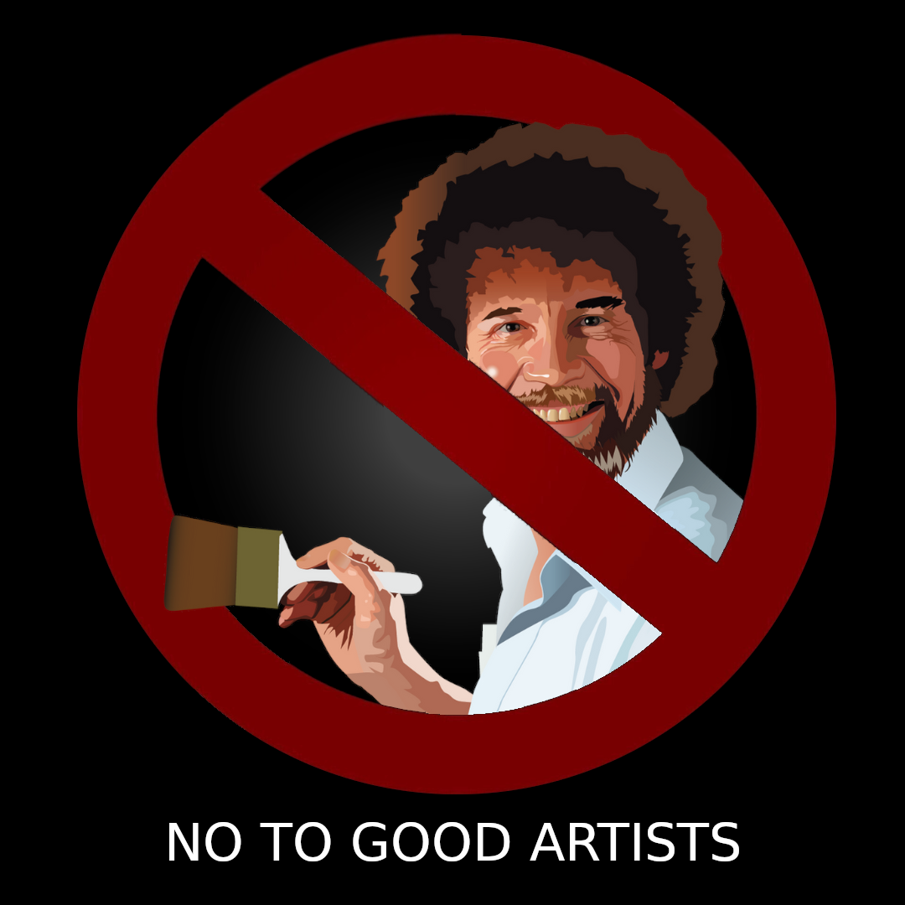

We may also tease out true nature of the anti-AI claims on this front by applying their arguments to human artists: if it is immoral for one to produce AI art on the grounds that the AI is more efficient it must also be immoral for more efficient human artists to make artwork. This hatred of innovation and efficiency on the mantle of jerbs is nothing more than an advocacy of a race to the bottom&#x2014;how dare Bob Ross produce that painting in only 30 minutes!? It took me over an hour for a worse end-product: those of us who are bad at making art must band together against the oppressive chains of the successful. If people who are better at making YouTube videos than I am all stopped or knee-capped their work, then I could more easily rise in the ranks. It is selfish for them to prevent me from achieving this success!

So applied consistently, the art-protectionism is a millstone not only around the neck of producers of AI-generated art, but also of those more able human artists&#x2014;all at the expense of the consumer of art. This is quite a high price to pay for the jobs of the least effective artists, and it is a price not being payed by them.

The brilliant economist Murray Rothbard called out this very same attitude when applied to protecting inefficient American firms from Japanese competition:

> Take, for example, the alleged Japanese menace. All trade is mutually beneficial to both parties—in this case Japanese producers and American consumers—otherwise they would not engage in the exchange. In trying to stop this trade, protectionists are trying to stop American consumers from enjoying high living standards by buying cheap and high-quality Japanese products. Instead, we are to be forced by government to return to the inefficient, higher-priced products we have already rejected. In short, inefficient producers are trying to deprive all of us of products we desire so that we will have to turn to inefficient firms. American consumers are to be plundered.<sup><a id="fnr.57" class="footref" href="#fn.57" role="doc-backlink">57</a></sup>

The same applies to our anti-innovation artists: they seek to reduce the standard of living of everyone else for all of time such that they may stagnate and not have to improve the quality or efficiency of their work, and then they have the gall to point and label everyone who they drag down as uncaring egotists<sup><a id="fnr.58" class="footref" href="#fn.58" role="doc-backlink">58</a></sup> for not bowing to their whims and willingly bathing in the recession that is their professional lives.


### The Marxism of the Art-Protectionists

The art-protectionists&rsquo; hatred of wealth and prosperity is laid naked in their overt Marxism, as exemplified by Istebrak:

> Mostly my issue with the ethical aspect is just my issue with all of that excessive capitalism, consumerism, kind of stuff, where they are trying to monetise everything, and everything is just getting&#x2013;you know&#x2013;to be a little more tasteless.<sup><a id="fnr.59" class="footref" href="#fn.59" role="doc-backlink">59</a></sup>

They tell us that capitalism is evil, and it is ruining everything, and of course therefore advocate for the destruction of competition and monopolisation of ideas with IP. We are told by Philosophy Tube that what ethical AI &ldquo;really means&rdquo; is &ldquo;digital socialism,&rdquo;<sup><a id="fnr.60" class="footref" href="#fn.60" role="doc-backlink">60</a></sup> and that &ldquo;there is no ethical AI under capitalism.&rdquo;<sup><a id="fnr.61" class="footref" href="#fn.61" role="doc-backlink">61</a></sup> Istebrak is not alone on this panel with her hatred of human flourishing, this anti-profit message is redoubled by Adam Duff, and Antonio Stappaerts, in a discussion over fans sending them AI generated art based on their work:

> [HARDY FOWLER]: I should clarify that the client who did that with my work was like completely well-meaning, it was sort of like they were actually excited about it as just an experiment of what&rsquo;s possible&#x2014;it wasn&rsquo;t done maliciously, but at the same time it seems like they hadn&rsquo;t considered how profoundly weird and unsettling that would be to the artist. [&#x2026;] I bet the guy who contacted you, Adam, just sort of: &ldquo;isn&rsquo;t this a neat thing I was able to do?&rdquo; [&#x2026;]
> 
> [ADAM DUFF]: He&rsquo;s a fellow artist, he&rsquo;s actually an artist [&#x2026;] but yeah, they did it innocently. And they said &ldquo;oh, **I&rsquo;m not monetising this**, or publishing it, I just wanted to show you what I did,&rdquo; right?<sup><a id="fnr.62" class="footref" href="#fn.62" role="doc-backlink">62</a></sup>
> 
> [&#x2026;]
> 
> [ANTONIO STAPPAERTS]: To Adam&rsquo;s point: as long as it&rsquo;s not monetisable. Because you know, you say Adam, if it&rsquo;s diluted, that&rsquo;s all fine as long as people are not able to profit off of what you created. Because if they&rsquo;re like, &ldquo;oh, we can take 20% Adam, 10% Steven, 30% Hardy, [&#x2026;]&rdquo;&#x2013;even if it&rsquo;s very generic, that&rsquo;s my main issue actually with this AI art&#x2013;the general public loves it. They really don&rsquo;t care. They love it&#x2014;so it&rsquo;s highly monetisable. [&#x2026;] They don&rsquo;t know the difference, [&#x2026;] they just love the dopamine hits, they&rsquo;re consumers, literally. [&#x2026;] So as long as it&rsquo;s not monetisable, sure.<sup><a id="fnr.63" class="footref" href="#fn.63" role="doc-backlink">63</a></sup>

It is quite frankly rich to hear the art-protectionists speak as if they love humanity and human flourishing whilst so clearly hating any sort of profit. What exactly does their ideal society look like? One where no man is allowed to profit unless the sacred creed of mystic art sages says that he is allowed to? This is absurd&#x2014;again, keep this fact in the front of your mind when confronted with such arguments: they want to use violence against you for creating art with your own property, and for trying to improve your own standard of living by yourself. On their view it is actually *evil* for you to dare to better yourself, you should rather live your life in total sacrifice to the Cronenberg monster of Art.

The Maxism is not contained within this group&#x2014;Timnit Gebru makes sure to stuff ample references to the &ldquo;exploitation of the workers&rdquo;<sup><a id="fnr.64" class="footref" href="#fn.64" role="doc-backlink">64</a></sup> and the oppression of the &ldquo;lower classes&rdquo;<sup><a id="fnr.65" class="footref" href="#fn.65" role="doc-backlink">65</a></sup> whilst discussing AI ethics. She makes sure to inform us that &ldquo;technology is political&rdquo;<sup><a id="fnr.66" class="footref" href="#fn.66" role="doc-backlink">66</a></sup>&#x2014;of course, we just need to make sure that we are inserting the &ldquo;correct&rdquo; politics (read: Marxism) into the AI systems. They have no principled opposition to AI image generation, they just want to be the ones in control, rather than the actual producers, the actual fountainheads behind this technology.

Karla Ortiz tells us that we should &ldquo;be kind to individuals, ruthless to corporations.&rdquo;<sup><a id="fnr.67" class="footref" href="#fn.67" role="doc-backlink">67</a></sup> From where does she derive this ethic? She was kind enough to tell us:

> So, when we are talking about [&#x2026;] individuals, [&#x2026;] there has to be a kindness to it because [&#x2026;] they&rsquo;re driven by their passions, they&rsquo;re human, they might not understand what&rsquo;s right, whats wrong, because their frame of mind is completely different, and that makes sense. But a corporation as a whole is still a combination of people driven by [a] profit motive [&#x2026;]<sup><a id="fnr.68" class="footref" href="#fn.68" role="doc-backlink">68</a></sup>

Ok, so she acknowledges that a corporation is just a combination of people, thus it is a specific type of person&#x2013;not a non-person&#x2013;that she is advocating people be ruthless towards&#x2014;and the reason that we should be ruthless to them is because they want profits. It is the same old bromide&#x2014;&ldquo;profit is evil,&rdquo; &ldquo;sacrifice yourself,&rdquo; &ldquo;don&rsquo;t better your own life,&rdquo; &ldquo;live for others,&rdquo; &ldquo;don&rsquo;t be selfish.&rdquo;

This attitude is also plain to see in the protectionists&rsquo; big gotcha! against Stability.ai, creators of Stable Diffusion&#x2014;a large portion of Zapata&rsquo;s video on the topic is dedicated to explaining how they are a for-profit company using the cover of a non-profit to &ldquo;launder data&rdquo; for use in their AI programs. These people say &ldquo;for-profit&rdquo; as if they were spitting venom&#x2014;the start and end of the argument is that Stability.ai is profiting, this is supposed to be more than enough to demonstrate that they must be evil.

Evan Conrad, an artist<sup><a id="fnr.69" class="footref" href="#fn.69" role="doc-backlink">69</a></sup> who is personally involved in the Silicon Valley AI developer-sphere claims that the motivations of the AI developers are entirely pure:

> Steven has this thing in his video that I think maybe misunderstands what all of these things are. A lot of these projects are not made by like [&#x2026;] standard money interests&#x2014;they&rsquo;re made by people who legitimately think they are building utopia. And I&rsquo;m relatively confident that they&rsquo;re building at least something very large that might lead to utopia. They are quite confident that they are building AGI&#x2014;and that&rsquo;s probably true. And when you are that confident that you are building the most important technology in the world it&rsquo;s just like not your motivator any more. Like, when [&#x2026;] you&rsquo;re really really confident that the thing that&rsquo;s gonna happen is that you&rsquo;re gonna make all prices go to zero, and you&rsquo;re gonna end up in this world in which everything is like free&#x2014;you like look over at your kids and you&rsquo;re like, &ldquo;oh my god! If I don&rsquo;t do this, like how shitty would it be for me to like not do this for my future children? [&#x2026;] make a world where they like never have poverty, [&#x2026;] shit is just all free, and they [&#x2026;] don&rsquo;t have cancer because we cured cancer with it.&rdquo; [&#x2026;] if you actually believe that, the money just doesn&rsquo;t really matter as much.
> 
> And so most of the AGI labs [&#x2026;] are research projects&#x2014;they like started in research, they like were founded as research projects, [&#x2026;] they don&rsquo;t really hire people whose job it is to make money. I&rsquo;m the person whose job is to like make money&#x2014;that&rsquo;s like the thing that I normally do. [&#x2026;] But like, from my perspective, they don&rsquo;t seem to hire those folks, they seem to hire folks that genuinely think they are trying to create utopia, or trying to prevent some really bad thing from happening.<sup><a id="fnr.70" class="footref" href="#fn.70" role="doc-backlink">70</a></sup>

So, we have a bit of a he-said-she-said scenario with respect to the motivations of these companies. Zapata&#x2013;who has absolutely no connnection with them&#x2013;says that their motivations are evil and devious;<sup><a id="fnr.71" class="footref" href="#fn.71" role="doc-backlink">71</a></sup> Evan&#x2013;who has a very deep connection with them&#x2013;says that their motivations are to make a literal utopia happen. Now, in the absence of evidence, there isn&rsquo;t any way to evaluate which claim is true&#x2014;but seeing as the art-protectionists see it fit to speculate wildly about the motivations of these AI companies, and the supposed-incompetence of prompters seen in Reid Southen assuming that Shadiversity simply does not understand how prompting works because he includes duplicate words (these duplicates have a purpose, by the way),<sup><a id="fnr.72" class="footref" href="#fn.72" role="doc-backlink">72</a></sup> I thought I might do some speculation of my own, but with evidence instead of relying on the &ldquo;profit bad&rdquo; bromide. Namely, I think it is quite clear from my extensive study into this topic that all of these concerns over ethical models, lack of artistic integrity, every point they make, it is all a smokescreen to cover up their true problem&#x2014;which is that this technology opens up art to more people and thus threatens their livelihoods. Duchess Celestia is explicit on this point:

> Let&rsquo;s imagine a world [&#x2026;] where AI wasn&rsquo;t trained on copyrighted art without artists&rsquo; consent and all AI art generators were trained entirely on ethically sourced materials. Would [AI art generation] be perfectly fine then? No, in my opinion, it would not, not because of the software itself, but because of how humans would still be most-inclined to use it&#x2014;as a replacement for real artists and real art.<sup><a id="fnr.73" class="footref" href="#fn.73" role="doc-backlink">73</a></sup>

She tells us further that &ldquo;obviously many agree that it would be better if all AI art trained on trained on copyrighted material was deemed to be copyright infringement by default, rather than based on its similarity to existing copyrighted works.&rdquo;<sup><a id="fnr.74" class="footref" href="#fn.74" role="doc-backlink">74</a></sup> Because, of course, we shouldn&rsquo;t let little things like the burden of proof or innocence until proven otherwise to get in the way of our goals here&#x2014;we must stifle competition and stamp out any innovation the moment it rears its ugly head. She tells us this, by the way, in a video discussing a &ldquo;New AI Art SCAM&rdquo; which is &ldquo;STEALING COMMISSIONS&rdquo;&#x2014;the &ldquo;SCAM&rdquo; in question being that people were paying artists for line work, and then iterating upon said line work with AI tools. This being a service that the artists themselves were advertising. It is not enough that people are paying artists to make art on the terms set by those artists, they have to ONLY pay artists, and do nothing in addition that might deprive those artists of what they do not own and are not owed.

So the problem for Celestia is indeed what I claim it to be---*not* that AI is unethical, but that it is a threat to her livelihood. She is not alone in this stance: we have seen it also with the array of artists who were completely fine with the tech right up to the point that it started getting good&#x2014;they have no principled objections to it, they just don&rsquo;t like that it can maybe get better than them.<sup><a id="fnr.75" class="footref" href="#fn.75" role="doc-backlink">75</a></sup> We see it in their hatred of profit&#x2014;all that an AI company profiting would imply is that they are providing a service which people value more than the alternative, the anti-AI crowd are again here against it on the grounds that it is good and is an improvement over what they can provide. They aren&rsquo;t against plagiarism, they are against competition, and plagiarism happens to be a useful weapon to their end of destroying innovation and creativity. Karla Ortiz makes this perfectly clear:

> Yeah, any individual in the world can copy your work, ok, fine they did it, but if its a corporation and they make a profit from that, that&rsquo;s a problem. Or if that individual makes a lot of money, that&rsquo;s also a problem.<sup><a id="fnr.76" class="footref" href="#fn.76" role="doc-backlink">76</a></sup>

Truly the mask has slipped: &ldquo;use your AI tools&#x2014;so long as they are bad;&rdquo; &ldquo;copy peoples art&#x2014;so long as you do not profit;&rdquo; &ldquo;make whatever art you wish&#x2014;so long as you don&rsquo;t do it for yourself;&rdquo; &ldquo;do *anything* you wish so long as you are not in the process bettering yourself and by proxy exposing the fattened slump that is Art.&rdquo;

This is seen further in Karla&rsquo;s backup plan. In the case where she is unable to completely destroy AI technology, there is to be instituted an artistic central planning bureau that will dictate the kinds of art you are allowed to make:

> So the way that I could see it is we&rsquo;re gonna need some very creative legislation that tackles the newness of all of this in an inventive way. So for me, I would say [&#x2026;] implement something like, for example, percentages [&#x2026;] depending on which industry you are a certain percentage of your labour force can be AI tools. So for example, if you are in like medicine, or sciences, that&rsquo;s taken into consideration and it&rsquo;s a very large percentage. But if it&rsquo;s something like [&#x2026;] the entertainment industry or things that are creative, [&#x2026;] then say: &ldquo;hey, listen. 2% of your work force has to be AI and that&rsquo;s the limit&rdquo;&#x2014;depending on the size of your company. Almost the way that I kind of see it is: think about it as if [&#x2026;] you&rsquo;re trying to gain a visa to work in the US [&#x2026;]&#x2013;or work in any other country&#x2013;[&#x2026;] in order for you to get a visa there has to be shown a need or a [&#x2026;] reason to why you couldn&rsquo;t give that job to someone who is a citizen, and why you need to bring someone from abroad. So I could see something like that being kind of implemented in a space like this, where it&rsquo;s like: &ldquo;hey, why do you need AI tools to [make this]?&rdquo;<sup><a id="fnr.77" class="footref" href="#fn.77" role="doc-backlink">77</a></sup>

This idea is re-doubled by Celestia, who thinks that people should be &ldquo;fighting for legislation that forces companies to have a minimum number of human artists.&rdquo;<sup><a id="fnr.78" class="footref" href="#fn.78" role="doc-backlink">78</a></sup> Ah yes: &ldquo;you have used too much AI technology in the production of this artwork. It is to be burned and you will be sent to re-education post-haste&#x2014;we can&rsquo;t have any lingering bourgeois sentiments in this industry.&rdquo; The world of their dreams is one where they get guaranteed employment on the backs of the producers regardless of the quality of work provided and where those producers must justify themselves and ask permission to continue producing. This is a world where the artistic recession may continue on *ad infinitum*. &ldquo;We must establish a society where government bureaucrats control the use of AI tools. Government must monopolise the task of detecting image AIs, and must be the ones to dictate the exact conditions of their use through the whole economy.&rdquo;&#x2014;in short, what is advocated here is a society where the state has sole discretion on the creation and detection of AI, a society where the Leviathan may manufacture whatever narratives it sees fit. The entire ethical worldview of these people is filtered through the lens of using violence to stop people from living their own damn lives as they see fit.

These are the people who destroy creation and spit in the face of man&rsquo;s happiness on Earth. These are the second-raters, the second-handers, the parasites:

> Thousands of years ago, the first man discovered how to make fire. He was probably burned at the stake he had taught his brothers to light. He was considered an evildoer who had dealt with a demon mankind dreaded. But thereafter men had fire to keep them warm, to cook their food, to light their caves. He had left them a gift they had not conceived and he had lifted darkness off the earth. Centuries later, the first man invented the wheel. He was probably torn on the rack he had taught his brothers to build. He was considered a transgressor who ventured into forbidden territory. But thereafter, men could travel past any horizon. He had left them a gift they had not conceived and he had opened the roads of the world.
> 
> That man, the unsubmissive and first, stands in the opening chapter of every legend mankind has recorded about its beginning. Prometheus was chained to a rock and torn by vultures&#x2013;because he had stolen the fire of the gods. Adam was condemned to suffer&#x2013;because he had eaten the fruit of the tree of knowledge. Whatever the legend, somewhere in the Shadows of its memory mankind knew that its glory began with one and that that one paid for his courage.
> 
> Throughout the centuries there were men who took first steps down new roads armed with nothing but their own vision. Their goals differed, but they all had this in common: that the step was first, the road new, the vision unborrowed, and the response they received&#x2013;hatred. The great creators&#x2013;the thinkers, the artists, the scientists, the inventors&#x2013;stood alone against the men of their time. Every great new thought was opposed. Every great new invention was denounced. The first motor was considered foolish. The airplane was considered impossible. The power loom was considered vicious. Anesthesia was considered sinful. But the men of unborrowed vision went ahead. They fought, they suffered and they paid. But they won.<sup><a id="fnr.79" class="footref" href="#fn.79" role="doc-backlink">79</a></sup>

The reason why the arguments used by these advocates of aesthetic stagnation are a strange mishmash of incompatible positions is because the art protectionists&#x2013;who have for a few centuries rested on the laurels of not needing to justify any decision they made&#x2013;are now faced with a real artistic contender to their stagnation. In such a situation they are like an animal backed against the wall&#x2014;they must grab at any argument they can find and see what sticks. Keep this idea in your pocket as you watch the rest of this video and as you encounter these people in the wild&#x2014;if you are particularly perceptive you will notice that their fundamental mission is to kneecap and destroy these AI art generators such that they may be kept in the picture without ever needing to innovate.


### The Elitism of the Art-Protectionists

They show their hand in their preferred order of automation:

> Machines are supposed to make it so we don&rsquo;t have to do menial jobs, freeing us up to pursue things like art. Now here we are working harder than ever before while machines do the art for us. Absolute f\*\*\*ing dystopia.<sup><a id="fnr.80" class="footref" href="#fn.80" role="doc-backlink">80</a></sup>

Abhishek Gupta of the Montreal AI Ethics institute has his own little pet jobs that he wants automated:

> [INTERVIEWER]: is [sic] there any jobs that we actually do want AI to do?
> 
> [&#x2026;]
> 
> I think things that are low-risk, things that are low-stakes, things that are well-defined, things that have a narrow boundary of potential behaviour, things that are [&#x2026;] sort of limited in terms of the impact that they would have on human lives in terms of safety&#x2013;safety in many dimensions, you know, physical, psychological, etc.&#x2013;and things that are, you know, maybe repetetive, that are drudgery, that don&rsquo;t bring joy to people, or are unnecessarily oppressive in the nature of doing that work.<sup><a id="fnr.81" class="footref" href="#fn.81" role="doc-backlink">81</a></sup>

But when it is suggested to artists that they can use AI to automate the grunt-work in their field, we are met with a constant chorus that some artists enjoy said grunt-work. In any case, we are again met with this notion that *your* stinky, smelly job should be automated, but not *our* higher, more sophisticated job. Ben Zhao, creator of the popular Glaze<sup><a id="fnr.82" class="footref" href="#fn.82" role="doc-backlink">82</a></sup> tool used by anti-AI artists, agrees with this notion:

> I wanna add a little bit to this&#x2014;I think those points are right on. I mean, to me it&rsquo;s a little bit alarming when you think about where are the positions of job replacement [&#x2026;] by AIs coming in, right? AI is not&#x2013;as many people thought&#x2013;[&#x2026;] taking the sort of unskilled work, and helping to elevate the workforce into more creative roles. [&#x2026;] In fact, AI is coming for the creative positions, it is coming for the artists, for the musicians. You know, we&rsquo;ve had people reach out, ever since Glaze went public, you know from choreographers, from voice actors, from writers, from journalists; all the creative aspects of human creativity, all these really highly valued positions in our society are getting threatened by AI.<sup><a id="fnr.83" class="footref" href="#fn.83" role="doc-backlink">83</a></sup>

So, these commentators are completely fine with, and in fact in favour of, automating *your* job, just not *their* job. Automating those &ldquo;stinky,&rdquo; &ldquo;dirty,&rdquo; manual jobs is completely moral&#x2014;those lugnuts should just learn to art, right? But automating artistic pursuits&#x2014;purge the thought! God forbid the special activity of art be done more efficiently by smarter people&#x2014;that should be reserved for peasant-work. &ldquo;How dare you be so callous as to even suggest that art be opened up to more people!? It is the lower jobs that should be automated, not *our* sacred profession!&rdquo; I really want the artists to hone in on this point here, because I hear it all the fucking time&#x2014;artists will be bitching and moaning about how unfeeling people are about them potentially losing jobs but then in the exact same breath they will cry out about how the AI should be taking away jobs from the blue-collar worker instead. This is a frankly disgusting attitude&#x2014;stop doing it.

The Gell-Mann Amnesia effect refers to the tendency that one has to read a newspaper article on a topic with which they are familiar and notice the constant and blatant errors. You are astounded at how totally and obviously wrong it is. Then you turn the page and read the rest of the newspaper and nod your head as if everything is suddenly peachy. You turn the page and completely forget how riddled with error the paper is. A similar effect seems to have taken hold of the artists: on the one hand as they speculate about AI automating any industry other than the one they are in, they immediately gravitate towards positive examples<sup><a id="fnr.84" class="footref" href="#fn.84" role="doc-backlink">84</a></sup>&#x2014;&ldquo;AI in medicine? I imagine that AI could help diagnose illnesses, this would be a good thing;&rdquo; &ldquo;AI in transportation? Self-driving cars could be more efficient and less accident-prone than humans, sounds good to me;&rdquo; &ldquo;AI for teaching? You could have a personalised expert tutor on any topic, this would revolutionise education for the better.&rdquo; But then, on the other hand, when it comes to introducing AI to art the tables are completely flipped on their head&#x2014;the advent of AI automation will surely be a complete disaster that will destroy the entire process of art-creation.


## The Anti-AI Crowd are neo-Luddites

It is not uncommon for the anti-AI crowd to be appalled by the accusation that they could be Luddites: &ldquo;we aren&rsquo;t anti-technology,&rdquo; they tell us, &ldquo;we artists are in fact some of the most willing people to embrace new technologies! All we are against is this specific technology because it directly harms artists&rsquo; ability to continue their holy work.&rdquo; These artists have clearly only ever heard &ldquo;Luddite&rdquo; as some passing term and associated it with being anti-technology on principle, never actually considering what the Luddites stood for. Because, indeed, the Luddites themselves were not against technology as such, they were rather against the mechanical loom, which was putting them out of their jobs. The arguments they had are identical in form to those we hear from the anti-AI neo-Luddites&#x2014;&ldquo;we Luddites aren&rsquo;t against technology! We are happy to embrace the steam locomotive in the transportation of our lace and the printing press to advertise our services&#x2014;we are just opposed to this evil new technology of the Jacquard machine that greedy capitalists are using to put us out of our jobs!&rdquo;

These artists, much like the Luddites of old, will&#x2013;in the words of Tom Scott&#x2013;draw the line of what is acceptable just past whatever they are doing.<sup><a id="fnr.85" class="footref" href="#fn.85" role="doc-backlink">85</a></sup> &ldquo;What&rsquo;s that? An AI tool that can cut out all of the bad takes in this recording and do all of the mixing and mastering? Sign me up! That sounds brilliant! Just don&rsquo;t use StableDiffusion.&rdquo;<sup><a id="fnr.86" class="footref" href="#fn.86" role="doc-backlink">86</a></sup> &ldquo;What&rsquo;s that? Content-Aware Fill on PhotoShop powered by AI? Brilliant! This will speed up that grunt compositing work so that I can focus on making my art! Just don&rsquo;t use Dall-E.&rdquo;<sup><a id="fnr.87" class="footref" href="#fn.87" role="doc-backlink">87</a></sup> &ldquo;What&rsquo;s that? An entire digital orchestra that I can use on my home computer? Fantastic! I have always wanted to make orchestral music. Just don&rsquo;t you dare use MidJourney.&rdquo;<sup><a id="fnr.88" class="footref" href="#fn.88" role="doc-backlink">88</a></sup>

Certainly, &ldquo;Luddite&rdquo; may be used as a term for a person who is against technology on principle, but then what exactly is their argument? &ldquo;Oh, no, we aren&rsquo;t against technology due to an adherence to principles&#x2014;we&rsquo;re not Luddites! No, no, no: we are randomly and arbitrarily against only certain technologies that make us personally unhappy.&rdquo; Surely, such an individual would possess greater integrity and intellectual honesty if they really were against all innovation, rather than accepting innovation only in those areas that will not threaten their sweet stagnation that they so carefully cultivate.

Erik Hoel rejects such historical comparisons:

> I’m well-aware that since the dawn of time whatever the latest wave of art is it has been described as “not art” by some crotchety elder. But all those previous times the artist wasn’t being replaced by gigantic spreadsheets trained as autoencoders, so perhaps historical analogies aren’t very useful here.<sup><a id="fnr.89" class="footref" href="#fn.89" role="doc-backlink">89</a></sup>

Indeed, those people were not replaced by &ldquo;gigantic spreadsheets trained as autoencoders,&rdquo; but this does not demonstrate the disanalogy. Instead they were replaced by mechanical looms and digital cameras&#x2014;clearly the relevant aspect of the comparison, Mr. Hoel, is that they are being replaced. *This* is what the Luddites were afraid of and it&rsquo;s what the modern visual artists are afraid of. That they aren&rsquo;t being replaced by the exact same technology, Mr. Hoel, is entirely irrelevant and that you think it is relevant, Hoel, shows a complete lack of the cognitive faculties required to participate in this argument.


## &ldquo;AI Art Sucks&rdquo; + &ldquo;AI Art Will Take Over&rdquo;

An especially hilarious tendency among the anti-AI crowd is to effortlessly swing from telling campside horror stories about the coming world where all artistic work will be forever wrestled away from man, where it will be &ldquo;impossible to make a living as an artist,&rdquo;<sup><a id="fnr.90" class="footref" href="#fn.90" role="doc-backlink">90</a></sup> into taunting the AI community about how AI art is fundamentally flawed&#x2013;that it is, in Dave McKean&rsquo;s words, a sea of beige<sup><a id="fnr.91" class="footref" href="#fn.91" role="doc-backlink">91</a></sup>&#x2013;and that you require humans to produce the best end products. In short, this is the combined bromide of &ldquo;AI art totally sucks&rdquo; with &ldquo;AI art is going to completely take over all artistic pursuits.&rdquo;

Zapata perfectly encapsulates this mentality in his video on the topic where he first paints his techno-dystopian vision of a world devoid of human artistry where all content is derived from a &ldquo;mega feed&rdquo; produced by AIs and that you &ldquo;lack imagination&rdquo;<sup><a id="fnr.92" class="footref" href="#fn.92" role="doc-backlink">92</a></sup> and &ldquo;should be embarrassed&rdquo; if you do not see this coming; and second during his appearance on *Art Cafe*, where he explains that AI image generation, by its nature simply cannot be creative, at least under it&rsquo;s current iteration:

> It&rsquo;s a probabilistic system, so when you ask me to make you art, like if a client asked me [&#x2026;], &ldquo;Steven I need a picture of somebody threatening someone with an axe,&rdquo; [&#x2026;] I try to produce what I believe is the best solution based on the criteria. These programs are not doing that, they produce solutions, or options, that fit statistically&#x2014;that probabilistically speaking, [&#x2026;] it&rsquo;s 75% likely this looks like an axe, it&rsquo;s 85% likely that this looks like a scared person, right? [&#x2026;] Like I said, if you have the prompt and the seed number, you can ask those two combinations every day to *Stable Diffusion* and it will give you the same result every time. If you ask me to do that picture 1000 times, I can give you 1000 different versions even if your input variables are exactly identical. Even if you give me a [structure], even if you give me a piece of paper and say &ldquo;I need a drawing of a man threatening someone with an axe but it must be based around this squiggle that I put down here, that squiggle must be in tact,&rdquo; right? So we can try to draw an analogy between that squiggle and the random seed number which is a noise field for *Stable Diffusion* to begin with, I can still give you an infinity of permutations where the squiggle is maintained&#x2014;it doesn&rsquo;t matter. So we&rsquo;re just not like it in that sense.
> 
> Also, because of the fact that it&rsquo;s trying to produce answers that are [&#x2026;] statistically likely, that produces problems like over-fitting, and the embarrassing things that we&rsquo;ve seen where if you ask it for salmon it gives you cooked salmon in the river instead of a living salmon, [&#x2026;] because it&rsquo;s seen more pictures of cooked salmon than it has of live salmon. It&rsquo;s going to make mistakes like that over and over again, because unlike us it doesn&rsquo;t have a cohesive worldview&#x2014;it doesn&rsquo;t understand what&rsquo;s alive, what&rsquo;s dead, what fits with context. It just says: statistically speaking, when you use that word, it&rsquo;s probably this. [&#x2026;] If I go back to the example of if someone needed a picture of a man threatening someone with an axe, [&#x2026;] it&rsquo;s extremely unlikely that *Stable Diffusion*&#x2013;because &ldquo;axe&rdquo; is used, and most pictures of axes include the axe&#x2013;it will put the axe in basically every image, but I&#x2013;being a creative artist&#x2013;I might say, &ldquo;I won&rsquo;t put the axe in the image, I&rsquo;ll instead show the person scared with the Shadow of the axe cast across their face.&rdquo; *Stable Diffusion* would basically never give you that because there&rsquo;s almost no photos of axes that are just the Shadow of the axe, it can never come to a conclusion like that because it&rsquo;s just utterly under-represented within the dataset.<sup><a id="fnr.93" class="footref" href="#fn.93" role="doc-backlink">93</a></sup>

So, AI art is so impressive that it can forever rip creative jobs out of human hands, but also it fundamentally will not and cannot seek to create the *best* art possible. If it is the case that AI could never achieve perfection by its own nature, then what exactly is the concern here? It must be that AI outcompetes those inferior artists, those artists who aren&rsquo;t producing the best of the best, those who are producing the mediocre. But, as explained above, if we are to oppose AI for outcompeting them on their own terms, then it must also be moral to oppose the best and most efficient human artists on the same grounds.

Steven elsewhere seemingly redoubles this notion that it is only ever going to replace the mediocre, telling us that AI art is &ldquo;lazy&rdquo;:

> AI art is the refuge of every would-be painter, every painter too ill-endowed or too lazy to complete his studies.

Oh, actually, I am mistaken, that&rsquo;s not Steven Zapata talking about AI image generation that&rsquo;s Charles Baudelaire talking about photography back in the 1800s.<sup><a id="fnr.94" class="footref" href="#fn.94" role="doc-backlink">94</a></sup> I don&rsquo;t know how I misplaced that so dearly. You of course see my point here, discerning viewer: these Luddite, anti-innovation, anti-art arguments are nothing new. There is almost a predictable progression from complete mockery of the new artistic technology, which is claimed to be not real art; followed by and sometimes paired with fears that it will dilute the artistic taste of the masses and put &ldquo;real&rdquo; artists out of jobs; which of course culminates in protectionist calls for preservation of old, and inefficient jobs.

In any case, if this world of AI-only art that worries Steven is truly so terrible and destructive of the human spirit, this surely means that the art being produced is not great&#x2014;great art inspires and thrills people, whether they want to make art or not. If the future of AI art is constant masterpieces flowing out of every rock and pebble, this is a world where man is more fully inspired and enriched by the media he consumes. That this is not the future painted, really makes one ponder about how fully humans are going to be replaced by it&#x2014;furthermore, Steven seems far less confident in his predictions when unscripted. In that very same *Art Cafe* interview, he refers to his imagined dystopia as &ldquo;pure science fiction&rdquo;<sup><a id="fnr.95" class="footref" href="#fn.95" role="doc-backlink">95</a></sup> and in an interview with Miles Johnston released on his channel after his anti-AI video, he says with respect to the rise of AI image generation that:

> I don&rsquo;t know, [&#x2026;] no one does, what that&rsquo;s going to do to markets, to culture, to people, to anything, right? We don&rsquo;t know for sure at all. [&#x2026;] The human-to-human connection is, I think it&rsquo;s a pretty safe bet that if anything&rsquo;s going to survive it&rsquo;s that, and it seems very likely to me that it will survive.<sup><a id="fnr.96" class="footref" href="#fn.96" role="doc-backlink">96</a></sup>

Now, that&rsquo;s a statement with quite a bit less fire in it than the near-certain hellscape that a person must &ldquo;lack imagination&rdquo; if they do not see coming with the introduction of image AIs.


## People Will Still Support Humans

Of course, unscripted Steven is correct here: you should not expect the human-to-human connection to go away any time soon. A large amount of this jerbs-worrying from artists, fundamentally misunderstands the nature of why a lot of people buy art in the first place. As Kelsey Rodriguez explains, the fact of people buying art to support the artist must be accounted for:

> [&#x2026;] when I buy art, I often don&rsquo;t just do it because I want something pretty to hang up in my house. I wanna support the individual artist&rsquo;s journey, I wanna be a part of something. When I support a small business on Tik Tok, and I find out that I was a part of a movement that helped save them from bankruptcy, that makes me feel good.<sup><a id="fnr.97" class="footref" href="#fn.97" role="doc-backlink">97</a></sup>

So, let us imagine we are five years down the line, Dall-E 7 is out, and *The Witcher 5* needs some box art. CD PROJEKT RED certainly *could* get a high quality rendering done by AI, *or* they could commission Greg Rutkowski for a bespoke piece. Evidently, many people are fans of Greg, and would be willing to support him, why wouldn&rsquo;t this company want the great publicity of slapping a &ldquo;supports human artists&rdquo; sticker on the box, if people care about this? Look at the mass of people who build their careers through donations on websites like ko-fi and Patreon&#x2014;careers built on the back of donations from people who like the work. There is a true selfish incentive for people to do this&#x2014;if I very much enjoy the work of Hans-Hermann Hoppe, and want him to continue to write books, it is in my own interests to financially support him in this endeavour by purchasing said books. We do not require, and it is not desirable to implement, the state cudgel of intellectual property to smite with the power of Uncle Sam any who would wish to consume intellectual products without supporting the progenitor. People are plenty capable of being moral on their own, we do not need to force them by blasting their ass with the long arm of the law.


## The Wynand Papers, and What Makes Them Possible

There is a certain truth to be pulled out from the artists who say that AI art is fundamentally flawed&#x2014;namely, that it is going to be far more adept at creating slop than actual high art. Zapata&rsquo;s horror story of AI image generators pumping out content to the lowest common denominator could indeed occur, many people have very poor taste&#x2014;but those with poor taste are not going to be at the forefront of any artistic revolution, nor should they be appealed to. Allow me to highlight this with the fictional archetype of the slop-dealer in *The Fountainhead*&rsquo;s Gail Wynand. In the book, Wynand owns several tabloid newspapers which dish out the most surface-level, bottom of the barrel stories, because this is what the people want, or so Wynand claims. He does this because due to some events in his life which I shall not spoil, he grows to believe that integrity is impossible, and so the only way to be successful in life is to appeal to the very worst kind of mindless drone. His foil, Howard Roark, is an architect of impeccable integrity&#x2014;he refuses to alter his buildings in any way to appeal to tradition, or anti-tradition, or any other pointless whims that might surround him.

The true artist takes after Howard Roark, he is not concerned about slop-peddlers shovelling gruel into the mouths of the hungry masses&#x2014;he is concerned only with creating his art to the greatest quality it can be. A Howard Roark does not build to have clients, he has clients so that he can build&#x2014;this is the model that you should be emulating if you want to do something good with your life. Ultimately, the book demonstrates the core flaw in Wynand&rsquo;s strategy&#x2014;namely, by kowtowing to the masses, he becomes their slave, he is incapable of actually doing good for himself, he needs to reconcile the inconsistency between his slavish devotion to the whims of the idiot masses, with his desire to attain happiness for himself.

Now, I do not want this to be mis-interpreted as an attack on the artistic integrity of AI images as such: there are certainly some very good pieces of AI generated art and some genuinely new artistic techniques that they make possible, which I will be going over later (see: [Can You Tell When Art Is AI Generated?](#orgcacac4d)). Shadiversity has a 40-minute video tutorial where he explains the process behind creating a SuperGirl version of his wife&#x2014;and he gives a genuine artistic motivation behind it:

> [&#x2026;] what I love to do is to depict my wife as SuperGirl, because that&rsquo;s who she is, she is *my* SuperGirl. She is the most beautiful creature in the world to me, and so I love making art of my wife&#x2014;she is my muse, and I particularly like depicting her in the way that I see her. People don&rsquo;t see what I see when I look at my wife&#x2014;when I look at my wife, I see the most beautiful creature in the world, I see my SuperGirl.<sup><a id="fnr.98" class="footref" href="#fn.98" role="doc-backlink">98</a></sup>

The theory of what art is will be addressed later, and it will be seen that he is doing genuine art here&#x2014;he is concretising a particular metaphysical belief that focuses on the *potential* of man as such to become a SuperGirl.

Austin McConnell used generative AI in the making of an almost hour-long animated short<sup><a id="fnr.99" class="footref" href="#fn.99" role="doc-backlink">99</a></sup> where he meticulously crafted every panel and evidently put effort into making sure that the characters were consistent across time and posed exactly where in the scene they needed to be.

So, I fully accept that AI art can be good, rather, what I am trying to get across here is that a true artist should not be concerned with the lowest-common-denominator slop-bots that proompt out an image for every trending topic on Twitter in the hopes that one of them goes viral, as the set of people that such a thing appeals to are not the clientèle of high art. If you are concerned about your job security, ask yourself: are you Gail Wynand, or are you Howard Roark?

Maciej Kuciara, host of the *Art Cafe* podcast, points out that this sort of second-hand trend-hopping is not at all unique to AI systems:

> [I am] least worried about an average AI art consumer, because at the end of the day there&rsquo;s nothing unique about it, you know? It&rsquo;s all kind of based on what already existed and there&rsquo;s [a complete] lack of uniqueness to it. Yes it creates incredible images but if you look at it [&#x2026;] it kind of reminds me of *ArtStation*, where a known artist would post something incredible and then a month later [&#x2026;] everyone&rsquo;s copying it.<sup><a id="fnr.100" class="footref" href="#fn.100" role="doc-backlink">100</a></sup>

So the question is: should artists be concerned about human trend-hoppers? Should Rembrandt be concerned that someone is biting his style? Surely not, just as is the case in other industries&#x2014;Mr. Beast is hardly concerned about the thousands of channels that jump on everything that he does a few weeks later, because he does it the best. The average film and TV show being produced today is the artistic equivalent of a sewer runoff, and yet filmmaking is still alive and well&#x2014;I fail to see why getting AI to produce works of a similar quality would yield any sort of different result.

If the competition ends up producing artwork of a higher quality, that indicates that they are not second-handers, that they are actually coming up with something new and better&#x2014;and the correct response to this is to improve yourself, not to get annoyed by your superiors.


# What is Art?


## The Objectivist Aesthetics


### Art as a Concretisation of Metaphysics

So we have it that it is not the case that AI image generation steals or plagiarises the work of artists, and that it is immoral to oppose a new line of production on the basis that it will obsolesce less-efficient lines of production. Thus I can now turn my attention to their final &ldquo;gotcha!&rdquo;: namely, can images produced by AI be called art?

To answer this, we must look at the more fundamental question: what is art? Either we have it that there are objective principles underlying artistry in which case such principles would need to be elucidated to answer the question, or there are no such principles and art can be whatever a person wants. In the latter case, the question &ldquo;can AI produce art&rdquo; is answered by &ldquo;if I want it to,&rdquo; or in other words, yes&#x2014;it is possible for AI to produce art.

So clearly, if I am to present the strongest case for the &ldquo;AI art isn&rsquo;t real art&rdquo; argument, I cannot assume an aesthetic subjectivism or relativism on the part of its proponents, thus I must analyse the potential candidates for a theory of art to find one with such objective principles (and this is being quite charitable indeed, it is not at all uncommon to find an AI opponent who is completely incapable of defining what &ldquo;art&rdquo; is, and who freely admits this, whilst fully confident in their assertions that AI art is not art&#x2014;quite a ludicrous position indeed).<sup><a id="fnr.101" class="footref" href="#fn.101" role="doc-backlink">101</a></sup>

Our first candidate for a theory of art is materialism, the materialist notes that art is pursued as an end in itself&#x2014;this makes art distinct from many other things that men produce. A newspaper, a scientific treatise, a busy signal on your telephone, a hammer and nail are all used and produced for utilitrian purposes; they are means towards some end, not ends in themselves. The materialist proceeds from this fact to conclude that art is a petty indulgence completely unrelated to reason or man&rsquo;s life in this world.

Obviously, such a theory would leave quite shaky grounds for the proponents of AI art not being art, as there could be no rational principles underlying that which is fundamentally irrational, which the materialists claim is the case for art. So, I shall move onto an opposing school, namely spiritualism. This school agrees with the fundamental premise forwarded by the materialists that because art is an end in itself it must be completely disconnected from furthering mans life on Earth, and they conclude from this that therefore the purpose of art is and must be to further mans life in a spiritual super-reality, of which man can achieve only mystic contact with. So there are not *objective* principles underlying art, the spiritualist tells us, the correct method of making and judging art is to refer to a mystic elite who have turned themselves away from man and his life on this planet towards some ineffable spiritual dimension, and who can therefore decree from on high the correct methods and principles of an art piece.

Now, adopting spiritualism could indeed allow the anti-AI artist to claim that AI images are not and cannot be art, but they could not do so through any rational argument. Instead they would have to completely abandon reason and state that they had mystic contact with some deity that told them that AI cannot produce art. The issue with such a view is epistemic&#x2014;epistemology being the science that studies how man gains knowledge and validates his conclusions. The spiritualist rests his view on the stance that &ldquo;knowledge [of reality] derives not from sense perception or from reasoning based on it, but from an otherworldly source.&rdquo;<sup><a id="fnr.102" class="footref" href="#fn.102" role="doc-backlink">102</a></sup> This view, therefore, rests on a supernaturalistic metaphysics, namely a metaphysics which posits that there is some supernatural source that controls and dictates the nature of reality, this fundamentally reduces into the primacy of consciousness which is the view that consciousness has metaphysical primacy over existence. But, consciousness is consciousness *of existence*, the primacy of consciousness viewpoint steals the concept of consciousness in its attempted inversion, making this a wholly untenable position.

However, there is a third option available that must be analysed here, namely the Objectivist theory of art. Both the spiritualists and the materialists accept the same premise that art has no relation to mans life on Earth, Objectivism rejects this, stating that art has a real, practical purpose for man:

> Art fulfills an essential need of human life, not a material need, but a spiritual need. &ldquo;Art, [&#x2026;] is inextricably tied to man&rsquo;s survival—not to his physical survival, but to that on which his physical survival depends: to the preservation and survival of his consciousness.&rdquo;<sup><a id="fnr.103" class="footref" href="#fn.103" role="doc-backlink">103</a></sup>

Man requires a code of values to guide him in life, to tell him what he should do and what he should avoid, namely man requires an ethics. But this ethics, this answer to the question of what man should do rests upon the more fundamental questions of what the universe man inhabits is like and how he can come to know things&#x2014;ethics rests upon the very broad and very complex fields of metaphysics and epistemology. If the world that man inhabits is malevolent and man is powerless to do anything then he should simply sit back and take whatever is thrown at him, never trying to better his situation. If man has the ability to change his circumstances for the better then ethics can legitimately answer how exactly he should go about doing this. Because this question of what a man should do in any given set of circumstances is of the prime importance to him and because it rests on a vast body of information he requires a method of quickly bringing into focus these abstract ideas to inform him on his decision. To do this, he must form a concretisation of said abstract ideas, one that can be immediately presented and summed up by his senses.

This is the role of art. The artist brings to focus in their work the aspects of the universe that are important and leaves aside those that are not:

> &ldquo;Art,&rdquo; in Ayn Rand&rsquo;s definition, &ldquo;is a selective re-creation of reality according to an artist&rsquo;s metaphysical value-judgments.&rdquo;<sup><a id="fnr.104" class="footref" href="#fn.104" role="doc-backlink">104</a></sup>

> In any human activity—whether one is performing surgery, building a skyscraper, or defining abstract principles—two types of cognition are involved. In some form, a rational being must know not only the nature of his activity, but also the philosophic context on which it rests: why the activity is proper, how it relates to his code of values, how his values relate to reality. Thus a man&rsquo;s metaphysical value-judgments, as Ayn Rand puts the point, &ldquo;are involved in every moment of his life, in his every choice, decision and action.&rdquo; The basic orientation underlying the concretes of one&rsquo;s daily endeavors must be continuously operative in one&rsquo;s mind as one&rsquo;s basic guide. For this purpose, it need not (and cannot) be a continuous object of conscious awareness; but a rational being cannot afford to leave so vital an issue purely to subconscious implication. If he is to be in control of his life, he must have the power to know his metaphysics, i.e., to summon it into focus, to make it the specific object of his awareness. In this sense, a man&rsquo;s view of life must be available to him at all times—and available *as a sum*.<sup><a id="fnr.105" class="footref" href="#fn.105" role="doc-backlink">105</a></sup>

, photographed by Jörg Bittner Unna, contrasted with Picasso&rsquo;s *The Old Guitarist* (right)")

To illustrate this theory, take as an example Picasso&rsquo;s *The Old Guitarist*. What can we say about the philosophy that this painting embodies? What is the metaphysical status of man as depicted here? We see a sickly and emaciated old man, hunched over in the gutter. This does not look like a man who can accomplish anything of significance, rather he looks as if he will die in the dirt when faced with a slight breeze. This painting pictures man as impoverished, weak, and impotent to do anything about it. Contrast this with Michelangelo&rsquo;s *David*, who stands stalwart in preparation for a fight with a great foe. This looks like a man who can accomplish anything, he can face down and destroy whatever needs destroyed. On the philosophy of Picasso&rsquo;s *The Old Guitarist* man is weak and doomed to misery, on Michelangelo&rsquo;s *David* man is unstoppable. All of the underlying facts in each artist&rsquo;s philosophy, which could take dozens of hours to explain are funnelled into a single object that can be directly perceived and digested:

> By converting abstractions into percepts, art performs another crucial (and inseparable) function. It not only integrates metaphysics, but also objectifies it. This means: it enables man to contemplate his view of the world in the form of an existential object—to contemplate it not as a content of his consciousness, but &ldquo;out there,&rdquo; as an external fact. Since abstractions as such do not exist, there is no other way to make one&rsquo;s metaphysical abstractions fully real to oneself (or, therefore, fully operative as one&rsquo;s guide). &ldquo;To acquire the full, persuasive, irresistible power of reality,&rdquo; Miss Rand writes, &ldquo;man&rsquo;s metaphysical abstractions have to confront him in the form of concretes—i.e., in the form of art.&rdquo;
> 
> The above is another expression of the primacy of existence. Since consciousness is not an independent entity, it cannot attain fulfillment within its own domain. In order to satisfy even its own most personal needs, it must in some form always return to its primary task: looking outward. To an entity whose essence is perception, there can in the end be no substitute for perception.<sup><a id="fnr.106" class="footref" href="#fn.106" role="doc-backlink">106</a></sup>

So the question of import is: is it possible for an AI to generate an image that sums up and concretises some particular metaphysics? The answer is clearly: yes. If you prompt an AI to generate an image of man weak and helpless in a universe that hates him, it will gladly provide this for you; if you prompt an AI to generate an image of man with the potential to conquer nature, it will provide this also.

,  &ldquo;Man with the potential to conquer nature&rdquo; (right), from Stable Diffusion")

Even on the most basic level, just literally typing these prompts into the *Stable Diffusion* HuggingFace and taking the first result, you can get those ideas across in concrete form. Now, are these images aesthetically good? Certainly not, they look like dogshit, I exercised basically no control over them. But do they concretise the metaphysics in question: they certainly do, at least to a limited extent. The left is very clearly tortured, this is perhaps the ugliest vision of reality that a man could muster, nothing is connected to anything else, everything is a meaningless blob&#x2014;this is the exact philosophy that I wanted it to embody. There are a great many philosophers who have this view of man and the reality that he inhabits. This is contrasted quite clearly with the right image, already we have some symmetry, some semblance of order within this world, and we have the depiction of man staring out into the clearing, almost as if he is parting the trees by his mere gaze&#x2014;again, this is the exact philosophy that I was trying to get across.


### Aesthetic Value as Objective

Now, how is it that I am able to claim these images to be aesthetically poor if they do indeed embody a certain metaphysics&#x2014;&ldquo;is that not the standard!?&rdquo; The answer is that there is an objective aesthetic value to a given piece of art&#x2014;the standard for this value being derived from the nature of art and the purpose that it serves in man&rsquo;s life. Above I answered the question *what is art?*&#x2014;I can now answer the question *what is good art?*.

> As the history of Romanticism indicates, an artist&rsquo;s philosophy can have significant consequences in regard to his esthetic merit. This does not, however, alter the fact that there is a difference between philosophic and esthetic judgment.
> 
> In judging an art work&rsquo;s philosophy, one is concerned with a question of truth: are the implicit metaphysical value-judgments guiding the artist&rsquo;s selections true or false, proved or arbitrary, logical or illogical? (Any explicit ideology in a work that clashes with its operative metaphysics is essentially irrelevant to its meaning.)
> 
> In judging an art work qua art, by contrast, one enters the domain of a highly personal emotion, sense of life. The goal of art, we have said, is not to prove but to show&#x2014;to concretize whatever sense of life the artist has, whether it be true or false. &ldquo;The fact that one agrees or disagrees with an artist&rsquo;s philosophy,&rdquo; Miss Rand concludes, &ldquo;is irrelevant to an *esthetic* appraisal of his work *qua* art.&rdquo; A false philosophy can be embodied in a great work of art; a true philosophy, in an inferior or worthless one.<sup><a id="fnr.107" class="footref" href="#fn.107" role="doc-backlink">107</a></sup>

The knee-jerk theory of aesthetic value, given the task of art is to concretise an emotion, is to hold that aesthetic judgement is done by a process of feelings&#x2014;that good art is art that feels good. This is a false-start&#x2014;emotions are not tools of cognition, they are rather derived from prior cognition performed by a person. To illustrate this consider the vast difference in the emotional response to just about every event. Perhaps a tenant overstays and refuses eviction&#x2014;someone who is anti-landlord would look upon this situation very positively, they would feel a sense of joy at what is happening; but on the other hand, someone who is in favour of the landlord&rsquo;s right in that property would be disgusted by the actions of the tenant. What such a situation shows is that the emotional response to the exact same stimulus can be completely different between different people depending on whatever prior cognition they have gone through&#x2014;in this case one persons cognitive faculties drove them to a pro-property stance, and the other to an anti-property stance, it is this stance which determines their emotional response. That emotional response is not telling either man anything about what is going on&#x2014;the emotions are not tools of apprehending reality.

So in the field of art&#x2013;like everywhere else&#x2013;feeling that something is the case is not enough&#x2014;we require a rational process to determine the proper aesthetic judgement. Leonard Peikoff highlights three aesthetic principles which give an indication as to what such a rational judgement would involve:

1.  selectivity;
2.  clarity, and;
3.  integration.


### Objective Aesthetic Principles


#### Selectivity

Selectivity here is with respect to the subject&#x2014;namely the rational artist is very particular about his choice of what to use to concretise his metaphysics. This is essentially implicit in the very purpose of art&#x2014;given art is for concretising metaphysics, and given different concretes will have different capabilities in doing this, the best artist does and must be selective. If an artist were to try and concretise his philosophy by picking whatever random concrete, the piece would lose all artistic meaning&#x2014;one can easily imagine the reductio case&#x2013;which is present heavily in modern art&#x2013;of attempting to concretise complete anti-concepts with an incomprehensible mess which the artist had no say in and no desire to have one. Such un-selected subjects make for bad art&#x2013;objectively bad&#x2013;it runs counter to the very purpose of art in the first place.

> No matter what his sense of life, an artist may not properly choose as his subject the random, the second-handed, or the metaphysically meaningless (e.g., Brillo pads). Since he has a definite perspective on reality to convey, he may not choose his subject by the standard of: &ldquo;whatever comes along&rdquo; or &ldquo;whatever incidents of my adolescence I happen to remember.&rdquo; Since it is his perspective, his standard cannot be: &ldquo;whatever subject others have chosen or the critics approve.&rdquo; Since he is engaged in an activity with an objective purpose, his standard cannot be: &ldquo;whatever appeals to me.&rdquo;<sup><a id="fnr.108" class="footref" href="#fn.108" role="doc-backlink">108</a></sup>

Those enemies of selectivity will oft oppose it by treating &ldquo;style&rdquo; as the only thing that matters in art. This stance is a fundamental inversion&#x2014;it is the subject which is the primary to which everything else is merely a means towards encapsulating. Insofar as the style is inconsistent with the subject it is the style that is wrong, not the subject.

> The subject is not the only attribute of art, but it is the fundamental one, it is the end to which all the others are the means. In most esthetic theories, however, the end—the subject—is omitted from consideration, and only the means are regarded as esthetically relevant. Such theories set up a false dichotomy and claim that a slob portrayed by the technical means of a genius is preferable to a goddess portrayed by the technique of an amateur. I hold that *both* are esthetically offensive; but while the second is merely esthetic incompetence, the first is an esthetic crime.
> 
> There is no dichotomy, no necessary conflict between ends and means. The end does not justify the means—neither in ethics nor in esthetics. And neither do the means justify the end: there is no esthetic justification for the spectacle of Rembrandt&rsquo;s great artistic skill employed to portray a side of beef.
> 
> [&#x2026;]
> 
> In art, and in literature, the end and the means, or the subject and the style, must be worthy of each other.<sup><a id="fnr.109" class="footref" href="#fn.109" role="doc-backlink">109</a></sup>


#### Clarity

Our second principle is *clarity*:

> In the broad sense applicable here, &ldquo;clarity&rdquo; denotes the quality of being distinct, sharp, evident to the mind, as against being obscure, clouded, confused.<sup><a id="fnr.110" class="footref" href="#fn.110" role="doc-backlink">110</a></sup>

It should be clear why this is a requirement&#x2014;art that is cloudy and obscure cannot serve well as a guide to action that one can call up at a moments notice to focus his attention on. It is almost the definition of a blur that it is out-of-focus&#x2014;blurry art is thus an anti-concept, or is at least running counter to its purpose. This requirement applies to whatever metaphysics you wish to embody&#x2014;if you are wanting to embody a metaphysics which holds reality as a chaotic mess which requires the hand of god to steady, this is fine, but to do so you must be comprehensible&#x2013;fully intelligible&#x2013;in your concretisation of it if you are to call it good art. On the point of clarity, art is good if you can immediately tell what it is trying to get across, art is bad if you cannot for the life of you work it out and where there are innumerable different theories all culminating in &ldquo;it means whatever you want it to mean&#x2014;the meaning of this piece is in the eye of the beholder.&rdquo;

> The function of the artist is to overcome the opacity of human experience&#x2014;to confront a universe that does often seem baffling and, by judicious selectivity, to reveal its true essence. The purpose of art, in other words, is the opposite of today&rsquo;s bromide. The purpose is not to revel in life&rsquo;s &ldquo;ambiguity,&rdquo; but to eliminate it.
> 
> [&#x2026;]
> 
> The nemesis of all the champions of &ldquo;blurred murk&rdquo; in art is the science of epistemology. Since art satisfies a need of man&rsquo;s cognitive faculty, it must conform to the requirements of that faculty. These requirements are precisely what is identified by epistemology, and they are not malleable to anyone&rsquo;s desires. A writer, for example, must obey the rules of using concepts; if he does so, his work, however otherwise flawed, is at least intelligible. If, however, a writer decides to dispense with the rules—if he jettisons definition, logic, and grammar in order to offer neologisms, contradictions, and word salads—then he objectifies, concretizes, and communicates nothing. The same principle applies to every art form, whatever the nature of its medium.<sup><a id="fnr.111" class="footref" href="#fn.111" role="doc-backlink">111</a></sup>


#### Integration

Our third principle is said by Peikoff to be the distinctive factor that differs good art from great art, it is called by Ayn Rand as &ldquo;the hallmark of art,&rdquo; namely: *integration*. The integrated artwork has every aspect in harmony with every other, as against having a mishmash of distinct blocks haphazardly stuck together. The very best art is representative of a *single* concrete that you can at once grasp and use as a guide&#x2014;for this reason it must consist of an indivisible whole, where each part implies and is implied by the rest and which perfectly encapsulates the particular sense of life required. Any discontinuity in an artwork is in effect making it such that you have two artworks in one that become impossible to separate out and consider separately&#x2014;each aspect of the artwork should be working towards the *same* end, rather than different ends.

Rand highlighted an example of this in *Siegfried*, a movie whose philosophy she rejected:

> Every action, gesture and movement in this film is calculated. [&#x2026;] Every inch of the film is stylized, i.e., condensed to those stark, bare essentials which convey the nature and spirit of the story, of its events, of its locale. The entire picture was filmed indoors, including the magnificent legendary forests whose every branch was man-made (but does not look so on the screen). While Lang was making Siegfried, it is reported, a sign hung on the wall of his office: &ldquo;Nothing in this film is accidental.&rdquo; This is the motto of great art.<sup><a id="fnr.112" class="footref" href="#fn.112" role="doc-backlink">112</a></sup>

Everything that an artist chooses to include is treated as metaphysically significant&#x2014;the artist is encapsulating that which is *important*. Thus any insignificant aspect, anything accidental or haphazard represents an anathema to the very purpose of art in the first place.

> In a scientific report, irrelevancy can often be bracketed and ignored; it need not affect cognition or communication. In a work of art, however, irrelevancy redounds on the total. The contradiction involved is lethal because it destroys the spell, i.e., the integrity and power of the stylization. Since art is a re-creation of the universe from a personal perspective, it offers man, in effect, a new reality to contemplate; anything accidental works to make the new reality unreal.<sup><a id="fnr.113" class="footref" href="#fn.113" role="doc-backlink">113</a></sup>


### The Role of the Artist in an AI World

It is on these aesthetic principles that the role for the artist will always remain. Steven Zapata&rsquo;s self-prompting image generator is surely not being selective with regard to its subject, and it surely would not involve a total integration and intention behind every aspect presented. The pieces produced by such a machine would be *objectively* poor. A similar thing can be said for simple text-prompt usage of these systems&#x2014;just from a pure information theory standpoint there simply wouldn&rsquo;t be enough data in a 12-word text prompt to sufficiently define every last branch in the equivalent of *Siegfried*&rsquo;s forests. Rather the common approach to achieve a similar level of artistic control is using the image-to-image feature, which allows you to encode orders of magnitude more information into what is provided to the AI, such that you can specify exactly what you want, where you want it, and how you want it to look. This surely leaves the door open for objectively brilliant AI generated art.

That this Wynand-megafeed slop is automated away allows artists&#x2013;good artists&#x2013;to focus their time on creating superior pieces than otherwise. The self-prompting megafeed can swallow up and satisfy the demand for all of the non-innovative work, allowing resources to be shifted towards those artworks that *are* innovative. It is almost a law of human nature that a lot of the time people don&rsquo;t know what they want until you show it to them. If Ford took public opinion surveys, people would have told him that they wanted faster horses, not cars. Steve Jobs had the entrepreneurial genius to create the iPhone&#x2014;a product completely unlike anything which existed, and which no possible trend data would exist pointing to, and which has now completely changed the mobile phone industry. A self-prompting AI simply cannot achieve this level of ingenuity&#x2014;anything completely new coming out in the art world would have to come from the guiding hand of man, assuming of course that human-like AGI isn&rsquo;t developed, which may or may not happen. The role of the artist is preserved in the post-AI world by giving people what they didn&rsquo;t even know they wanted.


## The Labour Theory of Art

The anti-AI art crowd has a counter-thesis to this AI-art-as-art stance which I have laid out, found in the ease of said prompting as against painting a fresco or composing an opera: namely that real art takes more effort to produce than is found in the case of AI image generation.

Of course, this ignores the many examples of immense control and work being done by the human guide of AI programs, which is how the very best AI art is made. Furthermore, the defenders of this thesis forego any manner of elucidating a philosophical backing for it&#x2014;it is asserted without argument, so it may be equally dismissed without argument. But, we can delve into some of the interesting implications of such a view in the meantime. First, is there some specific threshold of work put in that must be met for something to be art, or is it more of a sliding scale? If the former, then what possible non-arbitrary threshold could there be? Four hours of work and then it&rsquo;s art? Why not three and a half, or five? And if it&rsquo;s the time and effort put in that makes something art, consider a heavily constipated man who certainly exerts much time and effort during the production of his excrement. Would his dumped-up toilet become art in the process? If instead we have it that the amount of time put in is a sliding scale that determines how artful something is, then what would normally be understood as poor skill becomes great skill. The person who has never held a paintbrush in his life and as such takes far longer to produce a painting is elevated above his counterpart who is capable of throwing together a relative masterpiece in half an hour.

Moreover, if the training process is to be accepted as a valid consideration in whether an AI generated image is plagiarism, then surely it must also be taken into consideration here in the issue of how much work was put in. On this standard, we must include the countless hours of work that goes into writing and training such models by many dozens of engineers. Much time has been spent by people jeering and laughing at how poorly AI art comes out, which is surely evidence of how difficult it is to perfect such models and the pieces that they generate.


## The Communication Theory of Art

There is another popular theory of art that should be addressed here, namely the communication theory of art. The naïve form of this theory would simply have it that art is when communication&#x2014;this is clearly absurd. Art is not ordering a coffee, art is not calling an ambulance, art is not shouting at some ruffians. A *slightly* more sophisticated formulation can be found in Tolstoy&rsquo;s *What is Art?*:

> Art begins when a man, with the purpose of communicating to other people a feeling he once experienced, calls it up again within himself and expresses it by certain external signs.<sup><a id="fnr.114" class="footref" href="#fn.114" role="doc-backlink">114</a></sup>

So art is communicating a feeling by &ldquo;certain external signs.&rdquo; First, this would not discount AI art&#x2014;I can have an AI generate an image of a smiley face, and thus communicate an emotion&#x2013;happiness&#x2013;through the medium of AI. Second, this definition would be so broad as to include me saying &ldquo;boy, I feel great right now&rdquo; as being art&#x2014;an obvious absurdity. Third&#x2013;and this applies to all communication theories of art&#x2013;this definition cannot account for those art pieces that are made solely for the enjoyment of the artist and never shown to anyone. Is a given painting&#x2013;the exact same painting&#x2013;at one point in time not art when only seen by the artist, but upon his death and its being shown around does it suddenly become art? Does all art stop being art upon the death of the second-to-last human? Does art cease to be art the moment it is not being used in the act of communicating an emotion? These are seemingly odd features of a theory of art&#x2014;and yet they jump out of one of the more common such theories.

Ultimately, the communication theory of art is confused about the correct ordering of things. Art may well be used to communicate some idea, but this is not it&rsquo;s primary goal&#x2014;the primary goal is the concretisation of that idea. Concretisation must precede any communication, and so must be the genetic root of the activity.


## The Journey Theory of Art

There are several artists who propose a &ldquo;journey&rdquo; theory of art&#x2014;namely that what is important about an art piece, is the story behind its creation, not the end-product&#x2014;the journey, not the destination. Dave McKean gives us the Platonic form of this theory, telling us: &ldquo;I actually don&rsquo;t care what the end result is&#x2014;I don&rsquo;t give a damn what that is.&rdquo;<sup><a id="fnr.115" class="footref" href="#fn.115" role="doc-backlink">115</a></sup> Ok, well I fucking do care about that, I don&rsquo;t give one modicum of a shit about the story behind the random paints thrown onto some canvas which is then passed off as art&#x2014;I care only about the actual art itself. I evaluate art on its own merits, not by whatever &ldquo;story&rdquo; is behind it. I am a consumer of art, not an art historian. Why the hell should I be prevented from getting that end result which I want? Any judgement of art based on the story behind it is a form of self-deception&#x2014;you are lying to yourself about what is actually in front of your eyes and evaluating it based upon out-of-context history.

This is, of course, a slightly bastard-form of the labour theory of art&#x2014;or perhaps its sibling. The common premise being that the work put into the art is in any way relevant to whether it is art. This is false&#x2014;sure, people do care about stories, but that is a separate concern to art. It is the task of the museum to archive objects with some historic significance&#x2013;objects that have a story behind them&#x2013;that they were involved in interesting stories does not make them art. We see the reductio-case of the journey theory of art with the famous banana taped to a wall. The art gallery doesn&rsquo;t seem to give much of a shit when the banana rots or people come along to eat it, as they just replace it with a new banana each time. What we have in this situation is that the art itself has been entirely dispensed as irrelevant&#x2014;surely displaying the total failure of such a theory to explain the importance and role of art in mans life.

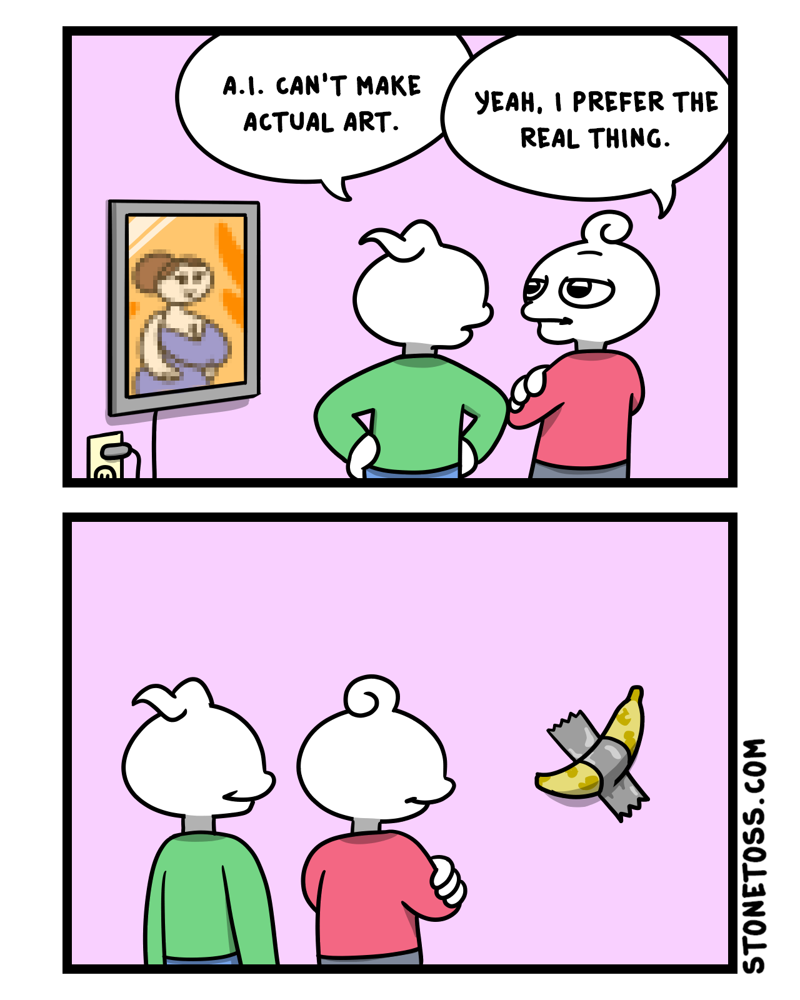


## AI as the Artist

Erik Hoel has his own thesis for why &ldquo;AI-art isn&rsquo;t art&rdquo;:

> Given how simple this is, only the most self-congratulatory would refer to themselves as an “artist” simply for typing a one-sentence description of an image and letting DALL-E do the rest. Imagine someone commissioning an artist to do an artwork and then referring to themselves, in strict seriousness, as “the real artist” since they were the one who paid the commission (in fact, it’s exactly the same, as DALL-E will require fees to whatever Big Tech company OpenAI licenses it out to. Probably Microsoft).<sup><a id="fnr.116" class="footref" href="#fn.116" role="doc-backlink">116</a></sup>

But, this clearly does nothing to establish his thesis that &ldquo;AI-art isn&rsquo;t art,&rdquo; surely in this analogy DALL-E is the artist, right? The question isn&rsquo;t &ldquo;who is the artist&rdquo; it&rsquo;s &ldquo;is AI art art?&rdquo; There is a broad class of arguments like this one from Hoel that centre around shifting the artistry to the AI, in order to attempt to negate that it is art. This, of course, could only ever apply to text-to-image, one can exert massive amounts of control using image-to-image. Moreover, that you aren&rsquo;t the one actually physically getting in there with a paintbrush does not make you not the artist&#x2014;the artist is the one who is directing the art and is deciding the composition of the new, fictional reality. At what degree of computer aid does one stop being the artist? Surely the superior understanding is that one is an artist if it is *their* creative vision.

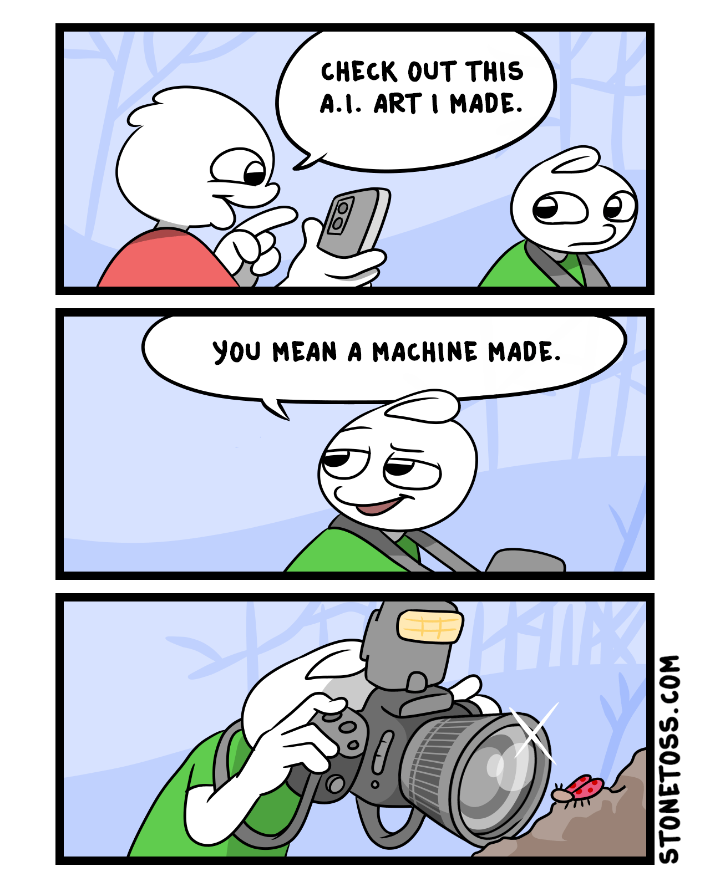

After all, movie directors certainly count as artists, if I asked Hoel who made *The Shining* I doubt he would start listing off every cameraman on set, he would of course say that Stanley Kubrick made *The Shining*. Kubrick is the one who had the creative vision, he is the one who decided how it would look and what would be included&#x2014;he is the artist. That he wasn&rsquo;t doing all of the performances and the filming and the catering and whatever else goes into making a movie does not negate that it is *his* movie.


## The Rush for Aesthetic Objectivism

In reality, it is plain to see for any with eyes that my above elucidation of an objective aesthetics for the artists to be using is perhaps overly-charitable. Art has been one of the primary battlegrounds of all of the worst subjectivism imaginable. I derive a certain joy&#x2013;or perhaps a schadenfreude&#x2013;in seeing the &ldquo;everything is relative,&rdquo; &ldquo;truth is subjective,&rdquo; crowd who have dominated the art industry for decades instantly turn on a dime into asserting that AI image generations violate the principles of true Art, and that it is objectively immoral for artists to lose their jobs to an AI. The art world post-Duchamp has almost entirely adopted the bromide that anything is art if the artist says so,<sup><a id="fnr.117" class="footref" href="#fn.117" role="doc-backlink">117</a></sup> and now that people are attempting to make actually good art as against anti-conceptual garbage, they are desperately scrambling to rescue objectivity from the well in which they drowned it.

For the artists out there: you really need to wrestle with this question&#x2014;you can&rsquo;t have it both ways. Either you maintain your nonsense relativism, in which case you are incapable of mounting a sound moral argument for or against anything, as any such argument may be refuted by &ldquo;that might be moral for you, but its not moral for me!&rdquo; Or, you drop the relativism, and adopt a realist philosophy, in which you can properly ground your moral and aesthetic claims: stop the nonsense of deconstructing concepts right up until the point where you deem the concept to be strategically advantageous to maintain. You are stealing the concepts which you wish to elevate to objectivity above the graveyard of destruction in your wake from those whose philosophy is actually grounded in reality.

One of the great fountainheads of the anti-AI art movement from which basically all other arguments are borrowed second-hand is Steven Zapata (which is ironic for a movement which bases its arguments in a hatred of AI on the grounds that it is second-hand). Zapata tells us that art can &ldquo;be anything,&rdquo; that it is &ldquo;very structureless,&rdquo; and that there is &ldquo;no real objectivity in art.&rdquo;<sup><a id="fnr.118" class="footref" href="#fn.118" role="doc-backlink">118</a></sup> He also finds want to put the word &ldquo;truth&rdquo; in air quotes.<sup><a id="fnr.119" class="footref" href="#fn.119" role="doc-backlink">119</a></sup> If this is the accepted opinion within art circles, it should be no surprise that anti-conceptual nonsense is the norm, nor should it be a surprise that people are turning to AI to produce actually good art. Zapata is at least honest enough to not get involved in the &ldquo;it&rsquo;s not real art&rdquo; argument, perhaps if the hordes of his intellectual descendants would realise why that is the case we could finally be without this nonsense-stance. My hopes for this occurring are not high&#x2014;the second-hander is fully capable of borrowing bundled ideas from wherever he chooses, without ever analysing whether there exists any gross inconsistency between his bundles. Remember this: whenever these people come along and claim that AI art is not real art, all you must do is ask them the simple question: what is art?


# Positive Applications of AI Image Generation


## Art For The Severely Disabled - &ldquo;just pick up a pencil and start drawing bro&rdquo;

The anti-AI crowd take particular glee in mocking the popular notion of AI image generation being a &ldquo;democratisation&rdquo; of art. Putting aside any issues I have with that particular terminology, the argument is that art was already accessible to everyone, because all you have to do is pick up a pencil and start drawing. LioConvoy says to people who wish to speed up their creation by using AI to draw backgrounds that they should just &ldquo;learn to draw backgrounds [&#x2026;] Learn to draw, or commission an artist.&rdquo;<sup><a id="fnr.120" class="footref" href="#fn.120" role="doc-backlink">120</a></sup> Well, at least he is giving us some options! &ldquo;Pay up, or use inferior techniques&#x2014;heads I win, tails you lose.&rdquo;

To artists who make claims such as these, just for your own strategic sake, consider how easy it is to turn this line of reasoning right back at you: &ldquo;Oh, we should just learn to draw, how about you just learn to get another job after art is automated?&rdquo; &ldquo;How about you just learn to code your own AI?&rdquo; &ldquo;How about you just learn to make passive income to support your art hobby?&rdquo;

Of course, there stands also an obvious counterexample to their blanket assertions that the AI prompters should just pick up a pencil and learn to draw: namely people who are not capable of picking up a pencil.

Take Stephen Hawking, who was completely paralysed by the end of his life. &ldquo;Pick up a pencil, gramps&rdquo; is not going to magically inspire him to be able to move his limbs again. With AI image generation [this guy](https://www.youtube.com/watch?v=gplA6pq9cOs) can make art, and he&rsquo;s in a fucking iron lung!

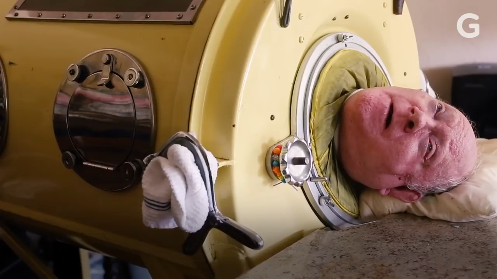

Can anyone honestly say that if a person in this state was pining to make art, that they would tell them to &ldquo;just pick up a pencil, bro?&rdquo; You might say that he can simply commission an artist if he wants personal art&#x2014;to which I would ask: how much do you think it costs him to maintain that big, fuck-off machine that is currently breathing for him? Are you going to advocate that he choose between being deprived of the joy that is appreciating art and knowing that he will be able to breathe tomorrow?

&ldquo;The difficulty in producing art is simply what separates the wheat from the chaff&#x2014;the boys from the men&#x2014;us from you,&rdquo; we are told by the great art-mystics, &ldquo;Polio Paul and Spinal Injury Steven, are simply undeserving of the sacred craft of art-making, they must quell their egotistical desires to wrestle this profession from its proper place.&rdquo;

Art has a profound impact on the mental wellbeing of those who partake in it&#x2014;I don&rsquo;t think we should be requiring that those who are incapable of making art unaided sacrifice this incredible benefit in order to please the existing artistic establishment.

This may sound like an overly-ambitious caricature that I am painting of the anti-AI crowd: surely nobody would actually be so vicious! Oh, if only that were true. Duchess Celestia makes it perfectly clear that those without the means to make art should just suck it the fuck up, telling us that &ldquo;if you can&rsquo;t animate a project or hire an animator, you shouldn&rsquo;t be able to make an animated project. If you can&rsquo;t create a book cover, or hire an artist to do it for you, your book shouldn&rsquo;t have a cover&#x2014;it&rsquo;s the basis of economy!&rdquo;<sup><a id="fnr.121" class="footref" href="#fn.121" role="doc-backlink">121</a></sup> And, again, what preventing people like Norman No Arms from making art looks like is in using actual violence against him and his collaborators for the reason that they did it in the &ldquo;wrong&rdquo; way. That she, to adopt her terminology, feels entitled to speak on economics whilst having a negative understanding of the field offends me! I work for the Foundation for Economic Education, and her flooding the market with ineptitudes like this poisons the field and puts the profession at risk&#x2014;I shouldn&rsquo;t face any competition in the field of economics education, just as the artists shouldn&rsquo;t have to face competition in their industry. Surely the correct response here is for me to advocate that violent force be used against anyone who would dare compete with me&#x2014;even when I claim that competition to be shoddy! This is what I have learned from the artists&#x2014;destroying competition is the only moral way to do these things.

You can imagine a particularly heinous Paralympics commentator saying similar things to these artists: &ldquo;running is already democratised, stop adding all of this new technological mumbo jumbo to it. All you have to do is pick up your legs and throw them in front of you one after the other. Look at all these cheaters using bionic enhancements&#x2014;this one is using wheels for Christ&rsquo;s sake! It&rsquo;s like they never bothered to watch any running tutorials on YouTube and just want a shortcut to success!&rdquo;

My friend Necro has cerebral palsy, which can cause his hands to cramp up very easily. He tells me that when he has used AI art it makes it a lot easier for him to quickly conceptualise things, you know, without willing his muscles to do what they simply can&rsquo;t. Necro is an artist, it&rsquo;s just that sometimes he is not physically capable of creating art: his mind is fully in-tact and capable of imagining brilliant works of art, its just that there is a gap between what his mind can imagine, and what is body is able to do. Now with AI image generation that gap has closed massively. You can be completely paralysed head-to-toe and be able to dictate prompts to an AI image generator&#x2014;anyone is capable of making art now, AI has indeed democratised the creation of art.

Furthermore, we needn&rsquo;t even go to the extremes of cerebral palsy or total body paralysis to think of people who can benefit from this technology. I have a tremor in my hands that makes it essentially impossible for me to properly use a paintbrush, or pencil, or whatever other such implement in order to make art&#x2014;it is basically impossible for me to utilise the correct level of pressure. Now, my tremor is certainly nothing crazy, there are people who have far worse impairments than me, but even something as mild as this can be overcome with the advent of AI art.

There is an even more fundamental point to be addressed here, which is seemingly completely outside the anti-AI artists&rsquo; scope of awareness&#x2014;namely the cost involved in choosing to do art. Basically, spending my time learning how to draw deprives me of the attainment of those goals that I could have pursued within the time that was spent on learning to draw. This is called opportunity cost by economists&#x2014;every single choice you make involves such a cost, the cost of everything that you forego in favour of whatever you choose. Now, AI image generation is able to drastically lower the opportunity cost of making art&#x2014;so if you are in a situation where you simply cannot spare the time to do art, you now are far more likely to be able to do so.

In response to Shadiversity&rsquo;s love of AI, FENNAH tells him to just &ldquo;learn the fucking skill,&rdquo;<sup><a id="fnr.122" class="footref" href="#fn.122" role="doc-backlink">122</a></sup> elaborating that with respect to Shad&rsquo;s use of AI as a colouring tool: &ldquo;you could have learned to draw all those things yourself.&rdquo;<sup><a id="fnr.123" class="footref" href="#fn.123" role="doc-backlink">123</a></sup> What FENNAH ignores here is opportunity cost. He addresses only the seen&#x2014;that Shad *could have* learned to become a great artist; whilst ignoring the unseen&#x2014;that Shad would have to give something up in order to achieve this. The question is, then, what exactly are we advocating that Shad gives up to learn this skill? Should he spend less time with his family? Should he spend less time perfecting his YouTube channel? Should he spend less time learning about medieval history? He has only limited time in the day&#x2014;and at some point in the future he will die forever. Is it really FENNAHs place to claim that Shad has been misplacing his time? Surely this decision is Shad&rsquo;s to make&#x2014;we do not know his situation, and we should not engage in such wild speculation over it.


## Fgaster Iterations

Imagine for me that you are a concept artist, working on *Star Wars: Episode XIV*, and you have just perfected the new design for the super-ultra-omega-stormtrooper. You show your design to Robot George Lucas, and he wants to see this new stormtrooper in every environment that has been designed for the new movie. Tell me, which sounds like the more enjoyable workflow: to tediously re-draw this stormtrooper in dozens or hundreds of different environments, or to give an AI your reference sheet, all of the environment drawings, and tell it to do the rest? It seems to me that the clear choice is the second one: by leveraging the power of AI, the tedium of iterating upon an idea over and over and over and over again can be completely eliminated. Maybe after you bring Robot George Lucas the hundreds of in-context images he wanted, he then asks you to give all of them jet packs, which was not a part of the original design. If you used AI, no problem: simply relay these instructions to *Stable Diffusion* version 12 and it can do all of the work for you.

Pascal Blanché explains that experimenting with image-to-image AIs has allowed him to &ldquo;open new horizons&rdquo; with his art,<sup><a id="fnr.124" class="footref" href="#fn.124" role="doc-backlink">124</a></sup> and he redoubles this exact notion of iteration that I am describing here:

> The process so far is to make many iterations over my own work with keywords like cyberpunk / futuristic city / bladerunner and so on, then recompose the results with my original. Plenty of [possibilities] from here.

Stan Prokopenko concurs:

> You can take the Proko logo, you can give it a bunch of different colours, different variations [&#x2026;] and then you can create a prompt template that&rsquo;s like: *this* style with *this* subject matter. So you just say this is an ocean of fish, or some koi, a koi pond, and then you give it a style&#x2014;it&rsquo;s like Picassoish or whatever, or it&rsquo;s like Rockwell [&#x2026;] and you create these thousands of combinations and then you just batch it all and you get these beautiful images of like the Proko logo.<sup><a id="fnr.125" class="footref" href="#fn.125" role="doc-backlink">125</a></sup>

Concept artist Trent Kaniuga is in the same boat, seeing AI and human art as a &ldquo;symbiotic relationship.&rdquo;<sup><a id="fnr.126" class="footref" href="#fn.126" role="doc-backlink">126</a></sup> This ability to quickly iterate upon an idea opens up entirely new avenues of creativity that would simply be locked behind time constraints before. An artist can describe the sort of asset that they are looking for, have an AI generate thousands of iterations, and then they can look through to see if there are any good ideas&#x2014;perhaps ideas that the artist never would have come up with sans the AI. AI art is a brilliant tool for opening up new horizons of creativity even for those who are already able-bodied artists. I mean, just think about it, this is for the artists: do you really want to be spending 15 hours a day making slight variations to some grass texture to cover up its tiling? Do you want to spend your time on draftswork that could be done by a computer? Or, instead of that stuff, do you want to focus your time on whichever aspects are most artistically fulfilling? I think the invention of the paint-fill tool is a sufficient answer to these questions.


## Automation of Less-Appealing Parts

This is not even a pure hypothetical either&#x2014;Benjamin Von Wong, a sculptor, explains how he uses DALL-E to improve his creative process:

> “DALL-E is a wonderful tool for someone like me who cannot draw,” [&#x2026;] “Rather than needing to sketch out concepts, I can simply generate them through different prompt phrases.”<sup><a id="fnr.127" class="footref" href="#fn.127" role="doc-backlink">127</a></sup>

So, instead of spending his time learning and utilising an entirely different artistic technique, he is able to specialise into the sculpture-work that he clearly prefers. This means, all else being equal, he will be able to produce more sculptures than otherwise&#x2014;surely a boon to his career. Aaron Blaise, veteran animator for Disney, mirrors this idea,<sup><a id="fnr.128" class="footref" href="#fn.128" role="doc-backlink">128</a></sup> pondering whether AI image generation could be used to fill in shadows and highlights, thus freeing the artist to spend their time elsewhere.

We have seen this applied to movies as well,<sup><a id="fnr.129" class="footref" href="#fn.129" role="doc-backlink">129</a></sup> *The Champion* used AI technology to re-dub the movie in several different languages, whilst keeping the actors voice, performance, and mouth movements consistent with the original. This is bringing the art to a whole new audience who would have to watch it with either an inferior vocal performance in a language they understand, or in the original but having to constantly read subtitles. AI is making art more accessible to people and allowing our stories to be truly global in scope.

Some in the artistic community scoff at this notion<sup><a id="fnr.130" class="footref" href="#fn.130" role="doc-backlink">130</a></sup>&#x2014;&ldquo;aha! But some people enjoy those &lsquo;less interesting&rsquo; aspects, so there!&rdquo; They tell us this, as if it in any way negates the point being made. &ldquo;Yes, well done Susan, I&rsquo;m glad for you that you enjoy sewing, this does not negate that I do not, and would much rather have a machine make clothes for me.&rdquo; If an artist still wants to engage in those aspects of the creative process that can be automated away, more power to them, I have absolutely no issue with them persisting in this activity&#x2014;but this does not make it wrong or stupid for other people to make a different choice.


# The Bullying of AI Artists


## Bullying Artists For Not Blacklisting AI Imgen

The level of bullying that AI artists have received for daring to pursue and engage with a new artistic medium is frankly disgusting. Nashor Kim gave permission for people to train an image model on his work<sup><a id="fnr.131" class="footref" href="#fn.131" role="doc-backlink">131</a></sup> and received immediate backlash in the quote tweets&#x2014;this is fucking ludicrous, I thought the whole point was that the AIs stole people&rsquo;s work, what exactly is the issue when someone gives permission?

Another artist, of his own volition, used AI tools in the creation of some art for a DnD sourcebook&#x2014;the response to this was not merely that the work should be removed from the book, but that the artist himself, who has worked with the company for nine years, should be forever blacklisted from ever creating art for the company again. &ldquo;Set an example of this parasite,&rdquo; they tell us&#x2014;the sin of using artistic tools to create his own art on his own terms means he must forever be cast out from the profession. Truly, this is what it means for artists to stick together.

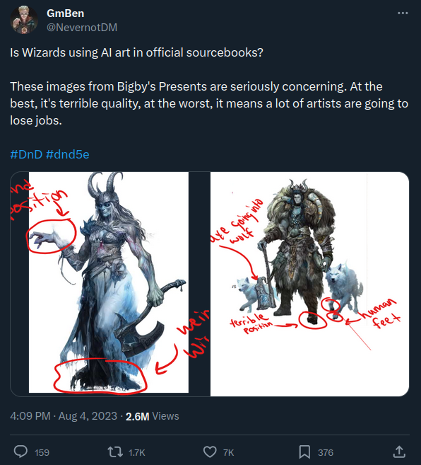


## Bullying YouTubers for Automating Their Own Jobs

Having any association whatsoever with AI has become the black mark against someone&rsquo;s name necessary to justify attacking them. All of the talk about &ldquo;ethical training&rdquo; is simply a smokescreen to cover up for their total rejection of the technology on protectionist grounds, which is why their attacks against artists is not limited to what would count as &ldquo;bad actors&rdquo; on their premises, but rather is targeted at anyone who would dare touch this more efficient technology.

This is seen quite clearly in those cases of YouTubers automating a task that *they themselves* would normally do&#x2014;premydaremy is apparently not allowed to use AI art in his thumbnails anymore:

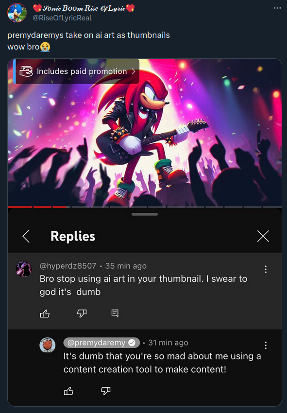

What exactly is the suggestion here? That YouTubers start commissioning bespoke art to use as the thumbnail for every video they make? What an utter absurdity&#x2014;it is not an uncommon strategy to frequently swap out different thumbnail and title combinations to perform A/B testing. Should YouTubers be commissioning artists for each combination and paying for the rush job that would be required to get the video out in time? Nobody does this&#x2014;nobody runs their channel this way. For the most part it is the youtuber himself who is making the thumbnail&#x2014;no artist on planet Earth lost their job because of this because no artist was ever going to be hired for such a job!

Austin McConnell is producing a book about a virtually unknown public domain superhero on a shoestring budget befitting the likely very limited revenue such a project could make. This budget was already going towards paying for:<sup><a id="fnr.132" class="footref" href="#fn.132" role="doc-backlink">132</a></sup>

-   a co-author;
-   professional editing;
-   proofreading;
-   formatting, and;
-   commissioning human artists for the books cover and marketing materials.

So, this is clearly not the image of a greedy, evil man attempting to wring every penny out of creation and destroy art in the process&#x2014;this is a guy who wants to get together with other creatives and bring something cool into the world. McConnell explains that he is &ldquo;forever dealing with the challenge of converting youtube viewers to actual readers of my work. So I decided that I would put together the first chapter in an animated story-book style, with the full audio production featuring different voices, music, sound effects, the whole nine yards, and then release it totally free for people who were either on the fence about picking up a copy and checking out the whole story, or who were just looking for something entertaining to spend about an hour watching.&rdquo;<sup><a id="fnr.133" class="footref" href="#fn.133" role="doc-backlink">133</a></sup>

The creation of this totally free animation took Austin about five months of painstaking work<sup><a id="fnr.134" class="footref" href="#fn.134" role="doc-backlink">134</a></sup> to promote a book that he was not even expecting to make all that much money.<sup><a id="fnr.135" class="footref" href="#fn.135" role="doc-backlink">135</a></sup> This is a clearly good thing, he has found a way to get the story in front of more people at no extra cost to them. But in the process he committed the mortal sin of using the labour-saving technology that is generative AI&#x2014;thus drawing the ire of the art-protectionist egregore.

This animation simply would not have been produced without the advent of AI,<sup><a id="fnr.136" class="footref" href="#fn.136" role="doc-backlink">136</a></sup> and it is far from being on the level of the Wynand mega-feed slop which Zapata fears:

> This storybook features various animation effects and motion graphics that were not AI-generated&#x2014;they were painstakingly crafted or added by me in a non-linear editor. [&#x2026;] The visuals for the spider-queen storybook were produced using a variety of resources including: 2D art and character designs I commissioned or drew myself, 2D and 3D assets I purchased from royalty-free stock footage websites, generative fill and neural art filters available in either photoshop or Adobe firefly&#x2013;which is an AI trained only on stock images owned by the company, public domain content, or other openly-licensed or non-copyright material [&#x2026;]&#x2013;and a diffusion model trained on the above materials.<sup><a id="fnr.137" class="footref" href="#fn.137" role="doc-backlink">137</a></sup>

And that&rsquo;s the kicker&#x2014;Austin was in complete compliance with the arbitrary ethical AI standards that have been championed by the art establishment and they still go after him. &ldquo;You hired human artists for this? Not enough. You used only public domain and licensed assets? Not enough. You put real blood, sweat and tears into it? Not enough.&rdquo;

Do you see why I call their &ldquo;ethical training&rdquo; concerns a smokescreen? They demonstrate by how they place their ire that they don&rsquo;t give a crap about any of that&#x2014;they only care if it will impact their wallets or sully the sanctity of their craft. The plain-Jane, plumb-line truth of the matter is that this AI image generation allowed Austin to push this particular piece of art&#x2013;this story about a completely forgotten superhero&#x2013;far beyond what would ever be possible without its use. This is a clear example of AI *improving* rather than detracting from art and creativity. Artists sticking together is whenever you bully artists for making art, and the more you bully them the more artists are sticking together.

*But using AI like this is just lazy!*

Ah yes, the classic cry against efficiency&#x2014;he who transports grain by horse must simply lack legs to walk on. It&rsquo;s as if we are to accept that capital goods simply push man to a state of lazing about on the beach, just barely surviving and spending the vast majority of his time doing no productive efforts and only a tiny fraction on collecting the resources he needs to live. We can of course see the obvious absurdity of such an example&#x2014;as man gains more capital goods it is indeed true that this allows him more leisure time, but it also allows that time he spends labouring to be vastly more productive than if he was stuck using only his bare hands. That Austin is able to save his time by using digital rather than film, and using AI instead of a pencil and paper, means that he was able to make this animation in the first place&#x2014;and the making of was anything but lazy:

> Now can people use AI generators to make lazy art? Sure, absolutely, but the video that I produced could not have been replicated, as some have suggested, in a couple hours by a computer. It required a heavy and overwhelming human involvement&#x2014;at the very least to write the actual book, but certainly to create this entire production. This shot here is a great example, we&rsquo;ve got a generative fill background that was produced using a royalty-free 3D environment, combined with 3D and 2D royalty-free assets, using commissioned art with alterations I hand-drew. All of it composited together and animated by me in Adobe After Effects, where I added camera movement, colour correction, focus effects, timed it to royalty-free music that I have licensed and curated, featuring sound effects from a stock library with reverb and mixing that I did, integrating a vocal performance that I meticulously constructed. If you believe that this method of video production is &ldquo;lazy content&rdquo; all I can do is just share these screenshots of the final project timeline with you and tell you that this video took way longer to put together than I ever would have anticipated, and if you think that this is something that anybody with an AI program can do I welcome you to try and replicate it yourself in a couple of hours.<sup><a id="fnr.138" class="footref" href="#fn.138" role="doc-backlink">138</a></sup>

The people making such arguments and decrying efficiency are simply anti-human. If they were truly consistent in their credo they would advocate an apocalypse&#x2014;a total breakdown in the capital structure which makes mans current flourishing on this Earth possible in the first place, returning man to the cold, damp, mud from which he has lifted himself out of.

*But, he still should have hired humans to do the work instead of AI!*

Austin explains that he tried hiring a female voice actor to voice the female character, holding three separate rounds of recruitment for the role, but the quoted rates were both far out of budget and none of the applicants were right for the part.<sup><a id="fnr.139" class="footref" href="#fn.139" role="doc-backlink">139</a></sup> He similarly reached out to freelance artists to see if any would be willing to draw the over 50-minute animation and was either turned down due to the immense scope of the project, or was quoted prices that would vastly dwarf any returns he could hope to get on the book that the short was supposed to be advertising. This is the fundamental point&#x2014;this animation simply would never have been made without the advent of AI&#x2014;nobody on Earth was going to be able to pay for it, and human artists are not entitled to someone paying for it. We now have more art because of the brilliant work of AI developers.


## Bullying Shadiversity for Teaching People how to Use AI

Shadiversity has been perhaps the most prominent defender of AI thusfar, so it is not particularly surprising that the mob has turned their attention to him also. He recently posted a challenge to prove that AI image generation is not just &ldquo;type prompt → get final image&rdquo; and he was proven entirely correct.

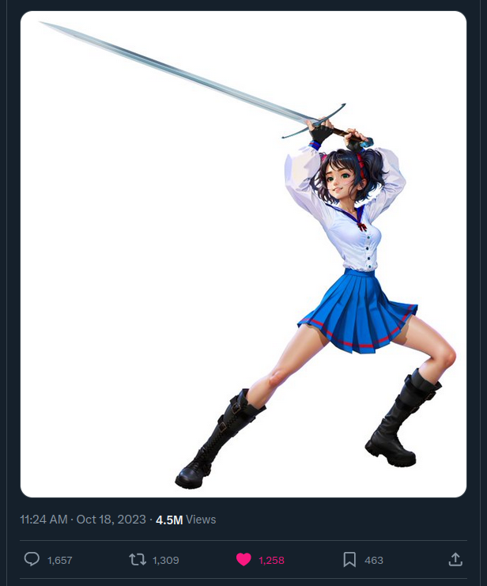

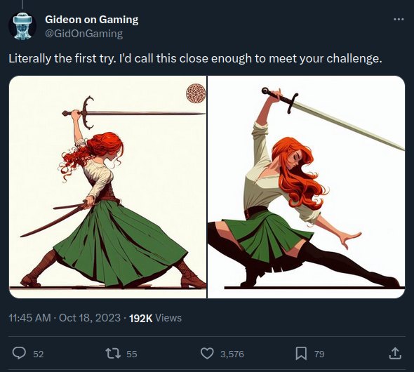

For both of these images the character looks nothing like Shad&rsquo;s character, the poses are completely different, the swords are completely different, the grip is completely different, and the swords are held flat-on to the camera, which is not the case for Shad&rsquo;s image. Again, it seems that the uncanny eye that the art-protectionist has for spotting every minor flaw in AI image generation is completely absent whenever it is useful for it to be. &ldquo;But aha! Silly Shad, didn&rsquo;t you know that even in this challenge you posted the hand is obviously not anatomically correct&#x2014;we win you lose!&rdquo;

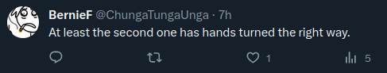

This, of course, ignores the fact that Shad based the grip off of an actual historic grip used and which he can recreate in person.


Shadiversity recognises that an artistic weakness of his is in the colouring of his line-drawings,<sup><a id="fnr.140" class="footref" href="#fn.140" role="doc-backlink">140</a></sup> that he has access to AI image-to-image software allows him to overcome this weak point and more fully realise his artistic vision. It takes a special kind of viciousness to wish to rip this ability from him.

Nor does this imply in any way that Shad is not still capable of immense artistic input. As explained, one of the key aspects to an objectively good piece of art is selectivity&#x2013;specificity&#x2013;making micro-adjustments to dial in the absolute perfect representation of the metaphysics that you are trying to embody. It would be easy enough to copy a prompt, or to type &ldquo;I wan supergirl who is flying and then there is a red skirt and then there is sci-fi armour&rdquo;&#x2014;but it is far more challenging to know *what* exactly to change in the prompt, *where* to inpaint, *which* settings to tweak, *how* to tweak them, and to select the best elements to photobash together for the final result. That we have dozens to hundreds of popular tutorials on how to use these tools is surely indicative that there is more to the process than &ldquo;click button → get art.&rdquo; Even before Shad does any inpainting or photobashing or illustration on top of the AI art, his prompts are fucking gigantic&#x2014;clearly he is trying to get a superior level of specificity than is possible with a shorter prompt. Karla Ortiz recognises this, saying that &ldquo;the more intricate and the more detailed the prompt [is], the better the image the AI can give you.&rdquo;<sup><a id="fnr.141" class="footref" href="#fn.141" role="doc-backlink">141</a></sup>

Reid Southen counters that this is just Shad not understanding how prompting works, which Shad disputes:

> There are parts [of] the AI image generation that we don&rsquo;t understand how it&rsquo;s working [&#x2026;] and so the reason why there&rsquo;s so many duplications in the negative prompt is because it actually affects the result. I&rsquo;ve tried differences and by this repetition the [difference in] results are actually quite extreme.<sup><a id="fnr.142" class="footref" href="#fn.142" role="doc-backlink">142</a></sup>

The artists-against-AI love to nitpick every last detail in every image they even suspect of having been touched by the hair on an AI&rsquo;s head,<sup><a id="fnr.143" class="footref" href="#fn.143" role="doc-backlink">143</a></sup> and they have also shifted to&#x2013;I would say&#x2013;engaging in some less-than-good-faith critiques of Shadiversity&rsquo;s non-AI art. The idea being that he was too lazy to get good and was self-conscious about this, so he used AI to cheat! What they rest their attacks on is this idea that if they can point out every little thing in an AI image that doesn&rsquo;t match up to reality that then AI art is completely worthless and worthy of attack. What this amounts to is a sort of naïve aesthetic realism&#x2014;&ldquo;oh, that lighting is not as it would be in real life, therefore its bad&rdquo;&#x2014;&ldquo;that anatomy is not as it would be in real life, therefore its bad.&rdquo; They of course ignore that art is not a process of capturing every detail in reality in some sort of &ldquo;slice of life&rdquo;&#x2014;rather it&rsquo;s purpose is to distill and represent only those aspects of reality that are *important*.

On that note, this exact same nitpicking procedure&#x2013;which the anti-AI crowd have so gleefully taken part in since the technology&rsquo;s release&#x2013;can be trivially used against the art that they produce as well.

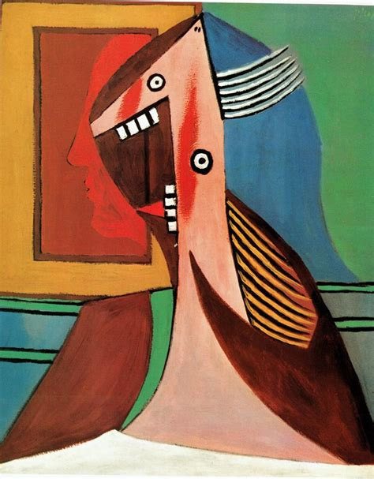

Uhhh, Pablo? That&rsquo;s not very accurate anatomy!


Why does the baby Jesus look like a tiny but fully grown man? That&rsquo;s not what things are really like!

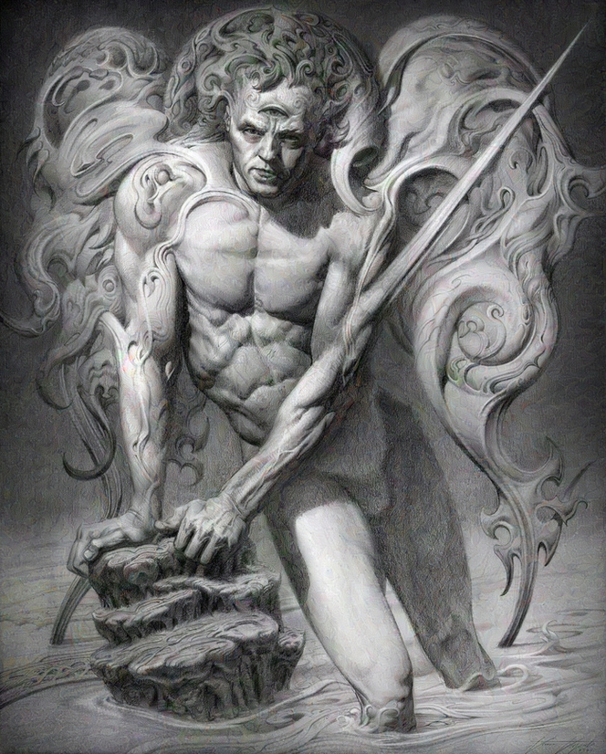

Does Steven Zapata not know how many eyes people have?

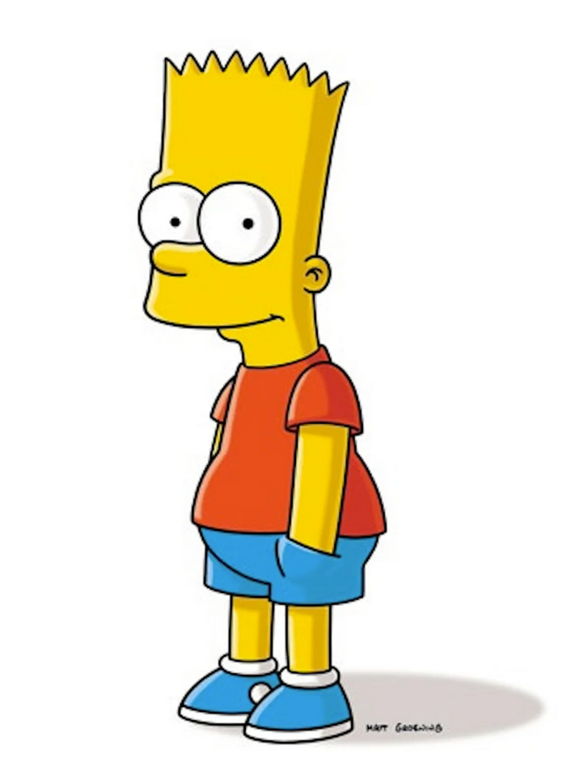

Erm, weird head much?

Of course, I kid with these nitpicks, but I am capable of producing far less nitpicky and far stronger criticism of the type of anti-human art coming out of people like Zapata and Picasso. For Picasso, this anti-perceptual mess is his vision of reality&#x2014;on such a philosophy man has no power to know anything and wherever he tries he will fall woefully short, perhaps ending up like the guitarist from before. This is an evil view of man, but it is encapsulated with a high degree of aesthetic rigour. Picasso is selective in his choice of a woman. Generally women are chosen to depict their beauty, but Picasso&rsquo;s job here is to deconstruct, so he deconstructs beauty itself. Picasso is clear in what it is he is doing&#x2014;he has not blurred the figure, he has rather slashed great lines across it, disintegrating the concept in front of our eyes. Where the piece suffers is on the level of integration&#x2014;these precise, distinct shapes are indicative of separate concepts, but the entire pursuit is to destroy concepts and reality. We have a fundamental disintegration between the technique and the reality being depicted by it.

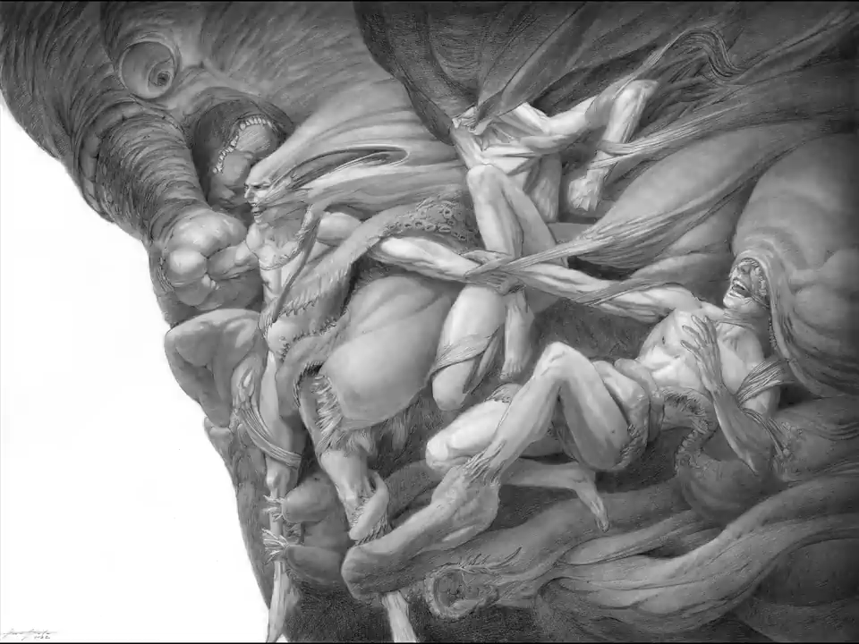

We can do the same to Zapata&rsquo;s work&#x2014;the view of man depicted here is truly gruesome. Looking over his portfolio, rarely are we met with any vision of man as an individual, or man as a conqueror, or man as triumphant&#x2014;rather we get grotesque collectives mashed together in a seemingly endless torture of every individual present. The individual on such a view does not exist, he is irrelevant, a fragmant torn from God, or a cell of the collective body&#x2014;his suffering is thus similarly irrelevant, for the collective is all that matters. Despite this, Zapata demonstrates an intimate knowledge of the human form, but sees it as deficient. Rather than depicting man as he is, fully functional in every muscle, not a hair out of place, he depicts man as requiring physical modification to properly fit within reality. The idea being presented here is that mans actual body is insufficient to meet his actual collectivist nature. That hes is able to execute these artistic equivalents of *The Communist Manifesto* with such a high degree of technical ability, betraying a deep connection with it, really makes it such that I can&rsquo;t help but chuckle whenever he claims to be pro-human&#x2014;especially when composed with his overt protectionism.

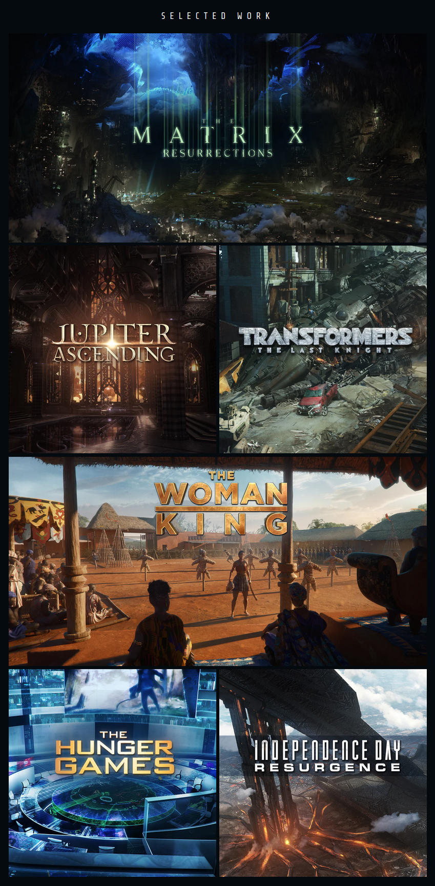

Reid Southen has been very outspoken in his opinions on this issue, fighting against the AI slop that threatens him.<sup><a id="fnr.144" class="footref" href="#fn.144" role="doc-backlink">144</a></sup> So let&rsquo;s take a look at the &ldquo;selected work&rdquo; on the front page of his website. We have: *The Matrix: Resurections*, *Jupiter Ascending*, *Transformers: The Last Knight*, *The Woman King*, *The Hunger Games*, and *Independence Day: Resurgence*. Well thank goodness Reid is the stalwart defender of humanity against the potential slop-factory that is AI. I just don&rsquo;t know what on Earth we would do without the high art that is *The Woman King* or the innumerable rehashes of old movies that seem to make up the bulk of his career. Remember guys: AI is bad because it just rehashes what has already happened, pay no attention to the man behind the criticism.

One distinction one might wish to draw between the sort of nitpicking I am doing and that done against AI is that for the most part the things I point out were intentionally put there by the artist in question&#x2014;for the case of Picasso and Zapata, that what they are doing is intentional makes it an even greater damnation, and further, that a decision was intentional does not seem to present any sort of barrier for the anti-AI side. Shadiversity made it clear that he enjoyed the look of the sun behind SuperGirl *and* wanted to get a good look at her front, so much like how movies will light up every inch of the screen, he wanted to use some unrealistic lighting. You might disagree with his intention here, but then we are back to me strongly disagreeing with the type of metaphysics embodied in a work by Zapata or Picasso.

Now, is it fair for me to go on such tirades against people&rsquo;s work due to a disagreement over the benefits of AI technology? If not, then the same rule should be applied to the AI-nitpickers&#x2014;either we all get to nitpick and the actual arguments sink to the background, or none of us do and we actually discuss the technology without lying about what our eyes see. Everyone knows that both AI and non-AI methods can make for highly appealing images, all pointing out flaws does is demonstrate Shadiversity to be correct when he says that having an artistic eye implies that one can make better AI art.


## Bullying Corridor Digital for Experimenting with AI

Corridor Digital, a prominent VFX channel decided to experiment with the new creative possibilities which AI affords. The response from artists? Ceaseless hate and flaming: put those silly VFX artists in their place twitter, how dare they seek to continue the same experimentation they always have, don&rsquo;t they know that AI is now forbidden, so sayeth Art? Zapata&rsquo;s insistence that artists are a pro-technology and pro-experimentation community seems completely absent in the response to this.

Corridor is &ldquo;absolute cancer,&rdquo; they &ldquo;deserve [zero] support,&rdquo; the actual people behind this are &ldquo;garbage&rdquo;&#x2014;its not even that the technology has flaws, or could be made in a more ethical way, no, it&rsquo;s that you are actual garbage or a &ldquo;loser piece of shit [hack] with no fucking talent&rdquo; for daring to experiment with unapproved technology. Corridor are &ldquo;not real artists&rdquo; anymore, they have committed the sin of experimenting with the wrong tech and now cannot be considered as such&#x2014;I hope you see now why I see fit to bring up that many of these people rest their arguments on a theory of art which deems that it is art if mystic priests say it is, and only then. Way to support artists and creativity, guys!

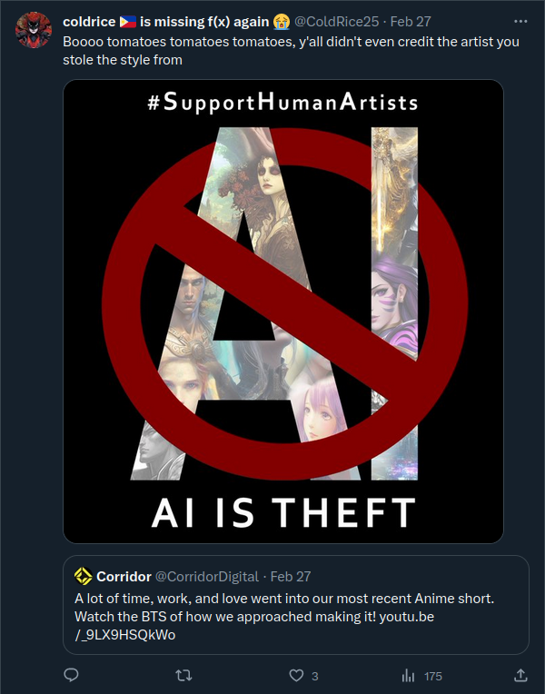

And I know that the response here is going to be that Corridor started it, that Corridor weren&rsquo;t supporting artists, but this just isn&rsquo;t the case. All of the backlash I am showing here is directed at their second Anime Rock Paper Scissors video, where they followed the calls to support human artists. They were about as explicit as you could possibly be with where they got the style from, and who contributed what to the final product&#x2014;but of course, it is never enough for these people. &ldquo;Oh, you hired someone to design the characters and made them fully aware that it was to be used for training an AI?<sup><a id="fnr.145" class="footref" href="#fn.145" role="doc-backlink">145</a></sup> Not enough.&rdquo; &ldquo;Oh, you reached out to the community to get help on the editing with bounties on completing scenes? Not enough.&rdquo; &ldquo;Oh, you highlighted and praised the musician who did the theme song? Not enough.&rdquo;

There is no rational basis for these attacks, this isn&rsquo;t in response to some evil committed by Corridor, the mere fact that they are using technology that the art sages have deemed bad is the beginning and end of the entire thought process. These people are *still* outraged at corridor for hiring a human artist to design a shirt for them because Corridor is now irreparably tainted by sin in their eyes&#x2014;if the problem truly is with not getting artists&rsquo; consent and not supporting artists, then people should be praising Corridor for finding a way to do both. What Corridor have done with this video strikes me as being essentially identical to what has been done by people like Joel Haver, or even in movies like *A Scanner Darkly*. Joel doesn&rsquo;t animate every single frame, he draws a few keyframes and has a computer fill in the rest<sup><a id="fnr.146" class="footref" href="#fn.146" role="doc-backlink">146</a></sup>&#x2014;where is the #CancelJoelHaver movement? Where are all of the people dunking on him with &ldquo;umm, acktually Joel, this is roto-scoping, not animation.&rdquo; I certainly can&rsquo;t see it.

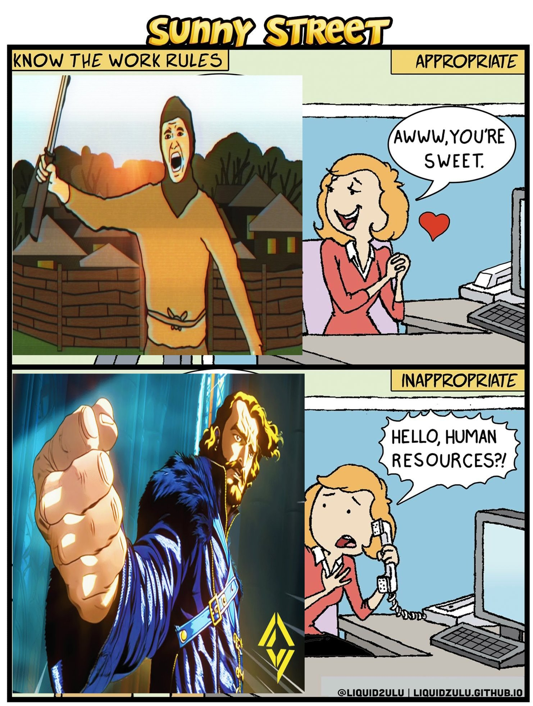

Disney animator, Aaron Blaise, has quite a different take on the Corridor video than the Luddite hordes, stating that &ldquo;it&rsquo;s not too different than what we did on *Beauty and the Beast* [&#x2026;] it&rsquo;s the same idea.&rdquo;<sup><a id="fnr.147" class="footref" href="#fn.147" role="doc-backlink">147</a></sup> He tells us that the much-bemoaned flickering present in the first short &ldquo;adds life to the final image.&rdquo;<sup><a id="fnr.148" class="footref" href="#fn.148" role="doc-backlink">148</a></sup> He explains that AI generated art is &ldquo;no different&rdquo; from what has been done before,<sup><a id="fnr.149" class="footref" href="#fn.149" role="doc-backlink">149</a></sup> and gives cudos to corridor for their experimentation.<sup><a id="fnr.150" class="footref" href="#fn.150" role="doc-backlink">150</a></sup>

A great deal of the backlash completely misses the point with these videos: well done, you found a frame where the hand looks messed up,<sup><a id="fnr.151" class="footref" href="#fn.151" role="doc-backlink">151</a></sup> get yourself a cookie. The purpose of the video was not to show how to make an anime, it was not to demonstrate the process that a human animator goes through, this is a visual effects channel, they were testing out a new visual effects technique and showing where it shines and where it doesn&rsquo;t. Either these people are being deliberately dense such that they may join in on the pile-on, or their mind consists only of recycled ideas that they can&rsquo;t quite grasp how to properly apply.

&ldquo;Oh, you&rsquo;ve slipped the point there, Zulu&#x2014;Corridor are a VFX studio, they only don&rsquo;t care about this because it&rsquo;s not threatening their jobs. Just you watch, the second AI starts making VFX they will change their opinion on a dime!&rdquo;<sup><a id="fnr.152" class="footref" href="#fn.152" role="doc-backlink">152</a></sup> Now, I might accept this accusation, if not for the fact that Corridor has a 20-minute long video<sup><a id="fnr.153" class="footref" href="#fn.153" role="doc-backlink">153</a></sup> on their channel geeking out and getting super excited over a new AI technology that can replace the job of a VFX artist in making a CG character. Like, a very significant portion of the Corridor channel is dedicated to showing off experimental labour-saving techniques that by the logic of the anti-AI crowd put them at risk of losing their jobs. This is the difference between corridor and the protectionists&#x2014;the people at corridor need to constantly innovate, they aren&rsquo;t able to rest on artistic laurels of &ldquo;everything is art&rdquo; and &ldquo;everything is subjective&rdquo; that were established in the wake of Kant. Corridor are on the bleeding edge in an industry that rarely achieves any sort of respect&#x2014;they cannot fall back on pompous &ldquo;you wouldn&rsquo;t get it&rdquo;s, the work of the VFX artist must be impeccable if he is to sustain himself&#x2014;no government grants are available for his gallery of work.

The backlash against Corridor here does not lie within a few isolated examples either, this is the expected result whenever anyone is met with the raging eye of art twitter for committing whichever sin they have decided upon this month. For all the cries from the anti-AI crowd that we be more empathetic towards artists, I find a complete lack of empathy whenever it comes to someone using the technology they despise *even when done in compliance with their arbitrary ethical standards*. If you want people to honestly believe that your community is all about sticking together, and supporting the human behind the screen, then call this shit out&#x2014;there is no significant counterweight to this shitstorm coming from within the art community.


## Giving Credit Where it is Due

Now, I will give credit where it is due, some artists have recognised this problem, as shown on *Art Cafe*:

> [MACIEJ KUCIARA]: There&rsquo;s a complete lack of empathy that&rsquo;s just like, it&rsquo;s just sad to see, you know? It&rsquo;s like: &ldquo;ah yeah you fucking artists,&rdquo; or like &ldquo;oh, yeah this lawsuit&rsquo;s going to kill this AI shit.&rdquo; It&rsquo;s like, I don&rsquo;t know man.
> 
> [SAM YANG]: On both sides, like [&#x2026;] for the people who use AI, on their side its like: &ldquo;oh, you guys are just whiney, you&rsquo;re just crying about it, suck it up and just deal with it.&rdquo; It&rsquo;s like, you don&rsquo;t understand [that] this has been people&rsquo;s livelihoods and their careers for so many years, this has been their passion, this has been something that they care about. And then on the artists&rsquo; side, you know artists are like: &ldquo;oh, we need to snuff this thing out, we need to kill this AI thing, this shouldn&rsquo;t even exist,&rdquo; it&rsquo;s like, ok well you&rsquo;re not looking at the benefits that it could bring to millions of people in the future.
> 
> [MACIEJ KUCIARA]: Or even just production, like if you are a director or someone who works with a team, I know it sounds horrible, to say like, &ldquo;I don&rsquo;t need to hire that many artists anymore,&rdquo; but on the other side though, it&rsquo;s just like it&rsquo;s so expensive&#x2013;especially if you&rsquo;re not like a big studio, or a big director, or you don&rsquo;t have millions of dollars of budget&#x2013;[&#x2026;] like I wanna make my short film, [&#x2026;] I don&rsquo;t have like even [a] few-thousand dollars, [&#x2026;] I don&rsquo;t have like 20-, 30-, 50-thousand dollars to pay an artist to make like a bunch of backgrounds for my film that&rsquo;s not going to even make money because I&rsquo;m not popular enough.<sup><a id="fnr.154" class="footref" href="#fn.154" role="doc-backlink">154</a></sup>

Now, I am not an AI artist, or a regular artist, and quite frankly I don&rsquo;t give much of a damn if people are mean to others online&#x2014;what I do care about is intellectual consistency. If artists want to be mean and throw shit at people for doing things they don&rsquo;t like, then they can&rsquo;t claim some moral high ground in advocating that people stick together and have empathy for one-another&#x2014;and they also need to back up said shit-throwing with some decent arguments. It is clear that for the vast majority of those upset over AI, the use of such technology makes one persona non grata not out of any actual immoral deed, but rather because the high priests of art deem it to be so.


## The Unethical Practices of AI-Artists


### The Kim Jung Gi AI

The anti-AI crowd have a few examples up their sleeves of the AI artists engaging in unethical practices which I would be remiss if I did not cover here. Perhaps the most prominent example is that of a person training an AI to make art similar to Kim Jung Gi shortly after his death. The argument was seemingly that this was in some form &ldquo;spitting on his grave.&rdquo; Now, I can&rsquo;t imagine why it is that his death is at all relevant to the ethical calculus&#x2014;is spitting on a grave worse than spitting on the living man? Only if death is more sacred than life&#x2014;if we are to accept death-worship and life-hatred, then yes, this is a sound argument. &ldquo;Kim Jung Gi has escaped the clutches of life&#x2014;we should not use his work to better the living, it should die with honour&rdquo; is the basic argument being made here.

Now, these types of hyper-specific AIs do perhaps have a slightly different ethical calculus involved. If I am training an AI specifically to attempt to mimic a particular artist, I would call that second-hand&#x2014;man cannot live on consistent second-handedness, and it is certainly aesthetically poor to have such borrowed art. However, if one uses the Kim Jung Gi AI, or any other similar AI, in order to incorporate different aspects of the style into new works, this is fine. For instance, if you just want it to know how comic book style in general is done such that it can be replicated through image to image because the art you are doing should be in comic book style, then this is not inherently second-hand.


### The Sam Yang AI

Now, there is a living example, namely the various LoRAs made to imitate the style of Sam Yang, so at least here we don&rsquo;t necessarily have any sort of death-worship on the part of the anti-AI crowd. But, do you want to know *why* it is that the AI community seemingly out of nowhere decided to start targeting Sam with all of these LoRAs? The reason is&#x2013;and this is something that almost goes completely unsaid&#x2013;Sam is the one who drew first blood.<sup><a id="fnr.155" class="footref" href="#fn.155" role="doc-backlink">155</a></sup>

That&rsquo;s right: Sam wasn&rsquo;t just going about his day when all of a sudden the StableDiffusion subreddit decided that they all wanted LoRAs of his style. Rather, what happened is that one guy decided to integrate Sam&rsquo;s style into his generations, and released a LoRA for others to do the same. In response Sam called the user out to his two-million instagram followers, who then proceeded to bully the person off of the internet. Then *as a retaliation* other users banded together in a protest of these moves by making more LoRAs of Sam&rsquo;s work&#x2014;this very much strikes me as a sort of Streisand Effect. &ldquo;Oh, you don&rsquo;t want this to happen and you are going to harrass people into submission for using their own property how they wish? Fuck you, I won&rsquo;t take it, here&rsquo;s several dozen more LoRAs with way more popularity.&rdquo;


# Can You Tell When Art Is AI Generated?

We are told that AI generated images lack that human touch, that they can be spotted from a mile away as mere computer imitations, that even the drawing of a child destroys anything that an AI could make.

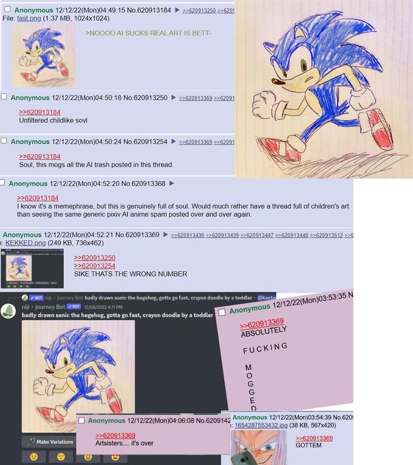

The more honest artists against AI will freely concede the point that images generated by AI can indeed look very impressive.<sup><a id="fnr.156" class="footref" href="#fn.156" role="doc-backlink">156</a></sup> AI is capable of executing techniques that either did not exist previously, or were certainly not widely known. The image-to-image technique allows artists to superimpose patterns that can be naturally filled in,<sup><a id="fnr.157" class="footref" href="#fn.157" role="doc-backlink">157</a></sup> creating a very unique effect. Can you honestly tell me that you saw such things as working QR codes integrated into a piece of art prior to the invention of these image-to-image systems? It is certainly possible for a human to do this on his lonesome, and perhaps it was done here and there&#x2014;but the pure speed and ease with which everyone is capable of experimenting with such techniques now dwarfs anything that has come before. Insofar as AI image generation is capable of producing works of a higher quality than the human alternative it is not only anti-human, but also anti-art to oppose this.

I do not doubt that just as photography inspired the impressionist movement, human artists will learn from and build upon these new aesthetic tools. When you have people being silenced for having art that is &ldquo;too similar&rdquo; to something that an AI might make,<sup><a id="fnr.158" class="footref" href="#fn.158" role="doc-backlink">158</a></sup> it becomes clear that whatever honest concerns about AI image generation there are have been quickly swamped by and swallowed up in a total assault on &ldquo;undesireable&rdquo; artists. The time it is taking for the anti-AI Stasi to evaluate whether your art is &ldquo;acceptable&rdquo; is quickly growing with every new iteration of these models: but in the words of Angela: &ldquo;if you can&rsquo;t tell, does it matter?&rdquo;<sup><a id="fnr.159" class="footref" href="#fn.159" role="doc-backlink">159</a></sup>

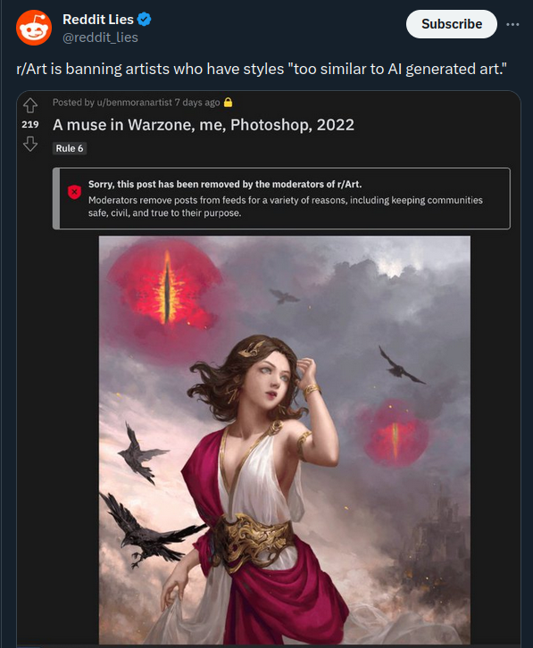

The cries from these artists to band together against AI ring particularly hollow when mere months ago the mob of twitter artists sought to ostracise and bully anyone who dared to monetise their work through the use of NFTs.<sup><a id="fnr.160" class="footref" href="#fn.160" role="doc-backlink">160</a></sup> It is rich to hear these people complaining about a computer program learning how to make art off of their backs immediately after the almost universal prevalence of &ldquo;haha, I just right-click saved your NFT dumbass!&rdquo; Let&rsquo;s even consider the artists-against-AI proposal that image models compensate artists when their art is used. Putting aside the nonsense claim that individual pieces of art are &ldquo;used&rdquo; to generate the images, as if it was photo-bashing or collage&#x2014;what these artists are asking for is for there to be a way to prove that they made a piece of art that is then used for further AI generations. Tell me: how is this at all dissimilar to what NFTs are? An NFT is a cryptographic token that allows you to prove that you produced some arbitrary data, such as an image or video. The ethical AI model that they champion is built on the back of the NFT technology they so dearly hate.<sup><a id="fnr.161" class="footref" href="#fn.161" role="doc-backlink">161</a></sup>


# IP For Me, but not For Thee

The anti-AI art crowd will laugh and jeer at the fact that AI generated comic book art was unable to be copyrighted by the author<sup><a id="fnr.162" class="footref" href="#fn.162" role="doc-backlink">162</a></sup>&#x2014;I celebrate this fact. All of these new and exciting creative tools could be left unmarred by the evil clutches of intellectual monopolies. The artists implicitly understand this&#x2014;the very popular task of creating fanart of different characters is a blatant violation of supposed intellectual property rights held by those companies who control those characters. You aren&rsquo;t going to be seeing any big-budget movie including a fanart character of Iron Man&#x2014;they would be sued into oblivion. Stop the double standard&#x2014;either you accept fanart and reject IP, or you reject fanart and accept IP. If you want to make the legalistic argument against AI that it infringes copyright, then I expect to see you in the trenches fighting against the massive copyright infringement coming from the fanart community.

Rebecca Blake of the Graphic Artists Guild tells us that Davinci&rsquo;s heirs shouldn&rsquo;t be compensated for re-productions of *The Mona Lisa* because he died more than 70 years ago.<sup><a id="fnr.163" class="footref" href="#fn.163" role="doc-backlink">163</a></sup> This is so blatantly an arbitrary standard&#x2014;the beginning and end of her ethical argument on any topic is &ldquo;gubmint said good, so it good,&rdquo; or &ldquo;gubmint said bad, so it bad.&rdquo; I would expect a more sophisticated moral philosophy from a three year old&#x2014;at least they can implicitly recognise that other kids snatching their toys is wrong, no matter what the grown-ups say about sharing.

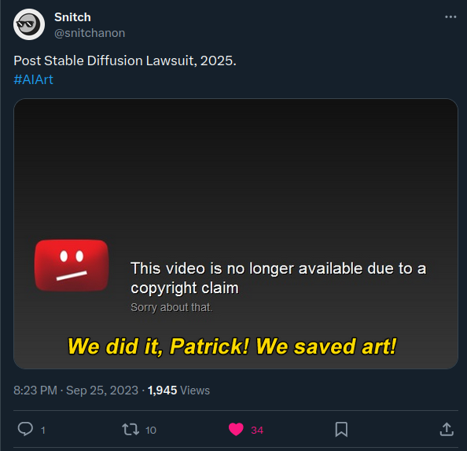

Just as the open source software community is able to create wonderful applications that a user is free to change to suit his purposes, we may be entering a golden age of free and open source artworks where budding creatives can build upon the prior body of knowledge without fear that Disney or Nintendo will strike them down with the hammer of uncle Sam. Small artists already act as if they don&rsquo;t have IP&#x2014;they watermark their work or send low resolution versions until they get paid for their commissions. I am yet to see Disney watermark any Marvel movies. IP helps only the large, established monopolists, and does nothing but hurt the creativity of those small, independent artists who champion its expansion.

The pro-IP artist wants it both ways&#x2014;IP for me but not for thee, as Lois van Baarle demonstrates:

> [&#x2026;] you know [&#x2026;] how Olivia Rodrigo had that song and then she had to [&#x2026;] credit *Paramore* as a song writer because it vaguely resembled a song that *Paramore* [made]. And I remember listening to it and being like: &ldquo;[&#x2026;] it&rsquo;s not the same song. It&rsquo;s *like* the song.&rdquo; If I could&#x2013;as an artist&#x2013;[&#x2026;] sue people whose work vaguely resembles mine, that would be like not only [&#x2026;] a lot of people but that would be cruel, because that would limit peoples creativity enormously and also my own because a lot of my work is deeply inspired by the work of other artists. So it&rsquo;s really interesting how that works, like in art it&rsquo;s quite broad&#x2014;you are allowed to mimic styles, *as a human*, humans are allowed to mimic styles, let&rsquo;s make a distinction between humans and robots.<sup><a id="fnr.164" class="footref" href="#fn.164" role="doc-backlink">164</a></sup>

So Lois recognises that IP is a force that is destructive of creativity, that preventing people from using the stylistic choices of others hinders the creation of art, but then she wishes that these same forces be applied over more arts than they currently apply to. Which is it? Is IP good or bad? You can&rsquo;t eat your cake and have it too, you must decide whether you want to prevent the use of similar artistic motifs and thereby attack the ability of artists to create, or allow this and thereby allow people to train AIs to do this task. There is a naked inconsistency in Lois&rsquo; view here, she realises that what she is advocating against actually places her on the side of the AI image generators, and decides that she will just arbitrarily particularise her argument. It very much strikes me that she was making this argument, which has been made by artists for countless years, and she catches herself realising that she forgot to download the new programming&#x2014;this argument would open the door for the AI defenders to demolish the plagiarism point. She must elucidate some relevant distinction between AI image generation and human artistry from which she derives her distinct ethics, else she is left with an irreconcilable contradiction in her view. We on the pro-AI side are often labelled as bootlickers for big corpo&#x2014;this is all whilst the anti-AI side are the ones who wish to expand IP helping some of the most powerful corporations on Earth. You can&rsquo;t rightly class yourselves as the underdogs fighting against the big and powerful, whilst championing for an expansion in the reach of the ever-powerful tentacles of The Mouse.

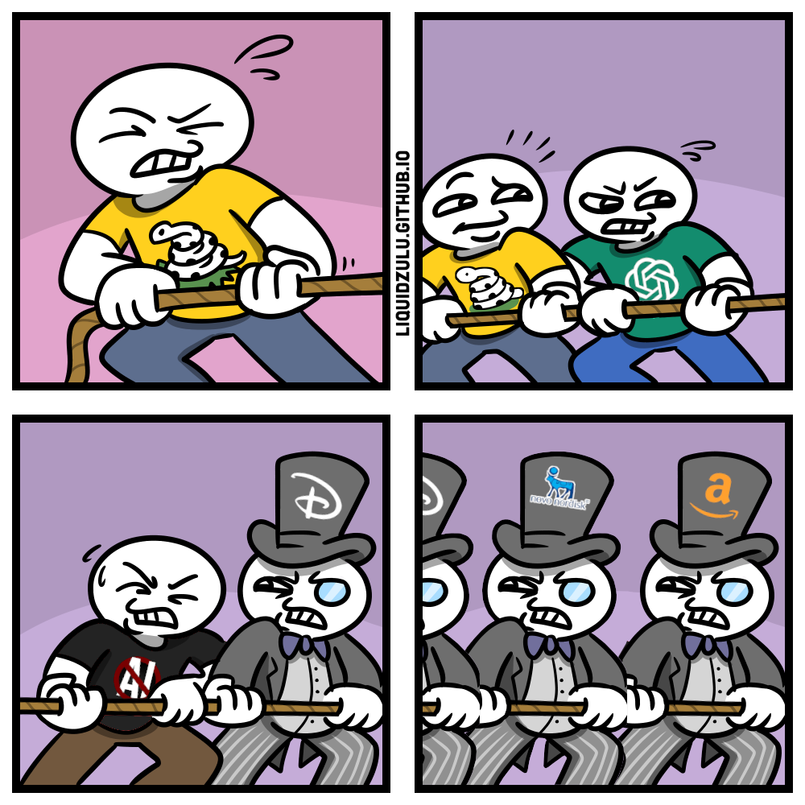

You should be able to see how this applies to the commonly cited &ldquo;gotcha!&rdquo; against Stable Diffusion&#x2014;that they deliberately avoided any copyrighted material in their music-generation AI because they were afraid of litigation. All this shows is that the music industry is more fully strangled and devoid of innovation&#x2014;that the visual artists wish to follow in their steps is very worrying. The truth is that as Lois correctly pointed out, the many abuses and evils we see in creative endeavours are caused by government intervention in the form of enforcing intellectual monopoly grants, and this makes it especially concerning that so many artists are calling for a government solution to this government problem. To learn more about this you have to watch this video<sup><a id="fnr.165" class="footref" href="#fn.165" role="doc-backlink">165</a></sup> where I explain that copyrights and patents are a moral evil that should be immediately and completely abolished.


# References

> &ldquo;Abandon all hope, ye who enter here.&rdquo;
> 
> &#x2014;Dante on watching anti-AI art videos

The following is a list of every video/article/blogpost/etc. that I made use of in the research for this video. I do not believe that I have missed any (apart from perhaps an errant tweet here and there, which are largely irrelevant). I make this available to you in case you wish to trace my intellectual lineage for whatever reason. A number of these have been either so repetetive of the general trend, or have been so uninformative, such that they have had zero impact on this script&#x2014;but I simply do not wish to search through and filter these out, so you get the whole hog.

-   Adam Duff LUCIDPIXUL, *AI ART ft: Istebrak, Steven Zapata, Hardy Fowler, Kelsey Rodriguez, Tyler Edlin & Antonio Stappaerts*, <https://www.youtube.com/watch?v=5JaS7APpO8U>
-   Adam Savage&rsquo;s Tested, *Adam Savage&rsquo;s Issue With A.I.-Generated Art*
-   Ana Isabel, *The (Concerning) Rise of A.I. Art*, <https://www.youtube.com/watch?v=lyrnWqQBYu0>
-   Aperture, *What Is Art?*, <https://www.youtube.com/watch?v=YIOb5_WCsOY>
-   Art Cafe, *AI and The Future of Art with Steven Zapata - Art Cafe #134*, <https://www.youtube.com/watch?v=qTB7tFZ2EFc>
-   Art Cafe, *Artist Authenticity vs AI with Sam Yang - Art Cafe #137*, <https://www.youtube.com/watch?v=hHIbAK_larY>
-   Art Cafe, *Prompt: In style of Greg Rutkowski - Art Cafe #139*, <https://www.youtube.com/watch?v=2SO9ZcI1ZDU>
-   Austin Green, *The Corridor Crew situation is a disaster*, <https://youtu.be/bOfrPh3OndM>
-   AustinMcConnell, *I used AI in a video. There was backlash.*, <https://www.youtube.com/watch?v=iRSg6gjOOWA>
-   Ayn Rand Institute, *Objectivism’s View of Art and Its Role in Man’s Life by Leonard Peikoff*, <https://www.youtube.com/watch?v=N8LKgPyCnY4>
-   Basement Picasso, *AI Art - Biggest advance, or the greatest theft that artists will ever see??*, <https://youtu.be/uuTlcApanHY>
-   Beard Wizard Man, *Thoughts on Shadiversity&rsquo;s AI &rsquo;Art&rsquo; Defense (Rant)*, <https://www.youtube.com/watch?v=GMAns9cTQJ0>
-   Bonsai Pop, *AI &ldquo;Anime&rdquo; -For Scum, By Scum (re: Corridor & Netflix, Mother&rsquo;s Basement)*, <https://www.youtube.com/watch?v=pkU2RmN2owg>
-   Carlini et al., *Extracting Training Data from Diffusion Models*
-   ChrissaBug, *A message to Artists coping with the mental health blow that AI art has dealt*, <https://www.youtube.com/watch?v=zx3ROK9nOYE>
-   Concept Art Association, *AI & Industry Town Hall featuring US Copyright Office*, <https://www.youtube.com/watch?v=7u1CeiSHqwY>
-   Concept Art Association, *AI Town hall hosted by Karla Ortiz & Concept Art Association*, <https://www.youtube.com/watch?v=LYO9sii1eKA>
-   Concept Art Association, *AI/ML Media Advocacy Summit Keynote: Steven Zapata*, <https://www.youtube.com/watch?v=puPJUbNiEKg>
-   Concept Art Association, *AI/ML Media Advocacy Summit: AI Ethics Panel*, <https://www.youtube.com/watch?v=lGq7S1q4T7c>
-   Corridor Crew, *Did We Just Change Animation Forever&#x2026; Again?*, <https://www.youtube.com/watch?v=FQ6z90MuURM>
-   Corridor Crew, *Is this AI Art, or is This Something New?*, <https://www.youtube.com/watch?v=mUFlOynaUyk>
-   Corridor Crew, *Lawyer Explains Stable Diffusion Lawsuit (Major Implications!)*, <https://www.youtube.com/watch?v=gv9cdTh8cUo>
-   Danar Worya *THE CREATIVE&rsquo;S VIEW on ART and A.I*, <https://www.youtube.com/watch?v=DeeRjUfVvG0>
-   DeviantRahll, *A Criticism of Shadiversity&rsquo;s &ldquo;AI Love Letter&rdquo;*, <https://www.youtube.com/watch?v=svsTKrdSd7s>
-   Draftsmen, *Why Be An Artist When There&rsquo;s AI? - Draftsmen S4E01*, <https://www.youtube.com/watch?v=lc-RX2AGGNA>
-   Duchess Celestia, *AI Art is BANNED in Video Games & Redbubble was CANCELLED (+More Art News!) || SPEEDPAINT+COMMENTARY*, <https://www.youtube.com/watch?v=xgnV-9lUdhU>
-   Duchess Celestia, *DeviantART Just Betrayed Its Whole Community. (DreamUp AI Controversy) || SPEEDPAINT + COMMENTARY*, <https://www.youtube.com/watch?v=IGj_3OhMrAU>
-   Duchess Celestia, *DeviantArt Cancelled AGAIN Over New Adoptables Feature || SPEEDPAINT + COMMENTARY*, <https://www.youtube.com/watch?v=gfYdebTqyEU>
-   Duchess Celestia, *Is Fixing Art EVER Okay? (Why Are Art Fixers Still Doing This?!) || SPEEDPAINT + COMMENTARY*, <https://www.youtube.com/watch?v=QZyfh0R41qk>
-   Duchess Celestia, *NO, AI Does NOT Democratize Art (And That&rsquo;s a Dumb Defense) || SPEEDPAINT + COMMENTARY*, <https://www.youtube.com/watch?v=lDtAL5IQRMc>
-   Duchess Celestia, *New AI Art SCAM is STEALING COMMISSIONS (+More AI Art News) || SPEEDPAINT + COMMENTARY*, <https://www.youtube.com/watch?v=AoO8NBZ4qSo>
-   Duchess Celestia, *Why Artists HATE AI Art! (And Why It’s NEVER Ethical) || SPEEDPAINT + COMMENTARY*, <https://www.youtube.com/watch?v=Jid6Pj17OBw>
-   Duchess Celestia, *Why SO MANY ARTISTS Are Burnt Out (Hustle Culture & The Art Community) || SPEEDPAINT + COMMENTARY*, <https://www.youtube.com/watch?v=5ElBbPAOxcI>
-   Duchess Celestia, *Why are Artists So TERRIFIED of AI Art? Is It Even REAL Art? || SPEEDPAINT + COMMENTARY*, <https://www.youtube.com/watch?v=Q7EjQiw5MhA>
-   Dustin Podell et al., *SDXL: Improving Latent Diffusion Models for High-Resolution Image Synthesis*, <https://arxiv.org/pdf/2307.01952.pdf>
-   Dylan Allman, *Artificially Intelligent, Genuinely Creative*, <https://interlinked.substack.com/p/9c3cc20c-0d77-4299-ae15-686710840ce7>
-   Eric Francisco, *Corridor Crew&rsquo;s AI-Generated Anime Isn&rsquo;t Just Callous and Craven &#x2014; It&rsquo;s Also Dangerous*, <https://www.inverse.com/entertainment/corridor-digital-ai-anime>
-   Erik Hoel, *AI-art isn&rsquo;t art*, <https://www.theintrinsicperspective.com/p/ai-art-isnt-art>
-   Ethan Becker, *3 STEPS TO INSTANTLY FIND YOUR STYLE| NEVER draw from IMAGINATION!*, <https://www.youtube.com/watch?v=NEvMHRgPdyk>
-   Evan Joseph-Riley, *Is This the Worst Thing to Happen to Art?*, <https://www.youtube.com/watch?v=y-fIGyD1f4Q>
-   FENNAH, *Responding to Shadiversity&rsquo;s &rsquo;Love Letter to ai Art&rsquo;*, <https://www.youtube.com/watch?v=D9GpKINVomo>
-   GCFLearnFree, *What is Art?*, <https://www.youtube.com/watch?v=QZQyV9BB50E>
-   GOTH ROSS, *DISRESPECTING KIM JUNG GI. THE LINE HAS BEEN CROSSED.*, <https://www.youtube.com/watch?v=7GxiQjTn12g>
-   GeorgeCrudo, *Zbrush and Chat! - AI Art and Shad*, <https://youtu.be/LXmFL7KulK8>
-   Greylock, *OpenAI CEO Sam Altman | AI for the Next Era*, <https://www.youtube.com/watch?v=WHoWGNQRXb0>
-   Grit, *I No Longer Like A.I.*, <https://www.youtube.com/watch?v=mkg0T2xSpvg>
-   Hello Future Me, *The AI Art Apocalypse*, <https://www.youtube.com/watch?v=9xJCzKdPyCo>
-   Jimmy McGee, *The AI Revolution is Rotten to the Core*, <https://www.youtube.com/watch?v=-MUEXGaxFDA>
-   Jonas Tyroller, *The Cr[AI]tive Revolution - The Future of Art (Full Documentary)*, <https://www.youtube.com/watch?v=rFr6Ltlr7kI>
-   KNIGHTS WATCH, *Reid Southen lies and gaslights attacking Shadiversity - REPLY*, <https://www.youtube.com/watch?v=7wmtk5ERBMg>
-   Kelsey Rodriguez, *Why I&rsquo;m not worried about AI ART* <https://www.youtube.com/watch?v=BsG2NDQC0kY>
-   KirkpattieCake, *Art is Hard. The Deceit, Egotism, and Jealousy of &ldquo;AI Art&rdquo; (ft. @shadiversity )*, <https://www.youtube.com/watch?v=dTR_k8ueAL0>
-   KnowsBestNever, *The War between Artists and AI*, <https://www.youtube.com/watch?v=S9zhDY6bf_o>
-   Kristian Nee, *The existential threat of AI art and why not to quit drawing - Sketchy Van Podcast #60 Steven Zapata*, <https://www.youtube.com/watch?v=OCY7lb_i0yM>
-   LegalEagle, *A.I. Versus The Law*, <https://www.youtube.com/watch?v=G08hY8dSrUY>
-   Leonard Peikoff, &ldquo;Chapter 12: Art,&rdquo; in id., *Objectivism: The Philosophy of Ayn Rand*
-   LioConvoy, *Discussing Shadiversity&rsquo;s AI Art Video*, <https://www.youtube.com/watch?v=4MEtqEU71Tg>
-   Living the Line, *DAVE McKEAN - Interview: AI Image-making and Its Implications*, <https://www.youtube.com/watch?v=I-PaCc96oQM>
-   MattVidPro AI, *Is AI Art Theft?*, <https://www.youtube.com/watch?v=KmYmbuL3Sbs>
-   Mother&rsquo;s Basement, *AI &ldquo;Anime&rdquo; - An Insult to Life Itself (re: Corridor & Netflix)*, <https://www.youtube.com/watch?v=GOwxXj1EIXM>
-   Our Painted Lives, *AI Debate with @StevenZapataArt*, <https://www.youtube.com/watch?v=XV1_lJZnqFE>
-   Outlier, *Diffusion Models | Paper Explanation | Math Explained*, <https://www.youtube.com/watch?v=HoKDTa5jHvg>
-   Patrick (H) Willems, *A.I. Filmmaking Is Not The Future. It&rsquo;s a Grift.*, <https://youtu.be/aC99lNQdNmA>
-   Philosophy Tube, *Here&rsquo;s What Ethical AI Really Means*, <https://www.youtube.com/watch?v=AaU6tI2pb3M>
-   Proko, *AI Ethics, Artists, and What You Can Do About It*, <https://www.youtube.com/watch?v=Nn_w3MnCyDY>
-   Proko, *What AI Developers Want Artists to Know about AI*, <https://www.youtube.com/watch?v=K_Bqq09Kaxk>
-   Royal Skies, *The Most Common Arguments For & Against AI*, <https://www.youtube.com/watch?v=F-i09Nz96cw>
-   Samuel Hamper, *Ai ART will get WORSE not better*, <https://www.youtube.com/watch?v=dGxPfb261C8>
-   Shadiversity, *A love letter to Ai art - you don&rsquo;t need to be afraid*, <https://www.youtube.com/watch?v=u_v9Gbw6kcU>
-   Shadiversity, *STOP THE LIES! - A.I. made art DOES NOT STEAL art! - Addressing the evidence*, <https://www.youtube.com/watch?v=7PszF9Upan8>
-   Sitch & Adam Show, *🔴The Great AI Art Debate! Talking To @Shadiversity and @S.FENNAH About The AI Art Controversy*, <https://www.youtube.com/watch?v=DI7PE2tjIxQ>
-   Solar Sands, *Doomed To Be Replaced: Is AI Art Theft?*, <https://www.youtube.com/watch?v=nIRbN52PA0o>
-   Solar Sands, *Doomed To Be Replaced: What Will AI Replace?*, <https://www.youtube.com/watch?v=VlbT4OshVLs>
-   Somepalli et al., *Diffusion Art or Digital Forgery? Investigating Data Replication in Diffusion Models*
-   Stanford HAI, *Creativity in the Age of AI: Artist Perspectives on AI, Copyright, & Future of Work*, <https://www.youtube.com/watch?v=y9wOvFihY74>
-   Steven Zapata Art, *Miles Johnston: Cheeky AI, The Total Set of Images, and Polite Revolution*, <https://www.youtube.com/watch?v=EqpWfYX7ou8>
-   Steven Zapata Art, *That KJG AI Is Disgusting, Turn It Off Ft. @AhmedAldoori*, <https://www.youtube.com/watch?v=H4t7Lc9-6kw>
-   Steven Zapata Art, *The End of Art: An Argument Against Image AIs*, <https://www.youtube.com/watch?v=tjSxFAGP9Ss>
-   Steven Zapata Art, *Why Dave Rapoza left Magic: The Gathering (it’s AI)*, <https://youtu.be/A8-nsFN-pWQ>
-   Subjectively,<sup><a id="fnr.166" class="footref" href="#fn.166" role="doc-backlink">166</a></sup> *We Have To Talk About AI Art&#x2026;*, <https://www.youtube.com/watch?v=Tcos1XBeKv8>
-   TEDx Talks, *The problem with AI-generated art | Steven Zapata | TEDxBerkeley*, <https://www.youtube.com/watch?v=exuogrLHyxQ>
-   The Andrew Price Podcast, *#26: AI&rsquo;s effect on Artists w/Finnian Macmanus*, <https://www.youtube.com/watch?v=34auSsWYx58>
-   The Andrew Price Podcast, *#31: Why Artists Shouldn’t Fear A.I, with Aaron Limonick*, <https://www.youtube.com/watch?v=cUzRWAr46TA>
-   The Andrew Price Podcast, *#36: Will AI replace artists?*, <https://www.youtube.com/watch?v=Ao5aV4I4Ivw>
-   The ArchCast, *The ArchCast Special! @Shadiversity Talking About AI In Art And Media*, <https://www.youtube.com/watch?v=bLWTUgW7Oq8>
-   The Art of Aaron Blaise, *Disney Animator REACTS to AI Animation!*, <https://www.youtube.com/watch?v=xm7BwEsdVbQ>
-   The Collective Podcast, *Ep. 235 - Steven Zapata*, <https://www.youtube.com/watch?v=GKnBSsoV1iE>
-   The ICE-CAST LIVE, *The A.I. Art Debate*, <https://www.youtube.com/watch?v=L5v7LUrZhFg>
-   The School of Life, *What is Art for?*, <https://www.youtube.com/watch?v=sn0bDD4gXrE>
-   This Is Why, *The ethics of AI art: is it plagiarism and should we be using it?*, <https://www.youtube.com/watch?v=gNtVek0xS5c>
-   Thumin, *Why Twitter Artists HATE AI Art&#x2026;!?*, <https://www.youtube.com/watch?v=SfPfoPx9zVc>
-   Totally Not Mark, *The Terrifying & Unethical World of AI Artwork (AI vs Artist)*, <https://www.youtube.com/watch?v=4aG47r7u6v0>
-   Trent Kaniuga, *ROASTING awful AI art.*, <https://www.youtube.com/watch?v=09mheiQIock>
-   Trent Kaniuga, *The END for concept artists? Will AI replace CONCEPT ARTISTS?*, <https://www.youtube.com/watch?v=LPYslj4GzS4>
-   Ultra Review Show, *In &ldquo;Defense&rdquo; of Shadiversity&rsquo;s AI Art*, <https://youtu.be/MiOYgE4dU7c>
-   Vox, *AI art, explained*, <https://www.youtube.com/watch?v=SVcsDDABEkM>
-   Vox, *An AI artist explains his workflow*, <https://www.youtube.com/watch?v=K0ldxCh3cnI>
-   Westside Tyler, *Watching Shadiversity Desperately Try To Defend AI Art (he fails)*, <https://youtu.be/UqN7cdzWzvU>
-   Wisecrack, *AI: The End of Art?*, <https://www.youtube.com/watch?v=l1QVwfpbXMQ>
-   bycloud, *How does AI REALLY Steal Art?*, <https://www.youtube.com/watch?v=GgU7CipUH38>
-   noagolden, *TOOLS DON&rsquo;T MAKE AN ARTIST - Response to Shadiversity*, <https://www.youtube.com/watch?v=LtJcIX2BPig>


# Footnotes

<sup><a id="fn.1" href="#fnr.1">1</a></sup> Ethan Becker, *3 STEPS TO INSTANTLY FIND YOUR STYLE| NEVER draw from IMAGINATION!*, <https://youtu.be/NEvMHRgPdyk?t=24>, t. 00:24

<sup><a id="fn.2" href="#fnr.2">2</a></sup> Concept Art Association, *AI Town hall hosted by Karla Ortiz & Concept Art Association*, <https://youtu.be/LYO9sii1eKA?t=628>, t. 10:28; Karla claims after this that she is &ldquo;over-simplifying&rdquo; the process but this is false&#x2014;she is not making it overly-simple, she is actually fundamentally misrepresenting what it is doing. &ldquo;Filling in the blanks&rdquo; is a simplification of what is happening&#x2014;this does not misrepresent what is fundamentally occurring.

<sup><a id="fn.3" href="#fnr.3">3</a></sup> Dustin Podell et al., *SDXL: Improving Latent Diffusion Models for High-Resolution Image Synthesis*, <https://arxiv.org/pdf/2307.01952.pdf>, Table 1

<sup><a id="fn.4" href="#fnr.4">4</a></sup> [Elephants weigh 15000 lbs](https://www.ifaw.org/journal/elephant-faq), 15000 / 25000 = 0.6; [0.6 lbs is ~270g](https://www.calculateme.com/weight/pounds/to-grams/0.6); [270g is in the range of a three-week old kitten](https://www.untamedcatfood.com/blogs/nutrition/kitten-weight-chart-kg).

<sup><a id="fn.5" href="#fnr.5">5</a></sup> Steven Zapata Art, *The End of Art: An Argument Against Image AIs*, <https://youtu.be/tjSxFAGP9Ss?t=1971>, t. 32:51

<sup><a id="fn.6" href="#fnr.6">6</a></sup> Mother&rsquo;s Basement, *AI &ldquo;Anime&rdquo; - An Insult to Life Itself (re: Corridor & Netflix)*, <https://youtu.be/GOwxXj1EIXM?t=359>, t. 05:59

<sup><a id="fn.7" href="#fnr.7">7</a></sup> See: Mother&rsquo;s Basement, *AI &ldquo;Anime&rdquo; - An Insult to Life Itself (re: Corridor & Netflix)*, <https://youtu.be/GOwxXj1EIXM?t=496>, t. 08:16

<sup><a id="fn.8" href="#fnr.8">8</a></sup> Jazza, *FIVERR Vs AI - Is this the END for ARTISTS?&#x2026;*, <https://youtu.be/5GO2xKmZsVo?t=706>, t. 11:46

<sup><a id="fn.9" href="#fnr.9">9</a></sup> Hello Future Me, *The AI Art Apocalypse*, <https://youtu.be/9xJCzKdPyCo?t=1292>, t. 21:32

<sup><a id="fn.10" href="#fnr.10">10</a></sup> This is the title of the chapter starting at 09:00 within Hello Future Me, *The AI Art Apocalypse*, <https://youtu.be/9xJCzKdPyCo>

<sup><a id="fn.11" href="#fnr.11">11</a></sup> Shadiversity, *The BIGGEST LIE about Ai ART*, <https://youtu.be/8eokIcRWzBo>

<sup><a id="fn.12" href="#fnr.12">12</a></sup> Adam Duff LUCIDPIXUL, *AI ART ft: Istebrak, Steven Zapata, Hardy Fowler, Kelsey Rodriguez, Tyler Edlin & Antonio Stappaerts*, <https://youtu.be/5JaS7APpO8U?t=1617>, t. 26:57

<sup><a id="fn.13" href="#fnr.13">13</a></sup> <https://c4sif.org/2010/12/galambos-and-other-nuts/>

<sup><a id="fn.14" href="#fnr.14">14</a></sup> Art Cafe, *AI and The Future of Art with Steven Zapata - Art Cafe #134*, <https://youtu.be/qTB7tFZ2EFc?t=8340>, t. 02:19:00

<sup><a id="fn.15" href="#fnr.15">15</a></sup> Art Cafe, *AI and The Future of Art with Steven Zapata - Art Cafe #134*, <https://youtu.be/qTB7tFZ2EFc?t=8899>, t. 02:28:19

<sup><a id="fn.16" href="#fnr.16">16</a></sup> Art Cafe, *AI and The Future of Art with Steven Zapata - Art Cafe #134*, <https://youtu.be/qTB7tFZ2EFc?t=8956>, t. 02:29:16

<sup><a id="fn.17" href="#fnr.17">17</a></sup> See: LiquidZulu, &ldquo;The Error of Conflating the Potential with the Actual,&rdquo; in id. *Brain*, <https://liquidzulu.github.io/brain/note/the-error-of-conflating-the-potential-with-the-actual>

<sup><a id="fn.18" href="#fnr.18">18</a></sup> [Steven Zapata script on the Library of Babel](https://libraryofbabel.info/bookmark.cgi?library_of_babel_steven_zapata_script) (<https://archive.ph/PNlEF>)

<sup><a id="fn.19" href="#fnr.19">19</a></sup> Steven Zapata Art, *Miles Johnston: Cheeky AI, The Total Set of Images, and Polite Revolution*, <https://youtu.be/EqpWfYX7ou8?t=190>, t. 3:10

<sup><a id="fn.20" href="#fnr.20">20</a></sup> Steven Zapata Art, *Miles Johnston: Cheeky AI, The Total Set of Images, and Polite Revolution*, <https://youtu.be/EqpWfYX7ou8?t=3033>, t. 50:33

<sup><a id="fn.21" href="#fnr.21">21</a></sup> See: Lindybeige, *Forests in the olden days*, <https://www.youtube.com/watch?v=zVPUFMwm73Y>

<sup><a id="fn.22" href="#fnr.22">22</a></sup> Adam Duff LUCIDPIXUL, *AI ART ft: Istebrak, Steven Zapata, Hardy Fowler, Kelsey Rodriguez, Tyler Edlin & Antonio Stappaerts*, <https://youtu.be/5JaS7APpO8U?t=6282>, t. 01:44:42

<sup><a id="fn.23" href="#fnr.23">23</a></sup> This argument in particular is attacked later, in [AI Took Our Jerbs!](#orgaede0ea)

<sup><a id="fn.24" href="#fnr.24">24</a></sup> Solar Sands, *Doomed To Be Replaced: Is AI Art Theft?*, <https://youtu.be/nIRbN52PA0o?t=1430>, t. 23:50

<sup><a id="fn.25" href="#fnr.25">25</a></sup> Zapata mentions this in: Our Painted Lives, *AI Debate with @StevenZapataArt*, <https://youtu.be/XV1_lJZnqFE?t=2288> t. 38:08; but he is using it for a completely separate argument.

<sup><a id="fn.26" href="#fnr.26">26</a></sup> Somepalli et al., *Diffusion Art or Digital Forgery? Investigating Data Replication in Diffusion Models*

<sup><a id="fn.27" href="#fnr.27">27</a></sup> <https://laion.ai/blog/laion-5b/>, <https://archive.ph/GNFeM>

<sup><a id="fn.28" href="#fnr.28">28</a></sup> Somepalli et al., *Diffusion Art or Digital Forgery? Investigating Data Replication in Diffusion Models*, fig. 1 caption.

<sup><a id="fn.29" href="#fnr.29">29</a></sup> Concept Art Association, *AI & Industry Town Hall featuring US Copyright Office*, <https://youtu.be/7u1CeiSHqwY?t=1244>, t. 20:44

<sup><a id="fn.30" href="#fnr.30">30</a></sup> Diffusion models in general are relatively very new&#x2014;there is no reasonable doubt that future models will be even less prone to over-fitting than current ones.

<sup><a id="fn.31" href="#fnr.31">31</a></sup> Carlini et al., *Extracting Training Data from Diffusion Models*

<sup><a id="fn.32" href="#fnr.32">32</a></sup> Carlini et al., *Extracting Training Data from Diffusion Models*, &ldquo;We now extract training data from Stable Diffusion: the largest and most popular open-source diffusion model [58]. This model is an 890 million parameter text-conditioned diffusion model trained on **160 million images**.&rdquo;

<sup><a id="fn.33" href="#fnr.33">33</a></sup> 1,000,000 \* 0.00128 = 204,800

<sup><a id="fn.34" href="#fnr.34">34</a></sup> From Carlini et al., *Extracting Training Data from Diffusion Models* (emphasis added): &ldquo;In both cases, we assume that an adversary who attacks a conditional image generator **knows the captions for some images in the training set**&#x2014;thus allowing us to study the **worst-case** privacy risk in diffusion models. [&#x2026;] Figure 5 shows the results of this analysis. While we identify little Eidetic memorization for $k < 100$, this is expected due to the fact **we choose prompts of highly-duplicated images**. Note that at this level of duplication, the duplicated examples still make up just one in a million training examples. These results show that duplication is a major factor behind training data extraction. [&#x2026;] We follow the same procedure as earlier but focus on the **top-1000 most duplicated prompts** for computational reasons.&rdquo;

<sup><a id="fn.35" href="#fnr.35">35</a></sup> <https://haveibeentrained.com/>

<sup><a id="fn.36" href="#fnr.36">36</a></sup> For the curious, I would warn against looking this individual up&#x2014;it seems they make quite a lot of furry pornography.

<sup><a id="fn.37" href="#fnr.37">37</a></sup> DeviantRahll, *A Criticism of Shadiversity&rsquo;s &ldquo;AI Love Letter&rdquo;*, <https://youtu.be/svsTKrdSd7s?t=252>, t. 04:12

<sup><a id="fn.38" href="#fnr.38">38</a></sup> Complaint at 3, Getty Images (US), Inc. v. Stability AI, Inc. (D. Del. 2023), <https://copyrightlately.com/pdfviewer/getty-images-v-stability-ai-complaint/?auto_viewer=true#page=&zoom=auto&pagemode=none>

<sup><a id="fn.39" href="#fnr.39">39</a></sup> James Vincent, *Getty Images sues AI art generator Stable Diffusion in the US for copyright infringement*, <https://www.theverge.com/2023/2/6/23587393/ai-art-copyright-lawsuit-getty-images-stable-diffusion> ([archived](https://archive.ph/zNwP7)).

<sup><a id="fn.40" href="#fnr.40">40</a></sup> See: Drew Gooden, *I&rsquo;m Disappointed*, <https://youtu.be/Vz8X2bhyNnE?t=282>, t. 04:42

<sup><a id="fn.41" href="#fnr.41">41</a></sup> See: MattVidPro AI, *Is AI Art Theft?*, <https://www.youtube.com/watch?v=KmYmbuL3Sbs>, t. 02:32, ibid., t. 17:52

<sup><a id="fn.42" href="#fnr.42">42</a></sup> Beard Wizard Man further notes that most of the big art-hosting websites do not have such clauses, see: id., *Thoughts on Shadiversity&rsquo;s AI &rsquo;Art&rsquo; Defense (Rant)*, <https://youtu.be/GMAns9cTQJ0?t=1227>, t. 20:27

<sup><a id="fn.43" href="#fnr.43">43</a></sup> Consider the case of a contract that contains microscopic text&#x2014;surely this text would not bind the person, they cannot agree to it if they have never even considered it.

<sup><a id="fn.44" href="#fnr.44">44</a></sup> This is from Solar Sands, *Doomed To Be Replaced: Is AI Art Theft?*, <https://youtu.be/nIRbN52PA0o?t=1545>, t. 25:45; &ldquo;Those who develop AI should do so in the most legal and ethical way possible; AI systems and the value they create cannot exist without the data of artists&rsquo; work; therefore artists should be compensated and ask for their permission before the work is used.&rdquo;

<sup><a id="fn.45" href="#fnr.45">45</a></sup> Adam Duff LUCIDPIXUL, *AI ART ft: Istebrak, Steven Zapata, Hardy Fowler, Kelsey Rodriguez, Tyler Edlin & Antonio Stappaerts*, <https://youtu.be/5JaS7APpO8U?t=6111>, t. 01:41:51

<sup><a id="fn.46" href="#fnr.46">46</a></sup> Art Cafe, *Artist Authenticity vs AI with Sam Yang - Art Cafe #137*, <https://youtu.be/hHIbAK_larY?t=2941>, t. 49:01

<sup><a id="fn.47" href="#fnr.47">47</a></sup> Danar Worya, *THE CREATIVE&rsquo;S VIEW on ART and A.I*, <https://youtu.be/DeeRjUfVvG0?t=395>, t. 06:35

<sup><a id="fn.48" href="#fnr.48">48</a></sup> See: The Collective Podcast, *Ep. 235 - Steven Zapata*, <https://youtu.be/GKnBSsoV1iE?t=9382>, t. 02:36:22

<sup><a id="fn.49" href="#fnr.49">49</a></sup> Danar Worya, *THE CREATIVE&rsquo;S VIEW on ART and A.I*, <https://youtu.be/DeeRjUfVvG0?t=2110>, t. 35:10

<sup><a id="fn.50" href="#fnr.50">50</a></sup> See: Frédéric Bastiat, *That Which Is Seen and that Which Is Not Seen*, <https://fee.org/resources/that-which-is-seen-and-that-which-is-not-seen>

<sup><a id="fn.51" href="#fnr.51">51</a></sup> If the work was less productive then they would not need the protectionism&#x2014;capital naturally flows towards the most efficient lines of production on the market. See: Ludwig von Mises, *Economic Calculation in the Socialist Commonwealth*

<sup><a id="fn.52" href="#fnr.52">52</a></sup> Concept Art Association, *AI/ML Media Advocacy Summit: AI Ethics Panel*, <https://youtu.be/lGq7S1q4T7c?t=81>

<sup><a id="fn.53" href="#fnr.53">53</a></sup> FENNAH, *Responding to Shadiversity&rsquo;s &rsquo;Love Letter to ai Art&rsquo;*, <https://youtu.be/D9GpKINVomo?t=5503>, t. 01:31:43

<sup><a id="fn.54" href="#fnr.54">54</a></sup> Duchess Celestia, *NO, AI Does NOT Democratize Art (And That&rsquo;s a Dumb Defense) || SPEEDPAINT + COMMENTARY*, <https://youtu.be/lDtAL5IQRMc?t=578>, t. 09:38

<sup><a id="fn.55" href="#fnr.55">55</a></sup> Concept Art Association, *AI/ML Media Advocacy Summit: AI Ethics Panel*, <https://youtu.be/lGq7S1q4T7c?t=2040>

<sup><a id="fn.56" href="#fnr.56">56</a></sup> <https://youtu.be/iRSg6gjOOWA?t=915>; <https://www.polygon.com/23767640/ai-mcu-secret-invasion-opening-credits> (<https://archive.ph/CC6c6>)

<sup><a id="fn.57" href="#fnr.57">57</a></sup> Murray Rothbard, *Protectionism and the Destruction of Prosperity*

<sup><a id="fn.58" href="#fnr.58">58</a></sup> See KirkpattieCake, *Art is Hard. The Deceit, Egotism, and Jealousy of &ldquo;AI Art&rdquo; (ft. @shadiversity )*, <https://www.youtube.com/watch?v=dTR_k8ueAL0>

<sup><a id="fn.59" href="#fnr.59">59</a></sup> See Istebrak speaking here: Adam Duff LUCIDPIXUL, *AI ART ft: Istebrak, Steven Zapata, Hardy Fowler, Kelsey Rodriguez, Tyler Edlin & Antonio Stappaerts*, <https://youtu.be/5JaS7APpO8U?t=1037>, t. 17:17

<sup><a id="fn.60" href="#fnr.60">60</a></sup> Warning, this video contains vulgar visuals of the host dressed in nothing but fishnets: Philosophy Tube, *Here&rsquo;s What Ethical AI Really Means*, <https://youtu.be/AaU6tI2pb3M?t=1665>, t. 27:45

<sup><a id="fn.61" href="#fnr.61">61</a></sup> Philosophy Tube, *Here&rsquo;s What Ethical AI Really Means*, <https://youtu.be/AaU6tI2pb3M?t=3078>, t. 51:18

<sup><a id="fn.62" href="#fnr.62">62</a></sup> Adam Duff LUCIDPIXUL, *AI ART ft: Istebrak, Steven Zapata, Hardy Fowler, Kelsey Rodriguez, Tyler Edlin & Antonio Stappaerts*, <https://youtu.be/5JaS7APpO8U?t=4762>, t. 01:19:22

<sup><a id="fn.63" href="#fnr.63">63</a></sup> Adam Duff LUCIDPIXUL, *AI ART ft: Istebrak, Steven Zapata, Hardy Fowler, Kelsey Rodriguez, Tyler Edlin & Antonio Stappaerts*, <https://youtu.be/5JaS7APpO8U?t=5287>, t. 01:28:07

<sup><a id="fn.64" href="#fnr.64">64</a></sup> Concept Art Association, *AI/ML Media Advocacy Summit: AI Ethics Panel*, <https://youtu.be/lGq7S1q4T7c?t=3241>, t. 54:01

<sup><a id="fn.65" href="#fnr.65">65</a></sup> Concept Art Association, *AI/ML Media Advocacy Summit: AI Ethics Panel*, <https://youtu.be/lGq7S1q4T7c?t=4272>, t. 01:11:12

<sup><a id="fn.66" href="#fnr.66">66</a></sup> Concept Art Association, *AI/ML Media Advocacy Summit: AI Ethics Panel*, <https://youtu.be/lGq7S1q4T7c?t=3480>, t. 58:00

<sup><a id="fn.67" href="#fnr.67">67</a></sup> Proko, *AI Ethics, Artists, and What You Can Do About It*, <https://youtu.be/Nn_w3MnCyDY?t=1031>, t. 17:11

<sup><a id="fn.68" href="#fnr.68">68</a></sup> Proko, *AI Ethics, Artists, and What You Can Do About It*, <https://youtu.be/Nn_w3MnCyDY?t=1039>, t. 17:19

<sup><a id="fn.69" href="#fnr.69">69</a></sup> <https://twitter.com/evanjconrad/status/1707187112481530149>

<sup><a id="fn.70" href="#fnr.70">70</a></sup> Proko, *What AI Developers Want Artists to Know about AI*, <https://youtu.be/K_Bqq09Kaxk?t=3805>, t. 01:03:25

<sup><a id="fn.71" href="#fnr.71">71</a></sup> See: Steven Zapata Art, *The End of Art: An Argument Against Image AIs*, t. 2:17, &ldquo;[&#x2026;] horrendous oversights and anti-humanist values [&#x2026;];&rdquo; ibid., t. 4:12, &ldquo;[&#x2026;] opportunistic collection and exploitation [&#x2026;];&rdquo; ibid., t. 12:04, &ldquo;[&#x2026;] the goal here is avoiding accountability and legal liability through tricky data laundering [&#x2026;];&rdquo; ibid., t. 27:49, &ldquo;[&#x2026;] the people making these things [&#x2026;] need you to feel worthless [&#x2026;];&rdquo; ibid., t. 38:11, &ldquo;[&#x2026;] baffling double-standard [&#x2026;];&rdquo; ibid., t. 38:21, &ldquo;[&#x2026;] bad faith towards visual artists and the callous belief that it is OK to trample them in particular [&#x2026;];&rdquo; ibid., t. 45:34, &ldquo;[&#x2026;] their chosen path [seems], in the most charitable interpretation, thoughtless [&#x2026;];&rdquo; ibid., t. 47:11, &ldquo;[&#x2026;] wholesale theft of our creative labour.&rdquo;

<sup><a id="fn.72" href="#fnr.72">72</a></sup> KNIGHTS WATCH, *Reid Southen lies and gaslights attacking Shadiversity - REPLY*, <https://youtu.be/7wmtk5ERBMg?t=4989>, t. 01:23:09

<sup><a id="fn.73" href="#fnr.73">73</a></sup> Duchess Celestia, *NO, AI Does NOT Democratize Art (And That&rsquo;s a Dumb Defense) || SPEEDPAINT + COMMENTARY*, <https://youtu.be/lDtAL5IQRMc?t=231>, t. 03:51

<sup><a id="fn.74" href="#fnr.74">74</a></sup> Duchess Celestia, *New AI Art SCAM is STEALING COMMISSIONS (+More AI Art News) || SPEEDPAINT + COMMENTARY*, <https://youtu.be/AoO8NBZ4qSo?t=282>, t. 04:42

<sup><a id="fn.75" href="#fnr.75">75</a></sup> On this, see also: ChrissaBug, *A message to Artists coping with the mental health blow that AI art has dealt*, <https://youtu.be/zx3ROK9nOYE>; she explains that the video is about an &ldquo;existential crisis&rdquo; [01:12] about not knowing what to do &ldquo;career-wise,&rdquo; [01:59] but that she also &ldquo;started out [&#x2026;] being pretty open minded to [it].&rdquo; [01:32]

<sup><a id="fn.76" href="#fnr.76">76</a></sup> Proko, *AI Ethics, Artists, and What You Can Do About It*, <https://youtu.be/Nn_w3MnCyDY?t=4980>, t. 01:23:00

<sup><a id="fn.77" href="#fnr.77">77</a></sup> Proko, *AI Ethics, Artists, and What You Can Do About It*, <https://youtu.be/Nn_w3MnCyDY?t=3373>, t. 56:13

<sup><a id="fn.78" href="#fnr.78">78</a></sup> Duchess Celestia, *Why Artists HATE AI Art! (And Why It’s NEVER Ethical) || SPEEDPAINT + COMMENTARY*, <https://youtu.be/Jid6Pj17OBw?t=963>, t. 16:03

<sup><a id="fn.79" href="#fnr.79">79</a></sup> Roark&rsquo;s speech in Ayn Rand, *The Fountainhead*, p. 602

<sup><a id="fn.80" href="#fnr.80">80</a></sup> <https://www.youtube.com/watch?v=l1QVwfpbXMQ&lc=Ugx2k1YLQmYJtHXImGJ4AaABAg>

<sup><a id="fn.81" href="#fnr.81">81</a></sup> Concept Art Association, *AI/ML Media Advocacy Summit: AI Ethics Panel*, <https://youtu.be/lGq7S1q4T7c?t=2830>, t. 47:10

<sup><a id="fn.82" href="#fnr.82">82</a></sup> <https://glaze.cs.uchicago.edu/>

<sup><a id="fn.83" href="#fnr.83">83</a></sup> Concept Art Association, *AI/ML Media Advocacy Summit: AI Ethics Panel*, <https://youtu.be/lGq7S1q4T7c?t=3264>, t. 54:24

<sup><a id="fn.84" href="#fnr.84">84</a></sup> Draftsmen, *Why Be An Artist When There&rsquo;s AI? - Draftsmen S4E01*, <https://youtu.be/lc-RX2AGGNA?t=3632>, t. 01:00:32

<sup><a id="fn.85" href="#fnr.85">85</a></sup> See: Tom Scott, *YouTubers have to declare ads. Why doesn&rsquo;t anyone else?*, <https://youtu.be/L-x8DYTOv7w?t=311>, t. 05:11

<sup><a id="fn.86" href="#fnr.86">86</a></sup> See: Westside Tyler, *This AI Bro is Clueless!! | Video Breakdown part 2/3*, <https://youtu.be/_v0GoGeBKtA?t=225>, t. 03:45

<sup><a id="fn.87" href="#fnr.87">87</a></sup> See: Westside Tyler, *Austin McConnell&rsquo;s TERRIBLE AI Apologia Video | Video Breakdown part 1/3*, <https://youtu.be/fdCB22pExHI?t=1834>, t. 30:34

<sup><a id="fn.88" href="#fnr.88">88</a></sup> See: Westside Tyler, *Austin McConnell&rsquo;s TERRIBLE AI Apologia Video | Video Breakdown part 1/3*, <https://youtu.be/fdCB22pExHI?t=2792>, t. 46:32

<sup><a id="fn.89" href="#fnr.89">89</a></sup> Erik Hoel, *AI-art isn&rsquo;t art*, <https://www.theintrinsicperspective.com/p/ai-art-isnt-art>

<sup><a id="fn.90" href="#fnr.90">90</a></sup> Steven Zapata Art, *The End of Art: An Argument Against Image AIs*, <https://youtu.be/tjSxFAGP9Ss?t=1729>, t. 28:49

<sup><a id="fn.91" href="#fnr.91">91</a></sup> Living the Line, *DAVE McKEAN - Interview: AI Image-making and Its Implications*, <https://youtu.be/I-PaCc96oQM?t=5997>, t. 01:39:57

<sup><a id="fn.92" href="#fnr.92">92</a></sup> Steven Zapata Art, *The End of Art: An Argument Against Image AIs*, <https://youtu.be/tjSxFAGP9Ss?t=930>, t. 15:30

<sup><a id="fn.93" href="#fnr.93">93</a></sup> Art Cafe, *AI and The Future of Art with Steven Zapata - Art Cafe #134*, <https://youtu.be/qTB7tFZ2EFc?t=8670>, t. 02:24:30

<sup><a id="fn.94" href="#fnr.94">94</a></sup> Charles Baudelaire (1859), *On Photography*, <https://www.csus.edu/indiv/o/obriene/art109/readings/11%20baudelaire%20photography.htm>, ([archived](https://archive.ph/36k1O))

<sup><a id="fn.95" href="#fnr.95">95</a></sup> Art Cafe, *AI and The Future of Art with Steven Zapata - Art Cafe #134*, <https://youtu.be/qTB7tFZ2EFc?t=6050>, t. 01:40:50

<sup><a id="fn.96" href="#fnr.96">96</a></sup> Steven Zapata Art, *Miles Johnston: Cheeky AI, The Total Set of Images, and Polite Revolution*, <https://youtu.be/EqpWfYX7ou8?t=2732>, t. 45:32

<sup><a id="fn.97" href="#fnr.97">97</a></sup> Kelsey Rodriguez, *Why I&rsquo;m not worried about AI ART*, <https://youtu.be/BsG2NDQC0kY?t=537>, t. 08:57

<sup><a id="fn.98" href="#fnr.98">98</a></sup> Shadiversity, *A love letter to Ai art - you don&rsquo;t need to be afraid*, <https://youtu.be/u_v9Gbw6kcU?t=361>, t. 06:01

<sup><a id="fn.99" href="#fnr.99">99</a></sup> AustinMcConnell, *The Spider-Queen - Chapter 1*, <https://www.youtube.com/watch?v=kJCkHae1dgE>

<sup><a id="fn.100" href="#fnr.100">100</a></sup> Art Cafe, *Artist Authenticity vs AI with Sam Yang - Art Cafe #137*, <https://youtu.be/hHIbAK_larY?t=3693>, t. 01:01:33

<sup><a id="fn.101" href="#fnr.101">101</a></sup> See: Bonsai Pop, *AI &ldquo;Anime&rdquo; -For Scum, By Scum (re: Corridor & Netflix, Mother&rsquo;s Basement)*, <https://youtu.be/pkU2RmN2owg?t=622>, t. 10:22, &ldquo;there&rsquo;s [sic] so many philosophical questions about what is the value of art, **and I don&rsquo;t have an answer to that**. But I think you know like a lot of people say [that] art is in the eye of the beholder **but what I definitely can say is that AI art is not art**.&rdquo;&#x2014;he doesn&rsquo;t know what art is and yet he can &ldquo;definitely&rdquo; say that &ldquo;AI art is not art.&rdquo; It is also not uncommon to encounter some tortured mess of a theory of art that&#x2013;ironically&#x2013;appears to have been conjured by a process of mixing together various half-baked and out-of-context ideas that have been rattling around the constricted space that is the brain of the person in question (a favourite of such theorists is seemingly-randomly sprinkled Marxism *à la* Ellsworth Toohey): The Canvas, *No, Ai &ldquo;Art&rdquo; is not Art.*, <https://www.youtube.com/watch?v=ESZO-XJZr0s>. No such theory that I have come across in my extensive research has had even an attempt made to integrate it with some broader philosophy, and they may all therefore be discarded out of hand until such a reconciliation actually occurs.

<sup><a id="fn.102" href="#fnr.102">102</a></sup> Leonard Peikoff, *Objectivism: The Philosophy of Ayn Rand*, Meridian (1991), pp. 30-31

<sup><a id="fn.103" href="#fnr.103">103</a></sup> Leonard Peikoff, &ldquo;Art as a Concretization of Metaphysics,&rdquo; in id., *Objectivism: The Philosophy of Ayn Rand*, Meridian (1991), p. 414

<sup><a id="fn.104" href="#fnr.104">104</a></sup> Leonard Peikoff, &ldquo;Art as a Concretization of Metaphysics,&rdquo; in id., *Objectivism: The Philosophy of Ayn Rand*, Meridian (1991), p. 417

<sup><a id="fn.105" href="#fnr.105">105</a></sup> Leonard Peikoff, &ldquo;Art as a Concretization of Metaphysics,&rdquo; in id., *Objectivism: The Philosophy of Ayn Rand*, Meridian (1991), p. 416

<sup><a id="fn.106" href="#fnr.106">106</a></sup> Leonard Peikoff, &ldquo;Art as a Concretization of Metaphysics,&rdquo; in id., *Objectivism: The Philosophy of Ayn Rand*, Meridian (1991), pp. 419-420

<sup><a id="fn.107" href="#fnr.107">107</a></sup> Leonard Peikoff, &ldquo;Esthetic Value as Objective,&rdquo; in id., *Objectivism: The Philosophy of Ayn Rand*, Meridian (1991), p. 438

<sup><a id="fn.108" href="#fnr.108">108</a></sup> Leonard Peikoff, &ldquo;Esthetic Value as Objective,&rdquo; in id., *Objectivism: The Philosophy of Ayn Rand*, Meridian (1991), pp. 440-441

<sup><a id="fn.109" href="#fnr.109">109</a></sup> Ayn Rand, &ldquo;The Goal of My Writing,&rdquo; in ead., *The Romantic Manifesto*

<sup><a id="fn.110" href="#fnr.110">110</a></sup> Leonard Peikoff, &ldquo;Esthetic Value as Objective,&rdquo; in id., *Objectivism: The Philosophy of Ayn Rand*, Meridian (1991), pp. 443-444

<sup><a id="fn.111" href="#fnr.111">111</a></sup> Leonard Peikoff, &ldquo;Esthetic Value as Objective,&rdquo; in id., *Objectivism: The Philosophy of Ayn Rand*, Meridian (1991), pp. 444-445

<sup><a id="fn.112" href="#fnr.112">112</a></sup> Ayn Rand, &ldquo;Art and Cognition,&rdquo; in ead., *The Romantic Manifesto*

<sup><a id="fn.113" href="#fnr.113">113</a></sup> Leonard Peikoff, &ldquo;Esthetic Value as Objective,&rdquo; in id., *Objectivism: The Philosophy of Ayn Rand*, p. 446

<sup><a id="fn.114" href="#fnr.114">114</a></sup> Tolstoy, *What is Art?*; no pagination exists on the version that I have.

<sup><a id="fn.115" href="#fnr.115">115</a></sup> The ICE-CAST LIVE, *The A.I. Art Debate*, <https://youtu.be/L5v7LUrZhFg>, t. 31:31

<sup><a id="fn.116" href="#fnr.116">116</a></sup> Erik Hoel, *AI-art isn&rsquo;t art*, <https://www.theintrinsicperspective.com/p/ai-art-isnt-art>

<sup><a id="fn.117" href="#fnr.117">117</a></sup> Out of a seemingly random selection of five artists, all five agree with Duchamp: <https://www.artgallery.nsw.gov.au/artboards/duchamp/five-questions-on-duchamp/> (<https://archive.ph/OQiam>); &ldquo;**Duchamp said ‘anything is art if an artist says it is’. Do you agree?**&rdquo;---**Richard Tipping**: &ldquo;Duchamp’s &lsquo;anything is art if the artist says it is&rsquo; **is true** because art cannot be constrained by existing definitions and constantly reinvents itself.&rdquo;---**Jaime Tsai**: &ldquo;**Definitely!** His attempt to exhibit a urinal as a sculpture (Fountain, 1917) proved that the original significance of an object can disappear under a new title and point of view if the artist determines it to be art.&rdquo;---**Kevin Platt**: &ldquo;**Sure**, but though this sentiment revolutionised art, I think it’s still **hard for people within and outside of art to accept**.&rdquo;---**Tom Picton-Warlow**: &ldquo;**Yes**. Marcel Duchamp’s readymades are what he is most famous for and as his friend Monique Fong noted: &lsquo;Marcel Duchamp recognised later in life … that the readymades are what changed art (for the better and for the worse)&rsquo;. Duchamp saw chess as art and all chess players as artists.&rdquo;---**India Urwin**: &ldquo;I love how empowering this idea is. Duchamp’s philosophy encourages artists to be tastemakers – it gives them licence to challenge preconceived ideas about what art is or should be. Duchamp said **anything can be art, and now we have to prove that anyone can be an artist**.&rdquo;

<sup><a id="fn.118" href="#fnr.118">118</a></sup> Kristian Nee, *The existential threat of AI art and why not to quit drawing - Sketchy Van Podcast #60 Steven Zapata*, <https://youtu.be/OCY7lb_i0yM?t=1623>, t. 27:03

<sup><a id="fn.119" href="#fnr.119">119</a></sup> Kristian Nee, *The existential threat of AI art and why not to quit drawing - Sketchy Van Podcast #60 Steven Zapata*, <https://youtu.be/OCY7lb_i0yM?t=3706>, t. 01:01:46

<sup><a id="fn.120" href="#fnr.120">120</a></sup> LioConvoy, *Discussing Shadiversity&rsquo;s AI Art Video*, <https://youtu.be/4MEtqEU71Tg?t=2290>, t. 38:11

<sup><a id="fn.121" href="#fnr.121">121</a></sup> Duchess Celestia, *NO, AI Does NOT Democratize Art (And That&rsquo;s a Dumb Defense) || SPEEDPAINT + COMMENTARY*, <https://youtu.be/lDtAL5IQRMc?t=578>, t. 09:38

<sup><a id="fn.122" href="#fnr.122">122</a></sup> FENNAH, *Responding to Shadiversity&rsquo;s &rsquo;Love Letter to ai Art&rsquo;*, <https://youtu.be/D9GpKINVomo?t=1160>, t. 19:20

<sup><a id="fn.123" href="#fnr.123">123</a></sup> FENNAH, *Responding to Shadiversity&rsquo;s &rsquo;Love Letter to ai Art&rsquo;*, <https://youtu.be/D9GpKINVomo?t=1459>, t. 24:19

<sup><a id="fn.124" href="#fnr.124">124</a></sup> <https://twitter.com/pascalblanche/status/1523780470001266689> (<https://archive.ph/CLogG>)

<sup><a id="fn.125" href="#fnr.125">125</a></sup> Draftsmen, *Why Be An Artist When There&rsquo;s AI? - Draftsmen S4E01*, <https://youtu.be/lc-RX2AGGNA?t=2884>, t. 48:04

<sup><a id="fn.126" href="#fnr.126">126</a></sup> Trent Kaniuga, *The END for concept artists? Will AI replace CONCEPT ARTISTS?*, <https://youtu.be/LPYslj4GzS4?t=319>, t. 05:19

<sup><a id="fn.127" href="#fnr.127">127</a></sup> Will Knight, *When AI Makes Art, Humans Supply the Creative Spark*, <https://www.wired.com/story/when-ai-makes-art/> ([archived](https://archive.ph/8ATKK)).

<sup><a id="fn.128" href="#fnr.128">128</a></sup> The Art of Aaron Blaise, *Disney Animator REACTS to AI Animation!*, <https://youtu.be/xm7BwEsdVbQ?t=361>, t. 06:01

<sup><a id="fn.129" href="#fnr.129">129</a></sup> Corridor Crew, *VFX Artists React to Bad & Great CGi 71*, <https://youtu.be/bUu-44nw3eQ?t=598>, t. 09:58

<sup><a id="fn.130" href="#fnr.130">130</a></sup> See: Ana Isabel, &ldquo;Goodbye craftsmen, hello directors?,&rdquo; in ead., *The (Concerning) Rise of A.I. Art*, <https://youtu.be/lyrnWqQBYu0?t=986s>; see also: Steven Zapata Art, &ldquo;Don’t people do the same thing with references as the AIs do?,&rdquo; in id., *The End of Art: An Argument Against Image AIs*, <https://youtu.be/tjSxFAGP9Ss?t=1925>

<sup><a id="fn.131" href="#fnr.131">131</a></sup> <https://archive.ph/kNaGO>

<sup><a id="fn.132" href="#fnr.132">132</a></sup> AustinMcConnell, *I used AI in a video. There was backlash.*, <https://youtu.be/iRSg6gjOOWA?t=230>, t. 03:50

<sup><a id="fn.133" href="#fnr.133">133</a></sup> AustinMcConnell, *I used AI in a video. There was backlash.*, <https://youtu.be/iRSg6gjOOWA?t=192>, t. 03:12

<sup><a id="fn.134" href="#fnr.134">134</a></sup> AustinMcConnell, *I used AI in a video. There was backlash.*, <https://youtu.be/iRSg6gjOOWA?t=434>, t. 07:14

<sup><a id="fn.135" href="#fnr.135">135</a></sup> AustinMcConnell, *I used AI in a video. There was backlash.*, <https://youtu.be/iRSg6gjOOWA?t=189>, t. 03:09

<sup><a id="fn.136" href="#fnr.136">136</a></sup> AustinMcConnell, *I used AI in a video. There was backlash.*, <https://youtu.be/iRSg6gjOOWA?t=788>, t. 13:08

<sup><a id="fn.137" href="#fnr.137">137</a></sup> AustinMcConnell, *I used AI in a video. There was backlash.*, <https://youtu.be/iRSg6gjOOWA?t=728>, t. 12:08

<sup><a id="fn.138" href="#fnr.138">138</a></sup> AustinMcConnell, *I used AI in a video. There was backlash.*, <https://youtu.be/iRSg6gjOOWA?t=795>, t. 13:15

<sup><a id="fn.139" href="#fnr.139">139</a></sup> AustinMcConnell, *I used AI in a video. There was backlash.*, <https://youtu.be/iRSg6gjOOWA?t=475>, t. 07:55

<sup><a id="fn.140" href="#fnr.140">140</a></sup> KNIGHTS WATCH, *Reid Southen lies and gaslights attacking Shadiversity - REPLY*, <https://youtu.be/7wmtk5ERBMg?t=1805>, t. 30:05; and ibid., <https://youtu.be/7wmtk5ERBMg?t=2321>, t. 38:41

<sup><a id="fn.141" href="#fnr.141">141</a></sup> Concept Art Association, *AI Town hall hosted by Karla Ortiz & Concept Art Association*, <https://youtu.be/LYO9sii1eKA?t=335>, t. 05:35

<sup><a id="fn.142" href="#fnr.142">142</a></sup> KNIGHTS WATCH, *Reid Southen lies and gaslights attacking Shadiversity - REPLY*, <https://youtu.be/7wmtk5ERBMg?t=4989>, t. 01:23:09

<sup><a id="fn.143" href="#fnr.143">143</a></sup> FENNAH, *Responding to Shadiversity&rsquo;s &rsquo;Love Letter to ai Art&rsquo;*, <https://youtu.be/D9GpKINVomo?t=1713>, t. 28:33&#x2014;&ldquo;Wow, the sun is behind her, and yet it is projecting onto the front of her. Brilliant, yes. [&#x2026;] I&rsquo;m nitpicking of course, it&rsquo;s obviously a very impressive result, let&rsquo;s not fucking kid ourselves.&rdquo;

<sup><a id="fn.144" href="#fnr.144">144</a></sup> His video should serve as ample evidence that this is his view.

<sup><a id="fn.145" href="#fnr.145">145</a></sup> Corridor Crew, *Is this AI Art, or is This Something New?*, <https://youtu.be/mUFlOynaUyk?t=180>, t. 03:00

<sup><a id="fn.146" href="#fnr.146">146</a></sup> Joel Haver, *How I Animated This Video*, <https://www.youtube.com/watch?v=tq_KOmXyVDo>

<sup><a id="fn.147" href="#fnr.147">147</a></sup> The Art of Aaron Blaise, *Disney Animator REACTS to AI Animation!*, <https://youtu.be/xm7BwEsdVbQ?t=82>, 01:22

<sup><a id="fn.148" href="#fnr.148">148</a></sup> The Art of Aaron Blaise, *Disney Animator REACTS to AI Animation!*, <https://youtu.be/xm7BwEsdVbQ?t=420>, t. 07:00

<sup><a id="fn.149" href="#fnr.149">149</a></sup> The Art of Aaron Blaise, *Disney Animator REACTS to AI Animation!*, <https://youtu.be/xm7BwEsdVbQ?t=455>, t. 07:35

<sup><a id="fn.150" href="#fnr.150">150</a></sup> The Art of Aaron Blaise, *Disney Animator REACTS to AI Animation!*, <https://youtu.be/xm7BwEsdVbQ?t=869>, t. 14:29

<sup><a id="fn.151" href="#fnr.151">151</a></sup> Mother&rsquo;s Basement, *AI &ldquo;Anime&rdquo; - An Insult to Life Itself (re: Corridor & Netflix)*, <https://youtu.be/GOwxXj1EIXM?t=114>, t. 01:54

<sup><a id="fn.152" href="#fnr.152">152</a></sup> Mother&rsquo;s Basement makes essentially this point, <https://youtu.be/GOwxXj1EIXM?t=236>, t. 03:56

<sup><a id="fn.153" href="#fnr.153">153</a></sup> Corridor Crew, *People say this tool will replace me, so I made a movie with it.*, <https://www.youtube.com/watch?v=eIJXOU83fqE>

<sup><a id="fn.154" href="#fnr.154">154</a></sup> Art Cafe, *Artist Authenticity vs AI with Sam Yang - Art Cafe #137*, <https://youtu.be/hHIbAK_larY?t=5108>, t. 01:25:08

<sup><a id="fn.155" href="#fnr.155">155</a></sup> KnowsBestNever, *The War between Artists and AI*, <https://youtu.be/S9zhDY6bf_o?t=1701>, t. 28:21

<sup><a id="fn.156" href="#fnr.156">156</a></sup> See: <https://twitter.com/pk_kenzie/status/1704289663832494127?s=19>; see also: Art Cafe, *Prompt: In style of Greg Rutkowski - Art Cafe #139*, <https://youtu.be/2SO9ZcI1ZDU?t=2638>, t. 43:58

<sup><a id="fn.157" href="#fnr.157">157</a></sup> <https://twitter.com/daniel_eckler/status/1705202342159884742>

<sup><a id="fn.158" href="#fnr.158">158</a></sup> <https://twitter.com/reddit_lies/status/1610669909842825222> ([archived](https://archive.ph/jI2To))

<sup><a id="fn.159" href="#fnr.159">159</a></sup> Westworld S01E02, &ldquo;Chestnut.&rdquo;

<sup><a id="fn.160" href="#fnr.160">160</a></sup> Uniquenameosaurus, *How Twitter Betrayed Artists and a Defense of NFTs*

<sup><a id="fn.161" href="#fnr.161">161</a></sup> &ldquo;They&rdquo; does not here refer to all anti-AI artists, but rather that intersection between anti-AI and anti-NFT artists. Maciej Kuciara recognises that NFTs are indeed what is being sought by the anti-AI community here: Art Cafe, *Prompt: In style of Greg Rutkowski - Art Cafe #139* <https://youtu.be/2SO9ZcI1ZDU?t=5691>, t. 01:34:51

<sup><a id="fn.162" href="#fnr.162">162</a></sup> <https://arstechnica.com/information-technology/2023/02/us-copyright-office-withdraws-copyright-for-ai-generated-comic-artwork/> (<https://archive.ph/L3UOQ>)

<sup><a id="fn.163" href="#fnr.163">163</a></sup> Stanford HAI, *Creativity in the Age of AI: Artist Perspectives on AI, Copyright, & Future of Work*, <https://youtu.be/y9wOvFihY74?t=1532>, t. 25:32

<sup><a id="fn.164" href="#fnr.164">164</a></sup> Danar Worya, *THE CREATIVE&rsquo;S VIEW on ART and A.I*, <https://youtu.be/DeeRjUfVvG0?t=3248>, t. 54:08

<sup><a id="fn.165" href="#fnr.165">165</a></sup> LiquidZulu, *Why Artists Shouldn&rsquo;t Own Their Art*, <https://youtu.be/4xKjHHzLUQQ>

<sup><a id="fn.166" href="#fnr.166">166</a></sup> lol
