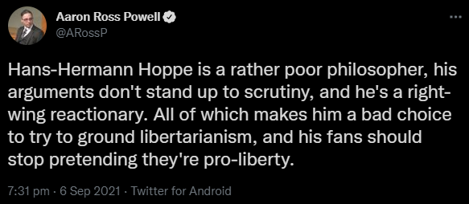
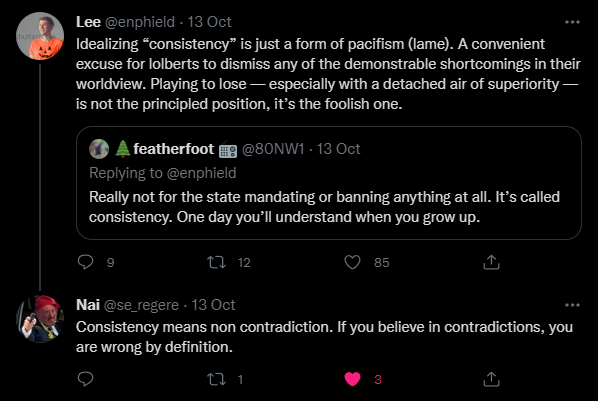
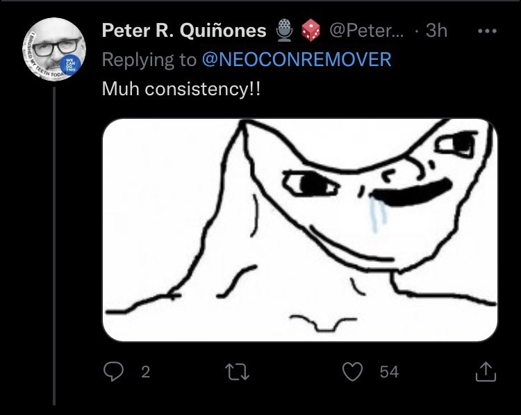

# Table of Contents

1.  [The Purpose of the Mises Caucus](#org7f1b6e6)
2.  [Counter Mandates](#org792229b)
3.  [The Hubris of Pragmatism](#orgc63e200)
4.  [Walk Away From Omelas](#org05aaf75)
5.  [On the Duty of Neo-Prags to Shut Up](#org422ca33)
6.  [Good People Fed Lies](#orge4c01c7)
7.  [Pragmatism Over Truth](#org4b4c2f4)
8.  [We Can Have Freedom After the Revolution](#org89b3473)
9.  [Living in Ancapistan in Your Head](#orge8928cc)
10. [Preferences Aren&rsquo;t Laws](#orgcdafa33)
11. [The White Pill](#orgb84ecef)
12. [I&rsquo;m Just Shitposting Bro, It&rsquo;s Called Irony](#org4de6b47)

# The Purpose of the Mises Caucus

The Libertarian Party Mises Caucus was founded for the purpose of principled messaging over pragmatism.<a id="fnr.1" class="footref" href="#fn.1">1</a> In interviews Heise is quick to promote his caucus as being a re-ignition of the Ron Paul revolution, the revolution that was built on the premise of reaching the remnant, which in short requires you to focus on principled messaging, and if you are not familiar with that these two videos<a id="fnr.2" class="footref" href="#fn.2">2</a>, <a id="fnr.3" class="footref" href="#fn.3">3</a> by Drew Hancock explain the concept in detail.

It was necessary to form this principled caucus because for many years the LP had been under the control of the prag caucus, who were willing to sacrifice the message for the sake of mainstream appeal, citing this as the more &ldquo;pragmatic&rdquo; approach to achieving liberty. A similar cancer has now gripped the Mises Caucus itself, and if it is not rooted out it could set back the liberty movement by years. This cancer is that of the neo-prags who wish to sacrifice adherence to libertarian ethics out of high time preference<a id="fnr.4" class="footref" href="#fn.4">4</a> and frustration with the Cathedral. This is the most urgent problem in intralibertarian discourse. Whether or not it is addressed will determine whether the movement will be characterised by the principles of liberty or impulsive reactions against whatever the enemy does. Where old prags bent over backwards to appease the establishment, neo-prags do the same for the anti-establishment, both at the expense of truth and ethics.

# Counter Mandates

The most common place where these neo-prags detract from libertarianism is in their desire for various government counter-mandates. You will often see them calling for the state to ban private businesses from rejecting the unvaccinated or alternatively the unmasked. A parallel can be drawn between this and the anti-discrimination laws implemented in the wake of the civil rights movement.

Their general speil is that while not ethical to ban businesses from enforcing that you wear a mask or take a vax, this will be a strike against the Cathedral and as such it will benifit liberty in the long run. We can put our selves in the shoes of civil rights advocates in the US in the 60&rsquo;s and use this logic to justify those anti-discrimination laws too. The Cathedral at that time was no doubt anti-black, and as such forcing businesses to not discriminate on the basis of race would be an equal strike against it as is forcing businesses to not discriminate on the basis of vaccination status.

We can take this further by imagining a hypothetical US, where the federal government mandated that all businesses must enforce Jim Crow. Would the proper libertarian response be to support states mandating that no business can discriminate on the basis of race? That hardly seems right, libertarianism is opposed to all forms of anti-discrimination legislation,<a id="fnr.5" class="footref" href="#fn.5">5</a> but this is not only an issue of ethics. Expanding the states ability to regulate freedom of association is a terrible strategy for attaining anarchy. If it is possible for states to implement their own mandates why not just negate the federal mandates, rather than negating them *and* implementing their own mandates on top. This is analogous to Walter Blocks framing of abortion as being evicting *and* killing. We can be for the negating of the federal mandate and against the implementation of a state mandate on top of that.

# The Hubris of Pragmatism

The neo-prag belief that they know when we should go about expanding the state &#x2013; and moreover, when they can discount ethics &#x2013; ties into the hubris of pragmatism. But before I elaborate on that I ask that you click the like button if you are also concerned with protecting the liberty movement from subversion.

So, this is a similar concept to what Jordan Peterson speaks of when he discusses the narcissism of authoritarianism. Essentially when I am saying that some previous regime was not real socialism, and that my ideas could implement proper socialism, what I am really saying is that I am smarter than those previous dictators and that if I was the dictator I could do a better job. A similar thing happens when I say that I can decide when ethics apply and when they don&rsquo;t; in saying that I imply that I am smarter than everyone else. How so? You may be asking, this is because of a second premise they take up, that they don&rsquo;t want others to decide when ethics don&rsquo;t apply to them. This is the essence of libertarianism, and these people still consider themselves libertarian, the belief that a person or a group of people are capable and that they should centrally plan ethics in this manner is statism. And as these people are at least ostensibly anarchist, what they are saying is that statism is fine so long as they are in charge.

# Walk Away From Omelas

If you are not like that and wish to actually remain consistent in your principles a good test of that is found in the short story &ldquo;The Ones Who Walk Away from Omelas.&rdquo; The story is about a perfect utopia, Omelas, a shimmering city of unbelievable happiness and delight, but the maintenance of this utopia requires that a single child be kept in perpetual filth, darkness, and misery. When citizens are old enough to be told the truth most, though initially shocked, ultimately accept this as a necessary injustice. Some however, silently walk away from the city, and no one knows where they go. The man of principle is a man who walks away from omelas, the high time preference neo-prags would sign up to aid in the torture of that child.

# On the Duty of Neo-Prags to Shut Up

In 1985, Murray Rothbard wrote an article in the publication *New Libertarian* called, &ldquo;On The Duty Of Natural Outlaws To Shut Up.&rdquo;<a id="fnr.6" class="footref" href="#fn.6">6</a> This entire piece was essentially Rothbard calling out the pragmatists of his time, to the same end as this video. He notes that the libertarians status as an embattled minority has lead to a tendency to big-tent thinking, namely, that we are indulgent toward anyone and everyone who is even tangentially in our ranks, even those who are damaging to the movement. You should think back and try to recall if you have fallen afoul of this tendency.

Rothbard notes that if you abandon natural law, you can no longer call the State an organisation of a criminal ruling class, because &ldquo;crime&rdquo; itself is a natural-law concept. Neo-prags can&rsquo;t even escape this issue by taking up positivism, as that &#x2013; the theory that the law is what the state says it is &#x2013; necessitates that the state is non-criminal as the state is deciding the laws! So what ground does that leave the pragmatist to argue with? To quote Rothbard, noting that &ldquo;Amadorean&rdquo; refers to Jorge Amador, who believed that the LP of his time was too gradualist *and* too ideological, sounding quite like our neo-prags:

> The pragmatic radical anarchist is faced immediately with powerful critiques from pragmatic statists. He can show, for example, that anarchy would increase production, yield a higher standard of living, etc., in the long run. But in the short run, lots of the privileged, subsidized, or monopolistic would be cast adrift. All these short-run and maybe intermediate-run problems could only be offset by vague future benefits. But why pragmatically, should everyone prefer the long-run to the short-run? What about the high-time preference people, who thus challenge the Amadorean: &ldquo;Look here, fella, I *know* the pragmatic benefits I&rsquo;m getting from the current system. And I *know*, too, the headaches, the disruptions, the losses that I and lots of others will suffer during the lengthy &lsquo;transition&rsquo; period. Even if you&rsquo;ve convinced me that eventually I might benefit, these benefits are too chancy and too long-run for me to want to risk it.&rdquo; And if the average person cannot be sold on radical immediatist anarchism, *a fortiori* the criminal ruling class, those net beneficiaries of the State, they who might well be losers even in the long-run, *certainly* won&rsquo;t be convinced. *At best*, the Amadorsymp will say: &ldquo;Well, I admit this anarchism sounds pretty good. But pragmatically, to ease the transition and minimize the costs that even you admit, let&rsquo;s move toward the ideal very, very gradually.&rdquo; And we are back, will-nilly, to the Republication or Democrat Party, the master &ldquo;gradualists&rdquo; of us all.
> 
> It is no accident, then, that Democrats and Republicans proudly *call themselves* &ldquo;pragmatists.&rdquo; Sure, they believe in freedom, in peace, in free markets, in all the goodies, but these goals have to be approached, they tell us, piecemeal, by the groping push-and-pull of the democratic consensus. And we are back hip deep in the *status quo*. &ldquo;Radical pragmaticism&rdquo; of any sort, whether anarcho or Khomeino or whatever, is virtually a contraction in terms.

Rothbard notes further that throughout all of recorded history, pragmatism has never succeeded in inspiring any sort of radical or revolutionary movement for social change. For who would join a radical minority movement, and commit himself for life to social rejection and a marginal existence, if not for the sake of some undying principle that takes precedence over any personal desires they may hold. The men and women who shaped history moved mountains out of a deep moral passion. It is ideology, moral values, deep beliefs, and principles that move people.

> It is no coincidence, then, that even in the libertarian movement, the people who have stuck to it over the years have been almost exclusively the believers in rights and possessors of moral passion. The libertarian pragmatists, what the Marxists call &ldquo;economists,&rdquo; have generally hived off to good jobs and have forgotten any movement concerns. And, by their lights, why not? Why not let the crazy ideologues worry about the movement and about liberty? The pragmatists, as usual, will just take what comes.
> 
> Anarcho-Pragmatism, then, simply doesn&rsquo;t work. It cannot push radicalism among the public, and it cannot build a radical movement. All it can do is subvert, weaken, and, if unchecked, even destroy the libertarian movement which the anarcho-pragmatists claim they are striving to strengthen and promote. Objectively, anarcho-pragmatists can only function as wreckers of libertarianism, And since moral passion and ideology *work* and pragmatism doesn&rsquo;t, the anarcho-pragmatists have a pragmatic *obligation* either to convert to natural rights, or, at the very least, to *pretend* to convert and then use natural rights and ideology as a weapon with which to build an anarchist movement. Objectively, then, and *on their own terms*, the anarcho-pragmatists have a solemn duty to surrender, to shut up about their doctrines and abandon the field.

# Good People Fed Lies

It is no secret that outlets such as Reason and Cato are not the most principled places on earth. As such, most libertarians have been conditioned to recoil and react negatively to whatever they put out. And you can hardly blame people when takes like these are the standard:

But this conditioning has given the neo-prags an in, people like Pete<a id="fnr.7" class="footref" href="#fn.7">7</a> Quinones are able to paint any old tweet sent by these institutes as being bad, even when they are consistent with libertarian principles. Doing this repetedly allows them to sneak their ideas through the sally port, until we are left with the current climate where the majority of responses to a principled reason take are negative.

It is my hope that with this video, people will be made aware of the danger neo-pragmatism holds and will thus know it when they see it, and avoid succumbing. But if we remain silent on this issue it will never die out, subversion lives in the dark, do not allow people to get away with it, call them out on their incorrect and anti-liberty beliefs.

# Pragmatism Over Truth

And I mean incorrect in the literal sense, they are objectively incorrect when they reject consistency for the sake of pragmatism. Consistency is defined as non-contradiction, and via the law of non-contradiction we can say that inconsistency is necessarily incorrect, thus embracing inconsistency is embracing a rejection of truth. So when you see people on twitter speaking like this, just remember that these opinions are *necessarily* wrong:

# We Can Have Freedom After the Revolution

We are fast approaching a time when it will be impossible to catch out neo-prags with reductios ad absurdum. Normally what you would do to show these people that they hold bad beliefs is ask them something along the line of; &ldquo;would you kill innocent people to achieve your desired political ends,&rdquo; which is met with a resounding &ldquo;no&rdquo; in any reasonable group of libertarians. But some neo-prags can be seen on twitter advocating that children be slaughtered and that the families of politicians be coerced. I cannot help but recall a story that Michael Malice tells<a id="fnr.8" class="footref" href="#fn.8">8</a> of Emma Goldman, a leftist anarchist who was deported from the US to the Soviet Union. Upon arrival she was horrified at the many things Lenin was doing and she confronted him in his office, saying; &ldquo;this is not what we are about, the revolution is about freedom&rdquo;<a id="fnr.9" class="footref" href="#fn.9">9</a> to which Lenin responded that freedom was a bougoise contrivance, and you cannot have it in the midst of a revolution.

# Living in Ancapistan in Your Head

Saying that you are living in ancapistan in your head is common among neo-prags, it is used as a derision of people they see as too principled, saying that neo-prags instead live in political reality, and that being an ancap means you rely on a utopian future that either will never happen or will not happen in the ancaps lifetime.

Danny Duchamp has an excellent defense<a id="fnr.10" class="footref" href="#fn.10">10</a> of the idea of living in anarcho-capitalism in ones head, which I shall heavily tax here, but you should watch the full thing. It is worth noting right off the bat that Murray Rothbard lived in anarcho-capitalism in his head, so too did most of our leaders. The great Ron Paul hardly acquired the presidency and even if he did, you are naiave if you think he would be able to get anything done with the lengths that the Cathedral went to to stop someone as unlibertarian as Trump. We are diametrically opposed to every form of political power, they will never be our friends, we are forced to live, and to preach anarcho-capitalism in our heads, as this is how we reach the remnant. Further, principles are not just intellectual abstractions that don&rsquo;t apply to your life, you use principles to inform you on how to live ethically in a complicated world. No man has the capacity to understand all of the cogs at play, else he could centrally plan, which we don&rsquo;t think is possible. So any man must employ aids to his action, so that he knows when he is being good and when he is being evil.

There is also the snuck premise that living by your principles will just lead to you getting run over by those who don&rsquo;t, and that by abandoning principles you gain far more ground. But this is not at all how politics works. You have a negligible impact on any political issue, whether you live by principles or not. The benefit in living by principles is that you can look yourself in the mirror and know that you are not evil, that you would walk away from omelas, that you would not be the guard at a prison camp.

Duchamp gives an analogy from Physics, that of the Second Law of Thermodynamics. The law states that in any isolated system, entropy cannot decrease, that is to say, that any isolated system will tend to thermodynamic equilibrium. But, in reality we don&rsquo;t see any isolated system, every system we come accross has energy coming in from outside, and/or energy leaving from it. So are physicists &ldquo;living in the Second Law of Thermodynamics in their heads?&rdquo; Is it pointless to consider the ideal case? Of course not, looking at the ideal case gives you a baseline with which you can analyse the real world with all of its messiness. Relating this back to anarcho-capitalism, we could ask whether ancap would devolve into statism, or rather, would we expect it to. This is asking whether private security firms have a tendency towards monopolisation, which any austrian will tell you isn&rsquo;t the case. But that requires us to look at the praxeologic ideal, rather than looking to the real world. Basing economic theory like that on empirical observation is epistemelogically flawed, and I think the neo-prags know this, yet they are basing their ethics on empiricism, surely just as flawed. That is to say, neo-prags can be reasonably framed as ethical-keynesians, not just for their empiricism but for their high-time preference.

# Preferences Aren&rsquo;t Laws

Neo-prags will often share memes of this sort:

This is an equivocation tactic, they want people to believe, and perhaps they themselves believe, that they are taking up the position this meme takes. Namely, that it is silly to tell people that they are not allowed to complain about the actions of a private company, as this is a rejection of preference. But that is not at all what neo-prags advocate, they wish to violently coerce rather than criticise and peacefully disassociate from companies who do things they don&rsquo;t like. Their frequent uttering of the &ldquo;it&rsquo;s a private company bro&rdquo; meme is an attempt to conflate principled libertarians with the leftist scourge, which sets a false dichotomy between a principled left and an unprincipleld right. It is very much not a good idea to cede the concept of principle to the left, as that is, as I explained above, ceding the concept of being correct to the left.

# The White Pill

But there is reason to be optimistic in the face of this issue; as described above, there was a neo-prag wave in Rothbard&rsquo;s time that was evidently quelled, and did not destroy the movement. And further, there does seem to be some pushback arising in the Mises caucus, Pete Quinones recently tweeted out that he is withdrawing his support due to a dispute with a founding member. I have also been assured by people in the caucus that the leadership is resolute on principle, meaning the problem is more focused on orbiters on twitter and various podcasts and the like. This fact allows for a disproportionate utility in publicly denouncing this behaviour, as it has no intellectual backing.

# I&rsquo;m Just Shitposting Bro, It&rsquo;s Called Irony

To round off this video, I present a prediction. If everything goes the way I hope it goes and larger names in the space start publicly calling out the neo-prag cancer, I believe they will retreat into &ldquo;it&rsquo;s just ironic shitposting, stop taking it so seriously bro.&rdquo; Neo-pragmatism can only live in the dark, when large names in the community point out their failings they will be less comfortable in their convictions, and as they have no principle to fall back on, they cannot re-enforce those convictions. You can aid in achieving this end, if neo-prags are publicly shamed, even by small fish, others will catch on &#x2014; every time you see statism being snuck through the back door into our movement, loudly and proudly denounce it. This would be the ideal end to the problem, the vanguard could once again get to work at vying for liberty, rather than having to concern themselves with subversion. However, this could just as easily lead to a fragmentation of the movement analogous to the famous Cato vs Mises split. Only time will tell.

# Footnotes

<a id="fn.1" href="#fnr.1">1</a> <https://lpmisescaucus.com/platform/>, *Plank 1 &#x2014; Property Rights*, &ldquo;We condemn all fraud and initiatory violence towards a person’s life, liberty, and property.&rdquo; ([archived](https://archive.ph/5upKF))

<a id="fn.2" href="#fnr.2">2</a> Drew Hancock, &ldquo;The Libertarian Case for Radical Messaging,&rdquo; <https://www.youtube.com/watch?v=Y6qUiD5sAkA>

<a id="fn.3" href="#fnr.3">3</a> Drew Hancock, &ldquo;Reach the Remnant,&rdquo; <https://www.youtube.com/watch?v=EhEAQCsSFfU>

<a id="fn.4" href="#fnr.4">4</a> See @ReadingMises, <https://twitter.com/ReadingMises/status/1448936188929249299?s=20>, for more on this.

<a id="fn.5" href="#fnr.5">5</a> See Michael Moreno, &ldquo;Why the Supreme Court&rsquo;s LGBTQ Ruling Is Immoral,&rdquo; <https://www.youtube.com/watch?v=KBlf9ubN5jk>, for more on this.

<a id="fn.6" href="#fnr.6">6</a> Rothbard, Murray N., &ldquo;On The Duty Of Natural Outlaws to Shut Up,&rdquo; *New Libertarian* 4, no. 13 (April 1985): 13–14. <https://mises.org/library/duty-natural-outlaws-shut> ([archived](https://archive.ph/7hmsV))

<a id="fn.7" href="#fnr.7">7</a> I use &ldquo;Pete&rdquo; rather than &ldquo;Peter&rdquo; because I think it sounds better

<a id="fn.8" href="#fnr.8">8</a> <https://www.youtube.com/watch?v=XdkjMzYITbI>

<a id="fn.9" href="#fnr.9">9</a> I am paraphrasing, watch the clip if you want it from the horses mouth

<a id="fn.10" href="#fnr.10">10</a> see: Danny Duchamp, &ldquo;In Defense Of Living In Ancapistan In Your Head,&rdquo; <https://www.youtube.com/watch?v=sKnVeP7_xSQ>
