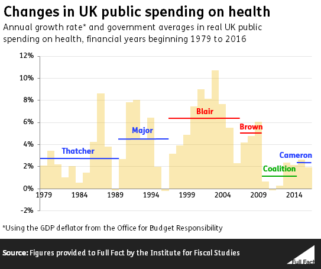

# Table of Contents

1.  [Introduction](#orge3cfbe3)
2.  [Crises](#org67781fa)
    1.  [Healthcare Costs Are Too High](#org3050c07)
        1.  [US](#org29994bd)
        2.  [UK](#org1561ab6)
    2.  [CCPVirus](#orge8716b5)
        1.  [CCP coverup](#orgf78cb8c)
    3.  [TB](#orgae948e1)
        1.  [How to cure TB](#org1d2e892)
            1.  [LTBI](#org60cef86)
            2.  [TB Disease](#org243081c)
        2.  [How the state restricts these treatments](#orgb463aba)
            1.  [They all have patents in some way](#org2089123)
3.  [Free-Market Healthcare](#org7934f0c)
    1.  [What are fraternal societies?](#org0153925)
    2.  [What is Lodge Practice?](#org24d6bbe)
    3.  [The Response of the Medical Establishment](#orge9c0fe3)
4.  [State Healthcare](#org4966c12)
    1.  [Obamacare](#org5e166ba)
    2.  [How American Healthcare Became Dysfunctional](#org481c8e8)
    3.  [The State Killed Pro Bono Care](#org5139cb6)
    4.  [Costs Go Down Where Not Regulated](#org789c4c0)
5.  [Regulations on Healthcare](#org59d539f)
    1.  [Restrictions](#orgc7772ac)
        1.  [Illegality of Cross-State Insurance Purchases](#org1ae8612)
        2.  [Insurance Alternatives Regulated](#org00b4025)
        3.  [Licensure of Medicine](#orgf315bcb)
        4.  [Unionism in Medicine](#orgde11975)
        5.  [Patents](#org454dcf7)
        6.  [The Food and Drug Administration](#org4e97868)
        7.  [Medicare/Medicaid Price Fixing](#orgc890f19)
        8.  [Paperwork](#org35543f9)
    2.  [Subsidies](#orga0851fa)
        1.  [Institutional Tilt Towards Insurance](#orga16f088)
        2.  [Mandatory Coverage of Specific Conditions](#org17c440c)
        3.  [Aid to Hospitals (Equipment)](#orgc474daa)
        4.  [Aid to Hospitals (Patients)](#org7110ea4)
        5.  [Aid to Employers](#orgd9dca7f)
        6.  [Inflation](#org755ee50)
6.  [Hoppe&rsquo;s 4-Step Solution to Healthcare](#org5a023de)
    1.  [Step 1: revoke all state-mandated licensing requirements for medical schools, hospitals, pharmacies, doctors, and other medical personnel.](#org848c0cb)
    2.  [Step 2: revoke all government restrictions on the production and sale of pharmaceutical products and medical devices.](#org7de1dbe)
    3.  [Step 3: de-regulate the health-insurance industry.](#orgafe1293)
    4.  [Step 4: Eliminate all subsidies to the sick or unhealthy.](#orgf71d126)
7.  [References](#orgd245140)

# Introduction

Healthcare is perhaps the industry most plagued by the state of them all, there is immense regulation,<a id="fnr.1" class="footref" href="#fn.1">1</a>, <a id="fnr.2" class="footref" href="#fn.2">2</a>, <a id="fnr.3" class="footref" href="#fn.3">3</a> funding,<a id="fnr.4" class="footref" href="#fn.4">4</a> and in some cases outright state monopolisation of the sector.<a id="fnr.5" class="footref" href="#fn.5">5</a> In this document I will show how every major healthcare crisis the world faces today has come about as a direct result of state interference, and I will describe the free-market counterfactual for healthcare and how it could solve those problems.

# Crises

## Healthcare Costs Are Too High

### US

The US is the country that international-socialists most often tout as a failure of free-market healthcare, despite the fact that the public spending per capita there ($9386)<a id="fnr.6" class="footref" href="#fn.6">6</a> is more than double<a id="fnr.7" class="footref" href="#fn.7">7</a> that of the UK ($3620).<a id="fnr.8" class="footref" href="#fn.8">8</a> Moreover, the US has greater per capita public funding of healthcare than the *total* per capita spending of anywhere else, and this from its previous rate of $2 a year under the free-market.

But the immense public funding is not the only problem plaguing the US market, the federal government also places immense regulation, mandatory licensing, and legion other restrictions on the ability of people to freely buy and sell healthcare resources, directly causing the ballooning prices we can see today.

It is important here to note that this crisis in healthcare costs didnt fully take off until the mid 1960s<a id="fnr.9" class="footref" href="#fn.9">9</a> (see also the figure below), when the government increased demand with the passage of medicare<a id="fnr.10" class="footref" href="#fn.10">10</a> and medicaid,<a id="fnr.11" class="footref" href="#fn.11">11</a> whilst continuing their restriction of the supply of doctors and medicine through medical licensing laws<a id="fnr.12" class="footref" href="#fn.12">12</a> and the regulation of the sale of drugs through the Food and Drug Administration.<a id="fnr.13" class="footref" href="#fn.13">13</a> Though the seeds of this crisis were planted far earlier (see: [3.3](#orge9c0fe3) and [4](#org4966c12)).

.")

It has been noted by Milton Freidman<a id="fnr.14" class="footref" href="#fn.14">14</a> that this restriction of supply coupled with the rising demand is a direct cause of the price increase above inflation. Robert Alford explained the minority view:<a id="fnr.15" class="footref" href="#fn.15">15</a>

> The market reformers wish to preserve the control of the individual physician over his practice, over the hospital, and over his fees, and they simply wish to open up the medical schools in order to meet the demand for doctors, to give patients more choice among doctors, clinics, and hospitals

For more than a century, medical special interests have invested billions into lobbying government to reduce competition<a id="fnr.16" class="footref" href="#fn.16">16</a>, <a id="fnr.17" class="footref" href="#fn.17">17</a> &#x2014; in fact, in 1945 the AMA spent $1.5 million on lobbying which was, at the time, the most expensive lobbying effort in US history.<a id="fnr.18" class="footref" href="#fn.18">18</a> Their efforts have paid off, below I borrow a list of a number of major government policy changes that have interfered with the healthcare industry, compiled by Mike Holly:<a id="fnr.19" class="footref" href="#fn.19">19</a>, <a id="fnr.20" class="footref" href="#fn.20">20</a>

> -   In 1910, the physician oligopoly was started during the Republican administration of William Taft after the American Medical Association lobbied the states to strengthen the regulation of medical licensure and allow their state AMA offices to oversee the closure or merger of nearly half of medical schools and also the reduction of class sizes. The states have been subsidizing the education of the number of doctors recommended by the AMA.
> 
> -   In 1925, prescription drug monopolies begun after the federal government led by Republican President Calvin Coolidge started allowing the patenting of drugs. (Drug monopolies have also been promoted by government research and development subsidies targeted to favored pharmaceutical companies.)
> 
> -   In 1946, institutional provider monopolization begun after favored hospitals received federal subsidies (matching grants and loans) provided under the Hospital Survey and Construction Act passed during the Truman Administration.
> 
> -   In 1965, nationalization was started with a government buyer monopoly after the Johnson Administration led passage of Medicare and Medicaid which provided health insurance for the elderly and poor, respectively.
> 
> -   In 1972, institutional provider monopolization was strengthened after the Nixon Administration started restricting the supply of hospitals by requiring federal certificate-of-need for the construction of medical facilities.
> 
> -   In 1984, prescription drug monopolies were strengthened during the Reagan Administration after the Drug Price Competition and Patent Term Restoration Act permitted the extension of patents beyond 20 years.
> 
> -   In 2003, prescription drug monopolies were strengthened during the Bush Administration after the Medicare Prescription Drug, Improvement, and Modernization Act provided subsidies to the elderly for drugs.
> 
> -   In 2014, nationalization [was] strengthened after the Patient Protection and Affordable Care Act of 2010 (“Obamacare”) provided mandates, subsidies and insurance exchanges, and the expansion of Medicaid.

The chart below shows the cumulative effects of all these interferences on the healthcare spending by sector and quite clearly paints the picture that government has ballooned the price far beyond what the market did, and would, produce.

")

Spending on prescription drugs didn&rsquo;t accelerate until after pharmaceutical monopolies were strengthened in 1984. Spending has increased even less for administrative, net cost of private health insurance and nursing home care, and not much at all for dental, structures, equipment, public health, other personal and professional care, home health care, research, non-prescription drugs and durable medical equipment.

Since the 1980s, the government has used its buyer monopoly power, through its Medicare and Medicaid programs, to effectively set price and quality controls (e.g., underpayments) on physicians and hospitals.<a id="fnr.21" class="footref" href="#fn.21">21</a> For the same purpose, the Federal and state governments promoted the concentration of private insurance into buyer monopolies (e.g., HMOs). The government has also encouraged clinics and hospitals to respond by merging into concentrated provider monopolies (while continuing to limit the supply of doctors and hospitals).

These government-private partnerships called &ldquo;managed competition&rdquo; resemble socialist central-planning.<a id="fnr.22" class="footref" href="#fn.22">22</a> Government sets prices,<a id="fnr.23" class="footref" href="#fn.23">23</a> which has predictably led to reduced quality, rationing and other perverse gaming. Moreover, the bureaucracy has brought standardized care,<a id="fnr.24" class="footref" href="#fn.24">24</a> higher administrative costs<a id="fnr.25" class="footref" href="#fn.25">25</a> and high executive salaries.<a id="fnr.26" class="footref" href="#fn.26">26</a>, <a id="fnr.27" class="footref" href="#fn.27">27</a> Costs in medical care have risen at double the rate of inflation (fig below), due to these burdens on competition.

")

### UK

The UK&rsquo;s National Health Service, or NHS, has wormed its way so deep into the culture that it achieves an almost cult-like status, where one will be harrassed for neglecting to cheer for it,<a id="fnr.28" class="footref" href="#fn.28">28</a> and good luck trying to find a single public figure or politician with the balls to say anything even a little bit negative about the monopoly. There is much fury over how the Conservative party have treated *our NHS* from leftists,<a id="fnr.29" class="footref" href="#fn.29">29</a> and speaking to one of these international-socialists you would think that they have implemented Thatcher-style obliterations to the funding, but not only has this not occurred, they havent even frozen the rise in funding. All of that anger is over the Conservatives simply reducing the rate at which funding increases (see fig below).

")

As Antony Sammeroff explains,<a id="fnr.30" class="footref" href="#fn.30">30</a> this increase in state funding of healthcare services has cost Britain its status as a world leader in medicine:

> Before the National Health Service was created in Great Britain our nation was a world-leader with an unrivalled record in making major medical breakthroughs. People came from all over the globe to study medicine, and to be treated in the UK. Dr. John Snow proved that the source of cholera epidemics was the water supply in London. Edward Jenner pioneered a vaccine for smallpox in rural England, and Sir Almroth Wright one for typhoid. Sir Humphrey Davy, also a Briton, first suggested the use of nitrous oxide as an anaesthetic in 1800. Sir Joseph Lister pioneered the use of antiseptics in operations in 1865 using impure carbolic acid, saving countless people dying from infections after surgery. Alexander Flemming, the Scottish physician discovered Penicillin in one of the charitable hospitals in London in 1928. Howard Florey and Ernst Chain, brought it to fruition working in a laboratory in Oxford in 1941. Britain had established the best record in the world for achieving major medical advances and had just developed the landmark drug of the 20th century, as well as playing a leading role in 5 out of the 7 leading medical breakthroughs between 1750 and 1948 when the NHS was established.<a id="fnr.31" class="footref" href="#fn.31">31</a> Britain is no longer a leader in medical advances.
> 
> Britain has less of the latest equipment and the old equipment is often being kept beyond the time when it is safe.<a id="fnr.32" class="footref" href="#fn.32">32</a> If a private company was using out of date intensive care machines and x-ray machines, obsolete cancer care equipment, and operating tables over twenty years old &#x2013; double their safe life span &#x2013; the champions of the NHS would no doubt be clamouring for more government oversight and regulation. When government agencies are culpable, they are more or less given a pass on public outrage because they are perceived to be acting in the public interest rather than for profit.

The UK is unable to compete with the cancer survival rates of the US &#x2014; a 2011 report<a id="fnr.33" class="footref" href="#fn.33">33</a> has demonstrated that Englands laugable survival rate of 54.48% is eclipsed by the US&rsquo; 71.18%. Healthcare that is free at the point of service sounds great, but not if it doesn&rsquo;t actually make you healthy. *The BBC* have reported patients &ldquo;dying in hospital corridors,&rdquo;<a id="fnr.34" class="footref" href="#fn.34">34</a> in one month 300,000 patients were made to wait in emergency rooms for more than four hours before being seen,<a id="fnr.35" class="footref" href="#fn.35">35</a> with thousands more suffering long waits in ambulances before even being allowed into the emergency room.<a id="fnr.36" class="footref" href="#fn.36">36</a>

In the UK and Canada, people die waiting in line for what would be quick and routine medical treatments in the US. In 2017 4 million were on hospital waiting lists,<a id="fnr.37" class="footref" href="#fn.37">37</a> up from a 7 year high of 3.4 million,<a id="fnr.38" class="footref" href="#fn.38">38</a> and this in a population of less than 67 million,<a id="fnr.39" class="footref" href="#fn.39">39</a> the number of people waiting for medical treatment in England reached a record high of 4.59 million in January 2021, giving a record high for the second month in a row.<a id="fnr.40" class="footref" href="#fn.40">40</a> In the UK you could turn up to an emergency room with an appendix about to burst and still be asked to wait overnight before they find you a bed. One patient reported that a lack of treatment rooms led hospital staff to examine her for gynaecological problems which had left her in severe pain and bleeding in a busy corridor, in full view of other patients.<a id="fnr.41" class="footref" href="#fn.41">41</a> Such humiliating anecdotes could be dismissed as embarrassing one-offs were it not for the shocking fact that as many as 120 patients per day<a id="fnr.42" class="footref" href="#fn.42">42</a> are being attended to in corridors and waiting rooms, in the public areas of hospitals, and some even dying prematurely as a result. In the first week of 2018, over 97% of NHS trusts in England were reporting levels of overcrowding so severe as to be &ldquo;unsafe.&rdquo;<a id="fnr.43" class="footref" href="#fn.43">43</a>

25% of British cardiac patients die waiting for treatment, and an investigation by a British newspaper found that delays in treatment for colon and lung cancer patients have been so long that 20% of cases were incurable by the time they finally received care.<a id="fnr.44" class="footref" href="#fn.44">44</a> In 2017, 193,000 NHS patients a month had to wait beyond the target time of 18 weeks for surgery,<a id="fnr.45" class="footref" href="#fn.45">45</a> and now nearly 400,000 patients in England alone have been waiting more than a year for routine treatments.<a id="fnr.46" class="footref" href="#fn.46">46</a> According to the OECD Britain has the lowest number of doctors per thousand population in the advanced world.<a id="fnr.47" class="footref" href="#fn.47">47</a> The chart below shows that the US has consistently fewer patients wating 4 weeks or more for either specialist appointments or elective surgery than; the UK, New Zealand, Australia, France, Norway, Sweden, and Canada, 7 countries with healthcare systems that receive far less criticism and far more praise from international socialists.

.")

Where free-at-the-point-of-entry resources are limited, older patients are often viewed as a drag on the system<a id="fnr.48" class="footref" href="#fn.48">48</a> &#x2013; especially since they require the most frequent care which costs much more. The average 65-year-old costs the NHS 2.5 times more than the average 30-year-old. An 85-year-old costs more than five times as much.<a id="fnr.49" class="footref" href="#fn.49">49</a> Although a third of all diagnosed cancers in the UK are found in patients seventy-five and over, only one in fifty lung cancer patients over seventy-five receives surgery, and the NHS does not even provide cancer screening to patients over the age of sixty-five.<a id="fnr.50" class="footref" href="#fn.50">50</a>

Sammeroff points out the results of the incentive to manipulate statistics to the detriment of those who most need healthcare (punctuation added for clarity):<a id="fnr.51" class="footref" href="#fn.51">51</a>

> The government can make waiting lists look shorter by denying patients services outright, because those who have been refused services will no longer appear in statistics. If someone&rsquo;s disease proves fatal because they failed to receive treatment in time, the government figures appear more cost effective because instead of having to budget for a series of expensive surgeries, they have a deceased person on their hands who will not rack up a whole lot of medical accounts. It&rsquo;s not to say that anyone is perniciously trying to kill off patients, but with pressure constantly mounting for officials to show meaningful improvements, the incentive to coldly take advantage of manipulated statistics &ldquo;for the greater cause of saving the NHS&rdquo; will always loom. It is, after all, our religion. In one interview, prominent columnist Dr. Dalrymple reported &ldquo;Managers going around the wards telling the doctors who they thought ought to be discharged. They had no medical training or knowledge. But they would try and influence the doctors to discharge patients quickly… This is a problem, of course, wherever the person paying for the care is not the patient himself… But where you have one giant organization that decides everything the hazard is even greater.&rdquo;

So the NHS may not charge one at the point of service, but it is immensely costly in terms of both the taxation required and the lives lost, no matter how much money is thrown into the great money pit that is the National Health Service it will *never* deliver a product anywhere close to being as good as the free-market.

## CCPVirus

The Wuhan Flu pandemic, caused by the CCPVirus, is currently the most apparent crisis in healthcare. This pandemic started thanks to a lab leak at the Wuhan Institute of Virology where the PLA were conducting gain-of-function coronavirus research (see: <https://github.com/LiquidZulu/youtube-scripts/blob/main/scripts/lab-leak/lab-leak.org> for my evidence).

In this section I will describe how even if we ignore the overwhelming evidence that the CCP created this virus, this pandemic was allowed to progress because of state interference.

### CCP coverup

The Chinese government willfully covered up the severity of the outbreak, threatening doctors who warned their colleagues about the contagion,<a id="fnr.52" class="footref" href="#fn.52">52</a> lying about human-human transmission through their WHO mouthpieces,<a id="fnr.53" class="footref" href="#fn.53">53</a> and refusing to provide virus samples to researchers.<a id="fnr.54" class="footref" href="#fn.54">54</a>, <a id="fnr.55" class="footref" href="#fn.55">55</a>

This was all during the largest migration of the year, that being the Chinese New Year, making these measures appear to be deliberate attempts to infect other countries.

In addition, the proposed precursor virus, RaTG13, was destroyed by China leaving no samples for foreign researchers to investigate.<a id="fnr.56" class="footref" href="#fn.56">56</a> The virology establishment, especially in China, have been running cover for this horrendous event leading to the deaths of over 3 million people. In an email correspondence with Anthony Fauci, Dr. Kristian G. Andersen of Scripps Research, head author of the main source<a id="fnr.57" class="footref" href="#fn.57">57</a> used to debunk a lab origin,<a id="fnr.58" class="footref" href="#fn.58">58</a> said that some of the features of the virus look &ldquo;engineered,&rdquo; and that:

> after discussions earlier today, Eddie, Bob, Mike, and myself all find the genome inconsistent with expectations from evolutionary theory.

None of this makes it into his paper though, and shortly after this two-faced opinion on the virus came out, Andersen deleted his Twitter account in shame.<a id="fnr.59" class="footref" href="#fn.59">59</a>

## TB

According to the CDC,<a id="fnr.60" class="footref" href="#fn.60">60</a> Tuberculosis infection is treatable, and if caught early, doctors can prevent progression to tuberculosis disease, but even if the illness has progressed to this point it can still be treated with greater effort.

### How to cure TB

<video controls src="./videos/TB or not TB.mp4" alt="A clip from the episode of House MD entitled 'TB or not TB'"/>

#### LTBI

The CDC reccommends<a id="fnr.61" class="footref" href="#fn.61">61</a> 3 drugs for the treatment of Latent TB Infection:

1.  Isoniazid (INH)
2.  Rifapentine (RPT)
3.  Rifampin (RIF)

These medications may be used on their own or in combination, as needs dictate.

#### TB Disease

When TB infection progresses to TB disease the treatment options are slightly different:<a id="fnr.62" class="footref" href="#fn.62">62</a>

1.  isoniazid (INH)
2.  rifampin (RIF)
3.  ethambutol (EMB)
4.  pyrazinamide (PZA)

### How the state restricts these treatments

So to treat TB in it&rsquo;s different stages you need one or multiple of:

1.  Isoniazid (INH)
2.  Rifapentine (RPT)
3.  Rifampin (RIF)
4.  ethambutol (EMB)
5.  pyrazinamide (PZA)

So let&rsquo;s see what restrictions the state places on each of these.

#### They all have patents in some way

The synthesis of isoniazid was first described in 1912 and three separate pharma companies attempted to patent the drug at the same sime &#x2014; luckily none succeded.

But patents of the drug itself arent the only way that drugs are restricted, INH suffers from inflated costs as described above making it infeasable for use in poor nations where treatment is most needed. And as I show below, where the drug isn&rsquo;t monopolised under IP, the process to produce it is.

Rifapentine was patented by Renato Cricchio & Vittorio Arioli under US4002752A, the production of rifampin under US4174320A, similarly with ethambutol (US3944618A, RU2712231C1), and with pyrazinamide (US2780624A), and our old friend isoniazid under WO2011012987A1.

# Free-Market Healthcare

So socialist healthcare has caused every crisis we see today, what might the free-maket counterfactual look like? We have, a historical precedent that we may draw on, that of lodge practice preformed by fraternal societies from the late 1800s up until the death of the lodge in the 60s.

## What are fraternal societies?

Fraternal societies, which arose from earlier &ldquo;friendly&rdquo; societies in the UK c. 1630 &#x2013; c. 1640,<a id="fnr.63" class="footref" href="#fn.63">63</a> were mutual aid organisations that provided a number of services, mainly focused on covering for what the later welfare state would provide, but at a much higher quality and entirely voluntarily. As a spokesman the *Modern Woodmen of America* once wrote in 1934, they provided;<a id="fnr.64" class="footref" href="#fn.64">64</a>, <a id="fnr.65" class="footref" href="#fn.65">65</a>

> [a] few dollars given here, a small sum there to help a stricken member back on his feet or keep his protection in force during a crisis in his financial affairs; a sick Neighbor’s wheat harvested, his grain hauled to market, his winter’s fuel cut or a home built to replace one destroyed by a midnight fire &#x2014; thus has fraternity been at work among a million members in 14,000 camps.

## What is Lodge Practice?

Lodge practice was a system where a fraternal society would hire a doctor on retainer to provide care to its members as and when they needed it. Doctors would bid fiercely for these contracts,<a id="fnr.66" class="footref" href="#fn.66">66</a> possibly for the assurance of a regular wage, and this bidding caused for an extremely low price by modern standards, as historian David T. Beito explains;<a id="fnr.67" class="footref" href="#fn.67">67</a>

> The leading beneficiary of lodge practice was, of course, the patient of modest means. He or she was able to obtain a physician’s care for about $2.00 a year, roughly equivalent to a day’s wage for a laborer. For comparable amounts, some lodges extended coverage to family members. The remuneration the lodge doctor received was a far cry from the higher fee schedules favored by the profession. The local medical society in Meadville, Pennsylvania, was typical in setting the following minimum fees for its members: $1.00 per physical examination, surgical dressing, and daytime house call and $2.00 per nighttime house call. Such charges, at least for ongoing service, were beyond the reach of many lower income Americans. Hence it was not coincidental, an editorial in the *Medical Council* pointed out, that lodge practice thrived in communities populated by the working poor.<a id="fnr.68" class="footref" href="#fn.68">68</a>, <a id="fnr.69" class="footref" href="#fn.69">69</a>, <a id="fnr.70" class="footref" href="#fn.70">70</a>, <a id="fnr.71" class="footref" href="#fn.71">71</a>, <a id="fnr.72" class="footref" href="#fn.72">72</a>, <a id="fnr.73" class="footref" href="#fn.73">73</a>
> 
> Moreover, had it not been for the competition offered by fraternal societies, official fees probably would have been still higher. In this vein Dr. Charles S. Sheldon complained that lodge practice “demoralizes the scale of prices in a profession already too poorly paid. It causes dissatisfaction among those outside the lodges and makes them unwilling to pay regular prices.”<a id="fnr.74" class="footref" href="#fn.74">74</a>, <a id="fnr.75" class="footref" href="#fn.75">75</a>

I dont know why any of us should want to pay a &ldquo;regular&rdquo; price that is higher than what the market produced, and if those outside of lodges are unhappy with their &ldquo;regular&rdquo; care and unwilling to pay those high prices, perhaps they ought to join a lodge. Furthermore, this phenomenally low price did not come at the cost of quality either, as Beito later elaborates;<a id="fnr.76" class="footref" href="#fn.76">76</a>

> Inspection of the medical journals gives some cause for skepticism of blanket assertions that lodges heedlessly sacrificed quality to elect candidates with the lowest fee. The contrary, in fact, occurred in a campaign described by lodge practice adversary Dr. George S. Mathews of Providence, Rhode Island: “In one lodge [meeting] two members in good standing in the State Medical Society openly underbid [one another]. One volunteered his services at $2 a head. The other dropped his price to $1.75. The first bidder then acceded to this price with medicines furnished. This occasioned a drop in bidder No. 2 in his price to include medicine and minor surgery. To the vast credit of the lodge neither bid was accepted but a non-bidder was given the job at $2.” In another case a Moose lodge asked the national organization to increase the salary of a doctor deemed particularly deserving.<a id="fnr.77" class="footref" href="#fn.77">77</a>, <a id="fnr.78" class="footref" href="#fn.78">78</a>

## The Response of the Medical Establishment

Doctors who were too arrogant and ineffective to serve the poor for such a cheap price were, of course, outraged by this. We already have a taste of this seeping through in the above quote where a doctor declares that his price is the &ldquo;regular&rdquo; price and that his more efficient collegues were pricing at a rate that sullies the dignity of the profession. This is very much in the same veign as those who complain about &ldquo;predatory pricing&rdquo; (see: <https://www.youtube.com/watch?v=-NCtUJM-uM8> and <https://github.com/LiquidZulu/youtube-scripts/blob/main/scripts/socialism-definition/socialism.org> for my response to such claims), but it goes further, there is seemingly a disgust from some physicians towards the idea of serving those &ldquo;beneath&rdquo; them.

> Shortly after the turn of the century, articles about the “lodge practice evil” began to fill the pages of American medical journals.

&#x2014; <i>Quoted here<a id="fnr.79" class="footref" href="#fn.79">79</a></i>

> The most serious [opposition to fraternal societies], without a doubt, was the organized opposition of physicians. The spread of the lodge practice evil elicited nearly universal condemnation from [state-run] medical societies. Reflecting the intensity of feeling, the *Pennsylvania Medical Journal* bluntly demanded in 1904 “that the ‘club doctor’ must be shut out of the profession.”<a id="fnr.80" class="footref" href="#fn.80">80</a>
> 
> At its core this antipathy represented fear for the survival of fee-for-service remuneration. Dr. W. F. Zierath of Sheboygan, Wisconsin, succinctly summed up the matter when he chided his colleagues for bowing to “the keen business instinct of the laity” who had “discovered in contract practice a scheme to obtain medical services for practically nothing.” Once doctors allowed nonprofessionals to place them on fixed salaries, Zierath and others cautioned, loss of both income and independence would follow. The profession would then become tainted and demoralized by every physician’s “undignified” scramble to “sell himself to the lowest bidder.” Another opponent predicted that lodge practice, if not stopped, would depress fees to levels “comparable to those of the bootblack and peanut vendor.”<a id="fnr.81" class="footref" href="#fn.81">81</a>
> 
> No opprobrium was off limits in depictions of the lodge doctor. He was a “scab” who broke ranks with professional solidarity, an incompetent “quack” spewed out by a low-grade diploma mill, and most unforgivably, a “huckster” bent on commercializing the noble art of medicine. Critics were quick to add, however, that lodge practice also harmed the patient who, in return for these low fees, received shabby service. It was a vain attempt, charged one opponent, to get “something for nothing.” Another cited “the consensus of opinion that physicians generally give fraternal organizations their money’s worth, no more.”<a id="fnr.82" class="footref" href="#fn.82">82</a>, <a id="fnr.83" class="footref" href="#fn.83">83</a>, <a id="fnr.84" class="footref" href="#fn.84">84</a>, <a id="fnr.85" class="footref" href="#fn.85">85</a>, <a id="fnr.86" class="footref" href="#fn.86">86</a>

&#x2014; <i>Quoted here<a id="fnr.87" class="footref" href="#fn.87">87</a></i>

But as I have shown above, the low prices of the lodge did not, in fact, come at the cost of quality, with lodges not just opting for the lowest bidder but the bidder who would provide their members with the best service. In any case, Beito continues;

> Dr. John B. Donaldson of Canonsburg, Pennsylvania, spoke for many: “As to lodge practice, to my mind it is simply contemptible and I see no excuse for its existence.” The double standard did not escape the attention of lodges. An editorial in the Eagle Magazine claimed, with some exaggeration, that there were “few professional protests” against company doctors. “Does it make a difference,” it asked, “whether the employer [of contract doctors] is a wealthy corporation, or a fraternity of humble citizens, most of them wage earners?”<a id="fnr.88" class="footref" href="#fn.88">88</a>, <a id="fnr.89" class="footref" href="#fn.89">89</a>

&#x2014; <i>Quoted here<a id="fnr.90" class="footref" href="#fn.90">90</a></i>

> By the 1920s, lodge practice had entered a steep decline from which it never recovered. Large segments of the medical profession had launched an all-out war. Throughout the country, state societies imposed manifold sanctions against physicians who accepted lodge contracts. The medical societies of several states, including Pennsylvania, Michigan, California, Maine, and Vermont, recommended that offenders be barred from membership. “The evil is such a far-reaching one,” warned the Journal of the Michigan State Medical Society, “that any measures to suppress it are justifiable.” Other state professional organizations, such as those of West Virginia and Illinois, favored less draconian pressure on practitioners to sign pledges spurning lodge contracts.<a id="fnr.91" class="footref" href="#fn.91">91</a>, <a id="fnr.92" class="footref" href="#fn.92">92</a>, <a id="fnr.93" class="footref" href="#fn.93">93</a>, <a id="fnr.94" class="footref" href="#fn.94">94</a>, <a id="fnr.95" class="footref" href="#fn.95">95</a>, <a id="fnr.96" class="footref" href="#fn.96">96</a>

&#x2014; <i>Quoted here<a id="fnr.97" class="footref" href="#fn.97">97</a></i>

> [It was, however,] [c]ounty, rather than state, societies [that] formed the vanguard of the movement to suppress lodge practice [note: the author means state in the sense of the United *States* of America; these societies were, and still are, granted special coercive powers by the government. See [5](#org59d539f) and [2.1.1](#org2f14964) for more details]. The prototypical campaign began with the request that a doctor sign an agreement shunning lodge contracts or, at least, not provide services for fees under the “customary” rate. Sometimes this method worked, at least for a while. If the pariah failed to relent, he faced more serious retribution, such as forfeiture of membership or a boycott. In 1913, for example, members of the medical society in Port Jervis, New York, vowed that if any physician took a lodge contract, they would “refuse to consult with him or assist him in any way or in any emergency whatever.” Sometimes the boycotts extended to patients. One method of enforcement was to pressure hospitals to close their doors to members of the guilty lodge. By 1914, in the Journal of the American Medical Association Dr. Robert Allen could write, with but slight exaggeration, “There is scarcely a city in the country in which medical societies have not issued edicts against members who accept contracts for lodge practice.”<a id="fnr.98" class="footref" href="#fn.98">98</a>, <a id="fnr.99" class="footref" href="#fn.99">99</a>, <a id="fnr.100" class="footref" href="#fn.100">100</a>, <a id="fnr.101" class="footref" href="#fn.101">101</a>, <a id="fnr.102" class="footref" href="#fn.102">102</a>, <a id="fnr.103" class="footref" href="#fn.103">103</a>, <a id="fnr.104" class="footref" href="#fn.104">104</a>, <a id="fnr.105" class="footref" href="#fn.105">105</a>, <a id="fnr.106" class="footref" href="#fn.106">106</a>, <a id="fnr.107" class="footref" href="#fn.107">107</a>, <a id="fnr.108" class="footref" href="#fn.108">108</a>, <a id="fnr.109" class="footref" href="#fn.109">109</a>, <a id="fnr.110" class="footref" href="#fn.110">110</a>, <a id="fnr.111" class="footref" href="#fn.111">111</a>
> 
> Reports in the medical journals suggest that these restrictions were effective. One example occurred in Bristol, Pennsylvania, where local physicians boycotted the lone lodge doctor in the area. As word of the campaign spread, “patrons gradually withdrew from him, his calls for attendance were few, and this last summer he quietly left the town and [its] vicinity.” In a similar case a member of the Loyal Order of Moose in Fort Dodge, Iowa, charged that doctors in his community had run the local lodge “into the ground” by going on strike.<a id="fnr.112" class="footref" href="#fn.112">112</a>, <a id="fnr.113" class="footref" href="#fn.113">113</a>

&#x2014; <i>Quoted here<a id="fnr.114" class="footref" href="#fn.114">114</a></i>

This organised assault on lodge practice coincided with the rise of the welfare state, which served to crowd out the lodge. After all, if you are being forced to pay for welfare by the state how likely are you to also pay for mutual aid?

# State Healthcare

So let&rsquo;s now take a closer look at exactly what state healthcare looks like, keeping the free-market counterfactual in our minds.

## Obamacare

We are told, by Bernie Sanders<a id="fnr.115" class="footref" href="#fn.115">115</a> and other Democrats,<a id="fnr.116" class="footref" href="#fn.116">116</a> that the Affordable Care Act (ACA, or Obamacare) saves 36,000 lives a year, and that its repeal would be therefore equivalent to the signing of 36,000 death warrants. But as economist Oren Cass<a id="fnr.117" class="footref" href="#fn.117">117</a> and historian Tom Woods<a id="fnr.118" class="footref" href="#fn.118">118</a> have pointed out,

> The best statistical estimate of the number of lives saved each year by the ACA is
> zero.

In fact there is reason to believe that Obamacare cost lives rather than saved them, as Cass shows:

> Had mortality continued to decline during ACA implementation in 2014 and 2015 at the same rate as during the 2000–13 period, 80,000 fewer Americans would have died in 2015 alone.

It&rsquo;s true that some studies find that health insurance does indeed save lives. But those studies are dealing with private insurance. Obamacare, by contrast, has, by and large, been an expansion of Medicaid, with the share of Americans holding private insurance actually declining.

This encouragement of state insurance plans caused by Obamacare and similar acts has had deliterious effects. In a randomized trial<a id="fnr.119" class="footref" href="#fn.119">119</a> in Oregon that gave some individuals Medicaid while leaving others uninsured, recipients of Medicaid gained no statistically significant improvement in physical health after two years compared to the uninsured. Whats more is that researchers have found<a id="fnr.120" class="footref" href="#fn.120">120</a> that Medicaid patients with a variety of conditions and medical needs often experience *worse* outcomes than similar uninsured patients.

## How American Healthcare Became Dysfunctional

In the early twentieth century, health insurance was hardly used.<a id="fnr.121" class="footref" href="#fn.121">121</a> At the time available treatments were limited, so the market for insurance was largely underdeveloped.<a id="fnr.122" class="footref" href="#fn.122">122</a> Some people did acquire sickness insurance, but this was more intended to maintain income during times of illness<a id="fnr.123" class="footref" href="#fn.123">123</a> than it was to pay for ones medical costs, which were cheap enough to pay out of pocket<a id="fnr.124" class="footref" href="#fn.124">124</a> as described above (see: [3.2](#org24d6bbe)). Programs comprable to modern health insurance started to gain steam during the 1930s, but really began to pick up in the next two decades, when government policies made them artificially attractive.

When the United States entered World War II, businesses on the home front found it difficult to attract the labour they needed because the draft had taken 11 million Americans out of the workforce, in addition to the federal government imposing wage and price controls. This regulation, like all others, had negative effects that the short-sighted bureaucrats could not see coming. They made it illegal for businesses to attract additional labour by offering higher wages, in order to control wartime inflation.

Businesses found a way around this restriction, however, in the form of employer-supplied medical insurance. The authorities didn&rsquo;t consider this benefit to be a wage increase, thus making it exempt from the taxation applied to regular wages. This is the origin of what became the tax-exemption for employer-provided medical care.

After the war ended, labour unions began to bake employer-financed medical insurance into their contract demans. Nonunion employers likewise felt compelled to provide it, in the hope that they could thereby avoid the unionisation of their workplaces.<a id="fnr.125" class="footref" href="#fn.125">125</a> Here, again, we see the role of non-market forces in bringing about the present reliance on employer-supplied medical insurance: the special legal privileges labour unions enjoy, and the lengths to which employers are willing to go in trying preserve a free labour market in their corner of the economy, derive from statutory interventions into the free-market and are not part of the market itself.<a id="fnr.126" class="footref" href="#fn.126">126</a>

The establishment of healthcare as a company-offered benefit may seem innocuous enough. But as a result, medical care gradually became an expense Americans paid for only minimally out of pocket. People became accustomed to having most costs covered by a third-party, and so slowly but surely they came to disregard price altogether when evaluating medical products and services. If employers are paying health costs for their employees through an insurance company, those employees will be less mindful of cost than if they bore it themselves.

Likewise, suppliers of healthcare have an incentive to offer high-cost treatments with marginal benefits because someone else is picking up the bill, and this someone else is incentivised to go for these overpriced solutions as then they can deduct more from taxes and other wages. If the employer covers $1,000 of medical bills they can attract more employees than if they only covered $100, the employer wants as much of the wage to be insurance as possible due to its tax-deductable status.

The predictable result, since neither suppliers nor consumers have an incentive to keep costs down, has been ongoing price increases. Naturally businesses tend to push back when their costs rise, but for privacy reasons they find it more difficuls to pry into the merits of a particular medical procedure performed on an employee than, say, to uncover why that employee purchased a first-class plane ticket on the company credit card.<a id="fnr.127" class="footref" href="#fn.127">127</a>

Vijay Boyapati, a former Google engineer, tells a story that could be multiplied millions of times over, regarding the effects on price when perverse incentives, and then normal ones, are in place. He wanted to have a small cyst removed from his back, this is what happened:<a id="fnr.128" class="footref" href="#fn.128">128</a>

> The first practice I visited was a dermatologist&rsquo;s office, which deals primarily with insured customers and can afford to charge exorbitant rates. I explained to the assistant on my first consulting visit that I didn&rsquo;t have health insurance — I choose not to — and asked how much the procedure would cost if I paid cash. She quoted me $700 for a riskless procedure that takes about 15 to 20 minutes to perform, and would not in this instance be performed by the dermatologist, but by the assistant herself. As I explained to the students in the public-health-policy class, the fact that there are very basic procedures that cost the equivalent of $2,100 an hour is a glaring sign that the market&rsquo;s normal price mechanism has been broken.
> 
> On the recommendation of a friend, I decided to visit another medical practice, Country Doctor, which deals mostly with lower-income patients who do not have health insurance. Because its customers pay out of pocket, Country Doctor has a much stronger incentive to charge prices that its customers are willing to pay up front. When I had the procedure to remove the cyst done at Country Doctor, it was performed by an actual doctor, and it cost less than $50.

Medicare and Medicaid, created in 1965, are also examples of third-party payment. Medicaid, the means-tested program for the poor, and Medicare, a program to provide for the medical needs of the old, regardless of income, both artificially stimulated demand for medical services on the part of the consumers, who were not themselves bearing the costs. In 1960, government covered 21% of total medical expenditures, with consumers bearing 55%. At the start of the millennium, government covered 43% and consumers only 17%, by 2019 the government made up for 85% of all healthcare expenditure.<a id="fnr.129" class="footref" href="#fn.129">129</a> Naturally, costs rose dramatically under these conditions.

Notably, the year prior to the establishment of Medicaid, poor families had *higher* hospital admission rates than did those in wealthier brackets. And while higher income individuals had and average of 5.1 doctor visits a year, low-income individuals had 4.3 &#x2014; hardly a dramatic difference. What Medicaid did result in was a dramatic *decline* in the reduced-cost or pro bono services that doctors had once provided the poor as a matter of routine. According to historian Allan Matusow:<a id="fnr.130" class="footref" href="#fn.130">130</a>

> Most of the government&rsquo;s medical payments on behalf of the poor compensated doctors and hospitals for services once rendered free of charge or at reduced prices&#x2026; Medicare-Medicaid, then, primarily transferred income from middle-class taxpayers to middle-class healthcare professionals.

Employers should be free to offer their workers a choice between continuing to receive employer-provided medical insurance or instead receiving the tax-free cash equivalent of the present average cost of such insurance (say, $10,000 to $15,000, indexed for inflation). This change would make clear to employees that the money an employer pays for their medical insurance comes out of their own pockets in the form of lower salaries. (Right now, most workers doubtless consider their fringe benefits to be “free.”) If the employee chooses the tax-free income, he would then have a much greater incentive to carry only a high-deductible policy. That is, since he can pocket any money he doesn’t spend on his policy, he has an incentive to keep that policy inexpensive. High-deductible policies, in turn, make people more cost conscious, since more of their medical expenses come out of their own pockets. And under this arrangement, the typical worker would save more than enough to pay the full deductible on whatever insurance policy he may choose to purchase (should he even need that much medical attention in a year), with money to spare.

Given the ongoing rise in medical costs and the countless stories of personal hardship to which these costs have given rise, critics of the present sytem have oft-claimed that additional government involvement is necessary. But if earlier government interventions have tended to push prices up, additional interventions in the same direction are likely to intensify, not solve, the problem. The Austrian economist Ludwig von Mises once described how government intervention tends to feed on itself: the first intervention causes problems that further interventions are enacted to solve, and so on, ad infinitum, until the economy becomes a maze of regulation and control. Never considered is the mere repeal of the initial problematic interventions.

Now, firms with fifty or more employees will be fined if they do not offer workers a health insurance plan that meets with the federal government&rsquo;s approval &#x2014; quite some distance we have travelled from insurance being a World War II tax writeoff.

## The State Killed Pro Bono Care

Author Jacob Hornberger recalls growing up in Laredo, Texas, in the 1950s, at a time when the Census Bureau had labeled that city the poorest in the country on a per-capita income basis. Yet according to Hornberger:<a id="fnr.131" class="footref" href="#fn.131">131</a>

> I never knew of one single doctor who turned people away. They treated everyone who came into their office. I never heard of a doctor complaining about having to provide free services to the poor.

And how were doctors doing in those days?

> They were among the wealthiest people in town, the money they made from the middle class and the wealthy and the poor who could pay subsidized the patients who couldn’t pay.

Those who received free care were grateful to receive it, and typically brought the doctor in-kind gifts. When government got involved, an impossible regulatory thicket invaded and complicated medicine to the point that physicians began retiring early, having come to despise a profession they had once loved. Meanwhile, among patients a sense of entitlement began to supplant the normal human instinct of gratitude. What had once been a harmonious and mutually satisfying relationship became frustrating for everyone.

The very fact that people today, so long accustomed to government-provided medical care, would actually wonder what would happen to the poor under a system without government coercion shows, as Hornberger says:

> what America’s welfare state has done to people’s faith in themselves, in others, and in a free society.

## Costs Go Down Where Not Regulated

In the United States, sectors of the healthcare industry that aren&rsquo;t generally covered by insurance have seen dramatic *decreases* in price along with great innovation. As John Stossel has reported,<a id="fnr.132" class="footref" href="#fn.132">132</a> Opternative are able to provide an online eye test that is as good, or sometimes better, than in-person tests, but for half the price. As a result the American Optimetric Association have cried out for regulation, having persuaded 13 states to draft bills banning at home eye tests. They want to force consumers to go to eye doctors in order that their pockets may be lined.

Laser eye surgery generally isn&rsquo;t covered, as a result, one Optometrist reports:<a id="fnr.133" class="footref" href="#fn.133">133</a>

> We have to provide excellent quality service to be competitive.

If his patients dont like the service provided, they will leave and go to a different doctor. If he doesn&rsquo;t have the best equipment, his patients notice and they leave. He has also been incentivised to make the experience as enjoyable as possible, reducing wait times and keeping people entertained as they wait. Quality improves whilst prices drop.<a id="fnr.134" class="footref" href="#fn.134">134</a> Cosmetic surgery, another uninsured area, sees similar improvements, with costs falling relative to inflation. As John Goodman, founder of the National Center for Policy Analysis, puts it, this drop in price is:<a id="fnr.135" class="footref" href="#fn.135">135</a>

> &#x2026;despite a huge increase in volume and considerable technical innovation (which is blamed for increasing costs for every other type of surgery).

# Regulations on Healthcare

I borrow the following list of regulations on US healthcare from *Jargon* and his contemporaries on the LibertyHQ forums, he explains that the two main ways that the healthcare market is distorted today is through the use of restrictions and subsidies;<a id="fnr.136" class="footref" href="#fn.136">136</a>

## Restrictions

### Illegality of Cross-State Insurance Purchases

Consumers are prohibited from reaching across state lines to purchase their health insurance.<a id="fnr.137" class="footref" href="#fn.137">137</a> This narrows the selection available to consumers, reducing competition and thereby allowing for a worse service in each state.

### Insurance Alternatives Regulated

In addition to the regulation of insurance the main competitor to insurance, lodge practice, was destroyed by those who would form the AMA, as I described above.

### Licensure of Medicine

Doctors, clinics, hospitals and insurance providers must become licensed by local, state or federal government, depending on the scenario, in order to provide care.<a id="fnr.138" class="footref" href="#fn.138">138</a> Doctors are licensed by the American Medical Association and granted “scope-of-practice” privileges by states; hospitals and clinics are licensed by municipalities, and insurance providers are licensed by state governments. The essential function of licensure in this case is to exclude would-be providers. Licensure has capital and credential requirements, which exclude providers which are lower-quality and lower-cost. For example, a would-be doctor who may not have attended a prestigious medical academy, but could diagnose common diseases nevertheless, is excluded.

In addition to this, hospitals require “certificates-of-need” in order to start construction, which are handed out by municipal or state planning boards, headed up by local medical experts who run their own hospitals,<a id="fnr.139" class="footref" href="#fn.139">139</a> creating an obvious conflict of interest.

### Unionism in Medicine

Medicine is a unionized industry.<a id="fnr.140" class="footref" href="#fn.140">140</a> Nurses and other random hospital personnel, through their unions, demand that certain processes be made impossible unless under the supervision of a unionized worker. This means that jobs which require only the labor of one person become jobs that require the labor of six people. The hospital, and ultimately the taxpayer, then has to pay for said extra labor. This also raises the barrier to entry for possible competing clinics, if they can&rsquo;t provide certain services without hiring unnecessary workers.

### Patents

Patenting is when a government gives an inventor a monopoly over an idea. Said inventor may then punish others should they try to use the same idea, using only their own private property. This limits the amount of providers-per-innovative-idea to one. Some might say that patents are a necessary carrot to the proverbial horse for spurring innovation. Intellectual property lawyer Stephan Kinsella disagrees,<a id="fnr.141" class="footref" href="#fn.141">141</a> saying that empirical evidence suggests that patenting actually has a depressing effect on innovation. Patenting in the medical industry leads to needlessly expensive medical goods, namely machinery and pharmaceuticals.

### The Food and Drug Administration

The FDA is an organization which screens products for safety and quality before giving them the &rsquo;green light&rsquo; for sale and consumption. It has also been captured by agribusiness corporations since its very inception. It slows the release of new medicines, prohibits people from trying alternatives, and occasionally seizes property and privilege only to confer it to a state-blessed enterprise. This discretionary authority, especially when seized by monopolistic interest, leads to slowed innovation, fewer products available, and product markups as large as 37 times.

### Medicare/Medicaid Price Fixing

The Medicaid and Medicare programs set the minimum reimbursement rates,<a id="fnr.142" class="footref" href="#fn.142">142</a> which companies then use as a baseline. This system encourages you to go onto an insurance plan. Physicians offer lower prices to clients with insurance to try to attract business and then charge higher prices to make up for said insurance discount. This means then, that those without insurance that can probably least afford care, end up paying the most for it. Without price-fixing for procedures and treatments, there would be no general minimum charge and physicians wouldn&rsquo;t have to discount insurance companies to attract clients.

### Paperwork

Extrenuous paperwork in general is a restriction on business, it imposes controls on entrepreneurs that bureaucrats deem necessary. It raises the costs of a business; as entrepreneurs are forced to comply with regulations, they must also employ lawyers and pencil pushers to sort through red tape. This disadvantages small businesses as they aren&rsquo;t politically connected enough to avoid regulation and also are more sensitive to high costs of businesses than are large businesses. Paperwork slants markets in favor of well-established businesses.

## Subsidies

### Institutional Tilt Towards Insurance

When everyone is encouraged to go on a health insurance plan, everything is encouraged, and even employers are encouraged to provide health insurance, the consumer&rsquo;s function as a discriminator and cost-cutter is qualitatively altered. Instead of economizing and considering every purchase of medicine, the care-seeker will simply ask for help and sign the bill. Care-givers, acknowledging this, will sell high-cost options primarily and not suffer for it, seeing as the care-seeker&rsquo;s treatment is being covered by his insurance company. What happens over time when consumers do not seek the best bang for their buck is that both treatments and insurance rates will go up.

### Mandatory Coverage of Specific Conditions

Insurance companies are compelled by law to offer coverage to certain treatments in all of their policies. This benefits the person with said medical condition to the disadvantage of all without said medical condition. All are forced to pay for the now higher rate, due to the increment of risk added by mandatory extra coverage, whether they want to be covered for said condition or not. If a person, A, has a certain condition, it is not the responsibility of the next person to subsidize the treatment of person A. Insurance plans become homogenized and unnecessarily expensive. This encourages people not to avoid certain conditions, such as obesity or heart disease.

### Aid to Hospitals (Equipment)

Hospitals receive aid for having the latest and greatest hi-tech equipment. This encourages hospitals to spend too much money on expensive equipment, party paid for by taxpayers. And since the hospitals aren&rsquo;t buying the equipment because of a legitimate need but because of a political incentive, they are not discriminating buyers. Thus, we can expect that suppliers of expensive medical equipment will raise prices comfortably without fearing that hospitals will stop buying.

### Aid to Hospitals (Patients)

The government will pay for a share of a patient&rsquo;s hospital bill if it is sufficiently huge. Since hospitals are non-competitive they will respond by ratcheting up the hospital bill to get federal money. Citizens, in the aggregate of their tax forms and ER bills, end up paying twice as much.

### Aid to Employers

The federal tax code encourages employers to provide their employees with health insurance. Some might say this is great, but it is not. Employers offer that health insurance out of your wages. Though the wage compensation you would get if employers were not encouraged to offer you health insurance would probably not, at this moment, be as big as the total value of the health insurance he does provide you, as the insurance he pays for is massively inflated in price and allows for no customisation, it causes some big problems. Firstly, it programs you to clutch your job like a life-line, whereas if you acquired insurance independently, you could go where you liked. If you value independence and self-respect, that&rsquo;s problematic. This also disables the consumer choice mechanism; no one will leave their job just to get a different healthcare plan. Secondly, it puts everyone on bloated insurance plans, which leads to the problems described above (insurance for things you don&rsquo;t need to be insured for, can pay for yourself, don&rsquo;t need to pay for, etc.)

### Inflation

Since much of the deficit is financed out of open market operations issued by the FED; Medicaid and Medicare are about half of the deficit, a sizable chunk of all printed money goes into government spending in healthcare. This means that the government&rsquo;s buying activity in healthcare drives the prices up and those not on the government healthcare teat will have to pay higher prices; not having had the privilege of paying yesterday&rsquo;s low prices with tomorrow&rsquo;s new money, they will have the pain of paying tomorrow&rsquo;s high prices with yesterday&rsquo;s old money. As the deficit gets worse, more debt will have to be monetized, and there will be more inflation in healthcare. Meaning, healthcare isn&rsquo;t getting any cheaper.

# Hoppe&rsquo;s 4-Step Solution to Healthcare

Hans-Hermann Hoppe is an Austro-Libertarian economist known predominantly for his work on covenant communities<a id="fnr.143" class="footref" href="#fn.143">143</a> and argumentation ethics,<a id="fnr.144" class="footref" href="#fn.144">144</a> though my focus here will be on his lesser-known stance on how to solve healthcare in the US.<a id="fnr.145" class="footref" href="#fn.145">145</a>

## Step 1: revoke all state-mandated licensing requirements for medical schools, hospitals, pharmacies, doctors, and other medical personnel.

In doing this, Hoppe argues, the supply of these services would almost instantly increase. This increase in supply would lead to; lower prices, a greater variety of healthcare, and increased competition leading to increased innovation.

Competing voluntary accreditation agencies can more than fill the role that is taken up by mandatory state licenses &#x2014; if a healthcare provider believes such accreditation will increase their reputation and allow greater trust leading to more customers then they will seek this out and be willing to pay for the priviledge willingly rather than it being forced.

In addition to these benefits, Hoppe points out that the consumers, now without the belief in a single &ldquo;national standard&rdquo; for healthcare would increase their search costs and be more discriminating in their choices, thereby sidestepping the proposed &ldquo;market failure.&rdquo;

## Step 2: revoke all government restrictions on the production and sale of pharmaceutical products and medical devices.

This would mean an immediate dismantling of the FDA, eliminating its hinderance to innovation and the increased costs it causes. In step with the falling costs would be a reduction of prices and consumers acting in accordance with their own personal risk assessments rather than that forced upon them by the state. Competing drug and device manufacturers would, in order to protect against liability suits and to attract customers, provide increasingly better product descriptions and guarantees.

## Step 3: de-regulate the health-insurance industry.

Hoppe&rsquo;s gripe with current, statist, insurance is that it is forced to insure that which, in a free market, is uninsurable. As an example you couldn&rsquo;t profitably insure people against painting their own wall blue, as that would be entirely within their own power &#x2014; the standard for whether something is insurable is whether it is outside of the insured party&rsquo;s control. Applying this to healthcare, many health maladies that are currently insured arise as a result of actions of the insured, those risks that an individual is able to systematically influence the likelihood of fall within that persons responsibility and not cannot be shared with others.

All insurance, moreover, involves the pooling of individual risks. It implies that insurers will pay more to some than others, but that nobody knows in advance who will get more and who will get less, the &ldquo;winners&rdquo; and &ldquo;losers&rdquo; are distributed randomly, and the resulting income redistribution is unsystematic. If &ldquo;winners&rdquo; or &ldquo;losers&rdquo; could be systematically predicted, &ldquo;losers&rdquo; would not want to pool their risk with &ldquo;winners,&rdquo; but with other &ldquo;losers,&rdquo; because this would lower their insurance costs. I would not want to pool my personal accident risks with those of professional football players, for instance, but exclusively with those of people in circumstances similar to my own, at lower costs.

Because of legal restrictions on the health insurers&rsquo; right of refusal &#x2013; to exclude any individual risk as uninsurable &#x2013;  the present health-insurance system is only partly concerned with insurance. The industry cannot discriminate freely among different groups&rsquo; risks. As a result, health insurers cover a multitude of uninsurable risks, alongside, and pooled with, genuine insurance risks. They do *not* discriminate among various groups of people which pose significantly *different* insurance risks. The industry thus runs a system of income redistribution &#x2014; benefiting irresponsible actors and high-risk groups at the expense of responsible individuals and low-risk groups. Accordingly, the industry&rsquo;s prices are high and ballooning.

Tom Woods explains the problem with current, state mandated insurance structure:<a id="fnr.146" class="footref" href="#fn.146">146</a>

> insurers are required to (1) enroll everyone who applies (“guaranteed issue”), (2) cover pre-existing conditions, and (3) adopt a policy known as “community rating,” in which they must charge the same premium to all, with minor exceptions for geographical area, age, and whether the plan covers an individual or a family. (And insurance companies are regulated in how large the differential can be between, say, very young and very old customers; the elderly, whose medical bills are far higher and of greater quantity than those of the young, may be charged a premium only twice as high.) It therefore makes sense for people not to purchase health insurance, wait until they become ill, and then purchase an insurance plan—their current illness being a “pre-existing condition” that insurance companies would be required to cover.
> 
> This is a suicidal business model—or perhaps homicidal, since the insurance companies did not elect to impose it on themselves. No insurance company can survive without being allowed to pool risks appropriately and charge premiums based on relevant actuarial estimates. Profit-seeking insurance cannot operate according to a business model designed for a social-welfare agency funded by taxation. Requiring insurance companies to cover “pre-existing conditions,” moreover, is like demanding that homeowners be able to take out fire insurance on a burning building. Cynics suspect that advocates of this plan understand perfectly well the impossible burden it will place on insurance companies (the bogeymen we are supposed to hate, who are in fact earning a mere 2.2 cents on the dollar in profit), and must be intelligent enough to foresee the coming collapse—and, as night follows day, nationalization—of the insurance industry.

To deregulate the industry means to restore it to unrestricted freedom of contract: to allow a health insurer to offer any contract whatsoever, to include or exclude any risk, and to discriminate among any groups of individuals. Uninsurable risks would lose coverage, the variety of insurance policies for the remaining coverage would increase, and price differentials would reflect genuine insurance risks. On average, prices would drastically fall. And the reform would restore individual responsibility in health care.

## Step 4: Eliminate all subsidies to the sick or unhealthy.

Subsidies create more of whatever is being subsidized &#x2014; this is why there are so many single black mothers, because single-parenthood was, and still is, subsidised. Similarly, subsidies for the ill and diseased promote carelessness, indigence, and dependency. If we eliminate such subsidies, we would strengthen the will to live healthy lives and to work for a living. In the first instance, that means abolishing Medicare and Medicaid.

# References

In making this I referenced works by the other listed authors, in alphabetical order, as follows (note: none of them are aware of this work and they have not endorsed it):

-   [Antony Sammeroff, &ldquo;It&rsquo;s Time to Give Up on Britain&rsquo;s National Health Service&rdquo;](https://mises.org/wire/its-time-give-britains-national-health-service) ([archived](https://archive.ph/XKW4y)).
-   David T. Beito, *From Mutual Aid to the Welfare State: Fraternal Societies and Social Services, 1890-1967* (Chapel Hill: University of North Carolina Press, 2000)
-   [Hans-Hermann Hoppe, &ldquo;A Four-Step Healthcare Solution&rdquo;](https://mises.org/library/four-step-healthcare-solution) ([archived](https://archive.ph/IUtei)).
-   [Jargon, et al. &ldquo;LibertyHQ forums › Public Forum › Economics › Healthcare Problem Survey&rdquo;](https://www.tapatalk.com/groups/libertyhq/healthcare-problem-survey-t785.html) ([archived](https://archive.ph/rokH6) [print version]).
-   [Mike Holly, &ldquo;How Government Regulations Made Healthcare So Expensive&rdquo;](https://mises.org/wire/how-government-regulations-made-healthcare-so-expensive) ([archived](https://archive.ph/u3gHX)).
-   [Tom Woods, &ldquo;Your Facebook Friends Are Wrong About Healthcare&rdquo;](https://www.yourfriendsarewrong.com/)

# Footnotes

<a id="fn.1" href="#fnr.1">1</a> [HCPC, &ldquo;Health Regulation Worldwide&rdquo;](https://www.hcpc-uk.org/about-us/who-we-work-with/other-regulators/health-regulation-worldwide/) ([archived](https://archive.ph/6wXM7)).

<a id="fn.2" href="#fnr.2">2</a> [Regis College, &ldquo;8 Important Regulations in United States Health Care&rdquo;](https://online.regiscollege.edu/blog/8-important-regulations-united-states-health-care/) ([archived](https://archive.ph/ZFxAf)).

<a id="fn.3" href="#fnr.3">3</a> [US Department of Health and Human Services, &ldquo;Laws & Regulations&rdquo;](https://www.hhs.gov/regulations/index.html) ([archived](https://archive.ph/q5sWD)).

<a id="fn.4" href="#fnr.4">4</a> [OECD Health Spending Database](https://data.oecd.org/healthres/health-spending.htm) ([archived](https://archive.ph/Q90dY)).

<a id="fn.5" href="#fnr.5">5</a> [Graeme Leach, &ldquo;The NHS’s monopoly is weakening – UK healthcare has a bright future&rdquo;](https://www.cityam.com/nhs-s-monopoly-weakening-uk-healthcare-has-bright-future/) ([archived](https://archive.ph/xY8Rz))

<a id="fn.6" href="#fnr.6">6</a> [OECD Health Spending Database](https://data.oecd.org/healthres/health-spending.htm) ([archived](https://archive.ph/Q90dY)).

<a id="fn.7" href="#fnr.7">7</a> \[\frac{9386}{3620} = 2.592817679558011\]

<a id="fn.8" href="#fnr.8">8</a> [OECD Health Spending Database](https://data.oecd.org/healthres/health-spending.htm) ([archived](https://archive.ph/Q90dY)).

<a id="fn.9" href="#fnr.9">9</a> [Mike Holly, &ldquo;How Government Regulations Made Healthcare So Expensive&rdquo;](https://mises.org/wire/how-government-regulations-made-healthcare-so-expensive) ([archived](https://archive.ph/u3gHX)), fig. 1

<a id="fn.10" href="#fnr.10">10</a> Folliard, Edward T. (July 31, 1965). [&ldquo;Medicare Bill Signed By Johnson: 33 Congressmen Attend Ceremony In Truman Library&rdquo;](http://search.proquest.com/docview/142611149/). *The Washington Post*. p. A1.

<a id="fn.11" href="#fnr.11">11</a> Social Security Amendments of 1965, enacting Title XIX of the Social Security Act of 1935

<a id="fn.12" href="#fnr.12">12</a> [Ronald Hamowy, &ldquo;The Early Development of Medical Licensing  Laws in the United States, 1875-1900\*&rdquo;, *Department of History, University of Alberta*](https://cdn.mises.org/3_1_5_0.pdf)

<a id="fn.13" href="#fnr.13">13</a> [&ldquo;FDA History — Part I&rdquo;](http://www.fda.gov/AboutFDA/WhatWeDo/History/Origin/ucm054819.htm). *Food and Drug Administration* ([archived](https://web.archive.org/web/20150316152305/http://www.fda.gov/AboutFDA/WhatWeDo/History/Origin/ucm054819.htm)).

<a id="fn.14" href="#fnr.14">14</a> Friedman, Milton. 1992. &ldquo;Input and Output in Medical Care.&rdquo; Hoover Press.

<a id="fn.15" href="#fnr.15">15</a> Alford, Robert. 1975. &ldquo;Health Care Politics: Ideological and Interest Group Barriers to Reform.&rdquo; University of Chicago Press. xiv+294.

<a id="fn.16" href="#fnr.16">16</a> [Oliver J. Wouters, &ldquo;Lobbying Expenditures and Campaign Contributions by the Pharmaceutical and Health Product Industry in the United States, 1999-2018&rdquo; JAMA Intern Med. 2020 May 1;180(5):688-697. doi: 10.1001/jamainternmed.2020.0146. PMID: 32125357; PMCID: PMC7054854](https://pubmed.ncbi.nlm.nih.gov/32125357/). &ldquo;The industry contributed $877 million to state candidates and committees, of which $399 million (45.5%) went to recipients in California and $287 million (32.7%) went to recipients in 9 other states.&rdquo;

<a id="fn.17" href="#fnr.17">17</a> [Karen S. Palmer, &ldquo;A Brief History: Universal Health Care Efforts in the US&rdquo;](https://pnhp.org/a-brief-history-universal-health-care-efforts-in-the-us/) ([archived](https://archive.ph/UtZZS)). &ldquo;The Wagner Bill evolved and shifted from a proposal for federal grants-in- aid to a proposal for national health insurance. First introduced in 1943, it became the very famous Wagner-Murray- Dingell Bill. The bill called for compulsory national health insurance and a payroll tax. In 1944, the Committee for the Nation’s Health, (which grew out of the earlier Social Security Charter Committee), was a group of representatives of organized labor, progressive farmers, and liberal physicians who were the foremost lobbying group for the Wagner-Murray-Dingell Bill.&rdquo;

<a id="fn.18" href="#fnr.18">18</a> [Karen S. Palmer, &ldquo;A Brief History: Universal Health Care Efforts in the US&rdquo;](https://pnhp.org/a-brief-history-universal-health-care-efforts-in-the-us/) ([archived](https://archive.ph/UtZZS)). &ldquo;After Truman’s surprise victory in 1948, the AMA thought Armageddon had come. They assessed their members an extra $25 each to resist national health insurance, and in 1945 they spent $1.5 million on lobbying efforts which at the time was the most expensive lobbying effort in American history.&rdquo;

<a id="fn.19" href="#fnr.19">19</a> &ldquo;How the Price System Works.&rdquo; Section 2 HHS.gov. U.S. Department of Health & Human Services. 2013.

<a id="fn.20" href="#fnr.20">20</a> [Mike Holly, &ldquo;How Government Regulations Made Healthcare So Expensive&rdquo;](https://mises.org/wire/how-government-regulations-made-healthcare-so-expensive) ([archived](https://archive.ph/u3gHX)).

<a id="fn.21" href="#fnr.21">21</a> Stagg-Elliot, Victoria. April 30, 2012. Prices for doctor services lag behind inflation. Economists cite downward pressure on pay rates from Medicare and commercial payers. *American Medical News*.

<a id="fn.22" href="#fnr.22">22</a> Richman, Sheldon. 2013. &ldquo;The Concise Encyclopedia of Economics.&rdquo; Robert Wood Johnson Foundation. December 27, 1979. *The Wall Street Journal*.

<a id="fn.23" href="#fnr.23">23</a> [A. Enthoven, &ldquo;The history and principles of managed competition.&rdquo; (1993) p. 6](http://www.channelingreality.com/Competitiveness/Ira_Magaziner/History_and_Principles_Enthoven_157_VC2.pdf) (looking for pdf archive solution). &ldquo;Managed competition must involve intelligent, active collective purchasing agents contracting with health care plans on behalf of a large group of subscribers and continuously structuring and adjusting the market to overcome attempts to avoid price competition.&rdquo;

<a id="fn.24" href="#fnr.24">24</a> [Louise Norris, &ldquo;An Overview of Standardized Health Insurance Plans&rdquo;](https://www.verywellhealth.com/what-are-standardized-health-insurance-plans-4083066)

<a id="fn.25" href="#fnr.25">25</a> [Emily Gee; Topher Spiro, &ldquo;Excess Administrative Costs Burden the U.S. Health Care System&rdquo;](https://cdn.americanprogress.org/content/uploads/2019/04/03105330/Admin-Costs-brief.pdf) (looking for pdf archive solution).

<a id="fn.26" href="#fnr.26">26</a> [Max Sullivan, &ldquo;Compensation for CEOs ranged from $274,300 to $1.4 million, depending on the size of the hospital.&rdquo;](https://www.healthcarefinancenews.com/news/study-sheds-light-executive-pay-healthcare-industry) ([archived](https://archive.ph/abr6t))

<a id="fn.27" href="#fnr.27">27</a> [Total Compensation Solutions, LLC. &ldquo;2019 HOSPITAL EXECUTIVE COMPENSATION REPORT&rdquo;](http://www.total-comp.com/Total%20Compensation%20Solutions%202019%20Hospital%20Executive%20Compensation%20Report%20-%20Sample%20Report.pdf) (looking for pdf archive solution).

<a id="fn.28" href="#fnr.28">28</a> [Kurt Zindulka, &ldquo;Online Mob ‘Names and Shames’ British Mother for Not Clapping for NHS&rdquo;](https://www.breitbart.com/europe/2020/04/25/facebook-mob-names-and-shames-mother-for-not-clapping-for-nhs/) ([archived](https://archive.ph/UcxVj)).

<a id="fn.29" href="#fnr.29">29</a> [Polly Toynbee, &ldquo;These brutal cuts to the NHS will haunt the Conservatives&rdquo;](https://www.theguardian.com/commentisfree/2019/oct/25/boris-johnson-conservatives-nhs-funding) ([archived](https://archive.ph/LsiUb)).

<a id="fn.30" href="#fnr.30">30</a> [Antony Sammeroff, &ldquo;It&rsquo;s Time to Give Up on Britain&rsquo;s National Health Service&rdquo;](https://mises.org/wire/its-time-give-britains-national-health-service) ([archived](https://archive.ph/XKW4y)).

<a id="fn.31" href="#fnr.31">31</a> Bartholomew, J.  (2004, 2013) “The Welfare State We’re In.”

<a id="fn.32" href="#fnr.32">32</a> Bartholomew, J.  (2004, 2013) “The Welfare State We’re In.”

<a id="fn.33" href="#fnr.33">33</a> [Population Research Institute, &ldquo;Cancer Survival Rates Far Worse in Great Britain than U.S.&rdquo;](https://www.pop.org/cancer-survival-rates-far-worse-in-great-britain-than-u-s/) ([archived](https://archive.ph/BZxDC)).

<a id="fn.34" href="#fnr.34">34</a> [Nick Triggle, &ldquo;Patients &lsquo;dying in hospital corridors&rsquo;&rdquo;](https://www.bbc.co.uk/news/health-42572116) ([archived](https://archive.ph/YV5SS)).

<a id="fn.35" href="#fnr.35">35</a> [Population Research Institute, &ldquo;Cancer Survival Rates Far Worse in Great Britain than U.S.&rdquo;](https://www.pop.org/cancer-survival-rates-far-worse-in-great-britain-than-u-s/) ([archived](https://archive.ph/BZxDC)).

<a id="fn.36" href="#fnr.36">36</a> [Nick Triggle, &ldquo;Patients &lsquo;dying in hospital corridors&rsquo;&rdquo;](https://www.bbc.co.uk/news/health-42572116) ([archived](https://archive.ph/YV5SS)).

<a id="fn.37" href="#fnr.37">37</a> [Full Fact, &ldquo;Four million on hospital waiting lists&rdquo;](https://fullfact.org/health/four-million-hospital-waiting-lists/) ([archived](https://archive.ph/83YVs)).

<a id="fn.38" href="#fnr.38">38</a> [Sophie Borland, &ldquo;Hospital waiting lists at seven-year high as 3.4m need treatment: More than 6,000 forced to wait at least a year for operations&rdquo;](https://www.dailymail.co.uk/news/article-3158591/Hospital-waiting-lists-seven-year-high-3-4m-need-treatment-6-000-forced-wait-year-operations.html) ([archived](https://archive.ph/QJhAX)).

<a id="fn.39" href="#fnr.39">39</a> [Office for National Statistics, &ldquo;Population Estimates for UK, England and Wales, Scotland and Northern Ireland: mid-2019&rdquo;](https://www.ons.gov.uk/peoplepopulationandcommunity/populationandmigration/populationestimates/bulletins/annualmidyearpopulationestimates/latest) ([archived](https://archive.ph/Jgpfn)).

<a id="fn.40" href="#fnr.40">40</a> [Pamela Duncan, &ldquo;NHS England waiting times reached record high in January&rdquo;](https://www.theguardian.com/society/2021/mar/11/nhs-england-waiting-times-reached-record-high-in-january) ([archived](https://archive.ph/ciGh4)).

<a id="fn.41" href="#fnr.41">41</a> [George Pickering, &ldquo;Patients Are “Dying in Corridors” of Britain’s Socialised Health System&rdquo;](https://mises.org/wire/patients-are-dying-corridors-britains-socialised-health-system) ([archived](https://archive.ph/0yrzb)).

<a id="fn.42" href="#fnr.42">42</a> [George Pickering, &ldquo;Patients Are “Dying in Corridors” of Britain’s Socialised Health System&rdquo;](https://mises.org/wire/patients-are-dying-corridors-britains-socialised-health-system) ([archived](https://archive.ph/0yrzb)).

<a id="fn.43" href="#fnr.43">43</a> [George Pickering, &ldquo;Patients Are “Dying in Corridors” of Britain’s Socialised Health System&rdquo;](https://mises.org/wire/patients-are-dying-corridors-britains-socialised-health-system) ([archived](https://archive.ph/0yrzb)).

<a id="fn.44" href="#fnr.44">44</a> DiLorenzo, T. J. (2016) &ldquo;The Problem With Socialism&rdquo; Chapter 9. pp. 96-97

<a id="fn.45" href="#fnr.45">45</a> [Denis Campbell, &ldquo;193,000 NHS patients a month waiting beyond target time for surgery&rdquo;](https://www.theguardian.com/society/2017/jan/13/193000-nhs-patients-a-month-waiting-beyond-target-for-surgery) ([archived](https://archive.ph/uKmH6)).

<a id="fn.46" href="#fnr.46">46</a> [Shaun Lintern, &ldquo;Nearly 400,000 NHS patients in England waiting more than a year for treatment&rdquo;](https://www.independent.co.uk/news/health/nhs-england-waiting-times-treatment-b1831810.html) ([archived](https://archive.ph/lmRGo)).

<a id="fn.47" href="#fnr.47">47</a> [Lizzie Parry, &ldquo;Britain has just 2.71 doctors per 1,000 people&#x2026; which is fewer than Latvia, Estonia and Lithuania&rdquo;](https://www.dailymail.co.uk/news/article-2533698/Britain-just-2-71-doctors-1000-people-fewer-Latvia-Estonia-Lithuania.html) ([archived](https://archive.ph/R08JO)).

<a id="fn.48" href="#fnr.48">48</a> [David Oliver, &ldquo;Don&rsquo;t see older people as a &lsquo;burden&rsquo; on the NHS&rdquo;](https://www.hsj.co.uk/comment/dont-see-older-people-as-a-burden-on-the-nhs/5068503.article) ([archived](https://archive.ph/DQ5r5))

<a id="fn.49" href="#fnr.49">49</a> [Nick Triggle, &ldquo;10 charts that show why the NHS is in trouble&rdquo;](https://www.bbc.co.uk/news/health-38887694) ([archived](https://archive.ph/wJ59j)).

<a id="fn.50" href="#fnr.50">50</a> DiLorenzo, T. J. (2016) &ldquo;The Problem With Socialism&rdquo; p. 101

<a id="fn.51" href="#fnr.51">51</a> [Antony Sammeroff, &ldquo;It&rsquo;s Time to Give Up on Britain&rsquo;s National Health Service&rdquo;](https://mises.org/wire/its-time-give-britains-national-health-service) ([archived](https://archive.ph/XKW4y)).

<a id="fn.52" href="#fnr.52">52</a> [Steve Postal, &ldquo;Republican Report: CCP, WHO Responsible for Spread of COVID-19
Confirming what we already knew — now will they be held accountable?&rdquo;](https://spectator.org/ccp-who-covid-19-republican-report/) ([archived](https://archive.ph/6KSG9)). &ldquo;The Report accused the CCP of intimidating journalists, doctors, and at least one nurse who were warning about the spread of COVID-19, in what amounted to a “gross violation of human rights.” According to the Report, three journalists were disappeared after reporting on the spread of COVID-19, with only one of those three having resurfaced. Li Zehua, the journalist who resurfaced, claimed that he was forcibly removed from his apartment, detained, and quarantined (twice) by the CCP. Dr. Li Wenliang, who revealed confirmed cases on WeChat, was forced to recant his findings and admit to “making false comments” that “severely disturbed the social order.” He was one of at least eight Wuhan doctors arrested by the CCP.&rdquo;

<a id="fn.53" href="#fnr.53">53</a> [Nick Givas, &ldquo;WHO haunted by January tweet saying China found no human transmission of coronavirus&rdquo;](https://www.foxnews.com/world/world-health-organization-january-tweet-china-human-transmission-coronavirus) ([archived](https://archive.ph/cWeym)).

<a id="fn.54" href="#fnr.54">54</a> [Aila Slisco, &ldquo;China Refuses to Send COVID Vaccine Samples to Canada During Diplomatic Row&rdquo;](https://www.newsweek.com/china-refuses-send-covid-vaccine-samples-canada-during-diplomatic-row-1528215) ([archived](https://archive.ph/MUx0S)).

<a id="fn.55" href="#fnr.55">55</a> [Bob Fredricks, &ldquo;China admits to destroying coronavirus samples, insists it was for safety&rdquo;](https://nypost.com/2020/05/15/china-admits-to-destroying-coronavirus-samples-for-safety/) ([archived](https://archive.ph/jOHbr)).

<a id="fn.56" href="#fnr.56">56</a> [Yan, Li-Meng; Kang, Shu; Guan, Jie; Hu, Shanchang; &ldquo;SARS-CoV-2 Is an Unrestricted Bioweapon: A Truth Revealed through Uncovering a Large-Scale, Organized Scientific Fraud&rdquo;](https://zenodo.org/record/4073131)

<a id="fn.57" href="#fnr.57">57</a> [Andersen, K. G.; et al. &ldquo;The proximal origin of SARS-CoV-2&rdquo;](https://www.nature.com/articles/s41591-020-0820-9.pdf)

<a id="fn.58" href="#fnr.58">58</a> [WHO, &ldquo;Origins of the SARS-CoV-2 virus&rdquo;](https://www.who.int/health-topics/coronavirus/origins-of-the-virus)

<a id="fn.59" href="#fnr.59">59</a> [Anders Anglesey, &ldquo;Scientist Who Warned Fauci COVID Could Be &lsquo;Engineered&rsquo; Deletes Twitter Account&rdquo;](https://www.msn.com/en-us/money/other/scientist-who-warned-fauci-covid-could-be-engineered-deletes-twitter-account/ar-AAKMOWe) ([archived](https://archive.ph/t6Sli)).

<a id="fn.60" href="#fnr.60">60</a> [US Centers for Disease Control and Prevention, &ldquo;Tuberculosis (TB) › Treatement&rdquo;](https://www.cdc.gov/tb/topic/treatment/default.htm) ([archived](https://archive.ph/R55Bf)).

<a id="fn.61" href="#fnr.61">61</a> [US Centers for Disease Control and Prevention, &ldquo;Tuberculosis (TB) › Treatement › Treatment Regimens for Latent TB Infection (LTBI)&rdquo;](https://www.cdc.gov/tb/topic/treatment/ltbi.htm) ([archived](https://archive.ph/hJp0B)).

<a id="fn.62" href="#fnr.62">62</a> [US Centers for Disease Control and Prevention, &ldquo;Tuberculosis (TB) › Treatement › Treatment for TB Disease&rdquo;](https://www.cdc.gov/tb/topic/treatment/tbdisease.htm) ([archived](https://archive.ph/5XpOC)).

<a id="fn.63" href="#fnr.63">63</a> David T. Beito, *From Mutual Aid to the Welfare State: Fraternal Societies and Social Services, 1890-1967* (Chapel Hill: University of North Carolina Press, 2000): 7.

<a id="fn.64" href="#fnr.64">64</a> Este Erwood Buffum, *Modern Woodmen of America: A History* (Rock Island, Ill.: Modern Woodmen of America, 1935), 2:5.

<a id="fn.65" href="#fnr.65">65</a> David T. Beito, *From Mutual Aid to the Welfare State: Fraternal Societies and Social Services, 1890-1967* (Chapel Hill: University of North Carolina Press, 2000): 2

<a id="fn.66" href="#fnr.66">66</a> George S. Mathews, “Contract Practice in Rhode Island,” *Bulletin of the American Academy of Medicine* 10 (December 1909): 601.

<a id="fn.67" href="#fnr.67">67</a> David T. Beito, *From Mutual Aid to the Welfare State: Fraternal Societies and Social Services, 1890-1967* (Chapel Hill: University of North Carolina Press, 2000): 117

<a id="fn.68" href="#fnr.68">68</a> “Contract Practice,” West Virginia Medical Journal, 425

<a id="fn.69" href="#fnr.69">69</a> Straub Sherrer, “The Contract Physician: His Use and Abuse,” *Pennsylvania Medical Journal* 8 (November 1904):106

<a id="fn.70" href="#fnr.70">70</a> “No Contract Practice for Meadville,” *Pennsylvania Medical Journal* 13 (November1909): 148

<a id="fn.71" href="#fnr.71">71</a> George Rosen, *The Structure of American Medical Practice*, 1875 – 1941 (Philadelphia: University of Pennsylvania Press, 1983), 99

<a id="fn.72" href="#fnr.72">72</a> Goldwater, “Dispensaries,” 614 – 15.

<a id="fn.73" href="#fnr.73">73</a> “We cannot escape from the fact that these poor people are not able to pay the most modest fee where continuous treatment is  necessary” (“The Vexed Question &#x2014; Lodge Practice,” *New York State Journal of Medicine* 13 (November 1913): 562)

<a id="fn.74" href="#fnr.74">74</a> Charles S. Sheldon, “Contract Practice,” *Bulletin of the American Academy of Medicine* 10 (December 1909): 590.

<a id="fn.75" href="#fnr.75">75</a> Referring to competition from the lodge doctor, an editorial in the *Illinois Medical Journal* warned that “where rate cuts begin there is no limit to the depth of the cut and finally all practitioners and the community suffer” (“Contract Practice,” *Illinois Medical Journal* 22 [November 1907]: 505).

<a id="fn.76" href="#fnr.76">76</a> David T. Beito, *From Mutual Aid to the Welfare State: Fraternal Societies and Social Services, 1890-1967* (Chapel Hill: University of North Carolina Press, 2000): 118

<a id="fn.77" href="#fnr.77">77</a> George S. Mathews, “Contract Practice in Rhode Island,” *Bulletin of the American Academy of Medicine* 10 (December 1909): 604

<a id="fn.78" href="#fnr.78">78</a> Loyal Order of Moose, *Minutes* (1921), 205.

<a id="fn.79" href="#fnr.79">79</a> David T. Beito, *From Mutual Aid to the Welfare State: Fraternal Societies and Social Services, 1890-1967* (Chapel Hill: University of North Carolina Press, 2000): 109

<a id="fn.80" href="#fnr.80">80</a> “An Example That Should Be Followed,” *Pennsylvania Medical Journal* 8 (November 1904): 107.

<a id="fn.81" href="#fnr.81">81</a> Zierath, “Contract Practice,” 150; “Contract Practice,” *West Virginia Medical Journal*, 426; Burrow, Organized Medicine, 126.

<a id="fn.82" href="#fnr.82">82</a> John McMahon, “The Ethical versus the Commercial Side of Medical Practice &#x2014; Which Will We Serve?,” California State Journal of Medicine 8 (July 1910): 243

<a id="fn.83" href="#fnr.83">83</a> John B. Donaldson, “Contract Practice,” Pennsylvania Medical Journal 12 (December 1908): 212–214

<a id="fn.84" href="#fnr.84">84</a> “A New Shame,” California State Journal of Medicine 7 (June 1909): 194

<a id="fn.85" href="#fnr.85">85</a> “Discussion, Dr. F. F. Lawrence, of Columbus,” Bulletin of the American Academy of Medicine 10 (December 1909): 637

<a id="fn.86" href="#fnr.86">86</a> Holtzapple, “Lodge Practice,” 536.

<a id="fn.87" href="#fnr.87">87</a> David T. Beito, *From Mutual Aid to the Welfare State: Fraternal Societies and Social Services, 1890-1967* (Chapel Hill: University of North Carolina Press, 2000): 115-116

<a id="fn.88" href="#fnr.88">88</a> “Shall We Have the Community Doctor?,” 4.

<a id="fn.89" href="#fnr.89">89</a> John B. Donaldson, “Contract Practice,” Pennsylvania Medical Journal 12 (December 1908): 212.

<a id="fn.90" href="#fnr.90">90</a> David T. Beito, *From Mutual Aid to the Welfare State: Fraternal Societies and Social Services, 1890-1967* (Chapel Hill: University of North Carolina Press, 2000): 125

<a id="fn.91" href="#fnr.91">91</a> Burrow, *Organized Medicine*, 131.

<a id="fn.92" href="#fnr.92">92</a> “Contract Practice,” *Journal of the Medical Society of New Jersey*, 336.

<a id="fn.93" href="#fnr.93">93</a> *Pennsylvania Medical Journal* 14 (November 1910): 152.

<a id="fn.94" href="#fnr.94">94</a> Editorial, *Journal of the Michigan State Medical Society* 8 (December 1909): 596.

<a id="fn.95" href="#fnr.95">95</a> “Contract Practice,” *West Virginia Medical Journal*, 426.

<a id="fn.96" href="#fnr.96">96</a> “Contract Practice,” *Illinois Medical Journal*, 504.

<a id="fn.97" href="#fnr.97">97</a> David T. Beito, *From Mutual Aid to the Welfare State: Fraternal Societies and Social Services, 1890-1967* (Chapel Hill: University of North Carolina Press, 2000): 124

<a id="fn.98" href="#fnr.98">98</a> “Vexed Question,” 561 – 63.

<a id="fn.99" href="#fnr.99">99</a> Albert T. Lytle, “Contract Medical Practice: An Economic Study,” *New York State Journal of Medicine* 15 (March 1915): 106.

<a id="fn.100" href="#fnr.100">100</a> On the pressures exerted by various local societies against lodge doctors, see Burrow, *Organized Medicine*, 126 – 32

<a id="fn.101" href="#fnr.101">101</a> “Medical Ethics and County By-Laws,” *Texas State Journal of Medicine* 8 (February 1913): 257 – 58.

<a id="fn.102" href="#fnr.102">102</a> “Contract Practice,” *Journal of the Medical Society of New Jersey*, 336.

<a id="fn.103" href="#fnr.103">103</a> “Contract Practice,” *West Virginia Medical Journal*, 426.

<a id="fn.104" href="#fnr.104">104</a> “Discussion, Dr. J. K. Weaver, Norristown,” *Bulletin of the American Academy of Medicine* 10 (December 1909): 631 – 32.

<a id="fn.105" href="#fnr.105">105</a> “Contract Practice,” *California State Journal of Medicine* 4 (February 1906): 44 – 45.

<a id="fn.106" href="#fnr.106">106</a> Rene Bine, “Contract Practice,” *California State Journal of Medicine* 10 (February 1912): 52.

<a id="fn.107" href="#fnr.107">107</a> “Contract Practice,” *Medical Council* 19 (October 1914): 398.

<a id="fn.108" href="#fnr.108">108</a> “An Example That Should Be Followed,” 107.

<a id="fn.109" href="#fnr.109">109</a> “No Contract Practice for Meadville,” 148.

<a id="fn.110" href="#fnr.110">110</a> “Report of the Committee on Lodge Practice,” *Pennsylvania Medical Journal* 15 (October 1911): 57.

<a id="fn.111" href="#fnr.111">111</a> Fraternal Order of Eagles, *Journal of Proceedings* (1912), 204 – 5.

<a id="fn.112" href="#fnr.112">112</a> Howard Pursell, letter, “Lodge Practice,” *Pennsylvania Medical Journal* 14 (December 1910): 237.

<a id="fn.113" href="#fnr.113">113</a> Loyal Order of Moose, *Minutes* (1913), 164.

<a id="fn.114" href="#fnr.114">114</a> David T. Beito, *From Mutual Aid to the Welfare State: Fraternal Societies and Social Services, 1890-1967* (Chapel Hill: University of North Carolina Press, 2000): 125

<a id="fn.115" href="#fnr.115">115</a> [Glen Kessler, &ldquo;Bernie Sanders’s claim that ‘36,000 people will die yearly’ if Obamacare is repealed&rdquo;](https://www.washingtonpost.com/news/fact-checker/wp/2017/01/14/bernie-sanderss-claim-that-36000-people-will-die-yearly-if-obamacare-is-repealed/) ([archived](https://archive.ph/wqgOd)).

<a id="fn.116" href="#fnr.116">116</a> [Ian Millhiser, &ldquo;Here’s how many people could die every year if Obamacare is repealed&rdquo;](https://archive.thinkprogress.org/heres-how-many-people-could-die-every-year-if-obamacare-is-repealed-ae4bf3e100a2/) ([archived](https://archive.ph/xGtgR)).

<a id="fn.117" href="#fnr.117">117</a> [Oren Cass, &ldquo;No, Obamacare Has Not Saved American Lives&rdquo;](http://www.nationalreview.com/article/445260/obamacare-no-lives-saved) ([archived](https://archive.ph/0RzE2)).

<a id="fn.118" href="#fnr.118">118</a> [Tom Woods, &ldquo;Your Facebook Friends Are Wrong About Healthcare&rdquo;](https://www.yourfriendsarewrong.com/) p. 3

<a id="fn.119" href="#fnr.119">119</a> Baicker, Katherine, Sarah L. Taubman, Heidi L. Allen, Mira Bernstein, Jonathan H. Gruber, Joseph P. Newhouse, Eric C. Schneider, Bill J. Wright, Alan M. Zaslavsky, and Amy N. Finkelstein. “The Oregon Experiment — Effects of Medicaid on Clinical Outcomes.” New England Journal of Medicine 368, no. 18 (May 2, 2013): 1713-1722.

<a id="fn.120" href="#fnr.120">120</a> [Oren Cass, &ldquo;Over-Medicaid-ed: How Medicaid Distorts and Dilutes America&rsquo;s Safety Net&rdquo;](https://www.manhattan-institute.org/html/over-medicaid-ed-how-medicaid-distorts-and-dilutes-americas-safety-net-8890.html) ([archived](https://archive.ph/9jz47)).

<a id="fn.121" href="#fnr.121">121</a> [Tom Woods, &ldquo;Your Facebook Friends Are Wrong About Healthcare&rdquo;](https://www.yourfriendsarewrong.com/)

<a id="fn.122" href="#fnr.122">122</a> [Tom Woods, &ldquo;Your Facebook Friends Are Wrong About Healthcare&rdquo;](https://www.yourfriendsarewrong.com/)

<a id="fn.123" href="#fnr.123">123</a> [Tom Woods, &ldquo;Your Facebook Friends Are Wrong About Healthcare&rdquo;](https://www.yourfriendsarewrong.com/)

<a id="fn.124" href="#fnr.124">124</a> David T. Beito, *From Mutual Aid to the Welfare State: Fraternal Societies and Social Services, 1890-1967* (Chapel Hill: University of North Carolina Press, 2000): 117

<a id="fn.125" href="#fnr.125">125</a> George Reisman, “The Real Right to Medical Care Versus Socialized Medicine,” ​Mises Daily , August 6, 2009, available at <http://mises.org/daily/3613>

<a id="fn.126" href="#fnr.126">126</a> Thomas E. Woods, Jr., *33 Questions About American History You’re Not Supposed to Ask* (New York: Crown Forum, 2007), ch. 30.

<a id="fn.127" href="#fnr.127">127</a> Vijay Boyapati, “What’s Really Wrong with the Healthcare Industry,” ​Mises Daily​, May 26, 2010, available at <http://mises.org/daily/4434>.

<a id="fn.128" href="#fnr.128">128</a> Vijay Boyapati, “What’s Really Wrong with the Healthcare Industry,” ​Mises Daily​, May 26, 2010, available at <http://mises.org/daily/4434>.

<a id="fn.129" href="#fnr.129">129</a> \[\frac{9386}{11071} = 0.8478005600216783\]

<a id="fn.130" href="#fnr.130">130</a> Allen J. Matusow, *The Unraveling of America: A History of Liberalism in the 1960s* (Athens, GA: University of Georgia Press, 2009 [1984]), 230, 231-32.

<a id="fn.131" href="#fnr.131">131</a> Jacob Hornberger, “Free-Market Health Care and the Poor,” May 2010, available at <http://www.campaignforliberty.com/article.php?view=899>

<a id="fn.132" href="#fnr.132">132</a> [Stossel: Eye Test Innovators vs. Bottleneckers](https://www.youtube.com/watch?v=eNBChmJUIvs)

<a id="fn.133" href="#fnr.133">133</a> [John Stossel - Free Market Medical Care](https://www.youtube.com/watch?v=K4I44BcK39Y)

<a id="fn.134" href="#fnr.134">134</a> Forbes and Ames, *How Capitalism Will Save Us*, 251.

<a id="fn.135" href="#fnr.135">135</a> [John C. Goodman, &ldquo;Hospital Pricing Strategies&rdquo;](https://www.psychologytoday.com/us/blog/curing-the-healthcare-crisis/201306/hospital-pricing-strategies) ([archived](https://archive.ph/Ssv2J)).

<a id="fn.136" href="#fnr.136">136</a> [Jargon, et al. &ldquo;LibertyHQ forums › Public Forum › Economics › Healthcare Problem Survey&rdquo;](https://www.tapatalk.com/groups/libertyhq/healthcare-problem-survey-t785.html) ([archived](https://archive.ph/rokH6) [print version]).

<a id="fn.137" href="#fnr.137">137</a> [Axene Health Partners, &ldquo;A Look at Selling Health Insurance Across State Lines&rdquo;](https://axenehp.com/look-selling-health-insurance-across-state-lines/) ([archived](https://archive.ph/UVlyY)).

<a id="fn.138" href="#fnr.138">138</a> [Mark Theoharis, &ldquo;Practicing Medicine Without a License&rdquo;](https://www.criminaldefenselawyer.com/resources/practicing-medicine-without-a-license.htm) ([archived](https://archive.ph/7J0LE)).

<a id="fn.139" href="#fnr.139">139</a> [NJ State Health Planning Board](https://www.nj.gov/health/bc/state-health-planning-board/) ([archived](https://archive.ph/I9lmZ)).

<a id="fn.140" href="#fnr.140">140</a> [Encyclopedia.com, &ldquo;Labor Unions In Healthcare&rdquo;](https://www.encyclopedia.com/science/encyclopedias-almanacs-transcripts-and-maps/labor-unions-healthcare) ([archived](https://archive.ph/xnla0)).

<a id="fn.141" href="#fnr.141">141</a> [Stephan Kinsella, &ldquo;Against Intellectual Property&rdquo;](https://mises.org/library/against-intellectual-property-0)

<a id="fn.142" href="#fnr.142">142</a> [Medicare.org, &ldquo;How Does Medicare Determine Reimbursement Rates?&rdquo;](https://www.medicare.org/articles/how-does-medicare-determine-reimbursement-rates/) ([archived](https://archive.ph/lBkY1)).

<a id="fn.143" href="#fnr.143">143</a> [Stephan Kinsella, &ldquo;Hoppe on Covenant Communities and Advocates of Alternative Lifestyles&rdquo;](https://www.stephankinsella.com/2010/05/hoppe-on-covenant-communities/) ([archived](https://archive.ph/Q4VuR)).

<a id="fn.144" href="#fnr.144">144</a> Hans-Hermann Hoppe; Murray N. Rothbard; David Friedman; Leland Yeager; David Gordon; Douglas Rasmussen (November 1988). [&ldquo;Liberty Symposium&rdquo;](http://www.hanshoppe.com/wp-content/uploads/publications/liberty_symposium.pdf) (PDF). Liberty. 2.

<a id="fn.145" href="#fnr.145">145</a> [Hans-Hermann Hoppe, &ldquo;A Four-Step Healthcare Solution&rdquo;](https://mises.org/library/four-step-healthcare-solution) ([archived](https://archive.ph/IUtei)).

<a id="fn.146" href="#fnr.146">146</a> [Tom Woods, &ldquo;Your Facebook Friends Are Wrong About Healthcare&rdquo;](https://www.yourfriendsarewrong.com/) pp. 8-9
