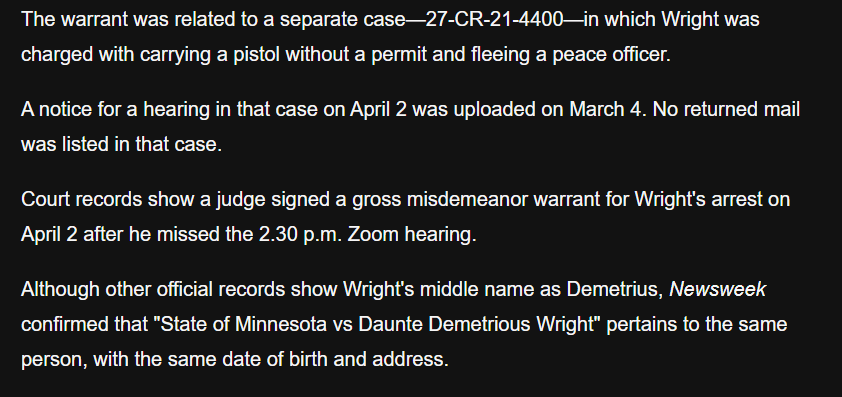

# Table of Contents

1.  [Notes](#org85ab507)
    1.  [Nate The Lawyer https://www.youtube.com/watch?v=0UDCTx455Gc](#orgeaef350)
    2.  [Actual Justice Warrior](#org0b8a574)
        1.  [Video 1 https://www.youtube.com/watch?v=5K7JiLyts9o](#org8aa431a)
        2.  [Video 3https://www.youtube.com/watch?v=MHrGOICBYYU](#orgb3d6b7b)
2.  [Intro](#org54d831f)
3.  [The Facts](#orgc47404f)
4.  [My Argument](#org72fd6ac)
5.  [AJW is Wrong About the Warrant](#org17f18c4)

# Notes

## Nate The Lawyer <https://www.youtube.com/watch?v=0UDCTx455Gc>

-   giving reasons for why kim potter shouldnt be convicted of manslaughter
-   facts:
    -   officers pulled over car with two people inside
    -   pulled over because there was an air-freshener on the rear view mirror
    -   saw that the car was in a left turn only lane but had a right turn signal on
    -   found that the car had expired tags
    -   Daunte had no license or insurance and an order of protection against him and an arrest warrant
        -   gross misdemeanor warrant for possession of a handgun without a permit, followed by running from police<a id="fnr.1" class="footref" href="#fn.1" role="doc-backlink">1</a>, <a id="fnr.2" class="footref" href="#fn.2" role="doc-backlink">2</a>
    -   Daunte resisted arrest and tried to drive off, dragging some officers a short distance.
    -   kim grabbed gun instead of taser and shot Daunte once, fatally wounding him
-   &ldquo;wowee look at how cool and nice kim is she a union rep she so loved she not used her gun in 26 years&rdquo;
-   first time Potter attempted to deploy taser in line of duty
-   states argument is that kim acted so carelessly as to make her criminally negligent.
-   justified risk because it was a lawful arrest (this is false)

## Actual Justice Warrior

### Video 1 <https://www.youtube.com/watch?v=5K7JiLyts9o>

-   shot daunte by accident
-   comparisons of size and weight are ridiculous, PB&J analogy
-   ridiculous to say that this was a pre-meditated murder plot
-   not anything to do with race
-   narrative is &rsquo;he just had air fresheners&rsquo;
-   robbed and choked a woman<a id="fnr.3" class="footref" href="#fn.3" role="doc-backlink">3</a>
-   kim did not shoot due to the above warrant, it was a mistake
-   wrong to say that Daunte didn&rsquo;t know about the warrant
-   comes down to police department policy, therefore there may be authority to shoot

### Video 3<a id="fnr.4" class="footref" href="#fn.4" role="doc-backlink">4</a> <https://www.youtube.com/watch?v=MHrGOICBYYU>

-   pulled over for expired registration tags which is a legitimate reason to pull someone over
-   turn signal business
-   and had an air freshener
-   open warrant on robbery (WRONG) (same source)
-   not entertaining the idea that kimberly potter did something that was anything but accidental in this scenario
-   yada yada yada positivism

# Intro

Kim Potter fatally shot Daunte Wright during a traffic stop, here is why she is a criminal.

My argument will be mostly focused on these videos by Nate the Lawyer and Actual Justice Warrior, both of whom are on the side of Kim, claiming that the Jury reached the wrong conclusion on this case.

# The Facts

Both Nate and AJW are correct when they say that the facts of what happened are not disputed, a group of officers including Potter saw a car with an air freshener on its rear view mirror, which is a violation of the state driving code, they further noticed that said car was in a left turn only lane but had a right turn signal and that it had expired tags. After stopping the officers discovered that Daunte had no license or insurance and had a restraining order against him in addition to an arrest warrant. This prompted an arrest which Daunte attempted to resist by driving off to which Potter responded to by attempting to draw her taser but reaching for her sidearm instead, firing a single, fatal shot at Daunte Wright.

# My Argument

Nothing that Daunte did constitutes a crime under natural law, that is nothing he did initiated any conflicts over scarce means, namely he did not violate the NAP. One may hang air fresheners wherever they damn well please on their own property, the state has no property right over the roads so they may not require Daunte to not hang it and they may not require him to use his turn signals in the way that they desire. Ditto for the expired tags and lack of license or insurance, none of these are things the state has any just say over. The order of protection that I noted above is also not cause for an arrest, and the warrant that was out on him was for carrying a handgun without a license,<a id="fnr.5" class="footref" href="#fn.5" role="doc-backlink">5</a> also not a crime under natural law.

Therefore there was no just cause to arrest Daunte, making it not an arrest, but a kidnapping, one that Daunte may resist at will. Any action on the officers&rsquo; part to curtail this resistence is further aggressive action, Kim would be guilty even if she had used her taser. Moreover, we can say that this is not a manslaughter, but a murder on Potters part as she had mens rea. Someone has mens rea if they were aware that they were committing the crime, i.e. if I am walking over a field and accidentally step on your glasses, I didn&rsquo;t deliberately do so so I had no mens rea, in this case, the just punishment is just restitution, namely I may be forced to have your sunglasses repaired. This is not the case for the officers, they were all aware that they were subduing Mr Wright, therefore they had mens rea. The fact that they thought this was a just thing to do has no bearing on this fact, just as it doesn&rsquo;t for the men and women who carried out the holocaust for the greater good of the German people. Both are guilty. This brings us to the second prong of proportional justice, retribution. Where someone is guilty of a crime and they knowingly did the crime they may be subject to both restitution and retribution, retribution being where the victim or their heir may have the act done unto the perpetrator. In this instance, Daunte&rsquo;s heir is justly allowed to decide whether Ms Potter is also fatally shot. Any prevention of this is yet further aggression on the part of the state.

# AJW is Wrong About the Warrant

Now, before I get into what I believe was a serious mistake on the part of AJW, I ask that you hit the like button if you want to see more libertarian analyses of hot button cases.

So, AJW&rsquo;s argument as to the circumstances, if they were true, would make the arrest in question a just one, and thus Daunte would not be allowed to resist so Potter would be innocent in the shooting. AJW states multiple times through his videos on the topic that Daunte&rsquo;s warrant was for robbing and strangling a woman, which is something that he did but is not what the warrant was about, AJW&rsquo;s own source proves this.<a id="fnr.6" class="footref" href="#fn.6" role="doc-backlink">6</a> The article notes that the warrant was for a separate charge:

Later elaborating that this was, as I stated above, due to carrying a handgun without a permit and resisting the arrest for that:

But it should be noted that I do not blame AJW for coming away from that article assuming that the warrant was for the robbery, it is written in a very opaque manner and in an old version<a id="fnr.7" class="footref" href="#fn.7" role="doc-backlink">7</a> of the page it outright states that the warrant was for the robbery:

I myself have run into issues with how frequently the Daily Mail are patching this piece, I have an old screenshot of the page stating the specific case number, but this too is now gone and I didn&rsquo;t have an opportunity to archive it:

So it is entirely possible that we do not yet know what exactly the warrant was for, the best I can tell is that it was for the possession of a handgun but if anyone can find something solid on it actually being for the robbery, please to let me know and I will issue an update in the pinned comment. This is what the entire case relies on, whether the arrest was for an actual crime or something the state says is a crime, so it is very important.

(VIDONLY:These are screenshots about the warrant being the pistol possession charge):

# Footnotes

<a id="fn.1" href="#fnr.1">1</a> <https://www.startribune.com/kim-potters-former-supervisor-deadly-force-justified-in-daunte-wright-shooting/600125927/> ([archived](https://archive.ph/62iB7)).

<a id="fn.2" href="#fnr.2">2</a> <https://www.usnews.com/news/us/articles/2021-12-08/explainer-what-will-jurors-hear-about-daunte-wright> ([archived](https://archive.ph/vCX0M)).

<a id="fn.3" href="#fnr.3">3</a> <https://www.dailymail.co.uk/news/article-9467375/Daunte-Wright-warrant-arrest-attempted-aggravated-robbery-charges.html?ito=social-twitter_dailymailus> ([archived](https://archive.ph/oyr0I)).

<a id="fn.4" href="#fnr.4">4</a> His second video responds to a point I don&rsquo;t make

<a id="fn.5" href="#fnr.5">5</a> <https://www.dailymail.co.uk/news/article-9467375/Daunte-Wright-warrant-arrest-attempted-aggravated-robbery-charges.html?ito=social-twitter_dailymailus> ([archived](https://archive.ph/oyr0I)).

<a id="fn.6" href="#fnr.6">6</a> <https://archive.ph/oyr0I#selection-1105.105-1105.130> and for proof that this was AJW&rsquo;s source at the time of writing: <https://archive.ph/ltEmY#selection-4465.2-4473.1> and <https://archive.ph/f6zTT#selection-4571.2-4579.1>

<a id="fn.7" href="#fnr.7">7</a> <https://archive.ph/Z6XUb>
